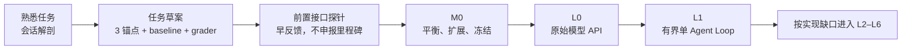

# 01 · 如何阅读这本书

你不是从零开始。

只要你已经让 Claude Code、Codex 一类工具读过仓库、修改过文件、运行过测试，甚至在失败后继续修正，你就已经使用过一个相当完整的 Agent Harness。你缺少的通常不是“Agent 是什么”的定义，而是一张能解释这些行为的系统地图：模型做了什么，Harness 替它做了什么，哪些约束来自确定性程序，怎样证明一次任务真的完成。

这本书从这种熟悉感出发，再逐层进入模型接口、Agent Runtime、Context、工具、安全、可靠性与运营。目标不是把你训练成某个框架的 API 使用者，而是让你能独立造出同类系统，并知道每一层为什么存在。

## 1. 先从你见过的现象开始

假设你给出任务：

> 修复这个失败测试，不要改变公开 API；先定位根因，修改后运行相关测试。

接下来发生的事情，可以提出一整本书的问题：

| 你看到的行为                               | 本书要揭开的机制                           |
| ------------------------------------ | ---------------------------------- |
| Agent 自动读取 `AGENTS.md` 或 `CLAUDE.md` | 持久指令怎样进入 Context，为什么它不是强制策略        |
| Agent 搜索文件，而不是把整个仓库塞进窗口              | Context Engineering、检索与渐进披露        |
| Agent 选择读、改、执行测试                     | Tool Contract、Agent Loop 与 Runtime |
| 测试失败后继续修改                            | Observation、状态转移、预算与停止条件           |
| 危险动作前请求许可                            | 权限、沙箱、授权与审批的不同职责                   |
| 历史过长后压缩或重新开始                         | Compaction、外部化状态与跨 Session 交接      |
| 另一个 Agent 做 Review                   | 上下文隔离、Evaluator 与 Multi-Agent 准入条件 |
| 最终展示 Diff 和测试结果                      | Trace、Outcome 与可验证完成               |

阅读的乐趣应来自不断完成这种映射：**原来我每天使用的能力，是由这一层设计出来的。**

## 2. 首小时只做一件事：拆开一次真实会话

第一次阅读按下面的顺序进行，不需要先背术语：

1. 找一条最近完成或失败的 Claude Code / Codex 任务。
2. 阅读下一章，同时记录它读了什么、调用了什么、何时改变计划、如何验证结果。
3. 用章末表格标出模型当时看见的 Context、模型周围的 Harness、推动任务前进的 Loop 与完成证据。
4. 另选一个要长期实现的任务族，只写 3 个锚点、一个更简单的 baseline 和一个 Outcome Grader；随后做一次无工具、无副作用的 **L0 前置接口探针**。

会话解剖不是正式 M0，也不是考试。Coding Agent 轨迹只负责把抽象名词固定到你亲眼见过的行为上；3 个锚点则是新 Workbench 的任务草案。第一次探针只为了尽早看见真实接口和失败，不足以支持版本比较，也不等于通过 L0。

## 3. 章节坐标不等于能力里程碑

全书有两套编号：

- `00–10` 是章节坐标，回答去哪里查一个概念。
- `M0、L0–L6` 是能力里程碑，回答 Workbench 下一步能增加什么。

它们不会一一对应。第一次反馈可以早于里程碑，但能力主线仍保持 `M0 → L0 → L1`：



任务草案完成后就可以做一次前置接口探针；探针暴露的歧义用来修正并冻结正式 M0。之后才把原始 API 适配器申报为 L0，并手写 L1 skeleton。L2–L6 的完整路线只在[转型路线](/masterpiece-static-docs/00-导读/05-从学习到转型的完整路线.md)维护；后面的 Context、知识、行动与可靠性章节，都要落回这个已经能运行的 Workbench。

若你需要直接按周安排阅读与实现，使用[八周启动计划：边学边造一个 Agent Workbench](/masterpiece-static-docs/10-毕业门禁/04-八周理论学习计划.md)。

## 4. 每章使用同一个学习循环

### 第一步：预测

先根据自己的 Agent 使用经验写下答案。例如：如果删除一半历史，Agent 会更差还是更好？如果测试命令超时，可以直接重试吗？

### 第二步：观察

从真实轨迹、固定 mock 或小实验中观察发生了什么。不要只记最终文本；同时记录输入、工具、状态、错误和真实环境结果。

### 第三步：解释

用本章机制解释现象：问题属于模型、Context、Harness、Loop、工具、策略还是环境？

### 第四步：证伪

构造一个会让错误理解暴露的反例。例如：生成一个符合 JSON Schema、但业务上越权的工具参数。

### 第五步：带回 Workbench

明确本章增加了哪个对象、状态、策略或评测案例，并回放同一批 M0 任务。

```text
熟悉现象 → 最小机制 → 失败反例 → 生产边界 → Workbench 增量
```

## 5. 三种掌握等级

### A · 能解释

能用自己的话说明机制、边界和失败方式。例如：为什么增加 Context 长度可能让结果更差。

### B · 能证伪

能设计一个小实验，让错误理解暴露，而不是用一次成功 Demo 证明自己。

### C · 能设计门禁

能把认识转成确定性约束：明确 enforcement point、允许/拒绝条件、可观察效果和自动测试。

L0/L1 的核心机制至少达到 B；权限、安全和真实副作用必须逐步达到 C。门禁用来决定能否增加风险或自主性，不用来惩罚阅读进度。

## 6. 两个案例，共用一套骨架

### 熟悉入口：Coding Agent

Claude Code / Codex 的编码任务用于解释你已经见过的表象：仓库指令、工具搜索、修改、测试、Review、权限与压缩。它帮助建立直觉，但本书不会把所有 Agent 都缩成编程 Agent。

### 贯穿案例：研究—判断—退款行动

全书的通用 Workbench 使用一个更完整的任务：

```text
读取当前用户获准访问的订单、内部政策与公开资料
→ 判断订单是否符合退款条件并给出证据
→ 生成精确退款提案与预览
→ 经服务端授权和具体审批
→ 使用幂等键提交
→ 从支付系统核对真实 Outcome
```

它同时容纳知识检索、状态、权限、审批、不可逆动作与故障恢复。客服、研究、销售或数据分析只是迁移场景，不再各自开启一套互不相干的玩具项目。

两者的共同骨架是：模型读取有限 Context，在 Harness 提供的工具与边界内通过 Loop 推进任务，最后由外部证据确认 Outcome。

## 7. 哪些内容现在学，哪些以后回读

| 当前阶段  | 现在需要掌握                                   | 暂不要求                          |
| ----- | ---------------------------------------- | ----------------------------- |
| 任务草案  | 3 个锚点、非 Agent baseline、一个 Outcome Grader | 12–20/30–50 案例、完整 Rubric、生产遥测 |
| M0    | 平衡 seed cases、冻结数据集、版本与切片                | 大规模评测平台                       |
| L0    | Token/Context 直觉、原始 API、stream、Schema、错误 | Agent 框架、多 Agent              |
| L1    | Tool Loop、状态、预算、取消、Trace、基础 Eval         | 真实不可逆动作、Durable Engine        |
| L2/L3 | Context、Knowledge、Memory、协议、授权、审批、幂等     | 无证据的长期记忆和多 Agent              |
| L4/L5 | 故障恢复、安全、UX、SLO、成本、发布门禁                   | 为简历堆叠平台与框架                    |
| L6    | 由任务证据选择 1–2 个专项                          | 同时追逐全部前沿能力                    |

数学、模型原理和统计只学到能解释工程现象、设计实验和识别边界的深度。需要推导或实施细节时再二刷，不在第一次阅读中用名词密度冒充深入。

## 8. 学习记录模板

```md
# 章节学习记录

## 我见过的现象
它在 Claude Code / Codex 或当前 Workbench 中怎样出现？

## 一句话机制
这一层解决什么问题？

## 系统边界
它保证什么？不保证什么？

## 一个反例
怎样让错误理解失败？

## 带回 Workbench
新增什么对象、状态、策略、Trace 或 Eval case？

## 尚未确认
哪些结论仍需实验或一手资料？
```

## 章末检查

1. 你最近一次 Claude Code / Codex 任务中，哪些行为显然不可能只由一段 Prompt 完成？
2. 章节编号与 M0/L0/L1 里程碑为什么不能混用？
3. 什么证据能证明你理解了一个概念，而不是只会复述定义？

## 本章小结

这本书的主线不是从术语走向术语，而是从熟悉行为走向可解释机制，再把机制变成自己的 Workbench。下一章直接拆开一次编码 Agent 任务，建立 Context、Harness、Loop 与 Agent Application 的第一张系统地图。

[继续实作主线：从一次 Agent 任务看懂全书](/masterpiece-static-docs/00-导读/02-知识地图与学习门禁.md) · [顺读知识支线：术语与边界](/masterpiece-static-docs/00-导读/03-术语与边界.md)
