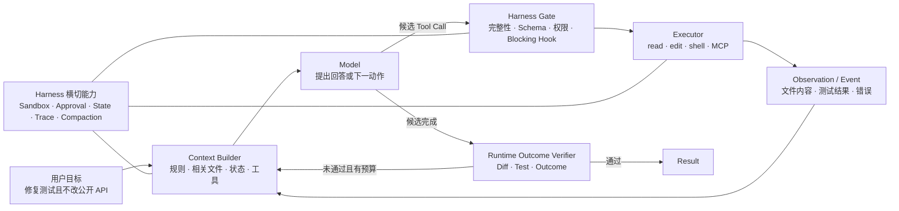
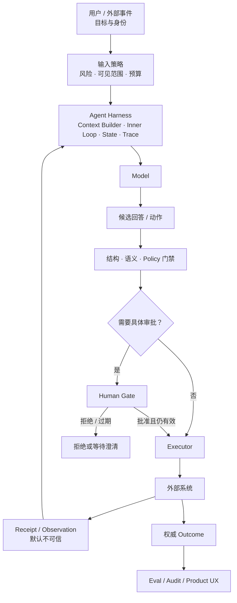

# 02 · 从一次 Agent 任务看懂全书

你让 Claude Code 或 Codex“定位失败测试、修复并验证”。它没有一次性吐出一段代码，而是先读规则和文件，调用搜索或 Shell，拿到结果后继续判断；有时请求许可，有时压缩历史，有时让另一个 Agent 审查。

这些行为很容易被统称为“模型很聪明”，但它们其实来自不同工程层。先把一次熟悉任务拆开，后面的模型、Runtime、Context、工具与评测才会各自找到位置。

## 1. 一次熟悉任务的真实骨架



这里至少有四个观察镜头：

1. **Context Engineering**：这一轮模型到底看见了哪些 Token，哪些规则、文件、状态、工具和观察被选择或排除。
2. **Agent Loop 与 Runtime Control**：模型怎样根据观察提出下一步，Runtime 怎样执行、记录、继续、取消或终止。
3. **Harness Engineering**：谁把模型、Context、工具、权限、沙箱、Hooks、状态、压缩与 Trace 组合成可工作的环境。
4. **Agent Application Engineering**：怎样把用户、领域状态、真实 Outcome、评测、安全、UX 和生产运营接到这套 Harness 上。

模型是核心能力来源，但不是整个应用。

## 2. Prompt、Context、Harness 与 Loop 不是四代产品

行业里的工程关注点确实在扩展，但不应把几个词写成相互淘汰的口号。

| 视角                       | 主要设计对象                                    | 它没有替代什么                          |
| ------------------------ | ----------------------------------------- | -------------------------------- |
| Prompt Engineering       | 指令、示例与输出要求怎样表达                            | 仍需要选择数据、工具和状态                    |
| Context Engineering      | 每次推理实际可见的最小高信号 Token 集合                   | Prompt 仍是 Context 的一部分           |
| Harness Engineering      | 围绕模型的 Context、Loop、工具、环境、权限、状态与观测设施       | 不会自动给出业务正确性                      |
| Inner Agent Loop         | 单次 Run 内“推理 → 提议 → 执行 → 观察”的反馈循环          | 仍需要 Harness 提供执行与边界              |
| Outer Orchestration Loop | 跨 Run 发现任务、隔离工作区、调用 Agent、独立验证、保存状态并决定下一轮 | 不等于无限自治，也不替代 Workflow、Eval 和人类门禁 |

Anthropic 把 Context Engineering 描述为 Prompt Engineering 的自然扩展，并把 Agent Harness 定义为让模型能够作为 Agent 行动的系统；OpenAI 与 Anthropic 的公开工程材料也都强调 Harness 对性能和长任务稳定性的影响。2026 年中已有部分实践者开始使用“Loop Engineering”描述跨任务、跨 Agent 的外层闭环，但它仍是边界未统一的社区实践术语。

首次阅读只需掌握 Prompt、Context、Inner Loop 与 Harness；Outer Orchestration Loop 是 L1 之后的进阶预告，可以先跳过。

因此，本书采用更精确的写法：

```text
一次模型调用：Prompt ⊂ Context
一次 Agent 运行：Context Builder + Inner Loop + Tools + Policy
Agent Harness：包裹并支撑上述运行的完整脚手架
外层工作闭环：Trigger + Isolation + Harness Run + Verify + Persist + Human Gate
Agent Application：Harness + Domain + Product + Eval + Operations
```

这不是名词游戏。边界清楚后，你才知道优化失败时该改输入、改 Loop、改工具、改 Harness，还是根本不该继续增加自主性。

## 3. 你已经在 Claude Code / Codex 见过这些层

> 产品行为核验日期：2026-07-12。这里只使用公开可观察机制帮助理解，不推断私有系统提示、模型权重或托管基础设施。

| 可观察表面                        | 工程归属                            | 不应误解为                                       |
| ---------------------------- | ------------------------------- | ------------------------------------------- |
| `AGENTS.md` / `CLAUDE.md`    | 稳定指令来源，进入模型 Context             | 权限系统或必然遵守的策略                                |
| 按需搜索、打开少量文件                  | 检索、工具使用与 Context Budget         | 模型已经“记住整个仓库”                                |
| Skill / 项目规则                 | 按需程序性知识或持久指导                    | 自动执行授权                                      |
| Shell、编辑器、MCP 工具             | Harness 暴露的能力与观察通道              | 模型可以直接改变外部世界                                |
| Permission、Sandbox、Approval  | Harness 中的执行控制                  | Prompt 里的礼貌提醒                               |
| 测试失败后继续修改                    | Inner Agent Loop                | 一次超长生成                                      |
| Compaction / 新 Session 交接    | 有损 Context 派生或结构化 handoff       | 权威领域状态                                      |
| Subagent / 独立 Reviewer       | Context 隔离、并行或 maker-checker 分离 | 天然更正确的多 Agent 系统                            |
| Thread / Turn / Item / Event | Codex 的协议与生命周期对象；持久化语义按对象和版本核对  | Event/notification 必然进入应用审计日志、所有 Agent 必须照搬 |

例如，Codex 公开文档把 Sandbox 与 Approval 分成“技术上能做什么”和“何时必须询问”两层；Claude Code 文档也明确指出 `CLAUDE.md` 是 Context，而强制阻断应放到设置或 `PreToolUse` Hook。两者共同说明：**行为指导与确定性执行控制必须分层。**

## 4. 从 Coding Agent 迁移到通用 Agent

编码只是最容易观察的入口。把同一骨架换到本书的退款任务：

| Coding Agent      | 通用退款 Workbench            |
| ----------------- | ------------------------- |
| 仓库规则与相关代码         | 退款政策、订单状态与用户约束            |
| 搜索、读文件、运行测试       | 检索政策、查询订单、生成退款提案          |
| 文件修改              | 对外部系统的候选动作                |
| 单元/端到端测试          | 领域 Grader 与真实 Outcome 查询  |
| Git Diff / Review | 退款预览、审批与审计记录              |
| 测试失败后继续           | 根据工具结果继续、澄清或收敛失败          |
| 工作区权限与沙箱          | actor/tenant 授权、短期凭证与执行隔离 |

最大的差异是风险：代码修改通常还有 Diff、测试和 Git；退款、发信或修改业务数据可能立即影响真实用户。因此后半本书会把授权、审批、幂等、未知效果和人工控制逐层加入同一个 Loop。

## 5. 现在才需要知识依赖

下面的依赖不要求一次学完。每当 Workbench 增加能力时，再补齐对应知识：

| 要增加的能力                        | 必须先理解                             | 你已经见过的表象                        |
| ----------------------------- | --------------------------------- | ------------------------------- |
| 原始模型调用（L0）                    | Token、自回归生成、Context、stream、Schema | Agent 输出逐步出现、结构化调用工具            |
| 有界单 Agent（L1）                 | Tool Calling、状态、预算、取消、Trace       | 搜索—修改—测试—再修改                    |
| Context Engineering（L2）       | 上下文窗口、状态分类、来源与压缩                  | 按需读文件、Compaction、Skill          |
| RAG / Knowledge（L3）           | embedding、检索指标、ACL、来源与新鲜度         | 搜索仓库、读取文档与引用证据                  |
| 受控写动作（L3）                     | 语义校验、授权、审批、幂等、真实 Outcome          | 修改文件前预览、危险命令前询问                 |
| Durable Agent（L4）             | checkpoint、事件历史、取消、版本和副作用         | 恢复 Session、后台任务、等待人工            |
| Multi-Agent / Outer Loop（条件性） | 单 Agent baseline、隔离、委派、独立验证与成本    | Subagent、Reviewer、Worktree、自动任务 |
| Rust 迁移（条件性）                  | 稳定契约、性能/隔离证据、跨语言对拍                | Coding Harness 的稳定执行核心与客户端解耦    |

## 6. 第一圈先获得反馈，门禁随后约束结论

你现在只需记住一条实际可执行的路径：

1. 在 [M0 任务草案](/masterpiece-static-docs/00-导读/04-M0任务契约-Baseline与数据集.md)中写正常、模糊、应停止 3 个锚点，一个非 Agent baseline，以及一个查询真实结果的 Outcome Grader。
2. 按 [Grader、Trial 与统计](/masterpiece-static-docs/03-评测与实验科学/01-Grader-Trial与统计.md)的首读边界，让 baseline 和一个候选结果各接受一次相同判定。
3. 做一次 L0 前置接口探针：用官方 SDK 进行无工具、无副作用的调用；保存原始请求、完整响应、错误、usage、latency 与 grader 结果。
4. 根据真实失败扩展并冻结正式 M0，再完成 L0 的 stream/Schema/错误边界和 L1 有界 Loop。

这次探针是学习反馈，不是比较实验，也不改变 `M0 → L0 → L1` 的能力里程碑顺序。正式 M0 先扩成 12–20 个平衡 seed cases 并按 Rubric 修订，再冻结 30–50 个版本化案例、Outcome、Grader 与 slice。后续知识源、写工具、持久执行、多 Agent 和 Rust 各有独立风险门禁；完整清单留在对应章节，不在这里重复。

## 7. 第一张 Agent Application 图



关键不变量只有一句：模型可以提出候选，但真实读取范围、执行资格、状态变化与完成证据必须由模型之外的系统持有。

## 首小时练习

选一条真实 Claude Code / Codex 轨迹，写一页表格：

| 时刻 | 模型看见的 Context | 候选动作 | Harness 控制 | Observation | 完成证据 |
| -- | ------------- | ---- | ---------- | ----------- | ---- |

再标记：哪一步如果没有权限、预算、测试或独立验证，会让“看起来完成”与真实 Outcome 分离。

通过证据：你能把至少 6 个可观察行为放回 Context、Inner Loop 或 Harness，并指出真实 Outcome 由什么外部证据确认，而不是全部归因于“模型自己决定”。

## 章末检查

1. 为什么 `AGENTS.md` / `CLAUDE.md` 不是整个 Context，更不是授权系统？
2. Inner Agent Loop 与 Harness 的边界是什么？
3. 为什么“Loop Engineering”更适合作为外层闭环的教学简称，而不是线性替代 Harness 的新一代标准？
4. 为什么完整闭卷检查不应阻塞第一个 L0/L1 skeleton？

## 一手资料与术语来源

- [Anthropic — Effective context engineering for AI agents](https://www.anthropic.com/engineering/effective-context-engineering-for-ai-agents)
- [Anthropic — Demystifying evals for AI agents](https://www.anthropic.com/engineering/demystifying-evals-for-ai-agents)
- [Anthropic — Harness design for long-running application development](https://www.anthropic.com/engineering/harness-design-long-running-apps)
- [OpenAI — Unrolling the Codex agent loop](https://openai.com/index/unrolling-the-codex-agent-loop/)
- [OpenAI — Unlocking the Codex harness](https://openai.com/index/unlocking-the-codex-harness/)
- [Codex — Custom instructions with AGENTS.md](https://learn.chatgpt.com/docs/agent-configuration/agents-md)
- [Codex — Agent approvals and security](https://learn.chatgpt.com/docs/agent-approvals-security)
- [Codex — App Server](https://learn.chatgpt.com/docs/app-server)
- [Claude Code — How Claude remembers your project](https://code.claude.com/docs/en/memory)
- [Claude Code — Hooks reference](https://code.claude.com/docs/en/hooks)
- [Addy Osmani — Loop Engineering](https://addyosmani.com/blog/loop-engineering/)（社区术语来源与实践观点，不视为正式标准）

## 本章小结

你每天使用的 Coding Agent，已经把 Context、Inner Loop、Harness、工具、权限与验证组合在一起。本书接下来做的不是重新教你点按钮，而是逐层重建这些能力。下一页是随查词典；首次顺读不必停下来背完，可以直接进入 M0。

[继续实作主线：M0 最小任务草案](/masterpiece-static-docs/00-导读/04-M0任务契约-Baseline与数据集.md) · [顺读知识支线：术语与边界](/masterpiece-static-docs/00-导读/03-术语与边界.md)
