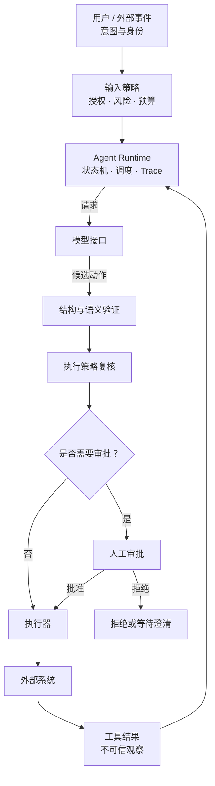

# 02 · 知识地图与学习门禁

如果把全书看成一次工程转型，这张知识地图就不是章节目录，而是一组依赖约束：先知道模型不保证什么，才能设计 Runtime；先区分状态、权限与真实效果，才能让 Agent 接触外部系统；先有 baseline 和评测，才有资格购买更多自主性。

贯穿案例会从“根据资料给出判断”逐步发展到“经策略校验后执行动作”。每多一层能力，都必须同时补上可观察证据和失败边界，而不是只让演示看起来更聪明。

## 1. 四层心智模型

### 第一层：模型是条件概率生成器

给定上下文 `x`，模型逐 Token 估计下一个 Token 的分布：

```text
P(y | x) = Π P(y_t | x, y_<t)
```

它没有数据库事务、权限系统或可靠时钟。看似完整的计划仍只是生成结果。

### 第二层：Agent 是带反馈的控制系统

运行时把模型的候选动作放入循环：观察环境、形成决策、校验、执行、获得新观察，再决定继续或终止。

### 第三层：Agent Application 是社会技术系统

真实应用还包括用户意图、组织权限、外部服务、数据治理、成本约束和责任归属。正确回答不等于正确行动。

### 第四层：生产可靠性来自证据链

一次演示没有统计意义。可重复案例、轨迹、故障注入、策略测试和生产指标共同形成证据。

## 2. 依赖关系

| 后续概念                | 必须先理解                                            |
| ------------------- | ------------------------------------------------ |
| 首次模型实验              | M0 Task Contract、baseline、task/trial/outcome     |
| Structured Outputs  | Token 生成、条件概率、JSON Schema                        |
| Tool Calling        | Structured Outputs、应用/模型边界                       |
| Agent Loop          | Tool Calling；基本失败/取消/未知效果语义在 04/06 内同步建立，08 再系统化 |
| Context Engineering | 上下文窗口、注意力限制、状态分类                                 |
| RAG                 | embedding、检索指标、来源与权限                             |
| Memory              | 状态、检索、写入策略；05/04 内先建立最小隐私/时效/删除语义，07 再深化治理       |
| MCP                 | 工具契约、身份授权、Tool/Resource/Prompt、JSON-RPC          |
| Durable Agent       | 幂等、事件历史、取消、版本和副作用                                |
| Multi-Agent         | 单 Agent baseline、上下文隔离、委派协议、独立评测                 |
| Rust 迁移             | 稳定契约、性能/隔离证据、跨语言测试                               |

## 3. 首次手写单 Agent 前门禁

### G0 · 问题与证据

- [ ] M0 Task Contract、风险清单和 30–50 个案例可重复判定。
- [ ] 有不用 Agent 的 baseline。
- [ ] 能区分 task、trial、outcome、trajectory、grader 和 harness。

### G1 · 模型边界

- [ ] 能解释自回归生成与随机性的来源。
- [ ] 知道上下文窗口是容量上限，不是可靠记忆。
- [ ] 知道后训练改善行为倾向，不构成形式化保证。

### G2 · 接口边界

- [ ] 能区分自由文本、结构化输出、工具调用和工具结果。
- [ ] 能解释结构合法与业务正确的差异。
- [ ] 能从语义事件重建一次流式响应。

### G3 · Agent 边界

- [ ] 能把 Loop 表达为有限状态机。
- [ ] 每个循环都有 step、时间、Token、成本和权限预算。
- [ ] 明确定义等待澄清/审批、取消请求、未知效果、完成、拒绝、失败、部分完成和超限。

### G4 · 行动边界

- [ ] 工具执行端重新验证 actor、resource、action、scope 和前置条件。
- [ ] 区分 query、可逆 command 和不可逆 command。
- [ ] 写操作具备 preview、审批、幂等、审计或补偿中的适用组合。

### G5 · 证据边界

- [ ] 有非 Agent baseline。
- [ ] 有正例、反例、权限、失败和攻击案例。
- [ ] 评测区分 outcome 与 trajectory，并运行多次 trial。

任一门禁缺失，都不应给 Agent 接入真实高影响动作。

## 4. L1 后门禁

- **Durable/后台任务**：lease、fencing、checkpoint/replay、幂等 Activity、版本迁移和故障矩阵。
- **Multi-Agent**：委派 envelope、权限衰减、重复/迟到消息、循环终止和独立收益评测。
- **Rust 迁移**：TS baseline 稳定，跨语言 Schema/Trace/Eval 对拍，并有性能、隔离或部署证据。

这些内容需要理解其边界，但不阻塞第一个 mock/只读工具的单 Agent。

## 5. 一页架构检查图



关键不变量：来自用户、网页、文件、数据库、工具和其他 Agent 的自然语言，都可能是不可信数据；它们不能凭文本内容自行提升为高优先级指令或授权。

## 章末检查

1. 为什么模型层的改进不能替代应用层授权？
2. 为什么 Tool Result 仍然是不可信输入？
3. 如果只记录最终回答，不记录轨迹，会失去哪些诊断能力？

## 本章小结

全书的主线是从概率生成逐层走向可验证的社会技术系统；每一层都要由门禁证明可以进入，而不是由阅读进度决定。下一章先固定全书术语的精确边界，避免后续把模型输出、系统状态和真实效果混为一谈。

[下一章：术语与边界](/masterpiece-static-docs/00-导读/03-术语与边界.md)
