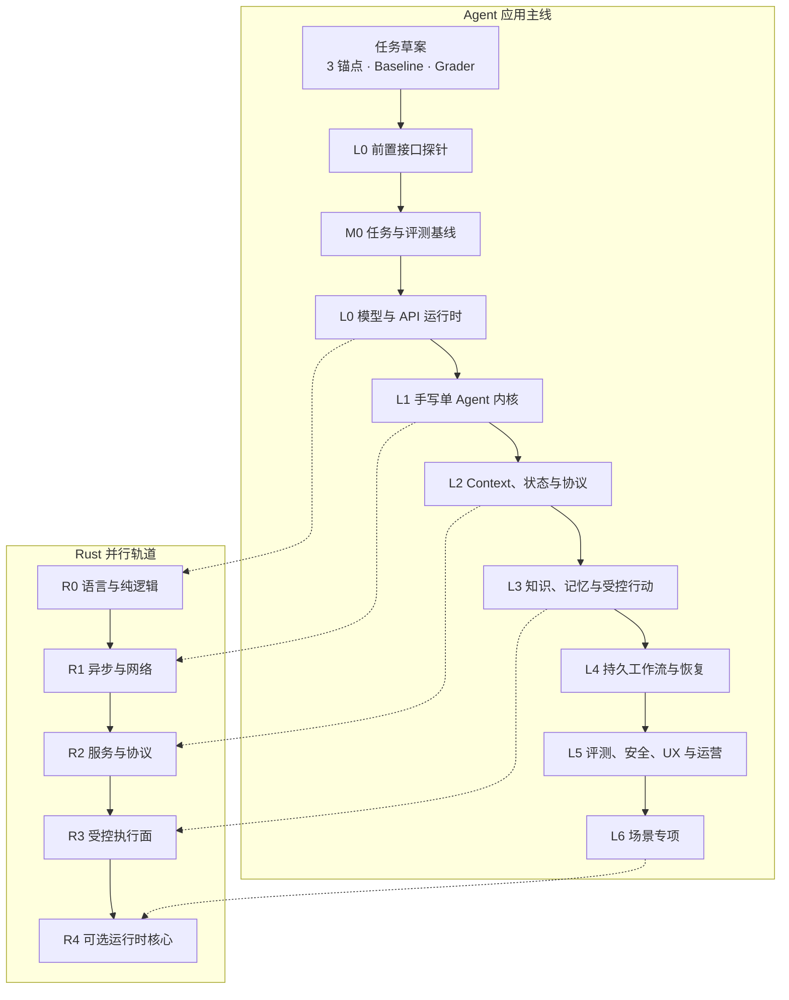

# 05 · 从学习到转型的完整路线

转型不是“读完八周理论后终于开始写代码”。写完 3 个锚点任务后，你先做一次前置接口探针，用真实反馈修正并冻结 M0；然后依次完成 L0 原始模型 API 和 L1 skeleton。之后每读一组章节，都把 Context、工具、安全或可靠性能力加入同一个 Agent Workbench，并用冻结案例回归。

下面的阶段不是按时间自动解锁的课程表，也不是阅读完成度。每一阶段都要回答四个问题：能力发生了什么变化，留下什么交付物，凭什么进入和退出，以及当前刻意不做什么。门禁限制的是新增风险与复杂度，不是第一次获得运行反馈。

## 1. 两条相互校验的成长轨道

TypeScript + Node 始终是产品与控制面的主线。Rust 的语言与异步基础可以随 L0/L1 并行学习；真实组件迁移只在 L1 baseline 已固定，且稳定性、隔离、部署或实测性能证据成立后开始。

## 2. Agent 应用主线的阶段证据

| 阶段     | 能力变化                      | 代表交付物                                                         | 进入 / 退出证据                                          | 当前暂不做                          |
| ------ | ------------------------- | ------------------------------------------------------------- | -------------------------------------------------- | ------------------------------ |
| **M0** | 从熟悉任务收敛为可比较的问题基线          | 准备：3 个锚点、baseline、Outcome Grader；退出：12–20 seeds → 30–50 个冻结案例 | 前置探针只修正任务；正式退出：Rubric ≥16/20 且结果/安全非 0，数据集已版本化冻结   | 不用 3 个案例的一次成功宣称系统可靠；不让门禁阻塞前置反馈 |
| **L0** | 能用模型与 API 机制解释行为和失败       | 官方 TypeScript SDK 流式 CLI、结构化输出、用量与错误记录                        | 进入：正式 M0 已退出；退出：能重建流式响应，并区分模型、协议、工具与应用错误           | 前置探针无工具、无副作用；不训练模型，不追榜单        |
| **L1** | 从“调用模型”变为掌握有限状态 Runtime   | 手写 Loop、3–5 个工具、预算、取消、Trace 与自动回归                             | 进入：L0 接口边界清楚；退出：同一失败能定位到具体系统层                      | 不先用 Agent 框架，不引入多 Agent        |
| **L2** | 把一次运行变为可连接 UI、可恢复、可演进的应用  | Thread / Run / Item、语义事件流、Context snapshot、最小 MCP 与 Skill     | 进入：L1 的 Loop 和工具契约稳定；退出：重连可恢复，取消后停止新工作并能收敛已提交或在途效果 | 不无限追加上下文，不让外部协议绑定领域逻辑          |
| **L3** | 让 Agent 基于可信证据工作并受控改变外部世界 | 有 ACL 的检索、来源链、分级工具、preview、审批与幂等                              | 进入：状态和工具边界可审计；退出：恶意参数与注入都不能绕过策略                    | 不默认上 Agentic RAG、长期记忆或任意代码执行   |
| **L4** | 让任务跨进程、部署与长时间等待安全存活       | Durable Workflow、外部事件等待、流程版本、故障矩阵                             | 进入：确有长任务或恢复需求；退出：强杀、重复事件和升级后无重复副作用                 | 不把 checkpoint 当作 exactly-once  |
| **L5** | 从“能运行”升级为“可验证、可控制、可运营”    | 生产 readiness review、评测回归、安全红队、SLO、成本与 UX 证据                   | 进入：核心流程可恢复；退出：质量、安全、恢复、成本和 UX 五类门禁通过               | 不用单次 Demo、截图或平台仪表盘替代证据         |
| **L6** | 在通用底座上形成一个可测量的场景专长        | 1–2 个专项作品及其 baseline 对比                                       | 进入：L5 底座成立；退出：专项能力相对基线有可测收益                        | 不同时追多个方向；多 Agent 等能力按条件引入      |

任务草案完成后即可进行受控单次接口探针；探针结果只用来修正并退出正式 M0。随后依次完成 L0 接口里程碑和 L1 Runtime。RAG、安全、Durable 与多 Agent 知识按后续能力即时补齐，不再全部前置。

## 3. 从“我用过”到“我能实现”

每一阶段都把熟悉的产品表象还原成自己的工程对象：

| 阶段 | 你在 Claude Code / Codex 中已经见过  | 现在要亲手掌握                                    |
| -- | ----------------------------- | ------------------------------------------ |
| M0 | 任务、Diff、测试结果、成功/失败体验          | 先做 3 个可判定 Task，再形成正式 baseline 与 Dataset    |
| L0 | 流式文本、Tool Call、错误与中断          | 原始 request/response/item/stream adapter    |
| L1 | 搜索—编辑—测试—继续                   | 有界 Loop、状态、预算、取消、Tool Contract、Trace       |
| L2 | 项目规则、Skill、Compaction、Session | Context snapshot、Thread/Run/Item、语义事件与 MCP |
| L3 | 外部连接器、权限提示、Review             | ACL、来源、Memory 写入门禁、授权、审批与幂等                |
| L4 | 后台任务、恢复、等待人类                  | Durable Workflow、流程版本与故障矩阵                 |
| L5 | 活动时间线、成本、自动 Review            | EvalOps、安全、SLO、可控 UX 与发布门禁                 |
| L6 | Subagent、Worktree、自动任务        | 只为经评测成立的专项设计外层工作闭环                         |

## 4. Rust 轨道的迁移证据

| 阶段     | 能力变化                | 代表交付物                                                | 进入 / 退出证据                                                                         | 当前暂不做                |
| ------ | ------------------- | ---------------------------------------------------- | --------------------------------------------------------------------------------- | -------------------- |
| **R0** | 掌握所有权、错误和契约化纯逻辑     | 学习用 budget、event 或 policy crate                      | 进入：可与 L0 同期学习；退出：fixture 与 TypeScript 版本对拍                                        | 不把练习 crate 当作真实迁移    |
| **R1** | 能写可取消、有超时和背压的异步 I/O | 学习用流式 client、只读 tool executor 或 parser               | 进入：可与 L1 同期学习；退出：错误、取消与关闭路径均有测试                                                   | 不重写完整 Runtime        |
| **R2** | 能以稳定协议提供独立服务        | Axum / Tower sidecar、共享 Schema 与 Trace               | 进入：L1 baseline 与迁移证据齐备，且 L2 契约已明确；退出：contract test、trace 传播与 graceful shutdown 通过 | 不因偏好提前使用进程内绑定        |
| **R3** | 承接权限敏感或资源密集的受控执行面   | MCP gateway、policy proxy、parser 或 sandbox supervisor | 进入：L1 baseline 与迁移证据齐备，且 L3 行动边界清楚；退出：权限、幂等、限流、审计和故障测试通过                          | 不把内存安全等同于沙箱安全        |
| **R4** | 在证据支持下选择性迁移运行时核心    | 事件核心或 Agent Application Server 的迁移版本                 | 进入：迁移证据持续成立，Thread / Run / Item 与恢复契约稳定；退出：Trace / Eval parity 与发布门禁通过            | 不用“Rust 理论上更快”作为迁移理由 |

R0/R1 在 L1 前只代表学习与对拍练习。任何阶段一旦要替换 Workbench 或生产中的真实组件，都必须先满足 L1 baseline、profile/SLO、部署与隔离证据，并经过 shadow、canary、rollback 等横切发布门禁。

## 5. 同一个 Workbench 如何滚动演进

不要为每个阶段另做一个互不相干的玩具项目。选定任务族后，让同一 Workbench 经历连续、可比较的变化：

1. **V-1 · Evidence Draft（M0 准备）**：3 个锚点、baseline、Outcome Grader 与一次前置接口探针。
2. **V0 · Evidence Baseline（M0）**：平衡 seed cases、冻结 Dataset、Grader、slice 与版本。
3. **V1 · Model Interface（L0）**：补齐原始 SDK、流式 Item、Schema、用量与错误分类。
4. **V2 · Runtime（L1）**：手写单 Agent Loop、工具分发、预算、取消和 Trace。
5. **V3 · Protocol / Context（L2）**：Thread / Run / Item、语义事件、Context snapshot、MCP 与 Skill。
6. **V4 · Knowledge / Control（L3）**：ACL 检索、来源与记忆策略、分级工具、preview、审批和幂等。
7. **V5 · Durability / Production（L4/L5）**：外部事件、故障恢复、流程版本、Eval、安全、UX、SLO 与成本。
8. **V6 · Specialty（L6）**：形成一个可测量的场景专项，只按证据引入多 Agent 或外层工作闭环。

每次迭代都回放 M0 数据集，并保留上一层 baseline。这样，复杂度是否带来质量或可靠性收益可以被测量，架构也不会随着框架练习不断推倒重来。

## 6. 作品证据：让成果可以被外部审查

最终作品不能只留下 Demo、截图或一段“效果很好”的说明。一个招聘方、评审者或未来协作者至少应能检查：

- 版本化的任务规格、风险清单、数据集与非 Agent baseline。
- 架构图、信任边界和威胁模型，以及模型、程序和人的职责划分。
- 同时覆盖 Outcome 与轨迹、多次 trial 和回归结论的 Eval 报告。
- 断线、取消、重复事件、进程崩溃和流程升级的故障恢复证据。
- 能展示进度、来源、变更预览、审批、暂停与恢复的可控 UX。
- 关键技术取舍和停止条件：为什么当前不引入多 Agent、长期记忆或进一步 Rust 迁移。

这些材料共同证明你能定义问题、约束系统并解释失败，而不只是拼出一条正常路径。

## 本章小结

完整转型靠 M0–L6 的连续交付与证据链完成：每学一层，就让 Workbench 多一个可运行能力、多一类失败证据和一条明确边界。Rust 沿 R0–R4 在稳定边界上渐进加入。[八周启动计划](/masterpiece-static-docs/10-毕业门禁/04-八周理论学习计划.md)会让你先用探针获得反馈，再按 `M0 → L0 → L1` 完成前三个能力里程碑。

[继续实作主线：八周启动计划](/masterpiece-static-docs/10-毕业门禁/04-八周理论学习计划.md) · [顺读知识支线：概率、信息量与采样](/masterpiece-static-docs/01-数学与机器学习直觉/01-概率-信息量与采样.md)
