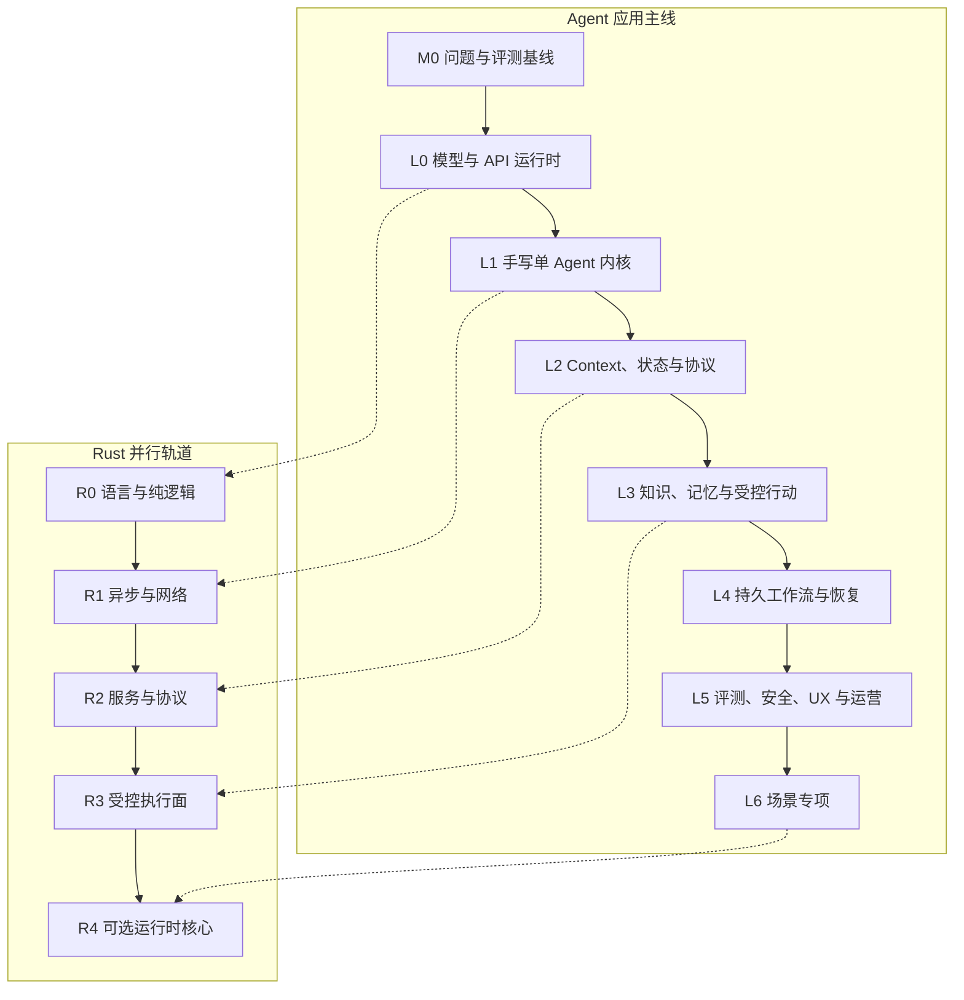

# 05 · 从学习到转型的完整路线

前置理论的八周学习只是起点，不是“完成转型”的证明。真正的变化发生在此后：你会围绕同一个 Agent Workbench 反复实现、注入故障、评测和收紧边界，直到能独立设计、交付并运营一个可验证的 Agent 应用。

下面的阶段不是按时间自动解锁的课程表。每一阶段都要回答四个问题：能力发生了什么变化，留下什么交付物，凭什么进入和退出，以及当前刻意不做什么。门禁没有通过，就继续补证据，而不是靠引入新框架掩盖问题。

## 1. 两条相互校验的成长轨道

TypeScript + Node 始终是产品与控制面的主线。Rust 轨道从纯逻辑和边界清晰的服务开始，只在稳定性、隔离、部署或实测性能证据成立时承接更多执行与数据职责。

## 2. Agent 应用主线的阶段证据

| 阶段     | 能力变化                      | 代表交付物                                                                            | 进入 / 退出证据                                          | 当前暂不做                         |
| ------ | ------------------------- | -------------------------------------------------------------------------------- | -------------------------------------------------- | ----------------------------- |
| **M0** | 从功能想法转为可判定的问题             | Task Contract、风险清单、12–20 个种子案例（seed cases）、非 Agent baseline；首次手写前扩为 30–50 个版本化案例 | 进入：选定真实任务族；退出：成功与真实 Outcome 可重复检查                  | 不急着写 Prompt、接工具或选框架           |
| **L0** | 能用模型与 API 机制解释行为和失败       | 官方 TypeScript SDK 流式 CLI、结构化输出、用量与错误记录                                           | 进入：M0 可评测；退出：能重建流式响应，并区分模型、协议、工具与应用错误              | 不训练模型，不追榜单，不做 GPU 优化          |
| **L1** | 从“调用模型”变为掌握有限状态 Runtime   | 手写 Loop、3–5 个工具、预算、取消、Trace 与自动回归                                                | 进入：L0 接口边界清楚；退出：同一失败能定位到具体系统层                      | 不先用 Agent 框架，不引入多 Agent       |
| **L2** | 把一次运行变为可连接 UI、可恢复、可演进的应用  | Thread / Run / Item、语义事件流、Context snapshot、最小 MCP 与 Skill                        | 进入：L1 的 Loop 和工具契约稳定；退出：重连可恢复，取消后停止新工作并能收敛已提交或在途效果 | 不无限追加上下文，不让外部协议绑定领域逻辑         |
| **L3** | 让 Agent 基于可信证据工作并受控改变外部世界 | 有 ACL 的检索、来源链、分级工具、preview、审批与幂等                                                 | 进入：状态和工具边界可审计；退出：恶意参数与注入都不能绕过策略                    | 不默认上 Agentic RAG、长期记忆或任意代码执行  |
| **L4** | 让任务跨进程、部署与长时间等待安全存活       | Durable Workflow、外部事件等待、流程版本、故障矩阵                                                | 进入：确有长任务或恢复需求；退出：强杀、重复事件和升级后无重复副作用                 | 不把 checkpoint 当作 exactly-once |
| **L5** | 从“能运行”升级为“可验证、可控制、可运营”    | 生产 readiness review、评测回归、安全红队、SLO、成本与 UX 证据                                      | 进入：核心流程可恢复；退出：质量、安全、恢复、成本和 UX 五类门禁通过               | 不用单次 Demo、截图或平台仪表盘替代证据        |
| **L6** | 在通用底座上形成一个可测量的场景专长        | 1–2 个专项作品及其 baseline 对比                                                          | 进入：L5 底座成立；退出：专项能力相对基线有可测收益                        | 不同时追多个方向；多 Agent 等能力按条件引入     |

## 3. Rust 轨道的迁移证据

| 阶段     | 能力变化                | 代表交付物                                                | 进入 / 退出证据                                                                  | 当前暂不做                |
| ------ | ------------------- | ---------------------------------------------------- | -------------------------------------------------------------------------- | -------------------- |
| **R0** | 掌握所有权、错误和契约化纯逻辑     | budget、event 或 policy crate                          | 进入：L0 同期开始；退出：fixture 与 TypeScript 版本对拍                                    | 不接管 Agent 编排         |
| **R1** | 能写可取消、有超时和背压的异步 I/O | 流式模型 client 或只读 tool executor                        | 进入：R0 语言基础；退出：错误、取消与关闭路径均有测试                                               | 不重写完整 Runtime        |
| **R2** | 能以稳定协议提供独立服务        | Axum / Tower sidecar、共享 Schema 与 Trace               | 进入：L2 契约已明确；退出：contract test、trace 传播与 graceful shutdown 通过                | 不因偏好提前使用进程内绑定        |
| **R3** | 承接权限敏感或资源密集的执行面     | MCP gateway、policy proxy、parser 或 sandbox supervisor | 进入：L3 行动边界清楚；退出：权限、幂等、限流、审计和故障测试通过                                         | 不把内存安全等同于沙箱安全        |
| **R4** | 在证据支持下选择性迁移运行时核心    | 事件核心或 Agent Application Server 的迁移版本                 | 进入：Thread / Run / Item 与恢复契约稳定；退出：Trace / Eval parity、canary 与 rollback 通过 | 不用“Rust 理论上更快”作为迁移理由 |

## 4. 同一个 Workbench 如何滚动演进

不要为每个阶段另做一个互不相干的玩具项目。选定研究、客服、销售、数据分析或个人效率中的一个任务族后，让同一 Workbench 经历六次可比较的变化：

1. **Runtime**：手写单 Agent Loop 和工具分发。
2. **Protocol**：加入 Thread / Run / Item、语义事件和客户端重连。
3. **Control**：加入预算、取消、权限、preview 与审批。
4. **Context**：加入 snapshot、压缩、动态工具、MCP 与 Skill。
5. **Durability**：加入 checkpoint、外部事件、幂等和流程版本。
6. **Production**：加入 Eval、Trace、安全红队、后台任务、成本和发布门禁。

每次迭代都回放 M0 数据集，并保留上一层 baseline。这样，复杂度是否带来质量或可靠性收益可以被测量，架构也不会随着框架练习不断推倒重来。

## 5. 作品证据：让成果可以被外部审查

最终作品不能只留下 Demo、截图或一段“效果很好”的说明。一个招聘方、评审者或未来协作者至少应能检查：

- 版本化的任务规格、风险清单、数据集与非 Agent baseline。
- 架构图、信任边界和威胁模型，以及模型、程序和人的职责划分。
- 同时覆盖 Outcome 与轨迹、多次 trial 和回归结论的 Eval 报告。
- 断线、取消、重复事件、进程崩溃和流程升级的故障恢复证据。
- 能展示进度、来源、变更预览、审批、暂停与恢复的可控 UX。
- 关键技术取舍和停止条件：为什么当前不引入多 Agent、长期记忆或进一步 Rust 迁移。

这些材料共同证明你能定义问题、约束系统并解释失败，而不只是拼出一条正常路径。

## 本章小结

前置知识只负责建立正确的工程判断；完整转型要靠 M0–L6 的连续交付与证据链完成，Rust 则沿 R0–R4 在稳定边界上渐进加入。接下来从概率与采样开始，只学习那些会直接影响 Agent 评测、门禁和运行时设计的模型直觉。

[进入第一部分：概率、信息量与采样](/masterpiece-static-docs/01-数学与机器学习直觉/01-概率-信息量与采样.md)
