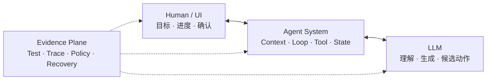

# 01 · 如何阅读这本书

本书面向具有前端或 TypeScript 工程经验、熟练使用 Claude Code、Codex 等 Agentic Coding 工具，但尚未系统构建过 Agent 应用的工程师。

知识章节与一个持续生长的应用共同推进。LLM 底层知识解释模型行为，Agent 系统知识把模型组织成可控制的执行过程，Agentic UI 则让这条过程能够被人类看见、干预和恢复。Eval、安全、可靠性与可观测性从第一轮实验开始持续提供工程证据。

完成全书后，应当能够回答并实现五件事：模型为什么会产生当前结果，Agent 如何选择和执行下一步，人类如何理解并控制任务，失败后怎样恢复，以及用什么证据证明任务真的完成。

## 1. 从熟悉的体验进入三层系统

Claude Code 或 Codex 处理代码任务时，通常会读取仓库规则、搜索相关实现、运行测试、修改文件，再根据新的测试结果决定下一步。界面上是一段连续交互，内部已经包含三层职责：



- **LLM 层**根据当前 Context 生成文本、结构化 Item 或候选 Tool Call；
- **Agent 层**构造 Context、管理 Loop 与状态、校验动作并调用 Tool；
- **UI 层**把 Run 投影成进度、证据、澄清、审批和恢复入口，并把用户意图送回 Application Server；
- **工程证据线**用测试、Eval、Policy、Trace 和权威 Outcome 约束三层。

代码修改通常有清晰 Diff 和测试，真实业务动作则可能不可逆：支付请求已经提交但响应丢失时，系统不能因为看到 Timeout 就再次退款；用户点击 Stop，也不能据此声称外部效果已经撤销。

正文因此把 Coding Agent 作为机制类比，真正持续构建的是一套售后处置应用。

## 2. 最终要完成的应用

贯穿项目名为 **Resolution Desk——可验证的退款处置工作台**。它处理一个完整任务族：由延迟配送、商品损坏、重复扣款或一般退款诉求触发的退款工单。系统可以解释、澄清、生成退款 Proposal、安全拒绝或转人工，但不把换货、补发和拒付混入首版范围。

```text
客服打开工单
→ 工作台创建 Thread / Run 并流式展示进度
→ Agent 查询获准访问的订单、物流与有效政策
→ 信息不足时生成受控的澄清界面
→ 系统形成带证据的建议或不可变退款 Proposal
→ 服务端重新授权并通过可信界面请求精确 Approval
→ Executor 使用稳定幂等键提交 Mock 退款
→ 系统查询支付侧权威 Outcome
→ 工作台展示回执、回复草稿和可恢复时间线
```

最终工作台还要处理断线、取消、进程重启、重复事件、Prompt Injection、跨租户读取和支付 ACK 丢失。功能完备不是能力无限，而是目标范围内的正常完成、澄清、拒绝、等待审批、未知效果核对和人工接管都有明确语义与可重复证据。

## 3. 三条知识主线与一条工程证据线

三条主线具有明确依赖，但会在项目中多次交汇。

### 主线一：LLM 底层知识

```text
概率与信息量
→ Token 与 Embedding
→ Attention 与 Transformer
→ 训练、后训练与推理
→ 采样、Context Window 与 Model API
```

这条线回答“模型为什么会这样表现”。学习目标不是训练基础模型，而是能解释输出波动、截断、检索差异、结构化生成失败和模型路由取舍。

### 主线二：Agent 系统知识

```text
Prompt / Context
→ Harness / Loop
→ State / Workflow
→ Tool / MCP / Action Control
→ Knowledge / Memory
→ Multi-Agent / A2A
```

这条线回答“怎样把概率能力变成受控系统”。单 Agent Runtime 是生产 Baseline；Multi-Agent 与 A2A 是必懂能力，但采用它们必须由相同 Dataset、近似总预算和故障测试下的 Eval 结果决定。

### 主线三：Agentic UI 与前端

```text
Application Server
→ Canonical Event / Public Snapshot / Reducer
→ AG-UI Runtime Interaction
→ Agent UX / Interrupt / Approval / Recovery
→ A2UI / Trusted Renderer / Action Gateway
```

这条线回答“人类怎样理解、控制并信任 Agent”。AG-UI 与 A2UI 都是主线内容：前者处理 Agent Backend 与用户界面的运行时交互，后者让 Agent 以声明式数据描述受控 Surface。它们都不能替代领域状态机、服务端 Authorization 和高风险 Approval。

### 横切工程证据线

Eval、安全、可靠性与可观测性不在最后集中补做。每增加一项能力，都同步增加 Dataset Case、Grader、权限不变量、故障注入、Trace 字段或 SLO。只有当新增复杂度产生可复现收益，功能才进入主路径。

## 4. 项目增量如何对应三层

| 阶段          | LLM 层增量                     | Agent 层增量                          | UI 层增量                | 工程证据                             |
| ----------- | --------------------------- | ---------------------------------- | --------------------- | -------------------------------- |
| Baseline    | Recorded Output             | 固定 Workflow                        | 静态工单详情                | Anchor Case + Outcome Grader     |
| Model Slice | Streaming、Structured Output | 有界只读 Loop                          | 流式 Item 与状态时间线        | 多 Trial + 协议错误分类                 |
| Knowledge   | Embedding / Rerank 直觉       | Context Builder、ACL、Provenance     | 可审查证据卡片               | Retrieval Eval + 越权 Case         |
| Action      | Tool Call                   | Proposal、Authorization、Idempotency | Preview、Approval、未知效果 | Fault Injection + 权威 Outcome     |
| Agentic UI  | Model Event Adapter         | Application Server、Canonical Event | AG-UI、Agent UX、A2UI   | Replay、Contract 与 UI Policy Test |
| Operations  | Model Routing               | Checkpoint、Queue、Recovery          | 重连、接管与降级状态            | Trace、SLO、发布门禁                   |

知识线防止项目退化成 API 拼装；项目线防止原理停留在抽象名词；工程证据线则阻止“看起来能用”被误认为“已经可靠”。

## 5. 每章采用同一种阅读节奏

章节尽量遵循下面的结构：

1. **问题**：Resolution Desk 当前出现了什么可观察缺口；
2. **机制**：缺口来自 LLM、Agent Runtime、UI 投影、协议还是外部系统；
3. **边界**：该机制能够保证什么，明确不能保证什么；
4. **实现**：为工作台增加一个小而完整的能力；
5. **故障注入**：主动制造截断、越权、重复、断线或状态冲突；
6. **验收**：用 Fixture、测试、Trace 或权威状态确认结果；
7. **衔接**：说明当前系统已经具备什么，下一章继续解决什么。

第 02–04 部分的实验不要求提前构建完整 Agent Runtime，可以使用书中给出的 Recorded Fixture、纸面推演或单一机制的小实验。第 05 部分建立可运行纵向切片后，后续实践持续累加到同一个应用。

## 6. 本书仓库不等于练习项目

当前仓库只用于阅读和发布本书，不承载应用源码。书中的 TypeScript 片段、Schema、状态机和目录结构是教学材料，不表示要在本仓库创建对应工程。

需要动手时，在本仓库之外建立独立练习项目：

```text
workspace/
├─ masterpiece/       # 本书仓库，只阅读
└─ resolution-desk/   # 读者自己的练习项目
```

练习项目可以根据个人习惯组织为单体应用或 Monorepo。全书只依赖稳定的逻辑边界：Web UI、Application Server、Agent Runtime、Model Adapter、Tool/Knowledge Adapter、Policy、State Store 和 Eval。具体 Framework 可以替换，领域契约与验收语义应保持稳定。

## 7. 三类完成证据

每一阶段都同时检查三类证据。

| 证据    | 回答的问题      | Resolution Desk 示例              |
| ----- | ---------- | ------------------------------- |
| 概念解释  | 是否理解机制与边界  | 为什么 Structured Output 合法仍不能直接退款 |
| 可运行行为 | 是否能实现该机制   | 完整 Tool Call 经过语义校验后才进入执行队列     |
| 故障结果  | 边界是否在异常中成立 | ACK 丢失后只查询原 Intent，不创建第二笔退款     |

截图和一段顺利对话只能说明界面曾经工作。完整证据还应包括输入 Fixture、运行版本、状态转移、UI 投影、外部 Outcome 和失败路径。

## 8. Claude Code 与 Codex 的使用边界

Coding Agent 可以帮助生成测试 Fixture 骨架、查找 SDK 类型、实现已经定义好的窄接口、执行测试和审查 Diff。适合交给 Coding Agent 的任务应包含明确 Contract、已有上下文、允许修改范围与验收命令。

以下判断仍由读者完成：

- 当前事实的权威来源是什么；
- 模型候选在哪一层变成可执行 Command；
- Canonical State 与 UI Projection 分别由谁持有；
- Authorization、Approval 与 Permission 分别由谁实施；
- Timeout、Cancel 和 Retry 如何影响外部效果；
- 哪项 Eval 能证明 Multi-Agent、A2A 或 Framework 增加的复杂度确实有效。

## 9. 推荐阅读顺序

第一次阅读按下面的顺序连续推进：

1. 读完导读，明确 Resolution Desk 的任务边界和 3 个 Anchor Case；
2. 用第 02–03 部分建立解释模型行为所需的 LLM 直觉；
3. 用第 04 部分建立 Eval 基线，从此让证据线伴随每次实现；
4. 完成第 05 部分 01–08，建立 Model Adapter、有界 Loop、State 与 Framework 判断；
5. 完成第 06 部分以及第 07 部分 01–04，依次加入 Context、Knowledge、Memory、Tool、MCP 与受控行动；
6. 学习 [Multi-Agent](/masterpiece-static-docs/05-模型接口与Agent内核/11-Multi-Agent协作状态与验证.md) 与 [A2A](/masterpiece-static-docs/07-工具-协议与行动控制/05-A2A与跨Agent协作协议.md)，掌握协作责任模型，并用对照 Eval 决定是否在生产启用；
7. 连续完成 [05/09 Application Server](/masterpiece-static-docs/05-模型接口与Agent内核/09-Agent-Application-Server与UI事件协议.md) → [05/10 AG-UI](/masterpiece-static-docs/05-模型接口与Agent内核/10-AG-UI与前端事件适配.md) → [08/05 Agent UX](/masterpiece-static-docs/08-安全与治理/05-Agent-UX与可控交互.md) → [08/06 A2UI](/masterpiece-static-docs/08-安全与治理/06-A2UI与声明式生成界面.md)，一次建立完整 Agentic UI 主线；
8. 阅读第 08 部分 01–04 与 07，将前面已经明确的 Trusted Renderer、Action Gateway 和人类控制边界纳入系统性 Threat Model、纵深防御与 Red Team；
9. 用第 09 部分补齐恢复、可观测和发布门禁；
10. 在第 11 部分按“综合心智模型 → 自测 → 参考答案 → 八周构建路径 → Resolution Desk 总装”完成闭环。

“05/09 → 05/10 → 08/05 → 08/06”必须连续阅读。前面的 Agent 内核、Knowledge、Tool、Multi-Agent 与 A2A 已经提供它依赖的运行和协作语义；四篇 UI 核心文章则完整回答从服务端事件到受控生成界面的设计问题。随后再进入系统性安全章节，验证这些边界在恶意输入与越权尝试下是否成立。

Rust、资料索引、能力索引和场景迁移属于专题与附录，不影响核心项目完成。

## 章末练习

选择一次近期的 Claude Code 或 Codex 任务，仅做系统拆解，不需要复制对话全文。分别识别：

- LLM 层实际收到的 Context 与生成的候选；
- Agent 层的 Tool、Observation、Run State、预算与权限控制；
- UI 层展示的进度、证据、确认和完成状态；
- 最终由测试、Artifact 或外部系统提供的 Outcome 证据。

若某个“完成”只能由模型的一句话判断，而没有测试、回执、数据库状态或其他外部证据，将它标记为后续需要补齐的验证点。

## 本章小结

本书以熟悉的 Coding Agent 体验作为入口，以 Resolution Desk 作为唯一贯穿项目。LLM、Agent 与 Agentic UI 三条知识主线共同构成产品，Eval、安全、可靠性与可观测性负责持续证明它可以被信任。下一章将一次任务拆成三层数据流，并说明 Context、Harness、Loop 和协议分别位于哪里。

[下一章：从一次 Agent 任务看懂系统分层](/masterpiece-static-docs/01-导读/02-从一次Agent任务看懂系统分层.md)
