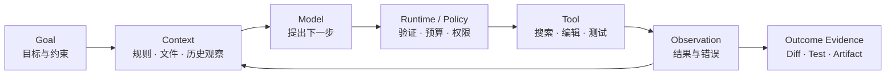

# 01 · 如何阅读这本书

本书面向具有前端或 TypeScript 工程经验、熟练使用 Claude Code、Codex 等 Agentic Coding 工具，但尚未系统构建过 Agent 应用的工程师。

它既不是模型术语手册，也不是若干互不相干的教程。知识章节与一个持续生长的应用共同推进：概率和模型原理解释现象，Agent Runtime 把现象变成可控制的执行过程，Context、Tool、安全与可靠性章节再把这条执行过程扩展成完整产品。

读完整书后，目标是能够回答并实现四件事：模型为什么会这样行动，系统如何限制它的行动，失败后怎样恢复，以及用什么证据证明任务真的完成。

## 1. 从熟悉的体验进入陌生系统

Claude Code 或 Codex 处理代码任务时，通常会读取仓库规则、搜索相关实现、运行测试、修改文件，再根据新的测试结果决定下一步。表面上是一段连续对话，实际已经包含 Agent 应用的基本结构：



这段经验适合建立直觉，却不是全书的业务案例。代码修改通常有清晰 Diff 和测试，真实业务动作则可能不可逆：支付请求已经提交但响应丢失时，系统不能因为看到 Timeout 就再次退款；用户点击 Stop，也不能据此声称外部效果已经撤销。

因此，正文只把 Coding Agent 当作机制类比，真正持续构建的是一套售后处置应用。

## 2. 最终要完成的应用

贯穿项目名为 **Resolution Desk——可验证的退款处置工作台**。它处理一个完整任务族：由延迟配送、商品损坏、重复扣款或一般退款诉求触发的退款工单。系统可以解释、澄清、生成退款 Proposal、安全拒绝或转人工，但不把换货、补发和拒付混入首版范围。

```text
客服打开工单
→ 系统流式展示当前分析状态
→ 查询获准访问的订单与物流事实
→ 检索当前生效的政策并标出来源
→ 信息不足时生成澄清表单
→ 形成带证据的处置建议或退款 Proposal
→ 服务端重新授权并等待精确 Approval
→ 使用稳定幂等键提交 Mock 退款
→ 查询支付系统确认真实 Outcome
→ 展示回复草稿、回执和完整时间线
```

最终工作台还要能够处理断线、取消、进程重启、重复事件、Prompt Injection、跨租户读取和支付 ACK 丢失。功能完备并不表示能力无限，而是目标范围内的正常路径、拒绝路径与恢复路径都有明确语义和可重复证据。

## 3. 两条线同时推进

全书有两条互相约束的主线。

**知识线**回答原理与边界：

```text
概率与表示
→ LLM 的生成机制
→ Eval 与实验方法
→ Model API 与 Agent Loop
→ Context、Knowledge 与 Memory
→ Tool、协议与行动控制
→ Security、Reliability 与 Operations
```

**项目线**持续增加用户可见能力：

```text
静态工单与 Baseline
→ 流式模型分析
→ 只读 Tool Loop
→ 政策检索与证据
→ Proposal 与 Approval
→ 幂等退款与结果核对
→ 可恢复 Web UI
→ Eval、Trace、SLO 与发布门禁
```

知识线防止项目退化成 API 拼装；项目线则防止原理停留在抽象名词。某项机制只有在项目中出现明确责任、故障和验收方式，才算真正掌握。

## 4. 每章采用同一种阅读节奏

章节尽量遵循下面的结构：

1. **问题**：Resolution Desk 当前出现了什么可观察缺口；
2. **机制**：缺口来自模型、Context、Runtime、协议还是外部系统；
3. **边界**：该机制能够保证什么，明确不能保证什么；
4. **实现**：为工作台增加一个小而完整的能力；
5. **故障注入**：主动制造截断、越权、重复、断线或状态冲突；
6. **验收**：用 Fixture、测试、Trace 或权威状态确认结果；
7. **衔接**：说明当前系统已经具备什么，下一章继续解决什么。

第 02–04 部分出现的实验不要求提前构建完整 Agent Runtime。它们使用书中给出的 Recorded Fixture、纸面推演或单一机制的小实验。第 05 部分建立可运行纵向切片后，后续实践才持续累加到同一个应用。

## 5. 本书仓库不等于练习项目

当前仓库只用于阅读和发布本书，不承载应用源码。书中的 TypeScript 片段、Schema、状态机和目录结构是教学材料，不表示要在本仓库创建对应工程。

需要动手时，在本仓库之外建立独立练习项目：

```text
workspace/
├─ masterpiece/       # 本书仓库，只阅读
└─ resolution-desk/   # 读者自己的练习项目
```

练习项目可以根据个人习惯组织为单体应用或 Monorepo。全书只依赖稳定的逻辑边界：Web UI、Application Server、Agent Runtime、Model Adapter、Tool/Knowledge Adapter、Policy、State Store 和 Eval。具体 Framework 可以更换，领域契约与验收语义应保持稳定。

## 6. 三类完成证据

每一阶段都同时检查三类证据。

| 证据    | 回答的问题      | Resolution Desk 示例                 |
| ----- | ---------- | ---------------------------------- |
| 概念解释  | 是否理解机制与边界  | 为什么 Structured Output 合法仍不能直接退款    |
| 可运行行为 | 是否能实现该机制   | 流式 Item 完整闭合后才允许进入 Tool Validation |
| 故障结果  | 边界是否在异常中成立 | ACK 丢失后只查询原 Intent，不创建第二笔退款        |

截图和一段顺利对话只能说明界面曾经工作。完整证据还应包括输入 Fixture、运行版本、状态转移、外部 Outcome 和失败路径。

## 7. Claude Code 与 Codex 的使用边界

Coding Agent 可以帮助生成测试 Fixture 骨架、查找 SDK 类型、实现已经定义好的窄接口、执行测试和审查 Diff。适合由 Coding Agent 执行的任务应包含明确 Contract、已有上下文、允许修改范围与验收命令。

以下判断仍由读者完成：

- 当前事实的权威来源是什么；
- 模型候选在哪一层变成可执行 Command；
- Authorization、Approval 与 Permission 分别由谁实施；
- Timeout、Cancel 和 Retry 如何影响外部效果；
- 哪项 Eval 能证明新增复杂度确实有效。

一次性要求 Coding Agent “把整个应用做完”只会隐藏这些边界，也无法替代对系统行为的解释。

## 8. 推荐阅读顺序

侧栏和页底翻页已经按照“核心主线 → 进阶实验 → 附录与专题”排列。第一次阅读沿核心主线连续推进，术语页可以随时回查：

1. 读完导读，明确 Resolution Desk 的任务边界和 3 个 Anchor Case；
2. 用第 02–03 部分建立足够解释模型行为的直觉；
3. 用第 04 部分学习如何比较随机系统，而不是只看一次结果；
4. 从第 05 部分开始持续实现同一个应用；首次阅读完成 05/01–09，建立单 Agent Runtime、Canonical Event、Public Snapshot 与可恢复 UI；
5. 第 06–09 部分依次加入知识、行动、安全、恢复和运营能力；核心路径从 07/04 进入 08/01，从 08/05 进入 08/07，并且只有完成 08/07 的全部适用安全门禁后，常规业务 Run 才能提交 Mock 退款；
6. 第 11 部分按“综合心智模型 → 自测 → 参考答案 → 八周构建路径 → Resolution Desk 总装”完成主线闭环；
7. 主线完成后，再进入 AG-UI Adapter、Multi-Agent、AI SDK / LangGraph、A2A、Agent Skills / MCP 扩展与 A2UI 等进阶实验。Canonical Event 与 Public Snapshot 是必修能力；AG-UI 位于 Product Edge、不能替代领域状态这一判断必须理解，但是否实现 Adapter 取决于客户端互操作需求；
8. Rust、资料索引、能力索引和场景迁移属于附录与专题，不影响核心项目完成。

## 章末练习

选择一次近期的 Claude Code 或 Codex 任务，仅做系统拆解，不需要复制对话全文。识别：目标与约束、模型调用前的 Context、工具及 Observation、运行状态、权限控制，以及最终完成证据。随后把这些对象映射到 Resolution Desk 的工单处理流程。

若某个“完成”只能由模型的一句话判断，而没有测试、回执、数据库状态或其他外部证据，将它标记为后续需要补齐的验证点。

## 本章小结

本书以熟悉的 Coding Agent 体验作为入口，以 Resolution Desk 作为唯一贯穿项目。知识解释项目中出现的问题，项目则为每项知识提供实现位置和验收证据。下一章将一条 Agent 任务拆成 Model、Context、Runtime、Harness 与 Application 五个层次。

[下一章：从一次 Agent 任务看懂系统分层](/masterpiece-static-docs/01-导读/02-从一次Agent任务看懂系统分层.md)
