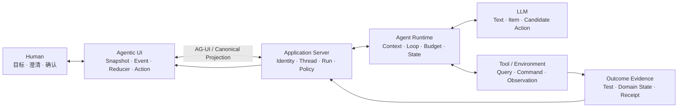
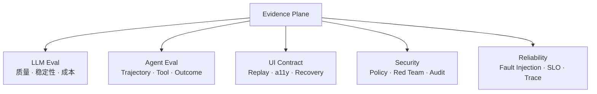

# 02 · 从一次 Agent 任务看懂系统分层

一项 Coding Agent 任务在界面上表现为连续交互，背后却由 LLM、Agent System 与 Agentic UI 三层协作完成。拆开这些职责之后，才能判断问题应由 Prompt、Context、Tool、Runtime、UI Reducer 还是业务策略解决。

本章先用一条熟悉的代码修复任务建立直觉，再映射到 Resolution Desk。类比的目的不是维护第二个项目，而是借助文件、Diff 和测试这些清晰证据，理解业务 Agent 中更难观察的边界。

## 1. 一次任务的三层数据流



一次完整循环可以描述为：

1. UI 把用户意图提交给 Application Server；
2. Runtime 从权威 State、可访问数据和 Tool Schema 中构造 Context；
3. LLM 生成文本、结构化 Item 或候选 Tool Call；
4. Runtime 与 Policy 校验结构、领域语义、预算和权限；
5. Tool Executor 产生 Observation 或外部效果；
6. Application Server 持久化 State 与 Canonical Event；
7. UI 从 Snapshot 和后续 Event 更新界面；
8. Eval 与 Outcome Verifier 检查任务是否真的完成。

模型不会直接读取文件、执行测试或修改数据库；UI 也不应从零散 Delta 猜测权威业务状态。外部效果和状态转移都由模型之外的确定性程序持有。

## 2. 第一层：LLM 提供概率能力

Model 接收 Token 序列，生成文本、结构化数据或 Tool Call。预训练和后训练决定它掌握的模式，当前 Context 决定本次调用可见的信息，推理与采样参数影响具体输出路径。

LLM 层主要回答：

- 输入怎样被 Tokenize，长 Context 为什么会产生截断与注意力竞争；
- 同一任务多次运行为什么得到不同措辞、计划或 Tool 参数；
- Structured Output 保证了什么，为什么 Schema 合法仍不代表业务合法；
- Embedding、Rerank 和模型路由分别改变了哪一部分行为；
- Provider Stream 中哪些是 Delta，哪些 Item 已完整闭合。

模型不持有业务数据库中的权威事实，也不能替代权限系统。即使模型生成了 `{"orderId":"123","amount":100}`，也只能说明候选数据可解析；订单是否存在、金额是否符合政策、操作者是否有权退款，都属于 Agent 与业务系统的责任。

## 3. 第二层：Agent System 把候选变成受控执行

Agent 层不是单个类或某个 Framework。它由 Context Builder、Runtime、Harness、Application Server、Tool、State 和 Policy 共同构成。

### 3.1 Context：一次调用真正可见的信息

Context 包含系统指令、用户输入、相关文件、工具说明、历史摘要、检索证据和当前任务状态。它不是“系统知道的一切”，而是 Context Builder 针对本次调用构造的有限视图。

Claude Code 或 Codex 按需搜索文件，就是一种 Context 选择。把整个仓库、全部历史和所有工具定义一次性放入请求，会同时增加成本、噪声和攻击面。

### 3.2 Agent Runtime：管理 Loop、State 与边界

Agent Runtime 管理一次 Run 中的控制流：

```text
构造 Context
→ 调用 Model
→ 校验候选动作
→ 执行 Tool
→ 记录 Observation
→ 更新 State
→ 继续、完成、失败、取消或等待人工
```

Runtime 还负责 Step、Token、时间和金额预算，以及超时、重试、重复调用检测和终止条件。一个没有上限的 `while` 循环不是可用的 Agent Runtime。

### 3.3 Agent Harness：提供完整运行环境

Agent Harness 将 Model Adapter、Context Builder、Runtime、Tools、Sandbox、Permission、Hooks、State、Compaction 和 Trace 组合成模型可以工作的环境。Coding Agent 能够浏览代码库、执行命令，并在测试失败后继续定位，主要依靠 Harness。

Harness 解决“模型如何在受控环境中工作”，并不自动解决具体业务是否正确。例如，文件系统 Permission 可以阻止进程读取某个目录，却不能判断客服是否有权查看某位客户的订单；后者属于领域 Authorization。

### 3.4 Agent Application Server：连接 Runtime、领域与产品

Application Server 位于 Agent 系统与 UI 的边界，负责：

- Authentication、Tenant 与领域资源；
- Thread、Run、Item、Canonical Event 与 Public Snapshot；
- 用户 Command、Approval、Cancel、Resume 与 Human Handoff；
- Queue、后台执行、Checkpoint 和恢复；
- 真实 Outcome、Audit、Eval 与 SLO；
- Web、App、CLI 和标准协议客户端。

因此，完整 Agent Application 可以概括为：

```text
Agent Application
= LLM Interface
+ Agent Runtime / Harness
+ Context / Knowledge / Memory
+ Tools / Actions
+ State / Workflow
+ Policy / Security
+ Agentic UI
+ Evaluation / Operations
```

## 4. 第三层：Agentic UI 让任务可以被理解和控制

传统聊天界面主要展示消息。Agentic UI 还必须表达长期任务、并行 Item、Tool 状态、证据来源、Interrupt、Approval、未知效果、断线重连和人工接管。

### 4.1 Canonical Event、Public Snapshot 与 Reducer

- **Canonical Event** 是应用内部已经持久化、具有稳定语义的事实，例如 `run.waiting_for_approval`；
- **Public Snapshot** 是客户端恢复时可获取的权威公开状态，不包含服务端私有 Context 或敏感 Trace；
- **Reducer** 将 Snapshot 与后续 Event 确定性地投影为 UI State；
- **User Action** 表达用户意图，必须回到服务端重新认证、校验与授权。

前端不得把 Provider Token Delta 当作业务状态，也不应仅凭最后一条自然语言消息判断 Run 已完成。

### 4.2 AG-UI：运行时交互平面

Agent–User Interaction Protocol（AG-UI）用于连接 Agent Backend 与用户界面，交换 Run、Message、Tool、State 等交互事件。它位于 Product Edge，适合支持标准客户端和 Framework 互操作。

Resolution Desk 先定义自己的 Canonical Event 与 Public Snapshot，再通过 Adapter 投影为 AG-UI Event。原生客户端和 AG-UI 客户端必须使用同一组 Fixture 验证最终 UI State；协议不能反向成为退款领域状态机。

### 4.3 Agent UX：表达不确定性与控制权

Agent UX 不只是展示 Streaming 文本，还要让用户区分：

- 系统正在生成、查询、等待还是核对外部效果；
- 当前信息来自模型推断、检索证据还是权威系统；
- Stop 能取消哪些后续工作，不能撤销哪些既有外部效果；
- 哪个 Proposal 正在等待 Approval，参数改变后为何必须重新确认；
- 何时能够 Retry，何时只能 Resume、Reconcile 或转人工。

### 4.4 A2UI：受控的声明式界面平面

Agent-to-User Interface（A2UI）允许 Agent 或服务端发送受 Catalog 约束的 Surface、Component、Data Model 与 Action 描述，由宿主使用本地可信组件渲染。它适合动态澄清表单、证据选择器和低风险信息收集。

A2UI Payload 可以经 AG-UI 等传输通道到达客户端，但两者职责不同：AG-UI 处理运行时交互，A2UI 描述界面。未知 Component、URL 与 Action 必须被 Trusted Renderer 拒绝；所有 Action 还要经过服务端 Action Gateway。退款金额、目标账户和最终 Approval 继续使用固定的受信原生 UI。

## 5. 横切工程证据：三层都必须可以验证



三个层次有不同的证据：

| 层次    | 不能只看      | 应补充的证据                                   |
| ----- | --------- | ---------------------------------------- |
| LLM   | 一次回答看起来合理 | 多 Trial、Grader、分布与成本                     |
| Agent | Tool 返回成功 | Trajectory、Policy Decision、权威 Outcome    |
| UI    | 顺利路径截图    | Snapshot Replay、Event Contract、断线和重复事件测试 |

安全、可靠性和可观测性不是上线前的清单，而是这套证据系统的组成部分。没有 Trace 无法归因；没有 Fault Injection 无法证明恢复；没有权限不变量就无法判断协议接入是否扩大了能力边界。

## 6. Prompt、Context、Harness 与 Loop 的关系

这些概念描述不同的设计对象，不是一条“旧技术被新技术淘汰”的代际线。

| 概念                     | 主要设计对象         | 典型问题                        |
| ---------------------- | -------------- | --------------------------- |
| Prompt Engineering     | 指令、示例、角色与输出要求  | 怎样把任务说清楚                    |
| Context Engineering    | 本次推理可见的全部信息    | 哪些证据、状态和工具应该进入请求            |
| Harness Engineering    | 模型周围的运行环境与控制设施 | 怎样提供工具、沙箱、状态、权限和反馈          |
| Agent Loop Engineering | 反馈循环、停止条件与验证闭环 | 怎样根据 Observation 继续，并防止循环失控 |
| Agentic UI Engineering | 服务端状态与人机协作界面   | 怎样展示、干预、审批、恢复并验证长期任务        |

Prompt 是 Context 的一部分；Context Builder 是 Harness 的一部分；Inner Agent Loop 通常由 Runtime 实现；Application Server 将 Run 转换为客户端可消费的稳定状态。前端工程并非最后套上一层页面，而是与持久状态、事件契约和人类控制共同设计。

以测试修复任务为例：

- “不要改变公开 API”是一条 Prompt 约束；
- 公开 API 定义、相关测试与当前 Diff 是 Context；
- 搜索、编辑、Shell、Sandbox 和 Permission 属于 Harness；
- “测试仍失败则继续定位，预算耗尽则停止”属于 Loop Control；
- 进度列表、Diff Preview、命令审批和 Stop 属于 Agentic UI；
- CI 结果和 API 兼容性检查才是 Outcome 证据。

## 7. 从 Coding Agent 映射到 Resolution Desk

| Coding Agent        | Resolution Desk                              |
| ------------------- | -------------------------------------------- |
| 仓库规则与相关代码           | 退款政策、订单数据与用户说明                               |
| 搜索文件、运行测试           | 检索政策、查询订单、核对支付状态                             |
| 修改代码                | 生成或提交退款操作                                    |
| Git Diff Preview    | 退款金额、原因和目标账户的 Proposal                       |
| 测试进度与 Tool Timeline | Run、Item、Evidence 与 Effect Status            |
| 命令审批                | 退款的精确 Approval                               |
| 测试与 CI              | 领域 Grader 与支付系统 Outcome                      |
| 工作区 Permission      | Actor、Tenant、Resource、Action 的 Authorization |
| 回退提交                | 取消、补偿或人工异常处理                                 |

代码修改通常可以通过 Git 回退；已提交的退款可能需要补偿流程。业务 Agent 的 Action Plane 因而必须显式设计审批、幂等、资源版本和审计，UI 也必须准确表达“正在核对”而不是把 Timeout 显示成“退款失败”。

## 8. Multi-Agent 与 A2A 位于 Agent 层

Multi-Agent 解决子任务并行、Context 隔离、权限隔离或专业化分工；A2A 解决独立 Agent 系统之间的发现、消息、Task 和 Artifact 交换。两者都不属于 UI 协议，也不会天然提高质量。

采用前必须先明确 Parent Run、Child Run、总预算、取消传播、Artifact Schema、确定性 Join 与最终结果 Ownership。远端 A2A Task 完成只表示协议任务终止，本地 Application Server 仍要验证 Artifact 并决定业务状态。生产启用则必须通过相同 Dataset 和预算下的对照 Eval。

## 9. 实践：拆解第一张 Resolution Desk 工单

使用下面的表格拆解任务 `case_refund_clear`：

| 时刻 | LLM Context 与候选      | Agent 层控制                        | UI 投影                             | Outcome 证据   |
| -- | -------------------- | -------------------------------- | --------------------------------- | ------------ |
| 1  | 根据工单提出查询目标订单         | 只允许读取当前 Tenant                   | 展示 `querying_order`，不暴露私有 Context | 尚无           |
| 2  | 根据订单提出检索当前政策         | ACL、版本与生效时间过滤                    | 展示带来源的 Evidence Item              | 尚无           |
| 3  | 生成退款 Proposal        | Schema、金额和 Authorization 校验；暂不执行 | 固定 Preview 与 Approval 入口          | 支付状态仍未改变     |
| 4  | 根据 Tool Receipt 起草回复 | 幂等提交并查询支付侧状态                     | 展示 `reconciling` 或最终 Receipt      | 权威支付 Outcome |

这一阶段只做纸面推演，不要求已有 Runtime。验收标准是为每一步指出三层责任和外部证据；若所有行为都只能归因于“模型自己决定”，或者 UI 只能展示一段文本，说明分层仍不清楚。

## 常见误区

- 把 `AGENTS.md` 或 `CLAUDE.md` 当作权限系统；它们只是进入 Context 的指令来源。
- 把 Provider Stream 直接当作可恢复的 UI 状态；应用仍需要 Canonical Event 与 Snapshot。
- 把 AG-UI 当成 Agent Runtime，或把 A2UI 当成可以执行任意前端代码的格式。
- 用更长 Prompt 修复工具超时、Reducer 重放错误、资源冲突或授权缺陷。
- 认为引入多个 Agent 或 A2A 会自然提高可靠性；新增协调必须经过 Eval。
- 把模型的自然语言推理过程当作审计记录；审计需要结构化事件与外部证据。

## 本章小结

LLM 提供概率能力，Agent System 管理 Context、Loop、State 与 Action，Agentic UI 将运行状态转化为人类能够理解和控制的产品体验。Eval、安全、可靠性与可观测性贯穿三层，负责证明系统在正常和异常路径中都保持边界。下一章提供全书随查术语，并进一步澄清协议、状态、知识、记忆与真实 Outcome 的区别。

[下一章：术语与边界](/masterpiece-static-docs/01-导读/03-术语与边界.md)
