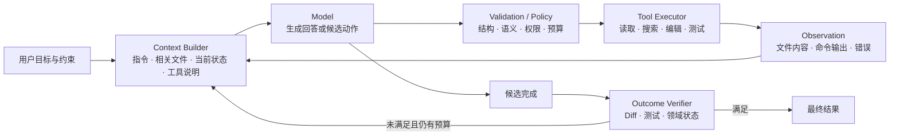
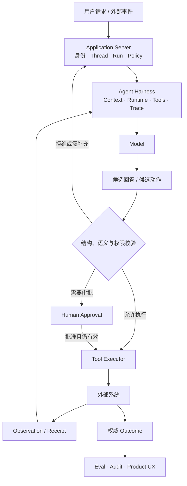

# 02 · 从一次 Agent 任务看懂系统分层

一条 Coding Agent 任务看起来像连续对话，实际由多种职责不同的组件协作完成。只有把这些职责拆开，才能判断问题应该通过 Prompt、Context、Tool、Runtime 还是业务策略解决。

本章先用一条熟悉的代码修复任务拆解系统，再把同一结构映射到 Resolution Desk。类比的目的不是维护第二个项目，而是借助文件、Diff 和测试这些清晰证据，理解业务 Agent 中更难观察的边界。

## 1. 一次任务的数据流



图中的模型只做两件事：根据当前输入生成内容，或者提出一个工具调用。它不会直接读取文件、执行测试或修改数据库。所有外部效果都由模型之外的程序完成。

这个边界解释了一个常见现象：模型可能准确描述了下一步，却因为工具参数不合法而无法执行；也可能成功调用工具，却因为权限检查缺失而产生不应发生的效果。两种故障不能都归为“模型回答不好”。

## 2. 五个层次

### 2.1 Model：提供概率性的判断与生成能力

Model 接收 Token 序列，生成文本、结构化数据或 Tool Call。预训练和后训练决定它擅长哪些模式；当前 Context 决定这一次调用能看到什么。

Model 不持有业务数据库中的权威事实，也不能替代权限系统。即使输出完全符合 JSON Schema，也只能说明结构可解析，不能说明参数语义正确。

### 2.2 Context：一次调用真正可见的信息

Context 包含系统指令、用户输入、少量相关文件、工具说明、历史摘要、检索证据和当前任务状态。它不是“系统知道的一切”，而是 Context Builder 为本次调用选择出的有限信息。

Claude Code 或 Codex 按需搜索文件，正是在做 Context 选择。若把整个仓库、全部历史和所有工具定义一次性放入请求，相关信号会被噪声稀释，成本和攻击面也会同步扩大。

### 2.3 Agent Runtime：让一次运行有状态、有边界

Agent Runtime 管理单次 Run 中的控制流：

```text
构造 Context
→ 调用 Model
→ 校验候选动作
→ 执行 Tool
→ 记录 Observation
→ 更新 State
→ 继续、完成、失败、取消或等待人工
```

Runtime 还负责 step、Token、时间和金额预算，以及超时、重试、重复调用检测和终止条件。一个没有上限的 `while` 循环并不是可用的 Agent Runtime。

### 2.4 Agent Harness：模型能够工作的完整运行环境

Agent Harness 将 Model、Context Builder、Runtime、Tools、Sandbox、Permission、Hooks、State、Compaction 和 Trace 组合在一起。Coding Agent 能够浏览代码库、执行命令，并在测试命令返回非零退出码后继续定位，主要依靠这套运行环境。

Harness 解决的是“模型如何在受控环境中工作”，并不自动解决具体业务是否正确。例如，文件系统权限可以阻止 Agent 读取某个目录，但它无法决定某位客服是否有权查看某位客户的订单；后者属于领域 Authorization。

### 2.5 Agent Application：把 Harness 接入真实产品

Agent Application 还要处理：

- 用户身份、租户与领域数据。
- Thread、Run、Item 和语义事件。
- 审批、取消、恢复和后台任务。
- 真实 Outcome、Eval、Audit 与 Service Level Objective（SLO）。
- Web、App、CLI 等多种客户端。

因此，一个生产 Agent 应用可以概括为：

```text
Agent Application
= Model Interface
+ Agent Runtime / Harness
+ Context / Knowledge
+ Tools / Actions
+ State / Workflow
+ Policy / Security
+ Product UX
+ Evaluation / Operations
```

## 3. Prompt、Context、Harness 与 Loop 的关系

这些概念描述的是不同观察尺度，并不是一条“旧技术淘汰、新技术接替”的产品代际线。

| 概念                     | 主要设计对象         | 典型问题                        |
| ---------------------- | -------------- | --------------------------- |
| Prompt Engineering     | 指令、示例、角色与输出要求  | 怎样把任务说清楚                    |
| Context Engineering    | 本次推理可见的全部信息    | 哪些证据、状态和工具应该进入请求            |
| Harness Engineering    | 模型周围的运行环境与控制设施 | 怎样提供工具、沙箱、状态、权限和反馈          |
| Agent Loop Engineering | 反馈循环、停止条件与验证闭环 | 怎样根据 Observation 继续，并防止循环失控 |

Prompt 是 Context 的一部分；Context Builder 是 Harness 的一部分；Inner Agent Loop 通常由 Runtime 实现。跨多次 Run 的调度、独立验证和持久化属于更外层的 orchestration，不应与单次 Run 内的 Tool Loop 混为一谈。

以测试修复任务为例：

- “不要改变公开 API”是一条 Prompt 约束。
- 公开 API 定义、相关测试与当前 Diff 是 Context。
- 搜索、编辑、Shell、Sandbox 和审批机制属于 Harness。
- “测试命令返回非零退出码或断言仍未满足时继续定位，预算耗尽则停止”属于 Loop Control。
- 持续集成（Continuous Integration，CI）的最终结果和 API compatibility check 才是 Outcome 证据。

## 4. 从 Coding Agent 映射到通用业务 Agent

Resolution Desk 可以复用相同结构，但外部动作的风险更高：

| Coding Agent   | Resolution Desk                              |
| -------------- | -------------------------------------------- |
| 仓库规则与相关代码      | 退款政策、订单数据与用户说明                               |
| 搜索文件、运行测试      | 检索政策、查询订单、核对支付状态                             |
| 修改代码           | 生成或提交退款操作                                    |
| Git Diff       | 退款金额、原因和目标账户的 Preview                        |
| 测试与 CI         | 领域 Grader 与支付系统 Outcome                      |
| 工作区 Permission | actor、tenant、resource、action 的 Authorization |
| 回退提交           | 取消、补偿或人工异常处理                                 |

这张映射也揭示了不能直接照搬的部分。代码修改通常可以通过 Git 回退；已提交的退款可能需要补偿流程。通用 Agent 的 Action Plane 因而必须显式设计审批、幂等、资源版本和审计。

## 5. 三类容易混淆的控制

### Permission

Permission 决定运行环境是否允许调用某类能力，例如是否允许执行 Shell、写入某个目录或访问网络。

### Authorization

Authorization 判断特定 actor 此刻是否能对特定 resource 执行特定 action。例如，客服 A 是否可以为订单 123 发起 100 元退款。

### Approval

Approval 表示用户理解并确认了某一个具体动作。审批内容必须包含目标、参数、风险和有效期；执行前仍要再次检查 Authorization 和资源版本。

三者缺一不可，也不能互相替代：有 Shell Permission 不代表有订单退款权限；通过 Authorization 不代表用户已经同意这笔操作；用户点击批准也不能覆盖服务端拒绝策略。

## 6. 最小系统地图



这张图的关键不变量是：模型负责提出候选，确定性系统负责读取范围、执行资格、状态变化和完成证据。

## 7. 实践：拆解第一张 Resolution Desk 工单

先观察 Coding Agent 中“Context → Candidate → Tool → Observation → Outcome”的结构，再按同一张表拆解 `case_refund_clear`：

| 时刻 | Context             | Model 候选      | Runtime / Harness 控制 | Observation    | Outcome 证据               |
| -- | ------------------- | ------------- | -------------------- | -------------- | ------------------------ |
| 1  | 工单文本、actor 与 tenant | 查询目标订单        | 只允许读取当前 tenant       | 返回订单事实与资源版本    | 尚无                       |
| 2  | 订单事实与政策元数据          | 检索当前有效退款政策    | ACL、版本与生效时间过滤        | 返回带来源的政策证据     | 尚无                       |
| 3  | 订单、政策与预算            | 生成退款 Proposal | Schema、金额和权限校验；暂不执行  | 返回不可变 Proposal | Proposal 与证据可审查，支付状态仍未改变 |

这一阶段只做纸面推演，不要求已有 Runtime。验收标准是为每一步指出权威状态、模型候选、确定性控制和完成证据；若所有行为都只能归因于“模型自己决定”，说明分层仍不够清楚。

## 常见误区

- 把 `AGENTS.md` 或 `CLAUDE.md` 当作权限系统。它们是进入 Context 的指令来源。
- 把一次成功 Tool Call 当作任务完成。执行成功与业务 Outcome 可能不同。
- 用更长 Prompt 修复工具超时、资源冲突或授权缺陷。问题落在错误层。
- 认为引入多个 Agent 会自然提高可靠性。它同时增加协调、成本和归因难度。
- 把自然语言推理过程当作审计记录。审计需要结构化事件与外部证据。

## 本章小结

Model、Context、Runtime、Harness 与 Application 构成从生成能力到完整产品的五层结构。Prompt Engineering、Context Engineering、Harness Engineering 与 Loop Engineering 分别优化其中不同对象，不存在简单的线性替代关系。下一章提供全书随查术语，并进一步澄清状态、工具、知识、记忆和评测之间的边界。

[下一章：术语与边界](/masterpiece-static-docs/01-导读/03-术语与边界.md)
