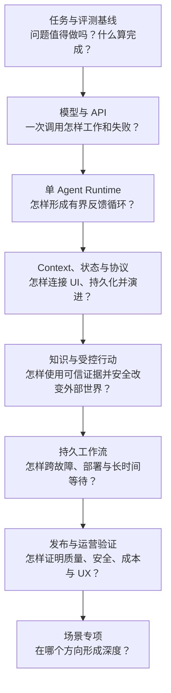
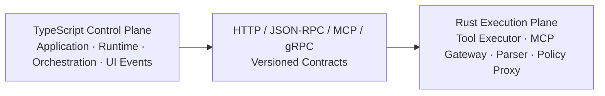

# 05 · 从前端工程到 Agent 应用工程

前端工程经验为 Agent 应用开发提供了重要基础：TypeScript 类型系统、异步 I/O、状态管理、事件驱动 UI、API 契约、测试和可观测性都可以直接迁移。真正需要补齐的，是概率模型带来的非确定性、工具调用循环、Context 管理、真实副作用和 Eval 方法。

转型路线因此不是抛弃既有工程能力重新学习一套技术，而是将这些能力扩展到一个新的系统边界。

## 1. 能力迁移地图

| 前端 / 全栈经验                               | 在 Agent 应用中的对应能力                                         | 新增难点                                      |
| --------------------------------------- | -------------------------------------------------------- | ----------------------------------------- |
| React State / Reducer                   | Thread、Run、Item 与 UI Event Reducer                       | 服务端才持有权威运行状态                              |
| Design System / Schema-driven Form      | A2UI Catalog 与声明式 Surface Renderer                       | 远端 UI Payload、Action 与 Data Model 都是不可信输入 |
| TypeScript 类型与 Zod                      | Tool、Event、State 的 Schema                                | 结构合法仍不代表语义、权限合法                           |
| Fetch、Server-Sent Events（SSE）、WebSocket | 模型流、语义事件和断线恢复                                            | Token chunk 与领域 Event 不是一回事               |
| API Client / Backend for Frontend（BFF）  | Model Provider Adapter、Model Context Protocol（MCP）Client | Provider 错误、限流和版本差异                       |
| 表单校验                                    | Tool 参数与 Approval Preview                                | 执行前还需服务端 Authorization                    |
| 状态机与异步任务                                | Agent Loop、Workflow、取消与恢复                                | 模型会动态选择下一步，外部效果可能未知                       |
| 单元测试与 End-to-End（E2E）测试                 | Task、Trial、Grader、Trace Eval                             | 输出有随机性，需多次 Trial 和分层指标                    |
| Web 安全                                  | Prompt Injection、Tool Abuse、数据边界                         | 不可信文本可能诱导高权限动作                            |
| 性能与监控                                   | Token、延迟、成本、Trace 与 SLO                                  | 模型和工具共同决定尾延迟与单位任务成本                       |

最关键的思维变化是：传统应用主要验证确定性代码是否按预期执行；Agent 应用还必须测量概率行为，并确保所有硬约束仍由确定性系统执行。

## 2. 能力如何逐层生长

阶段按照能力依赖排列，不是固定周数。一个阶段是否完成，以可审查交付物为准。

## 3. 每个阶段需要建立什么

### 任务与评测基线

先定义任务，不先搭 Agent。

- **交付物**：Task Contract、非 Agent baseline、30–50 个版本化 Task、Grader 与 baseline 报告。
- **完成证据**：成功与失败都能通过可重复方法判定，关键安全不变量可以自动检查。
- **暂不引入**：Agent 框架、多 Agent、长期记忆和真实高风险写操作。

### 模型与 API 运行时

使用官方 TypeScript SDK 直接处理模型接口，理解 Request、Response Item、stream、Structured Outputs、usage、timeout、rate limit 和 retry。

- **交付物**：流式 CLI 或最小服务、Provider Adapter、结构化输出、错误分类和用量记录。
- **完成证据**：可以从原始流事件重建响应，并区分模型拒绝、输出截断、协议错误与应用错误。
- **暂不引入**：高层 Agent 框架和复杂 Tool Loop。

### 手写单 Agent Runtime

在不依赖 Agent 框架的情况下，实现一个有界 Tool Loop。

- **交付物**：3–5 个 Tool、Runtime State、step/time/token/cost 预算、取消、重试策略和 Trace。
- **完成证据**：Schema 错误、语义错误、Tool 超时、重复调用、预算耗尽和取消都有自动测试；故障可以定位到明确层次。
- **暂不引入**：Multi-Agent 和不可逆生产动作。

### Context、状态与事件协议

将一次性 Loop 变成可连接多种 UI、可恢复并可演进的 Application Server。

- **交付物**：Context Snapshot、Thread / Run / Item、Canonical RunEvent、SSE 重连、一个 AG-UI Edge Adapter、MCP Client/Server 与一个 Skill。
- **完成证据**：客户端刷新后能恢复；重复 Event 不会重复更新；取消后不再发起新动作；UI 协议可以通过 Adapter 替换。
- **暂不引入**：把全部历史或全部 Tool Schema 注入每次调用。

### Knowledge、Memory 与受控行动

引入外部事实和真实业务操作。

- **交付物**：带 Access Control List（ACL）的 Hybrid Retrieval、来源链、Memory 写入策略、Tool 风险分级、Preview、Approval、Authorization、幂等和 Audit。
- **完成证据**：跨租户数据不会进入检索候选；恶意文档不能改变执行权限；重复请求不会造成重复副作用。
- **暂不引入**：无写入门禁的长期记忆、任意代码执行和没有评测依据的 Agentic Retrieval-Augmented Generation（Agentic RAG）。

### 持久工作流与故障恢复

处理跨分钟、小时或天的任务，以及进程崩溃和部署升级。

- **交付物**：Durable Workflow、Checkpoint、外部事件等待、流程版本、Outbox / Compensation 与故障矩阵。
- **完成证据**：在 Tool 执行前、执行后但 Checkpoint 前、Checkpoint 后分别强制终止进程，系统都能恢复或进入明确人工处理状态，且不会重复副作用。
- **暂不假设**：Checkpoint 能提供业务上的 exactly-once。

### EvalOps、安全、UX 与生产运营

将“能运行”升级为“可验证、可控制、可运营”。

- **交付物**：离线回归、Trace Grading、威胁模型、红队案例、SLO、成本预算、任务时间线、Canary、Rollback 与 Kill Switch。
- **完成证据**：质量、安全、恢复、成本和 UX 五类 Readiness Review 均有数据支持。
- **暂不接受**：用单次 Demo、截图或模型排行榜代替系统证据。

### 场景专项

通用底座完成后，再选择一到两个方向形成深度：Research、Transactional、Coding、Browser / Computer Use、Voice / Realtime、Ambient、Multi-Agent、Generative UI 或 Advanced Memory。

- **交付物**：专项作品及其与通用 baseline 的对比报告。
- **完成证据**：新增复杂度在目标质量、延迟或覆盖上带来可测收益。
- **选择原则**：A2UI、A2A、Multi-Agent、长期记忆和 Computer Use 都是条件性能力，不是所有项目的默认配置。

## 4. 同一个 Workbench 的连续版本

每个阶段都在同一个退款 Workbench 上增加能力，避免把学习变成一组互不相关的 Demo：

| 版本 | 新增能力                                               | 核心验收                          |
| -- | -------------------------------------------------- | ----------------------------- |
| V1 | Task Contract、Dataset、Baseline                     | 结果可重复判定                       |
| V2 | 原始模型 API 与 Structured Outputs                      | stream 和错误可重建                 |
| V3 | Tool Loop、预算、取消、Trace                              | 失败可归因                         |
| V4 | Context Snapshot、Thread / Run / Item、AG-UI Adapter | Native / AG-UI UI 均可重连，状态语义一致 |
| V5 | Knowledge、ACL、Approval、幂等                          | 越权与重复执行被阻断                    |
| V6 | Durable Workflow 与故障恢复                             | 强杀和升级后仍保持不变量                  |
| V7 | EvalOps、安全、SLO 与可控 UX                              | 具备发布验证证据                      |
| V8 | 一个场景专项                                             | 相对 baseline 有可测收益             |

每次迭代都运行同一批基线 Tasks，并保留上一版结果。这样才能判断“增加框架和抽象”是否真的购买了能力，而不只是改变代码形态。

## 5. 框架的学习位置

框架应在理解其所封装的机制后引入：

本节只说明框架进入学习路线的位置，不声明具体版本或稳定性；实施时应按对应章节给出的官方资料与核验日期重新确认。

1. 使用官方 Model SDK，直接观察原始对象和流事件。
2. 手写 Tool Loop，明确 State、Budget、Cancel 和 Error 的职责。
3. 用 AI SDK Core 重做同一功能，对比框架提供的抽象。
4. 接入 AI SDK UI、assistant-ui 或 CopilotKit 时，保留内部 Canonical Event Model。
5. 待单 Agent Runtime 和状态边界清晰后，再选择 OpenAI Agents SDK 或 LangGraph.js 实现完整系统。
6. 需要持久工作流时，对 Temporal 与 Inngest 做同题 Spike，经过故障实验后二选一。
7. 进入生产验证时，选择一个 Eval / Observability 平台，不同时深学多个同类产品。

框架学习的验收问题包括：它替应用保存哪些状态？恢复时哪些代码会重跑？如何取消？副作用由谁保证幂等？替换框架时哪些领域契约可以保持不变？

## 6. Rust 作为并行工程轨道

TypeScript + Node 适合承载产品逻辑、模型适配和控制面。Rust 可以逐步承接边界稳定、并发或隔离要求较高的执行与数据组件，但不应成为开始学习 Agent 的前置条件。

建议顺序：

- 先掌握所有权、错误处理、Serde 与纯逻辑，用共享 fixture 对拍 TypeScript 实现。
- 再用 Tokio、timeout、cancellation 和 backpressure 迁移只读 Tool 或流解析器。
- 接着用 Axum / Tower 建立独立 Sidecar，对齐 Schema 和 Trace 传播。
- 待边界稳定后，再由 Rust 承接受控执行、MCP Gateway 或资源密集组件。
- 只有 Runtime 契约稳定且评测证明收益后，才考虑迁移事件核心或 Application Server。

Rust 能改善内存安全、资源控制和交付形态，但不会让远程模型推理更快，也不自动提供 Sandbox、Authorization 或 exactly-once。

## 7. 可供外部审查的作品证据

完整作品不应只包含界面和演示视频。至少还应提供：

- Task Contract、风险清单、版本化 Dataset 和非 Agent baseline。
- 架构图、信任边界和模型、程序、人类之间的职责划分。
- Outcome 与 Trajectory Eval 报告，包括多次 Trial 和失败分类。
- 断线、取消、重复事件、进程崩溃和流程升级的恢复证据。
- 展示来源、Preview、Approval、进度、取消和恢复的产品界面。
- 对模型、Context、Tool、Workflow 和 Rust 迁移的取舍说明。

这些材料共同证明工程师能够定义问题、约束系统、解释失败并运营结果，而不仅是调用某个框架。

## 本章小结

前端工程到 Agent 应用工程的转型，是从确定性 UI 与 API 边界继续向模型、工具、状态、工作流和真实 Outcome 扩展。贯穿项目会按这组能力依赖逐步演进；Rust 则在稳定边界上作为可选执行面加入。下一部分从概率、采样、Embedding 和分布偏移开始，建立后续模型接口与 Eval 所需的最小数学直觉。

[下一章：概率、信息量与采样](/masterpiece-static-docs/02-数学与机器学习直觉/01-概率-信息量与采样.md) · [八周实践路径](/masterpiece-static-docs/11-综合实践与作品设计/04-八周学习与实践路径.md)
