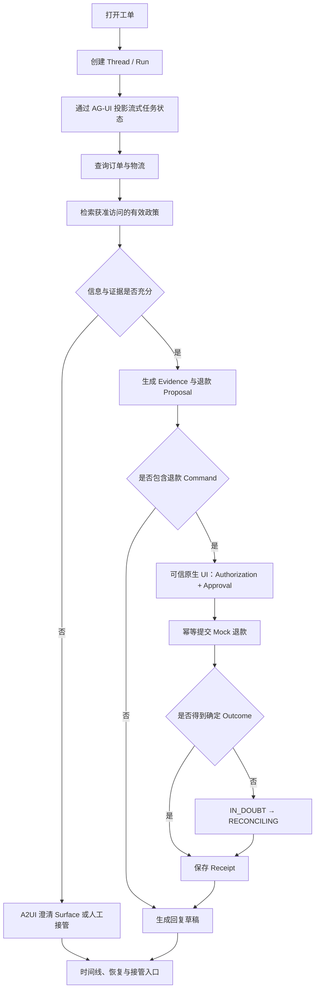

# 05 · 从前端工程到 Agent 应用工程：贯穿项目的构建路线

前端工程已经建立了许多关键直觉：界面状态需要 Reducer，外部数据必须在运行时校验，异步请求需要取消与错误边界，用户动作要映射成明确事件。Agent 应用在这些基础上扩大系统边界：一部分控制流由概率模型提出，Context 会改变判断，工具可能产生真实副作用，任务还可能跨越连接与进程生命周期。

本书的构建路线由三条知识主线共同驱动：

- **LLM 底层知识**解释模型为什么会产生当前输出；
- **Agent 系统知识**把候选输出组织成有界、可恢复的执行；
- **Agentic UI 与前端知识**把执行过程转化为可理解、可干预、可审查的产品体验。

Eval、安全、可靠性和可观测性是一条贯穿始终的工程证据线。每个里程碑都同时交付产品增量与验收证据，不把质量问题留到最后补做。

## 1. 最终用户旅程

完成全书后，一张售后工单应经过下面的完整流程：



流程中既有模型擅长的开放判断，也有程序必须持有的硬约束。完整应用的标准不是每张工单都自动退款，而是自动完成、澄清、安全拒绝、等待审批、未知效果核对和人工接管都有正确状态、界面与证据。

## 2. 项目从三个 Anchor Case 开始

第一个版本只固定三张工单：

| Case                 | 初始事实            | 正确结果                              |
| -------------------- | --------------- | --------------------------------- |
| `case_refund_clear`  | 同租户、订单完整、政策结论明确 | 生成证据充分的 Proposal；未 Approval 前没有退款 |
| `case_missing_order` | 用户没有提供可定位的订单    | 请求澄清，不猜测订单，不调用写工具                 |
| `case_cross_tenant`  | 请求引用其他租户订单      | 在数据进入模型前拒绝，Audit 中可见拒绝原因          |

三张工单覆盖正常、信息不足和安全拒绝。它们足以建立第一条 Baseline，又不会在 Runtime 尚未成形时制造大量难以维护的样本。后续每发现一种失败模式，就把相应 Case 加入 Dataset；全书总装时自然增长为 30–50 个高信息量案例。

## 3. 十一个连续里程碑

### 里程碑 1 · 产品契约与非 Agent Baseline

**进入时**：只有一段自然语言产品设想。

**增加**：Task Contract、领域 Fixture、3 个 Anchor Case、固定规则 Workflow 与 Outcome Grader。

**三层增量**：LLM 尚未进入；Agent 层只有确定性流程；UI 提供静态工单、事实与规则结论。

**验收**：三张工单可从同一初始状态重复运行；Grader 读取 Mock 权威状态，不按回复文风打分。

对应阅读：[导读](/masterpiece-static-docs/01-导读/01-如何阅读这本书.md)与[任务契约、Baseline 与数据集](/masterpiece-static-docs/01-导读/04-任务契约-Baseline与数据集.md)。

### 里程碑 2 · 解释模型行为

**进入时**：规则流程可重复，但无法处理开放措辞和多样表达。

**增加**：采样、Token、Embedding、Attention、Context Window 与分布变化的工程直觉；使用 Recorded Fixture 观察同一工单的多次输出、检索排序和截断边界。

**三层增量**：LLM 层形成可解释模型；Agent 与 UI 暂不开放新动作，避免在尚未理解不确定性时扩大系统能力。

**验收**：能够区分模型不确定性、知识缺失和系统故障；能够说明语义相似的政策为什么不一定是当前有效政策。

对应阅读：[数学与机器学习直觉](/masterpiece-static-docs/02-数学与机器学习直觉/01-概率-信息量与采样.md)与[LLM 工作原理](/masterpiece-static-docs/03-LLM工作原理/01-Token与自回归生成.md)。

### 里程碑 3 · 建立横切 Eval 基线

**进入时**：已有 3 个 Anchor Case 和若干录制输出。

**增加**：Trial、Outcome/Trajectory Grader、Trace Schema、Development/Regression/Holdout 分区；可复现 Environment Simulator、带来源的 Synthetic Case 与人工抽样复核。

**三层增量**：产品能力不变，但此后每一项 LLM、Agent 或 UI 改动都具有可比较证据。

**验收**：同一 Case 运行多次后能报告结果分布；相同 Seed 与环境版本能复现脚本驱动的状态转移、Model Stream 截断和只读查询 Timeout；人工 Rubric 保留原始分歧。

对应阅读：[评测与实验科学](/masterpiece-static-docs/04-评测与实验科学/01-Grader-Trial与统计.md)。

### 里程碑 4 · 第一条单 Agent 纵向切片

**进入时**：任务与评测已定义，还没有 Agent Runtime。

**增加**：Provider 官方 SDK Adapter、Streaming Event、Structured Outputs、3–5 个只读 Tool、有界 Loop、Budget、Cancel 和内部 Run State。

**三层增量**：LLM 开始产生结构化 Item；Agent 层完成最小 Harness；UI 先使用原生开发视图观察 Run 和 Tool Timeline。

**验收**：半个 Tool Call 永不执行；取消后不产生新动作；每次失败能归因到 Model、Protocol、Validation、Tool 或 Runtime。

对应阅读：[模型接口与 Agent 内核 01–08](/masterpiece-static-docs/05-模型接口与Agent内核/01-TypeScript-Node运行时边界.md)。

### 里程碑 5 · 可信政策知识

**进入时**：Runtime 只能查询结构化 Mock 数据，政策仍是固定输入。

**增加**：Context Builder、Provenance、ACL、Freshness、版本化 Ingestion / Index Manifest、Hybrid Retrieval、Rerank、Context Packing、Claim–Evidence 引用校验与 Memory Policy。

**三层增量**：LLM 获得经过筛选的证据；Agent 层管理检索与 Context；UI 展示政策标题、版本、生效时间和冲突状态。

**验收**：无权政策在候选生成前被过滤；过期版本不能覆盖当前版本；引用能够定位到支持结论的版本化证据；Memory 只保存经确认的沟通偏好，并能在后续 Thread 中被正确读取、更正和撤销，不能决定退款资格。

对应阅读：[Context、知识与记忆](/masterpiece-static-docs/06-上下文-知识与记忆/01-Context-Engineering.md)。

### 里程碑 6 · 从建议到受控行动

**进入时**：系统可以形成建议，但不会改变外部状态。

**增加**：MCP Adapter、Query / Command 分离、领域语义校验、Authorization、不可变 Proposal 与 Approval；Idempotency、Receipt 与 Reconciliation 先在隔离故障 Harness 中验证。

**三层增量**：LLM 只提出候选；Agent 层把候选转换为受策略约束的 Command；UI 展示不可变 Preview 与明确风险，常规业务 Run 仍停在 `command_ready`。

**验收**：Approval 后参数变化会使审批失效；重复请求不会重复退款；ACK 丢失进入未知效果核对，不盲目创建新请求。

对应阅读：[Tool、协议与行动控制](/masterpiece-static-docs/07-工具-协议与行动控制/01-工具契约与错误模型.md)。

### 里程碑 7 · Multi-Agent 与 A2A 对照验证

**进入时**：单 Agent 系统基线已经完整，并具备稳定 Dataset、预算记录和故障注入能力。

**增加**：Parent / Child Run、不可变 Artifact、总预算、取消传播、确定性 Join 与结果 Ownership；再用 A2A 表达跨独立 Agent 系统的 Task 与 Artifact。

**三层增量**：知识上掌握 Multi-Agent 设计和 A2A 协议；实验中只允许 Policy Evidence Worker 与 Case Evidence Worker 执行只读任务，本地 Coordinator 与 Executor 保留最终责任。

**验收**：在相同 Dataset 和近似总预算下比较固定 Workflow、有界单 Agent、best-of-N 与 Coordinator + Worker；只有质量、延迟或隔离收益稳定超过复杂度与故障成本时，才启用生产分支。远端 Agent 永远没有退款权限，A2A Task 完成也不能直接改变本地业务终态。

对应阅读：[Multi-Agent：协作、状态与验证](/masterpiece-static-docs/05-模型接口与Agent内核/11-Multi-Agent协作状态与验证.md)与[A2A 与跨 Agent 协作协议](/masterpiece-static-docs/07-工具-协议与行动控制/05-A2A与跨Agent协作协议.md)。

### 里程碑 8 · 连续完成 Agentic UI 主线

**进入时**：单 Agent Runtime、Knowledge、Tool 与受控行动已建立；Multi-Agent / A2A 的责任与 Artifact 语义也已经明确，但前端仍依赖开发视图或 Provider 原始事件。

**增加**：Application Server、Thread / Run / Item、Canonical Event、Public Snapshot、UI Reducer、AG-UI Adapter、Stop / Interrupt / Resume / Handoff、可信 Approval UI，以及受 Catalog 约束的 A2UI Renderer 与服务端 Action Gateway。

**三层增量**：Agent 层获得稳定的 Product Edge；UI 能够表达 Streaming、Tool、Evidence、Approval、未知效果和人工接管，并至少实现一个 A2UI 澄清或证据收集 Surface。退款 Approval 始终使用固定、可信的原生组件。

**验收**：重复 Event 不会重复更新 UI；断线后使用 Cursor 补齐事件；Provider Delta 不能直接改变业务终态；原生客户端与 AG-UI 客户端从同一 Run 得到等价公开状态；未知 A2UI Component、URL 和 Action 被拒绝；A2UI Action 回到服务端重新认证与授权。

必须连续阅读：[05/09 Application Server 与 UI 事件协议](/masterpiece-static-docs/05-模型接口与Agent内核/09-Agent-Application-Server与UI事件协议.md) → [05/10 AG-UI 与前端事件适配](/masterpiece-static-docs/05-模型接口与Agent内核/10-AG-UI与前端事件适配.md) → [08/05 Agent UX 与可控交互](/masterpiece-static-docs/08-安全与治理/05-Agent-UX与可控交互.md) → [08/06 A2UI 与声明式生成界面](/masterpiece-static-docs/08-安全与治理/06-A2UI与声明式生成界面.md)。

### 里程碑 9 · 系统性安全门禁

**进入时**：三层功能已经闭合，UI 的 Trusted Renderer、Action Gateway、Approval 与 Handoff 边界已经明确，但尚未经过完整攻击验证。

**增加**：Threat Model、Prompt Injection 防线、数据流策略、最小权限、纵深防御，以及覆盖恶意 Tool Description、跨租户读取、权限升级、数据外泄、A2UI 注入和跨 Agent Artifact 污染的 Red Team。

**三层增量**：安全策略同时约束 LLM 输入、Agent Action 与 UI Action；Red Team 发现进入版本化 Regression Dataset。

**验收**：恶意政策、Tool Result 和远端 Artifact 无法扩大权限；A2UI 无法注入未知组件或绕过 Action Gateway；完成全部适用安全门禁后，常规业务 Run 才能提交 Mock 退款。

对应阅读：[Agent 威胁建模](/masterpiece-static-docs/08-安全与治理/01-Agent威胁建模.md)至[纵深防御与人类控制](/masterpiece-static-docs/08-安全与治理/04-纵深防御与人类控制.md)，随后完成[Agent 安全评测与 Red Team](/masterpiece-static-docs/08-安全与治理/07-Agent安全评测与Red-Team.md)。

### 里程碑 10 · 故障恢复、可观测、发布与受控改进

**进入时**：正常路径与安全门禁可运行，但连接、进程或依赖故障仍可能破坏状态。

**增加**：Checkpoint、Outbox、Backpressure、Retry Budget、Effect Status；跨 Application Server、Queue、Worker 与 MCP / Tool 的 OpenTelemetry 因果链；SLO、Model Routing Eval、生产拓扑与发布门禁；再把一组经过脱敏和人工判定的生产信号整理为 Finding、Eval Target、Change Proposal 与候选 Behavior Bundle。

**三层增量**：Agent 层从 Checkpoint 恢复；UI 在刷新、断线与 Worker 重启后继续展示权威状态；工程证据线覆盖完整因果链，并能在不授予在线 Agent 发布权限的前提下形成下一版改进候选。

**验收**：分别在 Command 前、提交后 ACK 前和 Checkpoint 前终止进程，系统都能恢复或进入明确人工处理状态，且不会产生重复效果；Drain、Lease 接管、旧 Run 迁移和流式重连均可演练。Optimizer 只能生成候选，不能读取 Holdout、修改 Grader 或持有生产发布凭证；失败候选不能进入生产，已放量退化版本能够完整回滚。

对应阅读：[可靠性与可观测](/masterpiece-static-docs/09-可靠性与可观测/01-失败分类-超时-重试与取消.md)。

### 里程碑 11 · 三层总装与发布验证

**进入时**：LLM、Agent、Agentic UI 和横切工程证据已分别通过测试；Multi-Agent / A2A 是否进入产品已有 Eval 结论。

**增加**：端到端路径、完整 Dataset 回归、Readiness Review、Schema / Checkpoint 迁移、生产故障演练与演示脚本；采用候选 Agent Framework 时执行 Ejection Test。

**用户可见能力**：Resolution Desk 可以完整处理正常工单、信息澄清、安全拒绝、审批、未知效果恢复和人工接管。AG-UI 客户端与 A2UI 低风险 Surface 属于主线交付；Multi-Agent / A2A 分支仅在通过门禁时启用。

**验收**：正常退款、信息不足、越权、Prompt Injection、ACK 丢失、断线重连、AG-UI Replay 和 A2UI Action 拒绝等核心路径全部可重复运行并产生可审查证据。

对应阅读：[Resolution Desk 总装与验收](/masterpiece-static-docs/11-综合实践与作品设计/09-Resolution-Desk总装与验收.md)。

## 4. Agentic UI 为什么贯穿而不是收尾

Agentic UI 的四篇核心文章形成一条明确路径：

```text
05/09 Application Server 与 UI 事件协议
→ 05/10 AG-UI 与前端事件适配
→ 08/05 Agent UX 与可控交互
→ 08/06 A2UI 与声明式生成界面
```

前两篇建立状态与协议边界，后两篇建立人类控制与声明式界面边界。Resolution Desk 的主线验收因此包含：

1. Canonical Event 与 Public Snapshot 由应用持有；
2. AG-UI Adapter 与原生 Projection 使用共享 Fixture 对拍；
3. Stop、Interrupt、Approval、Recovery 与 Handoff 有不同 UI 语义；
4. 至少一个低风险 A2UI Surface 通过 Trusted Renderer 渲染；
5. A2UI Action 经 Action Gateway 重新校验；
6. 高风险 Approval 始终使用固定受信 UI。

协议实现可以替换，以上责任不能删除。AG-UI 不成为领域 Event Store，A2UI 不成为任意代码执行通道。

## 5. Framework 进入项目的位置

评估 Agent Framework 时，先理解它封装的对象：

1. 使用 Provider 官方 SDK 观察原始 Request、Item 与 Streaming Event；
2. 手写最小 Tool Loop，明确 State、Budget、Cancel 与 Error；
3. 用 AI SDK Core、OpenAI Agents SDK 或 LangGraph.js 重做相同 Slice；
4. 比较 Framework 替应用保存了哪些状态，恢复时哪些代码会重跑，副作用由谁保证幂等；
5. 保留自己的 Task Contract、Canonical Event、Tool Contract、Policy、UI Contract 与 Eval；
6. 执行 Ejection Test，证明替换 Runtime Adapter 不需要重写领域与前端状态语义。

Framework 选择服务于项目约束，不构成从“低级”到“高级”的身份标签。具体对照方法见 [AI SDK 与 LangGraph 对照实践](/masterpiece-static-docs/05-模型接口与Agent内核/12-AI-SDK与LangGraph对照实践.md)。

## 6. Multi-Agent 与 A2A 是必懂能力，不是默认生产答案

Multi-Agent 是协作架构，A2A 是跨独立 Agent 系统的协议边界。它们能够提供并行、Context 隔离、权限隔离和专业化分工，也会增加成本、取消传播、结果合并、故障归因和供应链信任问题。

因此，学习要求与生产决策分开：

- **学习要求**：能够设计 Parent / Child 生命周期、Artifact Contract、预算与确定性 Join；能够解释 A2A Task 与本地业务 Outcome 的差别；
- **生产要求**：必须在相同 Dataset、近似总预算和明确 Fault Schedule 下，证明相对简单 Baseline 的收益；
- **安全边界**：远端 Agent 只能返回可验证 Artifact，不能继承本地隐式权限，也不能直接提交退款。

未达到门禁时保留单 Agent 主路径，不影响对相关核心概念的完整掌握。

## 7. Rust 不属于主线完成条件

TypeScript + Node 可以长期承担 Resolution Desk 的产品逻辑、Agent Runtime、Application Server 与控制面。只有 Profile、资源限制、隔离或交付形态出现明确问题时，才评估用 Rust 承接 Parser、MCP Gateway 或 Tool Executor 等稳定边界。

跳过附录 A 的 Rust 可选专题不会缺少任何核心产品能力。进入该专题时，验收标准仍是与 TypeScript 版本共享 Contract、Fixture、Trace 与故障语义，而不是迁移代码量。

## 本章小结

全书的学习结果由一个持续生长的产品承载：先定义任务与证据，理解 LLM，再建立有界 Agent Runtime；随后用 Application Server、AG-UI、Agent UX 与 A2UI 完成人机协作主线，并逐步加入可信知识、受控行动、安全、恢复和可观测。Multi-Agent 与 A2A 必须理解，但是否进入生产由 Eval 决定。下一部分从概率、信息量与采样开始，解释为什么 Agent 不能沿用传统确定性函数的评估方式。

[下一章：概率、信息量与采样](/masterpiece-static-docs/02-数学与机器学习直觉/01-概率-信息量与采样.md) · [查看最终总装](/masterpiece-static-docs/11-综合实践与作品设计/09-Resolution-Desk总装与验收.md)
