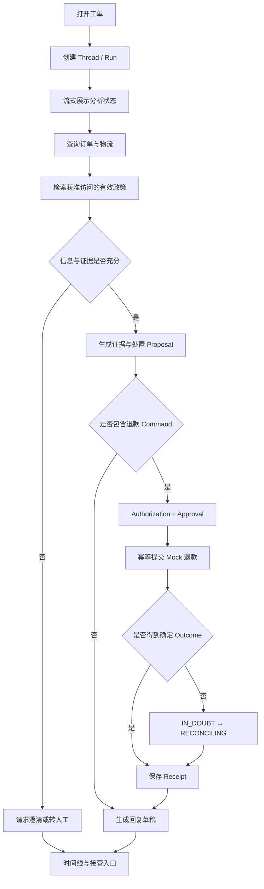

# 05 · 从前端工程到 Agent 应用工程：贯穿项目的构建路线

前端工程已经建立了许多关键直觉：界面状态需要 Reducer，外部数据必须在运行时校验，异步请求需要取消与错误边界，用户动作要映射成明确事件。Agent 应用在这些基础上扩大系统边界：一部分控制流由概率模型提出，Context 会改变判断，工具可能产生真实副作用，任务还可能跨越连接与进程生命周期。

这条构建路线不把上述主题拆成孤立的“前置知识”。每一部分都对应 Resolution Desk 的一个产品增量，并通过同一组工单、政策、订单和支付 Fixture 连接起来。

## 1. 最终用户旅程

完成全书后，一张售后工单应经过下面的完整流程：

这条流程包含模型擅长的开放判断，也包含程序必须持有的硬约束。完整应用的标准不是每张工单都自动退款，而是自动完成、澄清、拒绝、等待审批和人工接管都有正确的状态与界面。

## 2. 项目从三个 Anchor Case 开始

第一个版本只固定三张工单：

| Case                 | 初始事实            | 正确结果                              |
| -------------------- | --------------- | --------------------------------- |
| `case_refund_clear`  | 同租户、订单完整、政策结论明确 | 生成证据充分的 Proposal；未 Approval 前没有退款 |
| `case_missing_order` | 用户没有提供可定位的订单    | 请求澄清，不猜测订单，不调用写工具                 |
| `case_cross_tenant`  | 请求引用其他租户订单      | 在数据进入模型前拒绝，Audit 中可见拒绝原因          |

三张工单刻意覆盖正常、信息不足和安全拒绝。它们足以建立第一条 Baseline，又不会在读者尚未理解 Runtime 时制造 50 个难以维护的样本。后续每学到一种失败模式，再把相应 Case 加入 Dataset；全书总装时自然增长到 30–50 个高信息量案例。

## 3. 十个连续里程碑

### 里程碑 1 · 产品契约与非 Agent Baseline

**进入时**：只有一段自然语言产品设想。

**增加**：Task Contract、领域 Fixture、3 个 Anchor Case、固定规则流程与 Outcome Grader。

**用户可见能力**：客服可以打开静态工单页，查看订单、政策和规则判断结果。

**验收**：三张工单可从同一初始状态重复运行；Grader 读取 Mock 权威状态，不按回复文风打分。

对应阅读：[导读](/masterpiece-static-docs/01-导读/01-如何阅读这本书.md)与[任务契约、Baseline 与数据集](/masterpiece-static-docs/01-导读/04-任务契约-Baseline与数据集.md)。

### 里程碑 2 · 解释模型行为

**进入时**：规则流程可重复，但无法处理开放措辞和多样表达。

**增加**：采样、Token、Embedding、Attention、Context Window 与分布偏移的工程直觉；使用 Recorded Fixture 观察同一工单的多次输出、检索排序和截断边界。

**用户可见能力**：暂不开放新的自动动作，先明确模型输出为何会波动，以及哪些字段不能交给模型猜测。

**验收**：能够区分模型不确定性、知识缺失和系统故障；能够说明相似政策为何不一定是有效政策。

对应阅读：[数学与机器学习直觉](/masterpiece-static-docs/02-数学与机器学习直觉/01-概率-信息量与采样.md)与[LLM 工作原理](/masterpiece-static-docs/03-LLM工作原理/01-Token与自回归生成.md)。

### 里程碑 3 · 评测基线

**进入时**：已有 3 个 Anchor Case 和若干录制输出。

**增加**：Trial、Outcome/Trajectory Grader、Trace Schema、Development/Regression/Holdout 分区；可复现的 Environment Simulator、带来源的合成 Case 与人工抽样复核。

**用户可见能力**：产品能力不变，但每次修改开始有可比较证据。

**验收**：同一 Case 运行多次后能报告结果分布；相同 Seed 与环境版本能复现脚本驱动的状态转移、Model Stream 截断和只读查询 Timeout；跨租户 Observation 不进入候选 Context；人工 Rubric 保留原始分歧。未审批退款与重复效果在里程碑 6 建立隔离 Executor 后再验证。

对应阅读：[评测与实验科学](/masterpiece-static-docs/04-评测与实验科学/01-Grader-Trial与统计.md)。

### 里程碑 4 · 第一条可运行 Agent 纵向切片

**进入时**：任务与评测已定义，还没有 Agent Runtime。

**增加**：官方 Model SDK Adapter、Streaming Event、Structured Outputs、3–5 个只读 Tool、有界 Loop、Budget、Cancel 和 Canonical RunEvent。

**用户可见能力**：客服提交工单后，可以看到流式分析、只读查询和带状态的任务时间线；刷新页面后仍能恢复当前 Run。

**验收**：半个 Tool Call 永不执行；取消后不产生新动作；重复 Event 不会重复更新 UI；每次失败能归因到 Model、Protocol、Validation、Tool 或 Runtime。

对应阅读：[模型接口与 Agent 内核](/masterpiece-static-docs/05-模型接口与Agent内核/01-TypeScript-Node运行时边界.md)。

### 里程碑 5 · 可信政策知识

**进入时**：Runtime 只能查询结构化 Mock 数据，政策仍是固定输入。

**增加**：Context Builder、Provenance、ACL、Freshness、Hybrid Retrieval、Rerank、Context Packing 与 Memory Policy。

**用户可见能力**：工作台展示引用的政策标题、版本和生效时间；证据冲突时明确要求澄清或转人工。

**验收**：无权政策在候选生成前被过滤；过期版本不能覆盖当前版本；Memory 只保存经确认的沟通偏好，不能决定退款资格。

对应阅读：[Context、知识与记忆](/masterpiece-static-docs/06-上下文-知识与记忆/01-Context-Engineering.md)。

### 里程碑 6 · 从建议到受控行动

**进入时**：系统可以形成建议，但不会改变外部状态。

**增加**：MCP Adapter、Query/Command 分离、领域语义校验、Authorization、不可变 Proposal 与 Approval；Idempotency、Receipt 与 Reconciliation 先在隔离故障 Harness 中验证。

**用户可见能力**：客服可以审查退款金额、依据和目标账户；常规业务 Run 仍停在 `command_ready`，尚不能调用退款 Executor。

**验收**：Approval 后参数变化会使审批失效；重复请求不会重复退款；ACK 丢失进入未知效果核对，不盲目创建新请求。

对应阅读：[Tool、协议与行动控制](/masterpiece-static-docs/07-工具-协议与行动控制/01-工具契约与错误模型.md)。

### 里程碑 7 · 安全与可信交互

**进入时**：系统已经拥有读取能力、退款 Proposal 与经过隔离测试的 Executor，但 Mock 写入路径尚未向常规业务 Run 开放。

**增加**：Threat Model、Prompt Injection 防线、数据流策略、最小权限、可信 Approval UI、人工接管，以及覆盖工具描述、权限升级、数据外泄和资源耗尽的 Agent Red Team；启用相应扩展时，再加入受控 A2UI 澄清表单与跨 Agent Artifact 攻击链。

**用户可见能力**：界面区分澄清、审批、未知效果和人工接管。08/05 只完成可信 UI 与 Dry Run；完成 08/07 并通过全部适用安全门禁后，常规业务 Run 才能提交 Mock 退款。

**验收**：恶意政策和 Tool Result 无法扩大权限；退款 Approval 始终使用应用原生的受信界面；Red Team 发现进入版本化 Regression Case，并以权威系统结果验证防线。启用 A2UI 时，未知 Component、URL 和 Action 还必须被 Renderer 与服务端 Action Gateway 拒绝。

对应阅读：[安全与治理](/masterpiece-static-docs/08-安全与治理/01-Agent威胁建模.md)。

### 里程碑 8 · 故障恢复与可观测

**进入时**：顺利路径可运行，但连接、进程或依赖故障仍可能破坏状态。

**增加**：Checkpoint、Outbox、Backpressure、Retry Budget、Effect Status；跨 Application Server、Queue、Worker 与 MCP/Tool 的 OpenTelemetry 因果链；SLO、Model Routing Eval、生产拓扑与发布门禁。

**用户可见能力**：刷新、断线和 Worker 重启后继续显示权威状态；Timeout 后界面展示“正在核对”，而不是误报失败或撤销。

**验收**：分别在 Command 前、提交后 ACK 前和 Checkpoint 前终止进程，系统都能恢复或进入明确人工处理状态，且不会产生重复效果；Drain、Lease 接管、旧 Run 迁移和 SSE 重连均可演练。

对应阅读：[可靠性与可观测](/masterpiece-static-docs/09-可靠性与可观测/01-失败分类-超时-重试与取消.md)。

### 里程碑 9 · 可删除的能力与互操作扩展

**进入时**：单 Agent 主线已经完整。

**增加**：一组均可删除的扩展：AG-UI Edge Adapter；只读 Agent Skill 与 Dynamic Tool Discovery；MCP App / MCP Task Fixture；高金额或证据冲突时使用双 Worker，或通过 A2A 委派给只返回 Artifact 的风险复核 Agent；用 A2UI 生成低风险澄清或证据收集 Surface。主线已经掌握 Canonical Event、Public Snapshot 与 Reducer；AG-UI 实验只验证标准客户端互操作，不补写领域状态。

**用户可见能力**：不同客户端消费一致任务语义，特定复杂工单可请求远程复核，低风险表单可以按场景生成。

**验收**：协议 Adapter 不改变领域状态机；Skill 与发现结果不扩大权限；远程 Agent 没有退款权限；A2UI Action 回到服务端重新认证和授权；每项扩展相对简单 Baseline 没有收益时都可删除。

这些能力用于理解开放协议和扩大系统边界，不是核心应用的先决条件。AG-UI 所体现的 Product Edge 与领域状态分离属于必懂架构判断，具体 Adapter 仍是可选实现。对应阅读：[Multi-Agent](/masterpiece-static-docs/05-模型接口与Agent内核/11-Multi-Agent协作状态与验证.md)、[AG-UI](/masterpiece-static-docs/05-模型接口与Agent内核/10-AG-UI与前端事件适配.md)、[Skills 与 MCP 扩展](/masterpiece-static-docs/07-工具-协议与行动控制/06-Agent-Skills与MCP扩展.md)、[A2A](/masterpiece-static-docs/07-工具-协议与行动控制/05-A2A与跨Agent协作协议.md)与[A2UI](/masterpiece-static-docs/08-安全与治理/06-A2UI与声明式生成界面.md)。

### 里程碑 10 · 总装与发布验证

**进入时**：核心能力已经分别通过测试；采用的可选扩展也有独立验收证据。

**增加**：端到端路径、完整 Dataset 回归、Readiness Review、Schema/Checkpoint 迁移、生产故障演练与演示脚本；只有采用候选 Agent Framework 时才执行 Ejection Test。

**用户可见能力**：Resolution Desk 可以完整处理正常工单、信息澄清、安全拒绝和未知效果恢复；启用风险复核扩展时，再增加相应分支。

**验收**：正常退款、信息不足、越权、Prompt Injection、ACK 丢失和断线重连六条核心路径全部可重复运行并产生可审查证据；启用相应扩展时，再运行 A2A 复核与 A2UI 表单路径。

对应阅读：[Resolution Desk 总装与验收](/masterpiece-static-docs/11-综合实践与作品设计/09-Resolution-Desk总装与验收.md)。

## 4. 框架进入项目的位置

需要评估 Agent Framework 时，在理解其封装对象后再引入：

1. 使用 Provider 官方 SDK 观察原始 Request、Item 与 Streaming Event；
2. 手写最小 Tool Loop，明确 State、Budget、Cancel 与 Error；
3. 用 AI SDK Core、OpenAI Agents SDK 或 LangGraph.js 重做相同 Slice；
4. 比较框架替应用保存了哪些状态，恢复时哪些代码会重跑，副作用由谁保证幂等；
5. 保留自己的 Task Contract、Canonical Event、Tool Contract、Policy 与 Eval，执行 Ejection Test，证明替换 Runtime Adapter 不需要重写领域与 UI。

框架选择服务于项目约束，不构成从“低级”到“高级”的身份标签。具体对照方法见 [AI SDK 与 LangGraph 对照实践](/masterpiece-static-docs/05-模型接口与Agent内核/12-AI-SDK与LangGraph对照实践.md)。

## 5. Multi-Agent 在单 Agent Baseline 之后进入

Multi-Agent 不是主线的默认升级。先在同一 Dataset 与近似总预算下比较固定 Workflow、有界单 Agent、best-of-N 和 Coordinator + Worker；只有子任务确实可并行或需要 Context/权限隔离时，才引入 Child Run、不可变 Artifact、确定性 Join 与取消传播。跨独立系统后再使用 A2A，不能把 Wire Protocol 当作协作架构本身。

Resolution Desk 的进阶实验只让 Policy Evidence Worker 与 Case Evidence Worker 执行只读任务，Coordinator 保留唯一结果 ownership，退款 Command 始终由本地受控 Executor 持有。完整方法见 [Multi-Agent：协作、状态与验证](/masterpiece-static-docs/05-模型接口与Agent内核/11-Multi-Agent协作状态与验证.md)。

## 6. Rust 不属于主线完成条件

TypeScript + Node 可以长期承担 Resolution Desk 的产品逻辑、Agent Runtime 和控制面。只有 Profile、资源限制、隔离或交付形态出现明确问题时，才评估用 Rust 承接 Parser、MCP Gateway 或 Tool Executor 等稳定边界。

跳过第 10 部分不会缺少任何核心产品能力。若进入 Rust 专题，验收标准仍是与 TypeScript 版本共享 Contract、Fixture、Trace 与故障语义，而不是迁移代码量。

## 本章小结

全书的学习结果由一个持续生长的产品承载：先定义任务与证据，再理解模型，建立有界 Runtime，引入可信知识和受控行动，最后补齐安全、恢复、可观测与互操作。下一部分从概率、信息量与采样开始，解释为什么 Agent 不能用传统确定性函数的方式评估。

[下一章：概率、信息量与采样](/masterpiece-static-docs/02-数学与机器学习直觉/01-概率-信息量与采样.md) · [查看最终总装](/masterpiece-static-docs/11-综合实践与作品设计/09-Resolution-Desk总装与验收.md)
