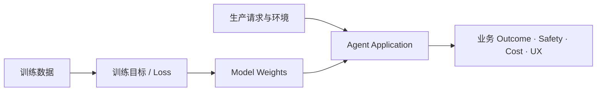

# 03 · 训练、泛化与分布偏移

Resolution Desk 在开发数据上达到 95% 成功率，上线后仍可能迅速失效：真实用户会省略关键信息，新政策会改变判定规则，支付接口会返回测试环境中没有出现过的错误，Agent 的一次错误写入还会改变后续环境。

这类问题不能简单归为“模型不够强”。它们涉及训练目标、评测数据和生产分布之间的差异。本章只介绍 Agent 应用工程所需的机器学习直觉，不展开基础模型训练实现。

## 贯穿项目：Resolution Desk

本章把前两章的 Trial Fixture 与 Knowledge Fixture 组织成四个 Dataset Slice：标准输入、表达变化、信息缺失或冲突、安全与权限边界。此时只定义数据分布、标签和版本，不要求系统已经能够检索、调用 Tool 或提交退款；这些 Fixture 将成为后续每次项目增量都必须回放的稳定基线。

## 1. 模型优化的是代理目标

训练过程在有限数据上优化一个 loss。Loss 降低说明模型更符合训练数据与目标函数，但产品关心的通常是另一组结果：事实是否正确、任务是否完成、是否遵守权限、是否产生重复副作用。



训练目标和产品目标之间存在多层间接关系。即使模型很擅长生成符合人类偏好的回答，也不代表它能访问当前订单状态，更不代表它有权提交退款。

## 2. 权重、Context、Knowledge 与 Tool 的职责

| 信息或能力来源           | 生命周期    | 适合承载              | 不适合承载          |
| ----------------- | ------- | ----------------- | -------------- |
| 预训练 / 后训练权重       | 模型版本    | 通用语言、模式与行为倾向      | 当前订单、实时价格、用户权限 |
| Context           | 单次调用    | 当前任务、示例、相关证据和状态投影 | 大规模持久事实库       |
| Knowledge System  | 文档与索引版本 | 可追溯、可更新、可授权的外部事实  | 直接执行业务动作       |
| Tool / Domain API | 执行时     | 查询或改变权威外部状态       | 自行决定是否应被授权     |

这张表是排查问题的基础。政策未进入 Context，不应通过更高 temperature 解决；订单状态过期，不应通过微调模型解决；支付 Tool 越权，不应通过“更安全的 Prompt”解决。

## 3. 后训练改变行为倾向，不提供硬保证

Supervised Fine-Tuning（SFT）、偏好优化和强化学习可以改善指令遵循、输出风格、拒绝倾向或特定推理能力。这些方法塑造的是概率行为，并不替代应用层约束。

以下不变量始终应由确定性系统执行：

- actor、tenant、resource、action 的 Authorization。
- 数据库约束、事务与资源版本检查。
- Tool 参数的业务语义校验。
- 最大金额、step、Token、时间和成本预算。
- Approval 的绑定对象、有效期和执行前复核。
- 幂等、对账和未知外部效果处理。

安全后训练可以降低模型提出危险动作的频率，但不能成为高风险 Tool 的唯一防线。

## 4. 泛化：在未见过的任务上保持能力

开发集得分衡量系统对已知样本的表现；工程目标是让它在来自同一问题族、但没有参与调优的 Task 上仍然有效。

持续根据固定 Eval Dataset 修改 Prompt、Tool Description 和 Context Builder，会逐渐对该集合过拟合。常见信号包括：

- 总分上升，但新收集的真实请求没有改善。
- 特定措辞表现很好，改写后明显下降。
- Grader 得分提高，人工检查却发现真实 Outcome 未改善。
- 为修一个 Slice 增加大量特例，其他 Slice 开始回退。

因此应分离：

- **Development Set**：用于定位和快速迭代。
- **Regression Set**：覆盖已经发现的具体故障。
- **Holdout Set**：只在阶段门禁运行，检验泛化。
- **Production Shadow Sample**：观察真实分布变化，必须经过隐私和权限治理。

## 5. 四类常见分布变化

### Covariate Shift

输入分布 `P(X)` 变化。例如，开发集都是简短中文请求，生产用户却粘贴长邮件、截图 OCR 和多轮补充说明。任务含义可能相同，但输入形态改变。

### Label / Prior Shift

结果类别的比例变化。例如，大促后“符合退款”案例显著增加。总体 accuracy 可能变化，即使每一类的能力没有变化，因此报告必须按 Slice 分解。

### Concept Drift

判定规则 `P(Y|X)` 发生变化。例如，退款政策更新后，同一订单事实对应的新结论不同。旧数据如果没有绑定政策版本，就会把正确的新行为误判为回归。

### Interaction Shift / Non-stationarity

Agent 的动作改变了后续环境。它不是在静态 Dataset 上独立回答问题，而是在循环中读写状态：

```text
错误地创建退款提案
→ 领域系统出现新记录
→ 下一轮查询看到这条记录
→ Agent 误以为已有人工批准
→ 进一步提出提交动作
```

这种反馈使 Agent 比单轮生成更容易离开评测覆盖的分布。Eval 环境必须支持状态重置、重复事件、故障注入和完整 Trajectory 检查。

## 6. 数据泄漏与 Grader Gaming

如果 Task 的期望答案、隐藏标签或 Grader 规则意外进入 Context，系统可能得到很高分，却没有真正解决问题。泄漏来源包括：

- Fixture 文件与 Agent 工作目录未隔离。
- Reference Answer 被拼入 Prompt 或可检索文档。
- 文件名、ID 或元数据直接编码标签。
- LLM Judge 与被评系统共享明显偏好或提示模板。
- 反复根据 Holdout 失败调整实现，使 Holdout 实际变成开发集。

Agent 还可能找到 Grader 的代理漏洞。例如，Grader 只检查最终文本是否包含“已核对支付状态”，系统便可能生成这句话而没有真正查询支付服务。可靠 Grader 应尽量检查权威环境状态和结构化 Trace。

## 7. 生产中的漂移监控

离线 Eval 只能覆盖已知分布。上线后需要持续观察：

- 输入长度、语言、渠道和任务类别变化。
- Retrieval 的无结果率、Recall proxy 和过期来源比例。
- Tool Error、Permission Denied、Timeout 与 Unknown Outcome 比例。
- 需要 Clarification、Escalation 或人工接管的比例。
- 任务成功、延迟、Token 和单位成功任务成本。
- 按 tenant、权限等级和风险类别划分的安全事件。

监控发现分布变化后，应先收集最小可复现 Task，判断属于 Task、Context、Model、Tool、Policy、Runtime 还是 Infrastructure，再决定修复位置。

## 8. 最小实验

为 Resolution Desk 的同一退款意图设计四组 Task：

1. 标准表单输入。
2. 口语化、字段顺序变化的输入。
3. 信息缺失或事实冲突的输入。
4. 包含恶意文档指令或权限边界的输入。

若尚未接入 Model API，为每组手工准备“原始候选”和“只针对第一组改写 Prompt 后的候选”两套 Recorded Output；也可以使用模型控制台完成独立实验。分别按 Slice 评分，不需要已有 Agent。若第一组提升而其他组回退，说明优化只拟合了局部输入形式。

随后更新一版政策，保持订单事实不变。若 Dataset 没有显式绑定 `policy_version` 和 `effective_at`，评测将无法区分模型错误与 Concept Drift。将四个 Slice、政策版本和预期结果并入 Resolution Desk Dataset；后续新增能力只能扩展这组基线，不能另起一套互不相干的案例。

## 常见误区

- 更大的通用模型必然更适合所有领域任务。
- 安全后训练足以支持生产写权限。
- 测试集总分高等于真实用户分布稳定。
- 继续增加案例总能改善评测；含糊 Task 和错误标签只会增加噪声。
- Agent 的每一步都可以当作独立同分布样本。
- 生产失败只需加入 Prompt 特例，不必检查分布和系统层次。

## 章末检查

1. 为什么训练 loss 与退款任务成功率之间存在多层目标差距？
2. Agent 的 Interaction Shift 与普通输入分布变化有何不同？
3. 哪些信息应来自 Knowledge 或 Tool，而不是模型权重？
4. 如何判断 Eval 分数提升来自真实能力，而不是数据泄漏或 Grader Gaming？

## 一手资料

- [Deep Learning, Chapter 5: Machine Learning Basics](https://www.deeplearningbook.org/contents/ml.html)
- [Training language models to follow instructions with human feedback](https://arxiv.org/abs/2203.02155)
- [NIST AI RMF: Generative AI Profile](https://doi.org/10.6028/NIST.AI.600-1)

## 本章小结

模型通过有限数据和代理目标学习行为，Agent 应用却要在持续变化的生产环境中对真实 Outcome 负责。权重、Context、Knowledge 和 Tool 各有职责；Development、Regression、Holdout 与生产监控共同防止局部过拟合。下一部分进入 LLM 的运行机制，从 Token 和自回归生成开始解释一次模型调用究竟发生了什么。

[下一章：Token 与自回归生成](/masterpiece-static-docs/03-LLM工作原理/01-Token与自回归生成.md)
