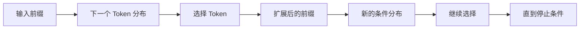

# 01 · Token 与自回归生成

前端应用通过模型 API 发送 JSON，其中包含 `messages`、`tools`、`attachments` 和各类配置。模型不会直接处理这些 JavaScript 对象；Provider 会先把它们编码为 Token 序列。理解这层转换，可以解释三个常见问题：工具定义为什么也会占用 Context，响应为什么逐步产生，以及模型输出为什么不能证明外部动作已经发生。

## 贯穿项目：Resolution Desk

Resolution Desk 在这一章仍不接入真实的模型服务商（Provider）。项目只新增两类可复用工件：一份包含指令、订单摘要、政策片段和 Tool Schema 的 Token Budget Sheet，以及一段能够重建完整候选 Item 的 Recorded Stream Fixture。[模型 API、状态与流式事件](/masterpiece-static-docs/05-模型接口与Agent内核/03-模型API-状态与流式事件.md)实现 Provider Adapter 时，会使用相同的输入和预期 Item 进行契约测试（Contract Test）。

## 1. 从文本到 Token ID

模型接收输入前，大致经历以下过程：

```text
Unicode 文本
→ 字节或字符表示
→ Tokenizer
→ Token 序列
→ Token IDs
→ Embedding Vectors
```

Token 不是稳定的“单词”。它可能是完整词、子词、标点、空格、字节片段或特殊控制标记。中文、emoji、代码、UUID、Base64 和 JSON 的 Token 密度差异很大，因此不能使用固定字符比例作为生产预算。

例如，下列字符串都需要实际使用目标模型的 Tokenizer 测量：

```text
Hello, world!
订单不符合退款条件。
👨‍👩‍👧‍👦
order_id=ord_01J9R8M4Y7Q3...
{"tool":"refund","amount":100}
```

同一段文本经过不同 Tokenizer 或不同版本处理，也可能得到不同的 Token ID。Token ID 只在对应的词表（Vocabulary）中有意义。

## 2. API 对象最终仍要序列化

应用通常看到结构化对象：

```ts
const input = [
  { role: "system", content: "Use the current refund policy." },
  { role: "user", content: "Check order 123." },
];

const tools = [
  {
    name: "get_order",
    description: "Read an order visible to the current actor.",
    parameters: { /* JSON Schema */ },
  },
];
```

Provider 会将 `role`、`content`、Tool Schema 和其他控制信息编码成模型可处理的序列。因此，Context Budget 不只包含用户正文，还包括：

- 系统和开发者指令。
- 历史消息与此前的 Response Items。
- Tool 名称、描述（Description）和 JSON Schema。
- 检索证据、文件内容和图片相关表示。
- Tool Result、错误信息和运行状态摘要。
- 为输出和推理过程预留的 Token。

随着 Tool 数量增加，即使用户输入很短，Schema 也可能占据大量输入预算。这正是动态工具发现（Dynamic Tool Discovery）和按需加载具有价值的原因。

## 3. 自回归生成

Decoder-only Language Model 的核心抽象是：给定当前前缀，预测下一个 Token 的条件分布；选中 Token 后，将它加入前缀，再预测下一步。

```text
P(x_1, x_2, ..., x_T) = Π P(x_t | x_<t)
```

一个看似完整的回答，实际上由许多局部选择连续构成。模型不会先在隐藏位置写好整段答案再一次返回。



这也解释了 Streaming：服务端可以在生成过程中持续发送增量，而不必等待完整响应。

## 4. 从 Token 流到结构化 Item

现代模型 API 往往不只返回文本，还可能返回以下类型化对象：

- Text Item。
- Tool Call。
- Tool Result 的输入引用。
- 与推理相关的 Item 或 Summary。
- Refusal。
- Usage 与完成状态。

应用不应把所有增量都拼成一段字符串再解析。更稳妥的做法是根据类型化事件维护状态：

```ts
type ResponseState = {
  text: string;
  toolCalls: Map<string, { name: string; argumentsJson: string }>;
  status: "streaming" | "completed" | "refused" | "incomplete" | "failed";
};
```

Tool Call 的参数可能通过多个增量片段（Delta）到达，只有收到对应的完成事件后，才能安全地解析和校验。TCP（Transmission Control Protocol）网络分片、服务器发送事件（Server-Sent Events，SSE）、Provider Event 和应用内部 Event 分属四个层次；任何网络分片都不应直接触发业务动作。

## 5. 模型输出与外部效果的边界

模型可以生成：

```json
{
  "name": "create_refund",
  "arguments": {
    "orderId": "123",
    "amount": 100
  }
}
```

这只是候选动作。真实执行仍需 Runtime 完成：

```text
解析完整 Tool Call
→ Schema 校验
→ 业务语义校验
→ Authorization
→ Approval 与 Resource Version 复核
→ 执行 Tool
→ 保存 Receipt 与 Outcome
```

模型说“退款已完成”更不能证明支付系统已经改变。语言模型只生成序列或结构化 Item；外部副作用由应用代码产生。

## 6. 停止生成不等于任务完成

一次响应停止可能有多种原因：

- 正常完成。
- 达到输出长度或 Context 限制。
- 模型拒绝。
- Provider 超时（Timeout）或触发限流（Rate Limit）。
- Tool Call 已生成，等待应用执行。
- 客户端取消。
- 协议或网络错误。

应用应依据 API 的类型化状态与错误字段判断，而不是搜索“完成”“抱歉”等文本。Agent Runtime 还需要在模型响应结束后判断整个 Run 是否完成，二者不是同一个生命周期。

## 7. Token Budget 的工程影响

Token Budget 同时影响：

### 成本

输入、输出和缓存命中通常采用不同计费方式，具体以 Provider 文档为准。应用应记录实际 usage，而不是只按字符数估算。

### 延迟

长输入会增加预填充（Prefill）阶段的计算量，长输出会增加串行解码（Decode）时间。即使响应只有几行，前面数万 Token 的 Context 仍会产生延迟成本。

### 截断

历史、Tool Result 或输出可能因预算不足而不完整。自动丢弃最旧消息未必安全，因为旧消息中可能包含仍有效的约束。

### 质量

更多 Token 并不总是更好。冲突、过期和无关内容会降低有效信号。

### 安全

进入 Context 的外部文档越多，Prompt Injection 与敏感数据暴露面越大。

## 8. 最小实验

完成三组不依赖 Agent Runtime 的测量：

1. 使用目标模型的 Tokenizer 或官方 Tokenizer 页面，比较中文、英文、代码、JSON、emoji 和长 ID 的 Token 数。
2. 对 Resolution Desk 的同一份静态请求逐步加入 `get_order`、`get_policy` 和 `draft_refund` Schema，记录 Token 数；若没有可用 API，首 Token 延迟留到[模型 API、状态与流式事件](/masterpiece-static-docs/05-模型接口与Agent内核/03-模型API-状态与流式事件.md)实测，不用估算值填充。
3. 使用下面的教学用 Recorded Fixture，按顺序拼接参数并只在 `item.completed` 后解析。它表达完整性边界，不冒充任何 Provider 的正式 Event 名称：

```jsonl
{"type":"item.started","itemId":"call_1","kind":"tool_call","name":"draft_refund"}
{"type":"arguments.delta","itemId":"call_1","delta":"{\"orderId\":\"ord_1001\","}
{"type":"arguments.delta","itemId":"call_1","delta":"\"amountMinor\":5000}"}
{"type":"item.completed","itemId":"call_1"}
```

验收标准：

- 预算计算包含指令、历史、Tool Schema 和输出预留。
- Tool 参数只在 Item 完成后解析。
- 截断、拒绝、取消与正常完成具有不同状态。
- 没有任何网络 delta 直接触发外部写操作。

保存 Token Budget Sheet、原始 JSONL 和预期的完整 Item。模型接口章节会使用真实 Provider Event 的类型、闭合边界与 `usage` 字段替换并验证这份教学 Fixture。

## 常见误区

- 模型直接读取 JavaScript 对象或数据库记录。
- Token 是稳定的语言学单词。
- Token 数只影响价格，不影响延迟、截断和质量。
- 流式网络分片可以直接当作完整 Tool Call。
- 模型结束生成就表示整个业务任务完成。
- Tool Call 符合 JSON Schema 就可以立即执行。

## 章末检查

1. 为什么 Tool Schema 也会占用 Context Budget？
2. 字符数为何不能作为可靠的 Token 上限？
3. Provider Response 完成与 Agent Run 完成有什么差异？
4. 自回归生成与真实外部动作之间的执行边界在哪里？

## 一手资料

- [Neural Machine Translation of Rare Words with Subword Units](https://aclanthology.org/P16-1162/)
- [SentencePiece](https://aclanthology.org/D18-2012/)
- [OpenAI tiktoken](https://github.com/openai/tiktoken)

## 本章小结

模型接收和生成的都是受预算约束的 Token 序列；API 中的 Message、Tool 和 Item 最终都会映射到这条序列上。自回归生成解释了流式输出（Streaming）和路径依赖，也划清了模型输出与外部效果的边界。下一章继续进入 Transformer，解释 Token 如何相互影响，以及 KV Cache 为什么能加速生成，却不能充当 Agent 的长期记忆。

[下一章：Transformer、Attention 与 KV Cache](/masterpiece-static-docs/03-LLM工作原理/02-Transformer-Attention与KV-Cache.md)
