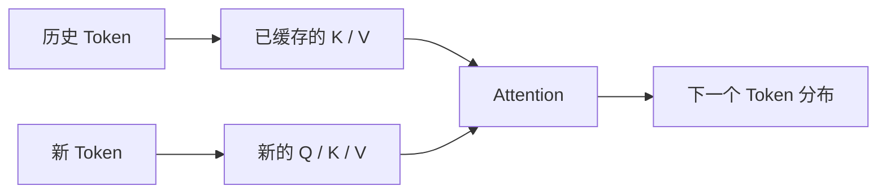

# 02 · Transformer、Attention 与 KV Cache

Agent 的 Context 往往同时包含系统指令、用户目标、工具定义、检索证据、历史消息和 Tool Result。把这些内容放入同一个窗口，并不表示模型会像数据库一样准确读取每个字段。Transformer 通过 Attention 在序列中组合信息，而信息位置、干扰、模型结构和训练方式都会影响最终利用效果。

本章建立足以支撑 Context 设计和性能分析的 Transformer 直觉，不要求推导完整网络，也不假设所有闭源模型使用完全相同的内部结构。

## 贯穿项目：Resolution Desk

本章为 Resolution Desk 增加 Context Cost Worksheet：分别计量稳定指令、订单事实、政策证据、Tool Schema 和输出预留，并标明相应成本发生在 Prefill 还是 Decode 阶段。此处只建立容量与延迟假设，不把 KV Cache、Prompt Cache 或 Provider Conversation State 误作项目的持久状态。

## 1. Decoder-only Transformer 的教学模型

现代生成模型可以先用下面的结构理解：

```text
Token IDs
→ Token Embedding + Position Information
→ [Masked Self-Attention
   → Multilayer Perceptron（MLP）
   → Residual Connection / Normalization] × N
→ Vocabulary Logits
→ Next-Token Distribution
```

每一层都会更新当前位置的隐藏状态（Hidden State）。Attention 从可见位置聚合信息，MLP 对每个位置的表示进行非线性变换，Residual Connection 使信息能够跨层传播。最后一层的 Hidden State 会映射为词表 Logits，用于预测下一个 Token。

这只是工程抽象。具体模型可能采用 Mixture-of-Experts、不同 Attention 变体、不同归一化方式或其他结构；应用层结论应以接口行为和测量为准。

## 2. Attention 在做什么

Scaled Dot-Product Attention 的标准形式是：

```text
Attention(Q, K, V) = softmax((QKᵀ / √d_k) + mask)V
```

可以把三个矩阵理解为：

- **Query**：当前位置正在寻找什么信息。
- **Key**：每个可见位置可以怎样被匹配。
- **Value**：匹配后实际聚合的内容表示。

Q、K、V 都由 Hidden State 经过可学习投影得到。一个位置会根据 Query 与各 Key 的匹配分数，对 Value 做加权组合。

多头注意力（Multi-Head Attention）让模型在不同投影空间中并行学习关系。例如，一些 Attention Head 可能更敏感于语法依赖，另一些则更敏感于实体或位置模式。某个注意力权重（Attention Weight）不能直接作为模型决策的完整因果解释；高权重只能说明该层、该 Head 发生了较强的信息聚合。

## 3. Causal Mask 保持自回归约束

生成第 `t` 个 Token 时，当前位置只能读取此前的 Token，不能读取未来内容。因果遮罩（Causal Mask）会屏蔽未来位置的注意力分数。

```text
位置 1 可见：1
位置 2 可见：1, 2
位置 3 可见：1, 2, 3
...
```

这保证训练和推理都符合 `P(x_t | x_<t)` 的条件分解。Speculative Decoding 等优化可以并行提出多个候选，但仍需验证候选是否与目标模型的自回归分布一致。

## 4. 位置信息为什么重要

Attention 本身不具备对输入顺序的先验感知，需要位置编码（Position Encoding）或位置嵌入（Position Embedding）表达 Token 的相对或绝对位置。旋转位置编码（Rotary Position Embedding，RoPE）是常见方案之一，但不同模型可能采用不同变体。

位置机制、训练时见过的序列长度和 Attention 结构共同影响长 Context 表现。因此，“接口允许输入 200k Token”只说明容量上限，不说明模型在任意位置都能同样可靠地使用信息。

对 Agent 而言，这意味着重要约束不能只靠在一段极长历史中出现过一次。Context Builder 应在每次调用中显式选择当前仍有效的目标、禁止条件、未完成事项和关键证据。

## 5. Prefill 与 Decode

一次推理通常分为两个性能阶段。

### Prefill

模型处理完整输入序列，为所有输入位置计算 Hidden State，以及 Attention 所需的 Key 和 Value。多个输入位置可以并行计算，但输入越长，计算量和内存压力通常越大。

### Decode

模型逐 Token 生成输出。每生成一个 Token，都需要让新位置读取此前序列。Decode 具有自回归依赖，输出长度会直接拉长总生成时间。

工程指标通常至少区分：

- **TTFT（Time to First Token）**：从请求开始到首个输出 Token。
- **TPOT（Time per Output Token）**：Decode 阶段平均生成一个 Token 的时间。
- **End-to-End Latency**：完整响应结束的总时间。

长输入主要增加 Prefill 与排队压力，长输出主要增加串行 Decode 时间。只报告一个平均延迟，会掩盖两种完全不同的优化方向。

## 6. Key/Value Cache（KV Cache）为什么有效

若每生成一个新 Token 都重新计算所有历史位置的 Key / Value，会产生大量重复工作。KV Cache 保存每层历史位置的 K/V，使下一步只需为新 Token 计算增量，再与缓存中的历史 K/V 做 Attention。



KV Cache 用内存换计算。其规模会随以下因素增长：

- 序列长度。
- 模型层数。
- KV Head 数与 Head Dimension。
- 数值精度。
- 并发请求数量。

因此，长 Context 即使通过 KV Cache 避免重复计算，也不接近“免费”。它会占用更多加速器内存，影响 Batch 和并发容量。

## 7. 四种“缓存或记忆”必须区分

| 概念                    | 生命周期                      | 作用              | 是否是权威状态          |
| --------------------- | ------------------------- | --------------- | ---------------- |
| KV Cache              | 一次推理执行                    | 加速 Decode       | 否                |
| Prefix / Prompt Cache | Provider 可复用的相同前缀计算       | 降低重复输入成本或延迟     | 否                |
| Conversation State    | API 或应用保存的 Message / Item | 为后续调用重建 Context | 取决于应用，但通常不是领域事实源 |
| Application Memory    | 应用数据库中的持久信息               | 跨 Run 保存偏好或经验   | 需要独立写入与读取策略      |

KV Cache 不会让模型跨 Session 永久记住内容；Prompt Cache 也不会改变模型权重。两者都是推理优化，不是 Agent Memory 方案。

## 8. Attention 不是检索系统

Attention 只在当前输入序列内部组合表示。它不会主动访问数据库，也不会从窗口之外查找资料。RAG 的 Retrieval 发生在模型调用之前：应用先从外部知识系统生成候选，再把选中的内容放入 Context，模型才可以通过 Attention 使用它们。

```text
External Knowledge
→ Retrieval / ACL / Rerank
→ Selected Context
→ Transformer Attention
→ Generated Output
```

两个步骤都可能失败。文档未被召回是 Retrieval Failure；文档进入 Context 但模型没有正确利用，是 Context Use / Generation Failure。评测必须分别定位。

## 9. 最小实验

### 实验 A：单头 Attention

使用少量向量实现单头 Attention：

1. 计算 `QKᵀ / √d_k`。
2. 加入 Causal Mask。
3. 对每一行执行 Softmax，确认权重和为 1。
4. 与 V 相乘，观察修改某个 Key 或 Value 后哪些位置变化。

### 实验 B：Context 长度与延迟

使用 Resolution Desk 的同一张订单和同一问题，依次加入一段、四段和十六段政策证据，保持输出长度近似不变，记录 TTFT、TPOT、总延迟和 `usage`；再保持输入不变，逐步增加输出长度。可以使用模型控制台完成这一独立测量。若当前无法取得逐项延迟，只定义采集表，并将实测留到[模型 API、状态与流式事件](/masterpiece-static-docs/05-模型接口与Agent内核/03-模型API-状态与流式事件.md)，不要用推测值代替证据。

### 实验 C：缓存边界

对 Resolution Desk 做一次纸面边界分析：比较 KV Cache、Provider Prompt Cache、Conversation State 和应用数据库中的 Memory，分别记录创建者、生命周期、失效条件和恢复方式。若某项状态无法在进程重启后从应用存储重建，就不应被当作 Durable State。

三个实验最终汇入同一份 Context Cost Worksheet。它将在后续 Context Builder、预算和性能章节中继续补充，而不是形成独立的性能 Demo。

## 常见误区

- Attention 等同于从数据库检索事实。
- Attention Map 可以完整解释模型为什么作出决定。
- KV Cache 会扩大 Context Window。
- 启用 KV Cache 后长 Context 几乎没有成本。
- Prompt Cache 会让模型永久学习内容。
- Conversation State 可以替代订单、审批等领域数据库。
- 更换本地客户端语言可以显著降低主要由远程推理产生的延迟。

## 章末检查

1. Causal Mask 与自回归条件依赖分别起什么作用？
2. Prefill 和 Decode 对延迟的影响为何不同？
3. KV Cache 为什么能加速生成，又为什么会限制并发？
4. Retrieval 与 Attention 分别在哪个阶段工作？
5. KV Cache、Prompt Cache、Conversation State 与 Application Memory 的生命周期有什么差异？

## 一手资料

- [Attention Is All You Need](https://arxiv.org/abs/1706.03762)
- [RoFormer: Rotary Position Embedding](https://arxiv.org/abs/2104.09864)
- [Attention is not Explanation](https://aclanthology.org/N19-1357/)
- [Efficient Memory Management for Large Language Model Serving with PagedAttention](https://arxiv.org/abs/2309.06180)

## 本章小结

Transformer 使用 Attention 在当前序列中组合信息，Causal Mask 维持自回归约束，KV Cache 则以显存换取 Decode 阶段的计算复用。这些机制解释了 Context 的利用方式和性能成本，但都不提供外部检索、跨 Run 记忆或权威业务状态。下一章将模型放回完整生命周期，区分预训练、后训练、In-Context Learning、RAG 和 Tool 各自提供的能力。

[下一章：预训练、后训练与推理](/masterpiece-static-docs/03-LLM工作原理/03-预训练-后训练与推理.md)
