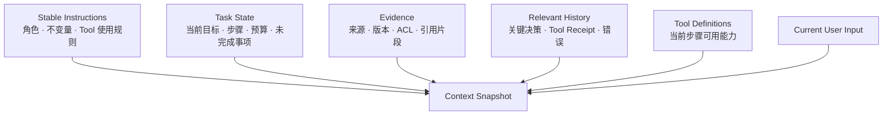

# 04 · Context Window、采样与能力边界

Agent 运行时间越长，越容易出现一种看似合理的实现：把全部消息、Tool Result、检索文档和历史摘要持续追加到请求中。只要模型支持更大的 Context Window，系统似乎就能继续工作。

问题在于，容量只回答“能否提交请求”，不回答“模型能否稳定使用这些信息”。旧目标、过期政策、冲突证据、重复 Tool Result 和恶意文档会同时争夺有限的注意力，还会增加延迟、成本和攻击面。

Context Engineering 的目标不是塞满窗口，而是为每次推理构造最小、充分、可追溯的 Context。

## 贯穿项目：Resolution Desk

本章把已有订单、政策和对抗文档整理成第一份静态 Context Pack，并为每个条目标注 Source、Version、Trust、Freshness 与 Token Cost。它只是后续 Context Builder 的输入 Fixture，不是聊天历史，也不承担 Runtime State；本章不要求已经实现 Compaction 服务或审批流程。

## 1. Context Window 是容量上限

一次请求的总预算通常包含：

```text
instructions
+ user input
+ conversation items
+ retrieved evidence
+ tool definitions
+ tool results
+ output reserve
+ reasoning-related tokens
≤ context window
```

具体计数、截断和 reasoning Token 语义由目标模型与 API 决定，实施时应以官方文档和实际 usage 为准。

需要区分四个概念：

| 概念                      | 含义                           |
| ----------------------- | ---------------------------- |
| Nominal Context Window  | API 允许的最大 Token 容量           |
| Effective Context       | 在给定任务、位置和干扰下，模型能可靠使用的信息范围    |
| Conversation State      | API 或应用跨调用保存的 Message / Item |
| External State / Memory | 尚未进入本次调用的持久数据                |

窗口扩大并不会自动扩大 Effective Context，更不会把 Conversation State 变成领域数据库。

## 2. 信息位置和干扰会影响利用效果

长 Context 中，相关信息可能被无关内容包围，也可能与旧版本产生冲突。研究和实践都表明，模型对不同位置的信息利用并不总是均匀。

Agent 场景中尤其常见以下问题：

- 初始目标在多轮 Tool Result 后被弱化。
- 已撤销的 Approval 仍残留在历史中。
- 旧政策和新政策同时出现，版本信息不明显。
- 同一个错误日志被多次追加，压过真正的根因证据。
- 外部网页中的 Prompt Injection 与系统指令同时进入 Context。
- 自动截断删除了仍未完成的约束。

因此，重要信息应带类型、来源、版本和有效期，由 Context Builder 在每一轮显式选择，而不是依赖模型从完整历史中自行恢复。

## 3. Context 的分层结构

一次 Agent 调用可以按职责组织 Context：



分层有两个价值：

1. 可以为不同部分分配 Token Budget 和裁剪策略。
2. Trace 能说明某项信息为何进入本次调用，以及它来自哪个权威对象。

Context Snapshot 应包含来源引用和版本，使同一次模型调用可以在调试环境中重放。

## 4. Context Builder 的基本步骤

```text
读取权威 Run State
→ 确定当前步骤和风险等级
→ 选择稳定指令
→ 按权限检索证据
→ 加载相关历史与未完成事项
→ 只暴露当前需要的 Tools
→ 去重、排序和预算裁剪
→ 生成可重放 Context Snapshot
```

每一步都应由程序完成。模型可以建议需要什么信息，但不能自行扩大数据访问范围。

一个简单的预算模型可以写成：

```ts
type ContextBudget = {
  maxInputTokens: number;
  reservedOutputTokens: number;
  instructions: number;
  taskState: number;
  evidence: number;
  history: number;
  tools: number;
};
```

预算不是要求每个区间始终用满，而是防止某一类内容无限占用窗口。若关键约束和必要证据无法在预算内共存，Runtime 应压缩、分解任务、重新检索或停止，而不是静默截断。

## 5. Sampling 参数控制选择，不控制事实

常见采样策略包括：

- **Greedy / Argmax**：每一步选择最高概率候选。
- **Temperature**：调整分布集中程度。
- **Top-k**：只保留概率最高的 k 个候选。
- **Top-p**：保留累计概率达到阈值的动态候选集。

不同 API 和模型未必开放相同参数；有些 reasoning model 还会限制可调范围。应用不应默认同时调整多个旋钮。

采样参数适合控制输出多样性和探索程度，不适合解决：

- 缺少权威证据。
- Tool 参数越权。
- 状态持久化错误。
- 外部请求状态未知。
- Prompt Injection。

降低 temperature 可以减少某些输出变化，但不能把错误 Context 变正确，也不能替代多 Trial Eval。

## 6. Compaction 是有损派生

长任务通常需要 Compaction：将大量历史压缩成更短表示，以便继续运行。摘要最容易丢失的内容包括：

- 否定条件和例外条款。
- 精确金额、时间、版本与资源 ID。
- Approval 的绑定参数和有效期。
- 尚未完成的承诺与失败原因。
- Evidence 与结论之间的引用关系。
- Tool 已提交但 Outcome 未知的中间状态。

因此，Compaction 结果不应成为唯一状态源。更安全的结构是：

```text
Append-only Events / Domain State    # 权威记录
          ↓
Structured Run Snapshot              # 可恢复状态
          ↓
Natural-language Summary             # 供模型使用的有损视图
```

摘要需要保存来源 Event 范围、生成版本和时间。恢复时，应用先读取结构化 State，再决定是否复用或重建摘要。

## 7. Context 污染与信任边界

进入 Context 的外部内容默认不可信。网页、邮件、政策文档和 Tool Result 中都可能包含看起来像指令的文本。

Context Builder 应保留来源类型，并明确区分：

```text
Trusted Instructions
Application State
Untrusted User / External Content
Tool Observations
```

文字上的分隔有助于模型理解，但真正的安全边界仍在 Tool Policy、Authorization、Sandbox 和网络控制中。任何外部文档都不能通过一句“忽略此前规则”提升自己的权限级别。

## 8. 何时拆分任务

Context 已接近上限时，增加窗口不是唯一方案。以下情况更适合拆分：

- 不同子任务需要完全不同的证据和 Toolset。
- 大量原始材料只需先生成结构化中间结果。
- 独立验证者应避免看到生成者的全部过程，以减少偏置。
- 权限边界要求不同数据不能进入同一个 Context。
- 长期任务需要跨 Run 保存状态，而不是依赖一条持续会话。

拆分可以使用确定性 Workflow、Subagent 或多个 Run。选择依据是 Context、权限、并行和验证需求，而不是“多 Agent 更先进”。

## 9. 最小实验

从 Resolution Desk 的 Knowledge Fixture 中选择同一个政策问题，组成一份 Recorded Context Pack：

- 一段正确证据。
- 一段过期但措辞相近的证据。
- 三段无关材料。
- 一段包含 Prompt Injection 的外部文档。

分别将正确证据放在 Context 开头、中间和末尾，再逐步增加干扰。可以用模型控制台运行多个 Trial，也可以对书中/手工准备的 Recorded Output 评分；不需要 Agent Runtime。记录：

- 结论正确率。
- Citation 正确率。
- 是否采用过期政策。
- 是否受到恶意指令影响。
- Input Token、TTFT 和总延迟。

随后进行一次纸面 Compaction：给定一份包含订单金额、`approval_status: not_requested`、未完成事项和证据引用的静态状态表，编写摘要并逐字段对照。摘要丢失任何精确值时，不修改权威状态表，而是将该字段列入“不可仅由摘要承载”的清单。

最终保留 Context Pack、排列条件、Recorded Output、评分和 Compaction 对照表。第 06 模块实现 Context Builder 时将重放这些 Fixture，验证选择策略而不是重新发明测试案例。

## 常见误区

- 标称一百万 Token 就表示任意位置都能可靠回忆。
- 把全部资料放入 Prompt 总比 Retrieval 更可靠。
- 更低 temperature 必然提高事实正确率。
- Conversation History 可以替代结构化 Run State。
- Compaction Summary 可以无损替代原始 Event 和领域状态。
- Provider 自动截断会保留业务上最重要的信息。
- 文档用 XML 或 Markdown 包裹后，Prompt Injection 就被彻底解决。

## 章末检查

1. Nominal Context Window 与 Effective Context 有什么差异？
2. Context Snapshot 为什么需要保存来源和版本？
3. 哪些状态不应只存在于 Compaction Summary？
4. 降低 temperature 为什么不能修复过期政策或越权 Tool Call？
5. 何时应拆分任务，而不是继续增加 Context？

## 一手资料

- [Lost in the Middle](https://aclanthology.org/2024.tacl-1.9/)
- [RULER: What's the Real Context Size of Your Long-Context Language Models?](https://arxiv.org/abs/2404.06654)
- [OpenAI — Conversation state](https://developers.openai.com/api/docs/guides/conversation-state)
- [Anthropic — Effective context engineering for AI agents](https://www.anthropic.com/engineering/effective-context-engineering-for-ai-agents)

## 本章小结

Context Window 只提供容量，Effective Context 取决于选择、位置、干扰和任务。Context Builder 需要从权威 State、Knowledge 和 History 中构造最小充分快照；Compaction 只是有损视图，不能覆盖原始事实。模型原理部分到此已经足以支撑后续的 Model API 接口实验。下一部分建立 Eval 方法，用 Outcome、Trajectory、Trace 和多 Trial 判断每次系统修改是否真正有效。

[下一章：Grader、Trial 与统计](/masterpiece-static-docs/04-评测与实验科学/01-Grader-Trial与统计.md) · [查看贯穿项目的构建路线](/masterpiece-static-docs/01-导读/05-从学习到转型的完整路线.md)
