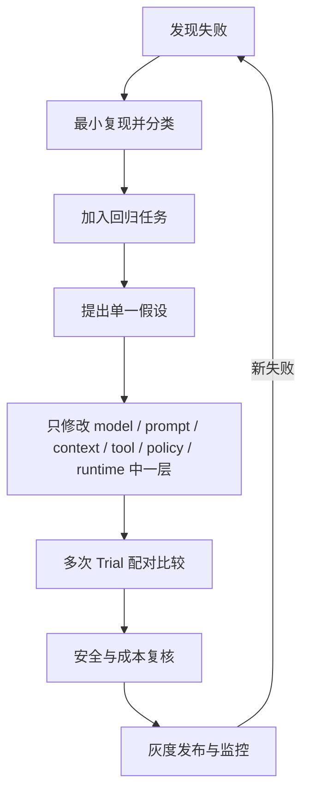

# 03 · Eval 驱动迭代

有了统计方法和结构化 Trace，团队才有条件把“这次退款失败了”变成可重复的工程问题。真正困难的不是想到更多优化点，而是在模型、Prompt、Context、工具、策略与 Runtime 之间定位责任层，并证明一次改动改善了目标指标而没有换来新的安全或成本回归。

本章把评测（Evaluation，Eval）放进日常研发循环：真实失败成为版本化案例，单一假设接受多次 Trial 检验，通过门禁后才进入灰度。这个闭环也会成为下一部分学习模型接口和手写 Agent 内核时的验证框架，使 Schema、流式事件和状态机不再只是孤立语法。

## 学习目标

- 把失败转成可重复案例和回归门禁。
- 区分离线 Eval、生产监控、A/B、用户研究。
- 避免一次改动多个变量和评测集过拟合。

## 1. 迭代闭环



先定位失败层再修复。用更长 Prompt 修工具超时，或用更强模型修授权漏洞，都是层次错误。

## 2. 失败分类

- Task/spec：目标本身含糊或不可解。
- Model：理解、规划、生成错误。
- Context/Retrieval：证据缺失、冲突或污染。
- Tool：契约、执行或结果错误。
- Policy/Security：误拒绝、漏拒绝、越权。
- Runtime：状态、循环、预算、恢复错误。
- Infrastructure：网络、队列、数据库和服务故障。
- Grader/Harness：评分漏洞、环境噪声、数据泄漏。

## 3. 四类互补证据

- Offline eval：上线前快速、可重复比较。
- Production monitoring：发现真实分布和未知失败。
- A/B test：验证真实用户结果，但需要足够流量和风险控制。
- User research/human review：理解主观质量、信任和交互问题。

没有任何单一层能覆盖全部问题。

## 4. 版本与可比性

每次 Run 固定或记录：model snapshot、sampling/reasoning config、prompt、toolset、schema、policy、retriever/index、runtime、dataset 和 environment 版本。

同时修改模型、Prompt、工具和检索后，即使得分变化也无法归因。

## 5. Gate 设计

发布门禁不只是一条平均分：

```text
no critical policy violation
task success not below baseline threshold
no regression in protected slices
p95 latency/cost within budget
failure and refusal behavior explainable
```

不同任务 slice 可有不同门槛，高风险动作应使用零容忍或极严格门禁。

## 微实验

选择一个已知失败，分别提出“换模型”“改 Prompt”“改工具契约”三个假设。只实施一个变量并跑多 trial；若没有显著、可归因改善就回退，而不是把所有改动一起保留。

## 常见误区

- 每次换最新模型都会自动提升。
- Eval 只在上线前跑一次。
- 用户点赞可以替代任务成功指标。
- 生产监控可以替代离线攻击测试。
- 固定评测集越调越高就表示泛化更好。

## 本章小结

Eval 驱动迭代的核心是先归因、再做单变量改动，并让离线回归、生产监控与用户证据各司其职。带着这套证据门禁，下一部分从 [TypeScript + Node 运行时先修](/masterpiece-static-docs/04-模型接口与Agent内核/01-TypeScript-Node运行时先修.md)开始，把模型调用逐步组装成可测试、可取消的 Agent Runtime。

## 章末检查

1. 为什么修复前要先分类失败层？
2. Offline Eval 与 production monitoring 各自看不到什么？
3. 哪些版本字段缺失会让两次结果不可比较？

## 一手资料

- [OpenAI Evaluation best practices](https://developers.openai.com/api/docs/guides/evaluation-best-practices)
- [Anthropic Demystifying evals for AI agents](https://www.anthropic.com/engineering/demystifying-evals-for-ai-agents)
- [NIST AI RMF Generative AI Profile](https://doi.org/10.6028/NIST.AI.600-1)
