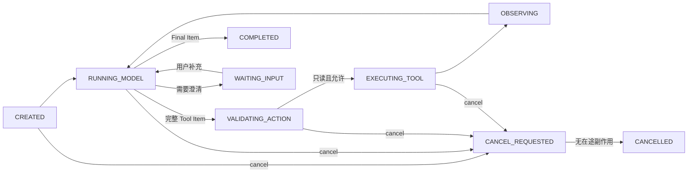

# 06 · Agent Loop 与状态机

当 Claude Code 或 Codex 读到测试失败、修改文件、再次运行测试时，你已经看见了 Agent Loop：模型提出下一步，Harness 执行工具，把观察结果放回下一轮 Context，模型再决定继续还是完成。这个核心循环不神秘，几十行 TypeScript 就能运行。

本章先只做这件事：把一个**只读、可取消、有预算**的 L1 Loop 跑通。至于“退款已经提交却丢了回执”“取消与副作用同时发生”等生产问题，我们会在后半章提前看一眼，到第 6～7 周再结合可靠性章节深入。这样，第一次阅读不会在写出 Loop 之前就被 `IN_DOUBT`、补偿和 Durable Workflow 淹没。

## 阅读路线

- **第一次读到 L1**：完成第 1～7 节和“带回 Workbench”，然后继续下一章。
- **第 6～7 周返回**：再读“生产深潜”，此时 Workbench 已开始接触审批、写操作和故障注入。
- **权威深入**：[失败、超时、重试与取消](/masterpiece-static-docs/08-可靠性与可观测/01-失败分类-超时-重试与取消.md)定义故障语义，[幂等、补偿与沙箱](/masterpiece-static-docs/06-工具-协议与行动控制/04-幂等-补偿与沙箱.md)定义副作用边界，[持久执行](/masterpiece-static-docs/08-可靠性与可观测/03-持久执行-Checkpoint与Exactly-Once.md)定义跨进程恢复。本章不重复实现它们。

## 本章解锁

- **工程判断**：区分一次 Run 内的 Inner Agent Loop、包裹它的 Harness 与跨 Run 的外层编排。
- **Workbench 工件**：一个有完整 Item 门禁、最大步数、deadline、取消、状态和 Trace 的 L1 Runtime skeleton。
- **通过证据**：能从同一条 Trace 分清“模型结束”“工具返回”“Run 完成”和“业务 Outcome 通过”。

## 1. 先认出你已经用过的 Loop

假设你让 Codex 修复一个失败测试，它的可观察轨迹大致是：

```text
run_started
context_built
model_item_completed(tool_call: read_file)
tool_completed(observation: file contents)
context_rebuilt
model_item_completed(tool_call: apply_patch)
tool_completed(observation: patch applied)
model_item_completed(tool_call: npm test)
tool_completed(observation: 27 passed)
model_item_completed(final_answer)
run_completed
outcome_graded(test suite: passed)
```

这条轨迹里有四个不同的“完成”：

- `model_item_completed`：模型的一个语义 Item 已收齐，不再只是半截流。
- `tool_completed`：Executor 得到了工具结果，不代表业务目标已经达成。
- `run_completed`：Runtime 进入终态，不再发起新的规划动作。
- `outcome_graded`：独立证据确认结果，例如测试真的通过、订单状态真的改变。

Codex App Server 公开了 Thread、Turn、Item 以及 start、resume、interrupt 等生命周期操作；Claude Code Hooks 则暴露若干可以观察或拦截的生命周期点。它们让 Harness 的职责可见，但不意味着不同产品内部必须使用同一实现。

## 2. 二十行 Loop 先跑起来

第一个实现只接 mock 或只读工具：

```ts
for (let step = 0; step < maxSteps; step += 1) {
  const context = await buildContext(snapshot);
  const item = await model.next(context, { signal });

  if (item.type === "final") return complete(item);
  if (item.type !== "tool_call") return fail("unsupported_item");

  const proposal = validateCompleteItem(item);
  const observation = await executeReadOnlyTool(proposal, { signal });
  snapshot = reduce(snapshot, observation);
}

return exhaust("step_budget");
```

代码已经具备反馈回路：观察会改变下一轮决策。此时先不要加入审批、多 Agent、自动补偿或 Durable Engine；否则你将无法判断故障来自模型、Loop，还是后来叠加的基础设施。

## 3. Loop、Harness 与 Outer Loop

```text
Inner Agent Loop = 一次 Run 内的“提议 → 验证 → 执行 → 观察”
Agent Harness    = Context Builder + Runtime + Tools + Policy + Sandbox
                   + State + Extensions + Trace
Outer Loop       = Trigger + Isolation + Start/Restart Run + Independent Verify
                   + Persist Task State + Human Gate + Next Attempt
```

同一 `run_id` 的等待、断线重连和 checkpoint/resume 属于 Runtime 或 Durable Harness。外层任务失败后重新领取任务，通常创建新的 `run_id` 与 `attempt_id`。两者都叫“循环”时很容易混淆预算、终止和副作用归属。

## 4. L1 只需要一组小状态

第一次实现使用只读工具，状态不必预演所有生产事故：

```text
CREATED
RUNNING_MODEL
VALIDATING_ACTION
EXECUTING_TOOL
OBSERVING
WAITING_INPUT
CANCEL_REQUESTED

COMPLETED
INCOMPLETE
FAILED
CANCELLED
BUDGET_EXHAUSTED
```



关键不是状态数量，而是每次转移都有 `Event + Guard + Effect`。例如，模型发来完整 Tool Item 只是一个事件；只有 Schema、权限、预算和工具只读属性都通过，Guard 才允许 Executor 调用工具。

## 5. Reducer 决定什么可以发生

模型输出候选动作，Reducer 和 Executor 才改变权威状态。一个最小事件联合类型可以从这里开始：

```ts
type L1Event =
  | { type: "run_started" }
  | { type: "model_tool_call_completed"; callId: string }
  | { type: "tool_succeeded"; callId: string; observationRef: string }
  | { type: "model_final_completed"; itemId: string }
  | { type: "model_incomplete"; reason: string }
  | { type: "input_required"; fields: string[] }
  | { type: "cancel_requested" }
  | { type: "budget_exhausted"; budget: "step" | "time" | "token" | "money" };
```

L1 Reducer 至少守住这些不变量：

- 未闭合的 Tool Call 永远不能进入 Executor。
- 模型只能提出动作，不能直接修改 Snapshot 或权威业务状态。
- 一个 `call_id` 的重复结果只能归并一次；每次尝试另有 `attempt_id`。
- 终态不再产生模型调用或新工具调用。
- Cancel 先持久化意图，再传播 `AbortSignal`；确认没有在途副作用后才写 `CANCELLED`。
- 状态写入带 expected version 或 CAS，避免并发 Reducer 相互覆盖。

## 6. 预算让 Loop 能停下来

至少记录五类预算：

```text
step budget
wall-clock deadline
token budget
money budget
tool/concurrency budget
```

预算检查发生在创建下一项工作**之前**。L1 只读场景中，预算耗尽后停止新工作，等待在途读取结束或取消，然后进入 `BUDGET_EXHAUSTED`。不要再问模型“你觉得要不要继续”，因为模型不是资源所有者。

## 7. Event、Snapshot 与 Context 不是同一份数据

```text
events ──reduce──> snapshot ──select/compact──> model context
```

- **Event Log**：不可变地记录发生过什么。
- **Snapshot**：从事件派生的当前权威运行状态。
- **Context Projection**：本轮选择给模型看的有限信息。

消息数组不能同时可靠承担三者。删除旧消息会破坏审计；无限追加又会污染 Context。下一步把 Runtime 接到 Web UI 时，还要从 Event 派生公开、安全、可重连的 UI Projection，详见 [Agent Application Server 与 UI 事件协议](/masterpiece-static-docs/04-模型接口与Agent内核/09-Agent-Application-Server与UI事件协议.md)。

> **第一次阅读到此即可。** 先完成只读 L1，再继续 Harness Engineering。下面的退款事故用于第 6～7 周回读，不是开始写第一个 Loop 的前置考试。

## 8. 生产深潜：一次退款为什么多出四个状态

小林申请退还订单 `order_123` 的 100 元。Agent 找到政策、生成提案，用户批准后调用支付服务。支付服务已经扣回款项，但响应在网络中丢失；此时用户又点击“取消”。

```text
18:42:01 proposal_frozen(hash=sha256:..., resource_version=41)
18:42:09 approval_granted(actor=xiaolin, expires_at=18:47)
18:42:10 command_sent(idempotency_key=refund:order_123:v41)
18:42:12 transport_timeout(effect=unknown)
18:42:13 cancel_requested
18:42:14 receipt_lookup(started)
18:42:15 effect_present(refund_id=rf_8891)
18:42:15 completed_with_effect_after_cancel
```

`timeout` 只说明本地没有拿到回答，无法证明退款失败。`cancel` 也不能倒转已经发生的外部效果。因此写工具需要额外表达：

```text
WAITING_APPROVAL
CANCELLING
IN_DOUBT
RECONCILING

COMPLETED_WITH_EFFECT_AFTER_CANCEL
PARTIAL
MANUAL_INTERVENTION
```

`IN_DOUBT` 的含义很窄：command 可能已发生，但证据不足。它不是 `FAILED`；`RECONCILING` 只能执行预先定义的回执查询、权威状态核对、去重、补偿或转人工，不能借机让模型规划新的业务动作。

## 9. 生产状态的代表性转移

这张表用于读 Trace，不要求在 L1 首次实现时全部编码：

| 当前状态               | Event                       | Guard               | Effect             | 下一状态                                   |
| ------------------ | --------------------------- | ------------------- | ------------------ | -------------------------------------- |
| CREATED            | run\_started                | 任务与预算有效             | 初始化 Snapshot       | RUNNING\_MODEL                         |
| RUNNING\_MODEL     | model\_tool\_call\_complete | Item 完整             | 持久化 proposal       | VALIDATING\_ACTION                     |
| VALIDATING\_ACTION | missing\_input              | 无安全默认值              | 写 clarification    | WAITING\_INPUT                         |
| VALIDATING\_ACTION | approval\_required          | proposal 已冻结        | 保存 hash、版本与 expiry | WAITING\_APPROVAL                      |
| WAITING\_APPROVAL  | approved                    | actor、hash、版本、时效均有效 | 发送 command         | EXECUTING\_TOOL                        |
| EXECUTING\_TOOL    | receipt\_success            | 回执与 intent 匹配       | 保存真实效果             | OBSERVING                              |
| EXECUTING\_TOOL    | timeout\_unknown            | command 可能已提交       | 禁止换新 key 重试        | IN\_DOUBT                              |
| 任一活跃状态             | cancel\_requested           | 尚未进入取消链             | 停止新工作并传播 Abort     | CANCEL\_REQUESTED                      |
| CANCEL\_REQUESTED  | no\_effect\_confirmed       | 无在途或未知效果            | 关闭 Run             | CANCELLED                              |
| IN\_DOUBT          | reconcile\_started          | 有稳定幂等键或查询键          | 查询回执/权威状态          | RECONCILING                            |
| RECONCILING        | effect\_present             | 存在 cancel intent    | 记录真实效果             | COMPLETED\_WITH\_EFFECT\_AFTER\_CANCEL |
| RECONCILING        | deadline\_exceeded          | 效果仍无法确认             | 记录 incident 与责任人   | MANUAL\_INTERVENTION                   |

完整的 retry 分类、cancel 时序和级联放大以 [08/01](/masterpiece-static-docs/08-可靠性与可观测/01-失败分类-超时-重试与取消.md) 为准；跨 Worker 的 lease、fencing、CAS、replay 与 exactly-once 边界以 [08/03](/masterpiece-static-docs/08-可靠性与可观测/03-持久执行-Checkpoint与Exactly-Once.md) 为准。不要从这张代表性表自行推导一套不兼容的恢复协议。

## 10. 生产不变量只增加，不替换 L1 核心

进入写操作后，再增加以下约束：

- 审批绑定精确参数、actor、目标资源版本和有效期；参数变化后重新审批。
- 同一业务 intent 的 retry 复用同一幂等键，相同 key 加不同 payload 必须拒绝。
- 有 in-flight command 或 unknown effect 时，预算耗尽只停止新工作，不能用 `BUDGET_EXHAUSTED` 掩盖效果。
- `RECONCILING` 保留初始原因以及后来出现的 cancel、budget、deadline facts。
- 真正终态后不再行动；收敛未知效果发生在进入终态之前。

这些规则解释了为什么生产 Runtime 看起来比二十行 Loop 复杂，但它们不改变核心认识：模型提议，Harness 验证与执行，Observation 再进入下一轮 Context。

## 带回 Workbench

### 第一次阅读：完成 L1

1. 只接 3～5 个 mock/只读工具，跑通完整 Item 校验、step budget、deadline、cancel 与 Trace。
2. 注入错误 Schema、Tool timeout、重复结果和预算耗尽。
3. Trace 至少记录 Context 版本、模型 Item、候选动作、Harness 决策、Tool attempt、Observation、状态转移与 Outcome。
4. 用测试证明：半截 Tool Call 不执行、重复 Event 不重复归并、终态不继续调用。

### 第 6～7 周返回：扩展写操作

先用“退款提交后 ACK 丢失”做 mock 故障实验。只有授权、精确审批、幂等键、receipt 查询与 [08/01 故障矩阵](/masterpiece-static-docs/08-可靠性与可观测/01-失败分类-超时-重试与取消.md) 都成立，才允许接入真实写工具。

## 常见误区

- Agent Loop 就是不断问模型“下一步是什么”。
- Streaming 文本停止就能标记 `COMPLETED`。
- 聊天历史可以同时充当 Event Log、Snapshot 和 Context。
- 第一个只读 Loop 必须先实现 Durable Workflow。
- 请求取消后可以立即写 `CANCELLED`。

## 章末检查

### L1 首读

1. 模型 Item 完成、Tool 完成、Run 完成和 Outcome 完成有什么差异？
2. Event、Snapshot、Context Projection 分别解决什么问题？
3. 为什么预算由 Harness 判断，而不是询问模型？

### 第 6～7 周回读

4. 为什么 command timeout 不能直接进入 `FAILED`？
5. 为什么 reconciliation 不违反“终态后不得行动”？

## 一手资料

- [OpenAI Function calling flow](https://developers.openai.com/api/docs/guides/function-calling)
- [OpenAI — Unrolling the Codex agent loop](https://openai.com/index/unrolling-the-codex-agent-loop/)
- [Codex App Server](https://learn.chatgpt.com/docs/app-server)
- [Claude Code Hooks reference](https://code.claude.com/docs/en/hooks)
- [ReAct](https://arxiv.org/abs/2210.03629)
- [Anthropic Building effective agents](https://www.anthropic.com/engineering/building-effective-agents)
- [AWS Idempotent APIs](https://aws.amazon.com/builders-library/making-retries-safe-with-idempotent-APIs/)

## 本章小结

熟悉的“读取—修改—测试—继续”就是 Inner Loop 的可见表面。第一次实现只需让完整 Item、只读工具、预算、取消、Event 和 Trace 形成闭环；写操作的未知效果与跨进程恢复留到 Workbench 真正需要它们时再引入。下一章缩放到整个 [Harness、架构模式与多 Agent 边界](/masterpiece-static-docs/04-模型接口与Agent内核/07-架构模式与多Agent边界.md)，理解 Claude Code、Codex 等产品把哪些能力放在模型之外。
