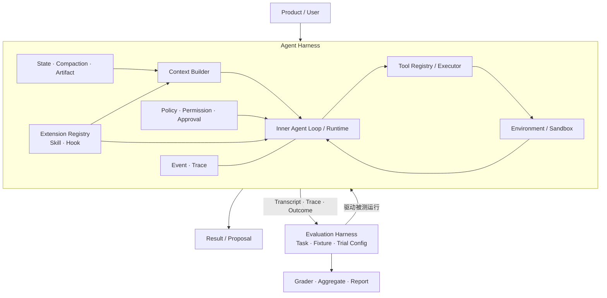
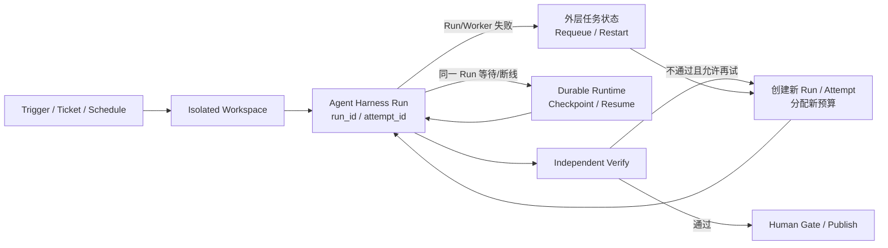

# 07 · Harness Engineering、架构模式与多 Agent 边界

上一章已经手写了 Inner Agent Loop。现在回看 Claude Code / Codex，你会发现“模型 + Loop”仍解释不了全部能力：谁发现项目规则、注册工具、限制工作区、拦截危险命令、压缩历史、保存 Trace，又是谁在另一个 Worktree 启动 Reviewer？这些围绕模型的设施共同构成 Agent Harness。

Harness Engineering 不是把更多插件装在模型周围，而是明确每个组件弥补了模型或环境的哪项不足，并用同一评测证明它仍然“承重”。本章随后把 Workflow、Agent、Evaluator 与 Multi-Agent 放回控制权和成本边界，避免把 2026 年的流行词变成默认架构。

## 本章解锁

- **工程判断**：区分 Agent Harness、Evaluation Harness、Inner Loop 与 Outer Orchestration Loop。
- **Workbench 工件**：一张 Harness Component Map，以及一份可版本化的 Skill/Hook Extension Contract。
- **通过证据**：能证明 Skill 按预算和信任边界加载、写操作被 Blocking Hook 确定性拦截，并用同一 M0 对比单 Agent、Workflow、Evaluator 与 Subagent。

## 1. Harness 到底包住了什么

Anthropic 在 Agent Eval 语境中给出过一个很实用的区分：

- **Agent Harness（或 scaffold）**：让模型能够作为 Agent 行动，负责输入处理、工具编排与结果返回。
- **Evaluation Harness**：准备任务和环境、运行 trial、记录轨迹、评分并聚合结果。

Evaluation Harness 可以向被测 Agent Harness 注入 fixture-backed 环境或工具 adapter，并复用 Trace Schema；fixture 本身仍归 Evaluation Harness 所有，不进入生产 Agent Harness。前者是被测系统的一部分，后者是测量它的设施。把两者混在一起，容易让测试代码悄悄替线上 Agent 完成关键步骤。

本书中的 Agent Harness 采用更完整的工程边界：



每个 Harness 组件都编码了一项假设：模型可能找不到正确文件，所以提供搜索；可能忘记约束，所以加载项目规则；可能误判完成，所以增加独立验证。模型升级后这些假设可能失效，Harness 必须做消融或对拍，而不是永久累积脚手架。

## 2. 从熟悉的 Skills 与 Hooks 看见扩展边界

你可能已经在 Claude Code 或 Codex 中见过类似体验：任务涉及某种专门工作时，Harness 才加载对应说明；危险工具执行前，系统可以阻断或请求确认；工具结束后，另一个扩展记录指标。这些能力不属于模型权重，它们来自 Harness 的扩展面。

但“目录里放一个 Markdown 文件”还不是生产契约。真正需要治理的是：本次 Run 加载了哪个版本、来自哪里、占用多少 Context、获得什么能力，以及扩展失败时系统究竟放行还是停止。

本书用一个厂商无关的 Extension Descriptor 表达公共字段：

```ts
type ExtensionDescriptor = {
  apiVersion: "agentbook.dev/v1";
  kind: "skill" | "hook";
  id: string;
  version: string;
  source: {
    uri: string;
    digest: `sha256:${string}`;
    trust: "first_party" | "reviewed_third_party" | "untrusted";
  };
  compatibility: { harness: string; minVersion: string };
  capabilities: {
    tools: string[];
    dataScopes: string[];
    network: "none" | "allowlisted";
  };
  budget: { contextTokens: number; timeoutMs: number };
};
```

这不是 Claude Code、Codex 或某个 SDK 的真实配置格式，而是本书的领域契约。各产品 Adapter 可以把自身规则文件、Skill 或 Hook 配置映射进来；Runtime 与 Trace 只依赖这份稳定表示。路径和文件名不能自己证明可信，来源还要经过允许列表、内容摘要、签名或人工审查策略。

## 3. Skill：按需加载，而不是把说明书全塞进 Context

小林问“`order_123` 是否符合退款政策”时，Harness 可能拥有几十个 Skills。合理流程不是一次性加载全部正文，而是渐进披露：

```text
发现：只读取 id / version / description / digest
→ 过滤：按租户、工作区、信任级别与能力范围筛选
→ 触发：显式选择或根据任务匹配候选
→ 授权：确认本 Run 允许加载该版本
→ 加载：在 Context budget 内读取入口说明
→ 深入：仅在需要时读取允许的 reference / template
→ 固定：本 Run 持续使用同一 digest，并写入 Trace
```

一个可执行的教学型 manifest 可以是：

```yaml
apiVersion: agentbook.dev/v1
kind: Skill
metadata:
  id: refund-policy-research
  version: 1.3.0
  description: 检索有效退款政策，并输出带来源和版本的资格判断
source:
  uri: repo://.agents/skills/refund-policy-research
  digest: sha256:7b1f...
  trust: first_party
activation:
  mode: matched-or-explicit
  entry: SKILL.md
context:
  maxTokens: 2400
  allowedReferences:
    - references/policy-query.md
    - templates/eligibility.json
capabilities:
  tools: [policy.search, order.read]
  dataScopes: [orders:read, policies:read]
  network: none
compatibility:
  harness: refund-workbench
  minVersion: 0.4.0
evals:
  suite: evals/refund-policy-research.v2.jsonl
```

Manifest 中的工具名只是**能力上限**，不等于本次 Run 已授权。最终可用能力应取交集：

```text
effective capabilities
  = skill 声明
  ∩ 当前 actor 权限
  ∩ workspace / tenant policy
  ∩ 本次 Run 的 allowlist
```

Skill 正文和引用材料都属于 Context 输入，要继承来源、信任和 Prompt Injection 防线。若 Run 已固定 `1.3.0 + sha256:7b1f...`，执行期间文件变成另一个 digest，Harness 应拒绝静默热切换：继续使用已缓存的固定版本，或创建显式的新 Attempt。

## 4. Hook：阻断决策与旁路观察必须分开

Hook 不是一段“什么时候都能跑”的回调。至少要把两类语义拆开：

- **Blocking Hook**：位于外部 Effect 之前，返回结构化决策；Runtime 必须等待它。
- **Observation Hook**：消费已发生事件，用于 Trace、指标或通知；它无权改写已作出的业务决定。

厂商无关的阻断输入和结果可以定义为：

```ts
type BeforeToolExecute = {
  type: "before_tool_execute";
  runId: string;
  actorRef: string;
  tool: string;
  proposalHash: string;
  argumentsRef: string;
  resourceVersion?: string;
  approvalRef?: string;
};

type BlockingDecision =
  | { decision: "allow"; policyVersion: string }
  | { decision: "deny"; code: string; publicReason: string }
  | { decision: "require_approval"; policyVersion: string };
```

Hook 只返回决策，不在原地修改已签名或已审批的参数。若确实需要规范化参数，应生成一个新 proposal，重新做 Schema、策略和审批校验。

| Canonical Hook Event      | 是否阻断 | Deadline / 超时       | 失败策略                                   | 必留审计                                         |
| ------------------------- | ---: | ------------------- | -------------------------------------- | -------------------------------------------- |
| `before_tool_execute`     |    是 | Effect 前的短 deadline | 写操作默认 fail closed；可返回 require approval | extension id/version/digest、输入 hash、决策、原因、耗时 |
| `before_external_publish` |    是 | 发布前短 deadline       | 敏感发布 fail closed                       | actor、目标、内容 hash、策略版本                        |
| `tool_completed`          |    否 | 通过 outbox 异步投递      | 业务 Run 继续；有限重试并记录丢弃指标                  | event id、delivery attempt、结果摘要               |
| `run_completed`           |    否 | 异步                  | 不回滚已完成 Run                             | run/outcome ref、投递状态                         |
| `context_compacted`       |    否 | 异步                  | 不阻塞下一轮；可告警                             | before/after digest、Token 变化、来源保留情况          |

还有四条容易被 Callback API 隐藏的边界：

1. 多个 Blocking Hook 的顺序必须配置并写入 Trace；默认合并优先级是 `deny > require_approval > allow`。
2. Blocking Hook 本身不得执行退款等业务副作用；它可能因超时或故障被重试。
3. Observation Hook 从持久化 outbox 消费事件，不能因为日志平台故障拖住退款主链路。
4. Hook 日志保存摘要和引用，不复制密钥、完整 Context 或敏感工具结果。

Claude Code 的 `PreToolUse` 等生命周期点、Codex 的权限确认表面以及 SDK callback 都可以由 Adapter 映射到这些 Canonical Events，但事件名相似不代表超时、阻断或失败语义天然相同，接入时仍需做契约测试。

### 退款 Workbench 小练习

沿用同一条退款事件，不新增虚构业务：

```text
skill.discovered(refund-policy-research@1.3.0, digest=7b1f...)
skill.loaded(context_tokens=1834)
tool.proposed(issue_refund, amount=100, resource_version=41)
hook.before_tool_execute(require_approval, policy=refund-write@8)
approval.granted(proposal_hash=92ac..., actor=xiaolin)
hook.before_tool_execute(allow, policy=refund-write@8)
tool.completed(refund_id=rf_8891)
hook.tool_completed.queued(observer=audit-sink@2.1.0)
```

实现并验证五个 fixture：Skill 超出 Context budget 时拒绝加载；digest 在 Run 中途改变时不热切换；未审批退款遇到 Blocking Hook timeout 时不执行；已完成退款遇到 Observation Hook timeout 时 Outcome 不回滚；换租户重放 approval 时因 actor/resource scope 不匹配而拒绝。

读者此时会发现，熟悉的“加载 Skill”和“执行前 Hook”背后其实是 Context、Supply Chain、Policy、Budget 与 Event 的交叉点。Harness Engineering 的价值正在于把这些交叉点变成可测试契约。

## 5. 复杂度递进

```text
确定性代码
→ 单次模型调用
→ 模型 + RAG
→ 固定 Workflow
→ 有界单 Agent
→ 多 Agent
```

只有当前一层无法满足任务且 Eval 证明下一层有收益时才升级。自主性是连续谱，不是越高越先进。

## 6. 常用模式

| 模式                   | 谁控制流程           | 适合          | 主要风险            |
| -------------------- | --------------- | ----------- | --------------- |
| Prompt Chaining      | 代码              | 固定阶段、每步可验证  | 错误级联、额外延迟       |
| Router               | 代码+分类器/模型       | 类别清晰、后续策略不同 | 误路由、类别漂移        |
| Parallelization      | 代码              | 独立子任务或多样采样  | 成本、汇合、共享状态      |
| ReAct                | 模型逐步选择          | 下一步依赖观察     | 循环、局部贪心、上下文膨胀   |
| Plan-and-Execute     | 模型计划+Runtime 执行 | 可分解长任务      | 计划陈旧、把计划误当授权    |
| Evaluator-Optimizer  | 生成器+评估器         | 有明确“更好”标准   | grader 被利用、无限迭代 |
| Orchestrator-Workers | 总控动态拆分          | 子任务数量未知且可并行 | 协调、重复、验证困难      |
| Handoff              | 专家接管            | 责任和上下文应转移   | 责任不清、恢复困难       |
| Agents-as-Tools      | 总控保留责任          | 专家只返回有限结果   | 总控上下文和验证负担      |

## 7. ReAct 的工程化

论文中的 Reason→Act→Observe，在产品中应落为：

```text
Decision summary
→ Proposed Action
→ Validated Execution
→ Typed Observation
```

不要把公开原始 Chain-of-Thought 当协议。审计对象是动作、参数、结果、来源和状态转移。

## 8. Plan 是可修改工件

计划至少包含 `step_id / goal / dependencies / status / completion_criteria / evidence`。新证据、用户 steer、权限变化、预算变化或工具失败都可能触发重规划。计划本身永远不是执行授权。

## 9. “Loop Engineering”应放在哪里

2026 年中已有部分实践者开始使用“Loop Engineering”描述一种工作方式：不再由人逐轮手写 Prompt，而是让系统自己发现任务、启动 Agent、保存进度、独立验证并决定下一轮。它仍是边界未统一的社区实践术语；本书把这类结构称为 **Outer Orchestration Loop（外层工作闭环）**，以免和一次 Run 内的 Agent Loop 混淆。



图中 `Checkpoint / Resume` 保持同一 `run_id`，属于 Durable Runtime；`Requeue / Restart` 则创建新 Run/Attempt，属于 Outer Orchestration。独立验证若在同一 Run 内反复驱动生成器，就是 Evaluator-Optimizer Workflow，也不应冒充跨 Run 调度。把这些结构统称为“循环”不会自动解决终止、成本、重复副作用或权限传播。

### 三个熟悉例子

1. **Claude Code / Codex Subagent**：为搜索或专项审查创建独立 Context，再返回有限结果。主要收益是隔离和并行，不是角色名本身。
2. **Generator + Evaluator**：让 maker 与 checker 分离。Anthropic 的长任务 Harness 实验表明，独立 Evaluator 在任务位于当前模型能力边缘时可能有价值；模型变强后，某些评审层也可能变成纯开销。
3. **任务板 + Worktree + Review**：外部任务状态触发隔离运行，通过测试和人工门禁后发布。它可以只用一个 Agent，也可以使用多个，因此 Outer Loop 不等于 Multi-Agent。

“Loop Engineering”目前更接近实践者术语，不是已经统一边界的行业标准。真正可验证的组成仍然是 Orchestration、Workflow、Eval、Durability、Budget 与 Human Control。

## 10. Multi-Agent 何时合理

> 本节的实现属于 L1 后。当前已有的单 Agent baseline 只需要用来判断是否存在可测的隔离、并行或专业化收益；没有证据时，不实现 Multi-Agent。

可能有价值：

- 子问题可以独立并行探索。
- 需要隔离不同上下文、工具或权限。
- 单一上下文容纳不了探索过程。
- 专家角色有可测的能力差异。

通常不合理：

- 只是给同一模型添加多个角色名。
- 所有参与者必须共享完整状态。
- 没有可靠的汇总和验证器。
- 单 Agent baseline 尚未建立。
- 成本和延迟预算不允许放大。

多 Agent 会增加通信损耗、上下文重述、权限传播、终止检测和失败归因难度。

## 11. L1 后的最小委派 Envelope

多 Agent 不能只传一段自然语言。委派消息至少需要：

```text
protocol/schema version
sender workload identity + original actor/delegation chain
parent_run_id + task_id + attempt_id + idempotency_key
goal + constraints + success criteria
allowed tools/scopes + data classification
deadline + cancel correlation
input refs + provenance + trust labels
expected result schema + ownership
trace context + sequence/version
```

接收方重新验证身份和衰减后的权限，不能因为消息“来自内部 Agent”就信任。协调器必须处理重复、迟到、乱序、恶意/失败 Worker、循环委派和取消传播；迟到结果不能覆盖已关闭或新版本任务。

## 前置桌面推演（30 分钟）

对同一研究任务画四个实现：固定 Workflow、ReAct、Plan-and-Execute、Orchestrator-Workers。分别标记控制权、状态归属、终止条件、最大调用数、错误传播和评测方法。选择最简单且满足要求的一个。

通过证据：如果选择 Multi-Agent，必须指出可测的上下文隔离、权限隔离或并行收益，以及委派、终止和验证成本；“角色更多”不通过。

## 带回 Workbench

为当前 L1 写一张 Harness Component Map：

| 组件                   | 当前假设          | 收益指标         | 成本/风险       | 何时删除或替换               |
| -------------------- | ------------- | ------------ | ----------- | --------------------- |
| Context Builder      | 全量历史会污染决策     | M0 成功率、Token | 选择错误、实现复杂度  | 简化后对拍无退化              |
| Tool Gate            | 模型会提出不完整/越界参数 | 策略违规为 0      | 延迟、误拒绝      | 不可删除，只能下沉 enforcement |
| Independent Reviewer | maker 自评偏宽松   | 缺陷召回、逃逸率     | 额外 Token/延迟 | 单 Agent 已稳定覆盖该任务切片    |

先为现有组件填表，再做一次限时消融：移除一个非安全关键脚手架，用同一 M0 回放。Harness Engineering 的深度来自可证伪假设，而不是组件数量。

再把第 3～4 节的退款 Skill manifest、Blocking Hook 和 Observation Hook 放入 fixture：固定 extension version/digest，记录 Context Token，占用超限时停止加载，并分别注入 timeout。通过标准不是“回调被调用”，而是写工具在阻断链失败时从未收到 command，旁路观察失败时主 Outcome 不被篡改且存在可追踪的投递告警。

## L1 后系统实验

用固定 mock Worker 注入重复结果、迟到结果、权限扩大、循环委派和恶意内容。只有 envelope 校验、task ownership、deadline/cancel 和 Eval 全部通过后，才允许接入真实 Worker。

## 常见误区

- 用了工具就是 Agent。
- Skill 声明过某项工具，就自动获得了该工具权限。
- 所有 Hook 都是安全 Enforcement，Callback 执行过就等于策略成立。
- 多次调用模型就是多 Agent。
- Agent 必须先生成完整计划。
- Multi-Agent 天然比单 Agent 更全面。
- 框架决定了架构模式。

## 章末检查

1. Router 为什么通常仍是 Workflow？
2. Plan-and-Execute 为什么必须允许重规划？
3. Agent Harness 与 Evaluation Harness 分别包含什么？
4. Skill 为什么要固定 version/digest，并限制 Context 与 capability budget？
5. Blocking Hook 与 Observation Hook 的 timeout 为什么不能采用相同策略？
6. Inner Agent Loop 与 Outer Orchestration Loop 为什么不能混为一谈？
7. 多 Agent 至少要证明哪一种隔离或并行收益？

## 一手资料

- [Anthropic Building effective agents](https://www.anthropic.com/engineering/building-effective-agents)
- [Anthropic Demystifying evals for AI agents](https://www.anthropic.com/engineering/demystifying-evals-for-ai-agents)
- [Anthropic Harness design for long-running application development](https://www.anthropic.com/engineering/harness-design-long-running-apps)
- [OpenAI — Unlocking the Codex harness](https://openai.com/index/unlocking-the-codex-harness/)
- [OpenAI — Harness engineering](https://openai.com/index/harness-engineering/)
- [OpenAI — Symphony orchestration](https://openai.com/index/open-source-codex-orchestration-symphony/)
- [Claude Code Skills](https://code.claude.com/docs/en/skills)
- [Claude Code Hooks reference](https://code.claude.com/docs/en/hooks)
- [Claude Code Subagents](https://code.claude.com/docs/en/sub-agents)
- [Codex Customization and Subagents](https://learn.chatgpt.com/docs/customization/overview)
- [Codex App Server](https://learn.chatgpt.com/docs/app-server)
- [Addy Osmani: Loop Engineering](https://addyosmani.com/blog/loop-engineering/)（实践者术语，不作为正式标准）
- [ReAct](https://arxiv.org/abs/2210.03629)
- [ReWOO: Decoupling Reasoning from Observations](https://arxiv.org/abs/2305.18323)
- [MAST: Why Do Multi-Agent LLM Systems Fail?](https://arxiv.org/abs/2503.13657)

## 本章小结

Harness Engineering 的对象不是“更多 Agent”，而是围绕模型建立一组可测试、可替换的 Context、Loop、Extension、执行与反馈设施。Skill 的按需加载和 Hook 的阻断/观察边界说明：熟悉的产品能力背后都是版本、信任、预算和失败语义。确定性代码、Workflow、单 Agent、Outer Loop 与 Multi-Agent 也是不同控制结构，不是从落后到先进的等级。下一章将据此整理[框架与 SDK 的学习优先级](/masterpiece-static-docs/04-模型接口与Agent内核/08-框架与SDK学习优先级.md)，用框架对照已理解的 Harness 组件，而不是用选型代替架构判断。
