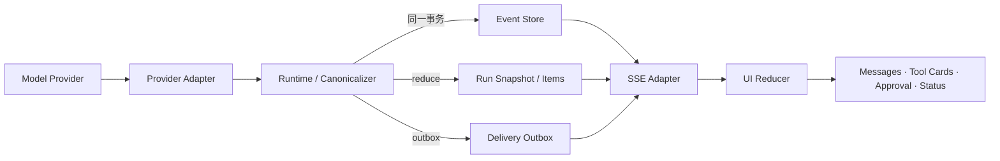

# 09 · Agent Application Server 与 UI 事件协议

小林提交 `order_123` 的退款请求后，界面依次显示“正在查政策”“需要确认”“退款已提交”。如果这些卡片直接由模型 Provider 的流式事件驱动，页面刷新后可能丢失工具状态，重复事件可能生成两张退款卡片，半截参数甚至可能被误画成可批准动作。

Agent Application Server 的作用，是把厂商事件翻译成应用事实，再把安全的公开投影交给 UI。浏览器看到的是可重连、可去重的 Run，而不是一条碰巧没有断开的模型连接。

## 本章解锁

- **工程判断**：区分 Provider Event、Canonical RunEvent、Transport Frame 与 UI State。
- **Workbench 工件**：一个 TypeScript RunEvent 契约、SSE endpoint 和纯 UI Reducer。
- **通过证据**：断流、重放、序列缺口、Snapshot 恢复和旧客户端兼容测试全部通过。

## 1. 应用服务器处在什么位置



关键顺序是：

```text
Provider Event
→ 闭合并校验语义 Item
→ 持久化 Canonical RunEvent 与 Item/Snapshot
→ SSE Adapter 投递公开事件
→ UI Reducer 派生页面
```

SSE 连接不是权威来源。即使客户端离线，Runtime 仍可完成、等待审批或失败；重新连接后，页面从 Snapshot 与后续 Event 恢复。

## 2. 同一条退款 Trace 的三种形态

Provider Adapter 可能先收到这样的厂商相关片段：

```text
output_item.added(kind=function_call)
arguments.delta("{\"orderId\":\"order_")
arguments.delta("123\",\"amount\":100}")
output_item.done
response.completed
```

应用不能把第一个 delta 变成退款按钮。Adapter 收齐 Item，Schema 校验成功，Runtime 再写稳定事件：

```text
41 item.started(kind=assistant_message)
42 item.text_delta("我找到了适用政策。")
43 item.completed
44 tool.proposed(tool=issue_refund, proposal_hash=92ac...)
45 approval.required(proposal_hash=92ac...)
46 run.state_changed(state=waiting_approval)
```

UI 只需把这些事实还原成文本和审批卡片。Provider 的 `response.completed` 也不能直接生成 `run.state_changed(state="completed")`；Run 终态由 Runtime 根据工具结果、等待状态和应用策略决定，Outcome 再由独立 Grader 评价。

## 3. Canonical RunEvent

下面是 Workbench 的第一版应用契约。它不是任何厂商事件类型的别名，也不能把生产状态压扁成笼统的 `running / waiting / failed`：

```ts
type BaseEvent = {
  schemaVersion: 1;
  eventId: string;
  threadId: string;
  runId: string;
  seq: number;              // 单个 Run 内严格递增
  occurredAt: string;
  traceId: string;
};

type PublicRunState =
  | "planning"
  | "waiting_input"
  | "waiting_approval"
  | "executing_tool"
  | "cancel_requested"
  | "in_doubt"
  | "reconciling"
  | "partial"
  | "manual_intervention"
  | "completed_with_effect_after_cancel"
  | "completed"
  | "cancelled"
  | "failed";

type PublicControl =
  | "submit_input"
  | "approve"
  | "reject"
  | "request_cancel"
  | "retry_safe"
  | "contact_operator";

type PublicEffectStatus =
  | "none"
  | "not_started"
  | "in_progress"
  | "confirmed"
  | "unknown"
  | "partially_confirmed";

type PublicToolStatus =
  | "proposed"
  | "approved"
  | "executing"
  | "in_doubt"
  | "reconciling"
  | "succeeded"
  | "failed";

type RunEvent =
  | (BaseEvent & { type: "run.started";
      data: { attemptId: string } })
  | (BaseEvent & { type: "run.state_changed";
      data: { state: PublicRunState; effectStatus: PublicEffectStatus;
        reasonCode: string; availableControls: PublicControl[] } })
  | (BaseEvent & { type: "item.started";
      data: { itemId: string; kind: "assistant_message" | "tool_result" } })
  | (BaseEvent & { type: "item.text_delta";
      data: { itemId: string; append: string } })
  | (BaseEvent & { type: "item.completed";
      data: { itemId: string } })
  | (BaseEvent & { type: "tool.proposed";
      data: { callId: string; tool: string; proposalHash: string; publicArguments: unknown } })
  | (BaseEvent & { type: "approval.required";
      data: { approvalId: string; proposalHash: string; publicPreview: unknown; expiresAt: string } })
  | (BaseEvent & { type: "approval.resolved";
      data: { approvalId: string; decision: "approved" | "rejected" | "expired"; actorLabel: string } })
  | (BaseEvent & { type: "tool.state_changed";
      data: { callId: string; status: PublicToolStatus;
        resultRef?: string; publicSummary?: string } })
  | (BaseEvent & { type: "control.cancel_requested";
      data: { actorLabel: string } })
  | (BaseEvent & { type: "run.error_recorded";
      data: { code: string; retryable: boolean; publicMessage: string } })
  | (BaseEvent & { type: "outcome.graded";
      data: { graderVersion: string; status: "passed" | "failed" | "inconclusive"; score?: number } });
```

`publicArguments`、`publicPreview` 和 `publicSummary` 必须在写入公开事件前脱敏。密钥、完整 Context、原始 reasoning 与敏感工具结果放在各自受控存储中，RunEvent 只保存 UI 和审计真正需要的字段或引用。

`run.state_changed(state="completed")` 只表示 Runtime 已到达应用终态；它不等于业务结果已经通过评测。Outcome Grader 可以稍后写入独立的 `outcome.graded`。因此不会再出现“Run 已完成，但 `outcomeStatus` 仍是 pending”这种把执行生命周期与结果质量混在一个事件里的契约。

Snapshot 是从 Event 派生的**完整公开投影恢复点**：

```ts
type PublicToolCard = {
  callId: string;
  tool: string;
  proposalHash: string;
  publicArguments: unknown;
  status: PublicToolStatus;
  resultRef?: string;
  publicSummary?: string;
};

type PendingApproval = {
  approvalId: string;
  proposalHash: string;
  publicPreview: unknown;
  expiresAt: string;
};

type RunSnapshot = {
  schemaVersion: 1;
  runId: string;
  upToSeq: number;
  state: PublicRunState;
  items: Array<{ id: string; kind: string; text?: string; status: string }>;
  toolCards: PublicToolCard[];
  pendingApprovals: PendingApproval[];
  availableControls: PublicControl[];
  effectStatus: PublicEffectStatus;
  lastError?: { code: string; retryable: boolean; publicMessage: string };
  outcomeGrade?: { graderVersion: string; status: "passed" | "failed" | "inconclusive"; score?: number };
  generatedAt: string;
};
```

这里的“完整”只针对客户端获准看到的投影：审批卡、工具卡、未知效果、人工接管和当前合法按钮都必须可由 Snapshot 单独重建。Runtime 自己还需要独立的 Durable Checkpoint，保存工作流游标、重试计数、幂等引用和租约；不能拿公开 Snapshot 代替执行恢复状态。

## 4. 从 Provider Event 到持久化 Item

Adapter 必须完成三件事：

1. 解析厂商事件并保留 provider response/item/call IDs，未知必需字段进入协议错误。
2. 累积 delta；工具参数只有在 Item 闭合、JSON 可解析且 Schema 通过后，才交给 Runtime 形成 `tool.proposed`。
3. 把 Provider 的失败、截断和断流映射成应用事件；绝不自行推断业务成功。

持久化时，Event、Snapshot 更新和 Delivery Outbox 应处于同一数据库事务：

```text
begin
  assert snapshot.version = expected_version
  allocate next seq
  insert run_event(run_id, seq, event_id, payload)
  upsert item + reduce snapshot
  insert delivery_outbox(event_id)
commit
```

高频文本 delta 可以在 Adapter 中按字节或短时间窗合并，再分配应用 `seq`；不能先直推浏览器、稍后才补写数据库。`UNIQUE(run_id, seq)` 与 `UNIQUE(event_id)` 共同抵御并发追加和投递重放。

## 5. SSE 的序列、缺口与重连

一帧公开事件可以这样发送：

```text
id: run_7:45
event: run-event
data: {"schemaVersion":1,"eventId":"evt_45","runId":"run_7","seq":45,
       "type":"approval.required","data":{"approvalId":"apr_9","proposalHash":"92ac...","publicPreview":{"amount":"CNY 100.00"},"expiresAt":"..."}}
```

协议规则比“打开一个 SSE endpoint”更重要：

- `seq` 由 Application Server 分配，只保证单个 Run 内单调，不借用 Provider sequence。
- `seq < nextSeq` 是重复事件，按 `eventId/seq` 幂等忽略。
- `seq > nextSeq` 是缺口，UI 暂停归并并请求从 `nextSeq` 补发，不能猜测中间状态。
- 重连携带 `Last-Event-ID` 或显式 `after_seq`；Server 从 Event Store replay，而不是重新调用模型。
- 若旧事件已超过保留期，Server 返回 `resync-required`，客户端先取 `RunSnapshot(upToSeq=N)`，再订阅 `N+1`。即使早期 `approval.required` 已被裁剪，Snapshot 仍必须带回尚未解决的审批卡、工具状态与合法 controls。
- heartbeat 是 Transport Control Frame，不占领域 `seq`，也不进入 Event Store。

Snapshot 解决“从已知完整状态重新开始”，Delta/Event 解决“低成本追上变化”。两者组合才是恢复协议。

## 6. UI Reducer 必须纯且可重放

```ts
type UIState = Omit<RunSnapshot, "upToSeq" | "generatedAt"> & {
  nextSeq: number;
  sync: "ready" | "gap";
};

function applyEvent(state: UIState, event: RunEvent): UIState {
  if (event.runId !== state.runId || event.seq < state.nextSeq) return state;
  if (event.seq > state.nextSeq) return { ...state, sync: "gap" };

  let next = state;
  switch (event.type) {
    case "run.state_changed":
      next = { ...state,
        state: event.data.state,
        effectStatus: event.data.effectStatus,
        availableControls: event.data.availableControls,
      };
      break;
    case "approval.required":
      next = { ...state, pendingApprovals: [
        ...state.pendingApprovals.filter(x => x.approvalId !== event.data.approvalId),
        event.data,
      ] };
      break;
    case "approval.resolved":
      next = { ...state, pendingApprovals:
        state.pendingApprovals.filter(x => x.approvalId !== event.data.approvalId) };
      break;
    case "item.started":
    case "item.text_delta":
    case "item.completed":
      next = reduceItem(state, event); // 按 itemId 幂等 upsert
      break;
    case "tool.proposed":
    case "tool.state_changed":
      next = reduceToolCard(state, event); // 按 callId 幂等 upsert
      break;
    case "control.cancel_requested":
      next = { ...state, availableControls: [] }; // 下一事件给出权威新状态
      break;
    case "run.error_recorded":
      next = { ...state, lastError: event.data };
      break;
    case "outcome.graded":
      next = { ...state, outcomeGrade: event.data };
      break;
  }
  return { ...next, nextSeq: event.seq + 1, sync: "ready" };
}
```

`reduceItem` 与 `reduceToolCard` 只是同一纯函数的拆分，不发网络请求。同一 Snapshot 加同一 Event 序列必然得到同一 UI；Reducer 也不执行工具，不把“界面已经画出成功”写回业务状态。

## 7. 兼容旧客户端

Event 协议独立版本化，并在连接握手中声明 `supportedSchemaVersions`。兼容规则如下：

- 同一版本只做可选字段的加法；客户端忽略未知可选字段。
- 新增非关键展示事件时，旧客户端可按 envelope 消费序列但忽略内容。
- 新增会改变审批、终态或安全语义的事件时，提高 schema version，并保留旧 endpoint/adapter 的兼容窗口。
- Server 声明 `minimumClientVersion`；低于该版本时明确拒绝，不让旧 UI 错画关键状态。
- 固定 v1 wire fixtures，分别喂给当前 Reducer 与仍受支持的旧 Reducer。

## 8. AG-UI 与 AI SDK UI 放在 Adapter 层

AG-UI 公开协议提供类型化生命周期事件和 Snapshot/Delta 同步；AI SDK 7 提供 UI message、stream 与 transport 能力。它们都适合作为 Product Edge 的互操作方案，但不应反向污染领域模型：

```text
Canonical RunEvent ──AG-UI adapter──> AG-UI Events
Canonical RunEvent ──AI SDK adapter─> UI Message Parts / Stream
Canonical RunEvent ──native SSE─────> 本书 Workbench UI
```

更换 UI 框架时，退款的 `proposalHash`、审批绑定、Run 终态与 Event Store 不应随之重写。

## 9. 故障与兼容测试

| Fixture                               | 必须观察到的结果                                                           |
| ------------------------------------- | ------------------------------------------------------------------ |
| Tool arguments 只到一半就断流                | 没有 `tool.proposed`，Run 不得完成                                        |
| Event 45 投递两次                         | Reducer 只应用一次，不产生两张审批卡                                             |
| 收到 44 后直接收到 46                        | UI 进入 `gap`，补齐前不应用 46                                              |
| Event 已过保留期                           | Snapshot 到 `N`，随后只应用 `N+1...`                                      |
| 等待审批时早期 Event 已被裁剪                    | Snapshot 仍含审批卡、proposal hash、tool card 与 `approve/reject` controls |
| Cancel 后处于 `IN_DOUBT` 时重连             | Snapshot 显示“结果未知/正在核对”，不出现普通 Retry 或伪造的 Cancelled                  |
| SSE 在审批后断开                            | `Last-Event-ID` replay，不重新生成 proposal                              |
| 未知可选字段/非关键事件                          | 旧 v1 Reducer 保持可用                                                  |
| 新的关键终态只存在于 v2                         | v1 客户端被版本门禁拒绝                                                      |
| 跨租户请求 run stream                      | Server 在读取 Event 前拒绝授权                                             |
| Tool result 含密钥                       | 公开 RunEvent 与 Snapshot 均不存在密钥                                      |
| Provider 宣布 completed，但 Runtime 在等待审批 | UI 保持 `waiting_approval`；不会生成 Runtime 完成或 Outcome 通过               |

## 带回 Workbench

1. 为现有 L1 定义 v1 `RunEvent`、`RunSnapshot` 与 JSON Schema，保留正反 fixtures。
2. 写一个 Provider Adapter，把录制的文本 delta、完整 Tool Item、截断和失败映射到 Canonical Events。
3. 实现 Event Store + Snapshot + Outbox 的原子追加，再实现 `GET snapshot` 与 `GET events?after_seq=`。
4. 用 native SSE 接 UI Reducer，跑完上表；最后再选 AG-UI 或 AI SDK UI 写一个薄 Adapter 做对照。

通过标准不是“页面能打字”，而是任意断点刷新后 UI 与 Event Store 一致，且重复、缺口、旧客户端和脱敏 fixture 都有确定结果。

## 章末检查

1. 为什么 Provider response completed 不能直接映射为 Run completed？
2. Public Snapshot、Durable Checkpoint、Event replay 和 heartbeat 分别解决什么问题？
3. 为什么 Tool arguments delta 不能直接生成审批卡？
4. AG-UI 或 AI SDK UI 为什么只能位于领域模型外侧？

## 一手资料

- [Codex App Server](https://learn.chatgpt.com/docs/app-server)
- [WHATWG Server-sent events](https://html.spec.whatwg.org/multipage/server-sent-events.html)
- [AG-UI Events](https://docs.ag-ui.com/concepts/events)
- [Vercel — AI SDK 7](https://vercel.com/changelog/ai-sdk-7)

## 本章小结

Agent Application Server 把易变的 Provider 流翻译成持久、可版本化的应用事件；SSE 只负责有序投递，UI Reducer 只负责派生显示。序列、去重、缺口、Snapshot 与兼容测试让 Agent 从“终端里能跑”变成“刷新和断线后仍可解释的产品”。下一部分进入 [Context Engineering](/masterpiece-static-docs/05-上下文-知识与记忆/01-Context-Engineering.md)，处理每一轮到底选择哪些状态与证据交给模型。
