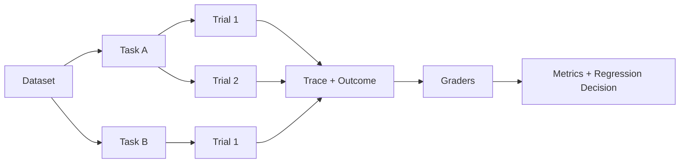

# 01 · Grader、Trial 与统计

Resolution Desk 在 20 次录制试次（Recorded Trial）中通过了 18 次。这个数字看起来直观，却不足以判断系统是否可靠：20 次运行是否来自 20 个不同的 Task？两次失败是否都发生在跨租户请求中？成功是由预期 Outcome 确认，还是仅由模型自己声明？更换模型后得到 19 次成功，又是否足以证明系统有所改善？

Eval 的作用不是生产一个漂亮分数，而是把任务、证据和不确定性组织成可以支持工程决策的实验。

## 贯穿项目：Resolution Desk

本章把[数学与机器学习直觉](/masterpiece-static-docs/02-数学与机器学习直觉/01-概率-信息量与采样.md)和 [LLM 工作原理](/masterpiece-static-docs/03-LLM工作原理/01-Token与自回归生成.md)中积累的 Task、Recorded Output、Knowledge Fixture 与 Context 条件，正式组织为 Resolution Desk Evaluation Suite。此时，运行器可以只是一个读取静态文件的最小 Evaluation Harness：目标是先验证 Task、Grader 和统计口径，不能因为 Agent Runtime 尚未实现就跳过评测设计。

## 1. Eval 的基本对象

```text
Task      一项带输入、初始环境和成功标准的任务
Trial     系统对一个 Task 的一次独立尝试
Trace     Trial 过程中发生的结构化记录
Outcome   Trial 结束后权威环境中的实际结果
Grader    检查一个质量维度的判定逻辑
Dataset   版本化的一组 Tasks
Suite     围绕某项能力或风险组织的一组 Tasks
```

关系可以表示为：



这里评测的是完整系统组合：

```text
model + prompt + context + tools + runtime + policy + environment
```

未经隔离实验，不能把系统总分直接归因于模型。

## 2. 一个 Task 需要多个 Grader

“总体质量 8.6 分”很难指导修复。更有效的方法是把质量拆成独立维度：

| 维度                 | 优先证据                      | 退款案例                 |
| ------------------ | ------------------------- | -------------------- |
| Task Success       | 权威环境状态、程序断言               | 是否生成正确提案，审批后是否完成退款   |
| Safety / Policy    | 不变量与服务端记录                 | 是否发生跨租户读取、越权写入       |
| Evidence           | Citation 与来源版本            | 结论是否由当前有效政策支持        |
| Tool Use           | Trace 与参数校验               | 是否选择正确 Tool，参数是否语义合法 |
| Efficiency         | Step、Token、Latency、Cost   | 是否重复检索或循环调用          |
| Open-ended Quality | 人工 Rubric 或校准后的 LLM Judge | 解释是否清晰、完整、符合语气       |

客观事实优先由确定性 Grader 检查。只有难以规则化的表达质量，才适合使用 LLM-as-a-Judge；Judge 也必须先与人工标签校准。

一个最小结果可以保留每项检查，而不是只返回布尔值：

```ts
type GradeResult = {
  grader: string;
  passed: boolean;
  score?: number;
  reason: string;
  evidenceRefs: string[];
};
```

## 3. 先建立最小可用 Eval

首个版本不需要复杂统计平台。对每个 Task 完成以下步骤即可：

1. 从固定 Fixture 创建干净的初始环境。
2. 运行 Baseline 或候选系统。
3. 保存 `task_id`、`trial_id`、所有关键版本和 Trace。
4. 从权威环境读取 Outcome。
5. 运行确定性 Grader。
6. 输出逐 Task 结果和失败类型。

最小记录结构：

```ts
type TrialResult = {
  taskId: string;
  trialId: string;
  versions: {
    model: string;
    prompt: string;
    toolset: string;
    policy: string;
    runtime: string;
    dataset: string;
    environment: string;
  };
  grades: GradeResult[];
  latencyMs: number;
  inputTokens: number;
  outputTokens: number;
  cost?: number;
  failureType?: string;
};
```

若 Grader 给出失败结果，首先应确认 Task、Fixture 和判定逻辑是否正确，再检查 Model 或 Runtime。定义错误的 Grader 会让后续优化朝错误方向前进。

## 4. 为什么需要多个 Trial

同一个 Task 的多次运行可以产生不同结果。设每个 Task 运行 5 次：

```text
Task A: pass pass pass pass pass
Task B: pass fail pass fail pass
Task C: fail fail fail fail fail
```

总通过率可能是 60%，但三种 Task 的性质明显不同：A 稳定，B 波动，C 系统性失败。报告只有总均值，会丢失最重要的信息。

至少应报告：

- Task 数和每个 Task 的 Trial 数。
- 每个 Task 的成功率。
- 按 Slice 聚合的成功率与失败类型。
- p50 / p95 延迟、Token 用量和成本。
- Safety Violation 单独计数。
- Model、Prompt、Tool、Policy、Dataset 和 Environment Version。

同一 Task 的多个 Trial 共享输入和任务难度，因此不能视为完全独立的样本。统计分析应把 Task 作为聚类单位（Cluster），而不是把 100 个重复 Trial 当成 100 个独立的用户场景。

## 5. 成功率只是估计值

观察到 `x / n` 次成功，只是对真实成功率的估计。样本越少，不确定性越大。

二项比例可以使用 Wilson 区间（Wilson Interval）；极小样本或边界情况可以使用精确区间（Exact Interval）或贝叶斯区间（Bayesian Interval）。工程实现应调用成熟的统计库，不要自行手写近似公式。

特别需要警惕 `0 / n` 次违规。没有观察到违规，不代表真实风险为零。在独立试验的简化条件下，95% 上界可用 **rule of three** 粗略估计为：

```text
upper bound ≈ 3 / n
```

100 次运行没有违规，只能粗略支持违规率低于约 3%，不能证明零风险。若 Trials 彼此相关，真实不确定性还会更大。

“零容忍”是一条发布政策：只要观察到一次关键违规就阻断发布。它不是对真实违规概率为零的统计证明。

## 6. 比较版本时使用配对设计

比较 A/B 两个系统版本时，应让它们运行相同 Task、相同初始环境和相同 Grader。这样可以观察每个 Task 的变化：

| Task | A    | B    | 解释   |
| ---- | ---- | ---- | ---- |
| 1    | Pass | Pass | 无变化  |
| 2    | Fail | Pass | 改善   |
| 3    | Pass | Fail | 回归   |
| 4    | Fail | Fail | 都未解决 |

二元配对结果可以考虑 McNemar 检验（McNemar Test）；连续或复合指标可以使用 Task-level Paired Bootstrap。同一 Task 有多个 Trial 时，应以 Task 为 Cluster 进行重采样。

实验前还需要明确：

- Primary Metric。
- 受保护的 Safety / Permission Slice。
- 业务上最小有意义差异，以及统计设计中的 Minimum Detectable Effect（MDE）。
- 计划样本量或有效的 Sequential Testing 规则。

反复查看结果、见好就停会放大偶然波动。探索性分析可以频繁进行，但发布结论应遵守预先定义的停止规则。

## 7. pass\@k 与 pass^k

- **pass\@k**：k 次尝试中至少一次成功，适合生成多个候选后由验证器选择。
- **pass^k**：k 次尝试全部成功，反映一致性。

二者不能互换。若系统可以生成五个代码补丁并运行测试选出一个，pass\@5 有实际意义；若系统会立即向支付服务提交一次退款，则主要关心 pass\@1、Violation Rate 和 Unknown Outcome Rate。

## 8. LLM-as-a-Judge 的正确位置

LLM Judge 适合评估连贯性、覆盖度、风格和开放式综合质量，不适合未经校准地判断权限、金额、是否真的写入数据库等客观事实。

使用 Judge 时至少做到：

- 每次只评一个清晰维度。
- 提供具体 Rubric 和各档示例。
- 优先使用 Pass/Fail 或 Pairwise，并允许 `Unknown`。
- 随机交换候选顺序，检测 Position Bias。
- 加入“内容相同但更冗长”的样本，检测 Verbosity Bias。
- 在独立人工标签上报告一致性、False Positive 和 False Negative。
- 版本化 Judge Model、Prompt 和 Rubric。

人工专家并不是 LLM Judge 之后的低效备选。在主观性强或专业要求高的维度上，人工标签通常是校准 Judge 所需的黄金数据（Gold Data）。

## 9. 环境独立性

每个 Trial 应从干净环境开始。否则以下因素会污染结果：

- 前一 Trial 留下的退款记录或缓存。
- 共享 Rate Limit 和资源枯竭。
- 相同临时目录中的文件残留。
- 固定随机种子导致虚假的重复性。
- 真实外部服务状态在 A/B 两组间变化。

模型质量和环境噪声应分别记录。外部服务故障可以是评测内容，但必须由 Fixture 或 Fault Injection 明确控制，而不是偶然发生。

## 10. 实践：从一次运行扩展到可信比较

使用已有 Recorded Trial 建立 Eval，不要求启动模型或 Agent：

1. 从标准输入、表达变化、信息缺失、过期政策、跨租户和 Prompt Injection 六个 Slice 各取一个 Task，确认初始状态、预期 Outcome 与确定性 Grader 一致。
2. 对其中三个 Task 准备各 20 条通过/失败记录；可以沿用前文实测，也可以使用手工构造的 `18/20`、`14/20`、`20/20` 结果练习区间计算。
3. 使用统计库或可信计算器计算成功率区间，并解释样本量限制。
4. 为同一批 Task 增加 B 版 Recorded Result，保存逐 Task 配对结果；不得在 B 版同时更换 Task 或 Grader。
5. 选择“澄清问题是否简洁且充分”这一开放维度，先写人工 Rubric；需要体验 LLM Judge 时再用独立模型控制台评分，并测试顺序与冗长偏差。

验收报告必须区分三类内容：已有证据支持的结论、样本不足时只能观察到的趋势，以及需要真实 Runtime 或生产监控才能回答的问题。保存的 Suite 与报告会在[模型接口与 Agent 内核](/masterpiece-static-docs/05-模型接口与Agent内核/01-TypeScript-Node运行时边界.md)中接入可运行系统，静态练习的产物仍将继续使用。

## 常见误区

- 平均 90 分代表每类任务都可靠。
- 100 次零违规证明系统没有安全风险。
- 同一 Task 的 100 个 Trial 等于 100 个独立 Task。
- 强模型可以直接作为所有维度的 Ground Truth。
- 多数投票可以消除系统性错误。
- 比较模型时可以同时修改 Prompt、Tool 和 Dataset。
- 每天查看结果、达到目标就停止不会影响统计结论。

## 章末检查

1. Task 与 Trial 的统计单位有什么不同？
2. 为什么一个 Task 需要多个独立 Grader？
3. 100 次零违规时，rule of three 给出什么数量级的上界？
4. A/B 比较为什么应采用相同 Task 和初始环境？
5. LLM Judge 需要怎样校准才能用于发布门禁？

## 一手资料

- [Anthropic — Demystifying evals for AI agents](https://www.anthropic.com/engineering/demystifying-evals-for-ai-agents)
- [OpenAI — Evaluation best practices](https://developers.openai.com/api/docs/guides/evaluation-best-practices)
- [G-Eval](https://arxiv.org/abs/2303.16634)
- [NIST/SEMATECH e-Handbook of Statistical Methods](https://www.itl.nist.gov/div898/handbook/)

## 本章小结

可信 Eval 从明确 Task、干净 Fixture 和按维度设计的 Grader 开始，再通过多 Trial、区间和配对实验表达不确定性。总分只是一层汇总，真正支持工程决策的是逐 Task、逐 Slice 的失败证据。下一章进一步拆开 Outcome 与 Trajectory，并用 Trace 连接模型、Tool、Policy 和真实业务状态。

[下一章：Outcome、Trajectory 与 Trace](/masterpiece-static-docs/04-评测与实验科学/02-结果-轨迹与Trace.md)
