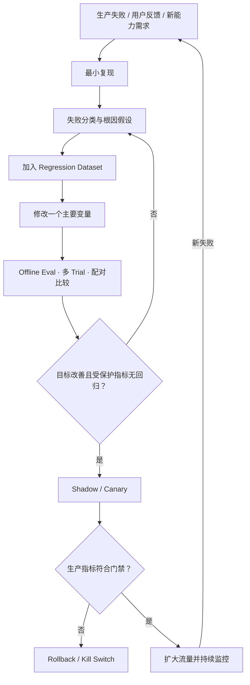

# 03 · Eval 驱动迭代

Resolution Desk 的 Recorded Incident 显示：“系统引用了已经失效的退款政策。”可选改动很多：换模型、改 Prompt、增加 Retrieval top-k、调整 Reranker、扩写 Tool Description，或者为这个案例加入特例。如果没有先定位故障层，任何改动都可能偶然修好当前输入，同时在其他场景引入回归。

Eval 驱动迭代将一次模糊反馈转换成可重复实验：保存任务与环境，定位责任层，提出单一假设，比较多个 Trial，再通过受保护指标和灰度结果决定是否发布。

## 贯穿项目：Resolution Desk

本章把前两章的静态 Dataset、Context Pack、Retrieval Result 和 Trace 组合成第一个完整 Eval Loop。练习对象是固定事故 `stale_policy_003`：旧政策措辞更相似而被排在当前政策之前。当前只验证根因假设和 Grader，尚未实现的检索器、Runtime、Shadow 与 Canary 明确留作后续执行门禁。

## 1. 从生产失败到工程问题

一个完整闭环如下：



闭环中的关键是“可复现”和“可归因”。没有固定 Task、Fixture、版本和 Trace，就无法知道下一次运行是否仍在测试同一个问题。

## 2. 先分类，再决定修复位置

Agent 失败通常落在以下层次：

| 层次                  | 典型故障                               | 合理修复方向                                    |
| ------------------- | ---------------------------------- | ----------------------------------------- |
| Task / Spec         | 成功标准含糊、任务不可解                       | 修 Task Contract、标签或人工升级条件                 |
| Model               | 理解、规划、生成或 Tool Selection 错误        | Model、Prompt、Example、reasoning config     |
| Context / Retrieval | 证据缺失、冲突、过期或被噪声淹没                   | Query、ACL、Rerank、Context Builder          |
| Tool Contract       | Description 含糊、Schema 不足、结果语义不清    | Tool API、Schema、错误模型与文档                   |
| Tool Execution      | Timeout、Rate Limit、部分成功、未知效果       | Retry、Idempotency、Reconcile、Compensation  |
| Policy / Security   | 误拒绝、漏拒绝、越权或数据泄漏                    | Authorization、Policy、Sandbox、Audit        |
| Runtime             | 循环、状态转移、预算、取消、恢复错误                 | State Machine、Budget、Event Handling       |
| Infrastructure      | Queue、Database、Network、Provider 故障 | SRE、Backpressure、Circuit Breaker、Failover |
| Grader / Harness    | 判定漏洞、Fixture 污染、数据泄漏               | 修 Eval Infrastructure 与 Dataset           |

以“引用错误政策”为例：

- 正确政策未被召回，属于 Retrieval Recall。
- 正确和过期政策都已召回，但版本没有进入 Context，属于 Context Builder。
- Context 已明确标注版本，模型仍选择旧政策，才更可能属于 Model。
- 回答引用正确，Grader 却读取旧 Ground Truth，则属于 Dataset / Grader。

这四种情况不能用同一条 Prompt 补丁处理。

## 3. 最小复现必须包含环境

传统前端 Bug 常通过输入和代码版本复现；Agent Bug 还需要保存环境与概率配置：

```text
Task Input
Actor / Tenant / Permission
Domain Fixture
Knowledge / Index Version
Model + Sampling / Reasoning Config
Prompt + Context Builder Version
Tool Schema + Policy Version
Runtime Version
External Fault Injection
```

最小复现不是保存一段聊天截图，而是构造一个可以从干净状态反复运行的 Task。若故障只在特定外部状态下出现，该状态也必须进入 Fixture。

## 4. 将真实失败加入 Regression Dataset

Regression Task 应保留导致故障的关键结构，但需要脱敏并移除无关噪声。一个生产失败可以衍生出三个层次的案例：

1. **Exact Regression**：尽可能复现原故障。
2. **Nearby Variants**：改变措辞、顺序、金额或文档位置，验证修复不是字符串特例。
3. **Counterexample**：确认修复没有导致过度行为，例如为避免旧政策而拒绝所有含版本冲突的请求。

每个案例都应绑定发现来源、风险等级、目标 Grader 和首次修复版本。Regression Dataset 会随着系统运行增长，但不应把原始生产数据无审查地永久保留。

## 5. 提出单一、可证伪的假设

“让模型更聪明”不是实验假设。可证伪假设应明确变量、机制和预期指标：

> 当前错误由过期政策在 Rerank 阶段排名过高导致。将 `effective_at` 和 `policy_version` 加入确定性过滤，应提高 `stale_policy` Slice 的 Evidence Pass Rate，同时不降低当前政策的 Recall\@5。

这个假设只修改 Retrieval / Context 一层，并同时声明目标指标和受保护指标。

一次修改多个主要变量会破坏归因。例如同时换模型、重写 Prompt、调整 top-k 和升级 Tool Schema，即使总分提高，也无法判断哪项改动有效、哪项只是增加成本或风险。

## 6. 设计受保护指标

发布门禁不应只有平均 Task Success。至少包含：

```text
Primary Metric 改善达到最小有意义差异
Critical Safety Violation = 0（发布政策）
Protected Slices 不低于 baseline
Unknown Outcome Rate 不上升
p95 Latency 与单位成功任务成本在预算内
Clarification / Refusal 没有异常增加
```

例如，加入更严格的政策版本过滤可能减少错误引用，却也可能让有效但元数据缺失的政策全部消失。`stale_policy` 是目标 Slice，`missing_metadata` 就应成为受保护 Slice 或明确转人工的行为。

## 7. 四类证据各自回答不同问题

### Offline Eval

快速、可重复，适合回归、对抗和故障注入。它看不到全部真实分布，也无法完整测量用户信任和组织流程变化。

### Shadow Evaluation

在不影响用户决策或外部状态的前提下，让新版本处理真实流量副本。适合观察分布、成本和潜在动作；写操作必须保持禁用或进入隔离 Sandbox。

### Canary / A/B

在受控流量上验证真实用户和系统结果。需要预定义流量、持续时间、停止条件、Safety Gate 和 Rollback。

### User Research / Human Review

用于理解可读性、信任、认知负担和人工接管体验。用户点赞不能替代业务 Outcome，但离线 Task Success 也不能替代真实 UX 研究。

没有任何单一证据层能够覆盖全部问题。

## 8. 版本化是可比性的前提

每次 Trial 至少记录：

```ts
type SystemVersion = {
  model: string;
  modelConfig: string;
  prompt: string;
  contextBuilder: string;
  toolset: string;
  policy: string;
  retriever: string;
  index: string;
  runtime: string;
  dataset: string;
  graders: string;
  environment: string;
};
```

Provider 的可变行为也需要通过可用的 Model Snapshot 或发布日期固定；若无法完全固定，应在报告中明确这一限制，并使用多 Trial 和持续基线监控降低误判。

## 9. 防止对 Eval Dataset 过拟合

Eval 驱动不等于围绕固定分数反复打磨。需要以下约束：

- Development、Regression 和 Holdout 分离。
- Holdout 不参与日常 Prompt 调整。
- 新增真实失败时，同时补充 Nearby Variant 和 Counterexample。
- 定期审查 Grader 是否仍对应真实业务目标。
- 报告按 Slice 分解，不用总分掩盖局部退化。
- 对多次比较和反复查看结果采用合适的统计控制。
- 生产分布变化时更新 Dataset，但保留历史版本用于回归。

若系统只在已知题目上越来越高分，而 Shadow 和生产结果没有改善，应停止调参并重新检查 Task Contract、数据分布和 Grader。

## 10. 一次完整修复示例

生产失败：系统为 31 天前签收的订单引用了旧版“30 天内可退”政策，判定允许退款。

### 复现

- 固定订单签收时间、请求时间和两版政策。
- 保存 Retrieval Candidate、Rerank Score 和 Context Snapshot。
- 确认旧政策进入 Context，且没有显式 `valid_to`。

### 根因

Knowledge Metadata 保存了版本号，但 Context Builder 只投影正文和标题，模型无法区分有效期。

### 假设

在 Retrieval 后执行时间有效性过滤，并将政策版本与有效期写入 Evidence Item，可消除该类错误。

### 变更

只修改 Evidence Selection 和 Context Serialization，不换 Model，不改 Tool。

### Eval

- Exact Regression 与 8 个日期边界变体全部通过。
- 当前政策 Recall 无回归。
- 缺少有效期的政策进入 `manual_review`，不再被默认采用。
- p95 Latency 增长在预算内。

### 发布

先在 Shadow 中观察被过滤政策比例，再进行小流量 Canary；若 `manual_review` 比例超过阈值，立即回滚并修复元数据。

这个过程比“在 Prompt 中加一句只使用最新政策”更可解释，也能形成长期回归资产。

## 11. 实践：建立第一个迭代闭环

使用 Resolution Desk 的 `stale_policy_003` Recorded Incident，不要求已经存在 Agent：政策 `pol_2025_11` 已失效但相似度较高，政策 `pol_2026_07` 在任务时间有效；Recorded Retrieval Result 将旧政策排在第一位，Recorded Trace 显示错误发生在 Rerank 后、Context Packing 前。

1. 固定 Task、查询时间、两版政策、排序结果和期望 Outcome。
2. 使用 Trace 将故障分类到一个主要层次。
3. 写出可证伪假设：“在 Rerank 前按 `effective_at` 做确定性过滤，可以消除过期政策引用，且不降低当前政策 Recall。”
4. 加入 Exact、日期边界 Variant，以及“旧政策仍在生效”的 Counterexample。
5. 在静态排序表中只加入这一项过滤，其他输入和 Grader 保持不变。
6. 比较 baseline 与候选的 Recorded Result；有条件时再用模型控制台补充多 Trial，但不执行 Tool。
7. 检查 ACL Violation、当前政策 Recall、Manual Review Rate、Token 与预计延迟等受保护指标。
8. 按预先写明的阈值判断候选是否达到接入条件，并保持 Fixture、Grader 与验收结果对应当前系统语义。

验收标准：第三方能够使用同一 Fixture 重现原故障，确认它属于 Freshness / Ranking 层，并判断候选过滤规则是否满足接入条件。第 06 模块实现检索管线时必须用这组 Regression Fixture 验证真实代码。

## 常见误区

- 每次升级到最新 Model 都会自动提高应用质量。
- Eval 只需在上线前集中运行一次。
- 用户点赞可以替代 Task Success 和 Safety 指标。
- Production Monitoring 可以替代离线对抗与故障测试。
- 固定 Dataset 分数持续上升就表示泛化能力持续提高。
- 一个生产失败只需加入完全相同的 Regression Case。
- 同时修改多个层次可以节省实验时间且不影响归因。

## 章末检查

1. 为什么真实失败必须先转化为带环境的可重复 Task？
2. Exact Regression、Nearby Variant 与 Counterexample 各自防止什么问题？
3. Offline Eval、Shadow、Canary 和 User Research 分别回答什么问题？
4. 什么样的假设才具有可证伪性？
5. 哪些版本字段缺失会让两次结果无法比较？

## 一手资料

- [OpenAI — Evaluation best practices](https://developers.openai.com/api/docs/guides/evaluation-best-practices)
- [Anthropic — Demystifying evals for AI agents](https://www.anthropic.com/engineering/demystifying-evals-for-ai-agents)
- [NIST AI RMF Generative AI Profile](https://doi.org/10.6028/NIST.AI.600-1)

## 本章小结

Eval 驱动迭代把真实失败转化为可重现 Task、明确层次、单变量假设、回归资产和发布决策。Offline Eval 提供快速证据，Shadow 与 Canary 验证真实分布，生产监控继续发现未知失败。带着这套方法，后续模型 API、Tool Loop、Context 和 Workflow 的每一项实现都可以被独立验证，而不是只靠 Demo 判断。

[下一章：环境模拟、合成数据与人工评审](/masterpiece-static-docs/04-评测与实验科学/04-环境模拟-合成数据与人工评审.md)
