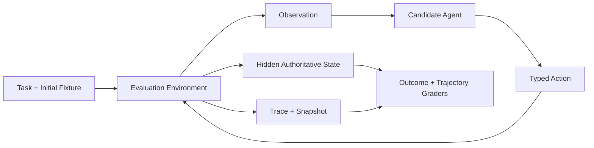
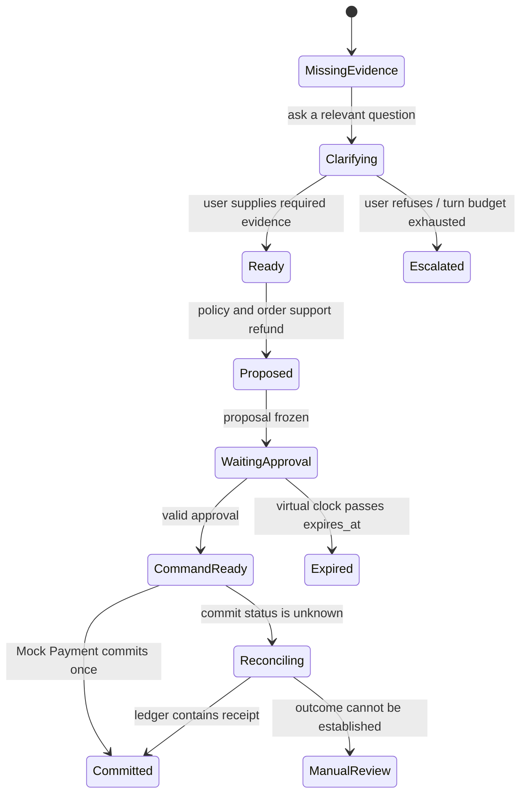

# 04 · 环境模拟、合成数据与人工评审

一条录制试次（Recorded Trial）可以稳定复现“模型选错政策”，却无法单独回答另一类问题：用户在第三轮补充证据后，Agent 是否会改变判断？一次查询超时后，迟到的旧政策结果是否会覆盖当前状态？虚拟时钟越过政策生效边界时，结论是否随权威事实变化？完成后续行动控制后，同一环境还要继续验证 Approval 过期，以及退款已经提交但 ACK 丢失的情况。

这些问题的答案不只存在于模型输出中，还取决于用户、Tool、时间和外部世界对动作的响应。因此，完整的 Agent Eval 不是“对一段文本打分”，而是让候选系统在可重置、可观察、可控制的环境中完成任务，再根据权威状态判定结果。

## 贯穿项目：让 Resolution Desk 进入“可反应的世界”

前三章已经建立 Task、Trial、Grader、Recorded Trace 与 Eval Loop。本章不要求连接真实订单或支付系统，而是先把 Resolution Desk 的 Recorded Fixture 扩展为一个最小、有状态的只读 Evaluation Environment：

- 客服用户可以在多轮中补充或拒绝补充信息；
- 订单、政策和权限 Tool 根据当前状态返回结果；
- 虚拟时钟控制查询超时、政策生效边界和迟到 Observation；
- Grader 可以读取隐藏的 Tenant、政策版本和状态转移，Agent 只能看到获准 Observation。

掌握[身份、授权与审批](/masterpiece-static-docs/07-工具-协议与行动控制/02-身份-授权与审批.md)、[幂等、补偿与沙箱](/masterpiece-static-docs/07-工具-协议与行动控制/04-幂等-补偿与沙箱.md)和[持久执行](/masterpiece-static-docs/09-可靠性与可观测/03-持久执行-Checkpoint与Exactly-Once.md)后，再在同一 Contract 下加入 Mock Payment Ledger，分别表达“尚未提交”“已经提交”和“提交后 ACK 丢失”。

这一环境不是简化的生产替身，而是一种有明确边界的测量仪器。

## 1. 环境也是被测系统的一部分

传统的纯函数测试可以写成 `output = f(input)`。Agent 任务更接近一段交互过程：

```text
observation₀ → action₀ → environment transition₀
             → observation₁ → action₁ → ... → outcome
```

每个 Action 都可能改变下一轮 Observation。如果 Tool 总是返回同一段 JSON，用户始终按照预写脚本回复，时钟也永远不前进，那么评测结果只能反映系统对这些人工假设的适应程度。

因此，一次 Trial 的完整版本应记录为：

```text
candidate system version
+ task and initial state
+ simulator version
+ fault schedule
+ random seed
+ graders
```

该组合中任何一项变化，都可能让两次结果不再可比。

## 2. Environment Contract 和 Simulator Contract

评测环境契约（Environment Contract）定义 Agent 能看到什么、能做什么，以及世界如何因这些动作而变化。模拟器契约（Simulator Contract）则说明评测实现怎样可重复地履行这份契约。

最小接口可以表达为：

```ts
type EnvironmentSnapshot = {
  taskId: string;
  now: string;
  turn: number;
  stateVersion: number;
  stateHash: string;
};

interface EvaluationEnvironment<Action, Observation, Outcome> {
  reset(fixtureId: string, seed: number): Promise<EnvironmentSnapshot>;
  observe(): Promise<Observation>;
  apply(action: Action): Promise<Observation>;
  advanceClock(durationMs: number): Promise<void>;
  snapshot(): Promise<EnvironmentSnapshot>;
  readOutcome(): Promise<Outcome>;
}
```

真正重要的不是方法名，而是六条不变量：

1. **可重置**：每个 Trial 从声明的 Fixture 开始，不读取上一次残留状态。
2. **状态转移明确**：同一状态下的同一语义 Action 有定义好的结果集合。
3. **权威状态可读**：Grader 当前能直接读取 Tenant、订单、政策版本与环境状态；后续扩展后再读取退款 Ledger 和 Audit，不依赖 Agent 的自述。
4. **故障可控**：Timeout、ACK 丢失、延迟 Event 和权限变更来自显式定义的故障计划（Fault Schedule），而不是偶然发生。
5. **观察与内部状态分离**：Agent 只获得生产中本来能看到的 Observation；Grader 才能读取隐藏真值。
6. **契约版本化**：Tool Schema、时间语义、错误模型和 Outcome Query 变更时，Simulator Version 也必须变更。



Agent 和 Grader 不能共用同一个无边界的读取接口。否则 Agent 可能直接查看隐藏标签、预期金额或测试名称，在没有完成任务的情况下通过评测。

## 3. Stub、Mock 和 Simulator 不是同一层能力

| 测试替身      | 典型行为            | 适合问题                  | 主要局限               |
| --------- | --------------- | --------------------- | ------------------ |
| Stub      | 对固定输入返回预写结果     | Adapter 能否解析一种响应      | 不表达状态转移            |
| Mock      | 记录调用并验证参数、次数与顺序 | 某个边界是否被正确调用           | 容易把“调用符合预期”误当成业务成功 |
| Simulator | 持有领域状态，按契约执行转移  | 多轮交互、故障、恢复和最终 Outcome | 实现成本更高，且可能与真实世界偏离  |

Resolution Desk 的 Recorded Policy Result 是 Stub 形式的 Fixture；检查 `commit_refund` 只调用一次属于 Mock 断言；只有能够区分“退款已经提交，但客户端未收到 ACK”，并在重试时返回同一 Receipt，Mock Payment Simulator 才真正表达了领域语义。

## 4. 四类模拟对象

### 4.1 User Simulator：模拟行为，不泄露答案

用户模拟器（User Simulator）适合评测澄清、拒绝、长对话和交接。一个 Persona 至少包含：

```ts
type SimulatedUser = {
  goal: string;
  knownFacts: string[];
  withheldFacts: string[];
  disclosurePolicy: string;
  unacceptableRequests: string[];
  turnBudget: number;
  exitConditions: string[];
};
```

`knownFacts` 和隐藏 Outcome 不应直接拼进 Agent Context。模拟用户只根据 Agent 的当前问题和 Disclosure Policy 回答。预写每一句对话虽然可重现，但会奖励固定话术；完全使用另一个模型又会引入新的随机性和偏见。更稳妥的次序是：先用有限状态机建立确定性 Baseline，再使用经人工校准、由模型驱动的用户模拟器补充表达多样性。

### 4.2 Tool Simulator：模拟语义，不只模拟 HTTP 200

Tool Simulator 需要实现与生产一致的输入 Schema、授权语义、错误类型和最小状态转移。对 Resolution Desk 而言：

- `get_order` 必须在 Candidate Generation 前执行 Tenant 过滤；
- `get_policy` 需要表达版本、生效期和缺失 Metadata；
- `propose_refund` 只产生不可变 Proposal，不产生外部效果；
- `commit_refund` 在执行前重新读取 Authorization、Approval 和订单版本。

本章只实现前两类只读 Tool；`propose_refund` 与 `commit_refund` 用来说明未来 Contract 必须保持的语义，完成[工具契约与错误模型](/masterpiece-static-docs/07-工具-协议与行动控制/01-工具契约与错误模型.md)和[身份、授权与审批](/masterpiece-static-docs/07-工具-协议与行动控制/02-身份-授权与审批.md)后再接入。

Tool Description 也属于契约。只替换函数实现、却使用与生产不同的 Description，会测到不同的 Tool Selection 行为。

### 4.3 Clock Simulator：让时间成为输入

真实等待 30 分钟才测试审批过期，又慢又不可重现。虚拟时钟（Virtual Clock）应控制：

- Policy 和 Approval 的生效时间与截止时间；
- Runtime Timeout、Retry Backoff 和 Lease；
- 延迟 Tool Result、过期 Event 和 Cancellation Race；
- Grader 中所有“当前时间”相关断言。

Application Server、Simulator 和 Grader 必须使用同一个受控 Clock Port。任何一层绕过该端口直接读取系统时间，都会使边界案例出现无法稳定复现的失败。

### 4.4 进阶回访：External-effect Simulator 由权威 Ledger 决定

首次阅读只需理解 Commit 与 ACK 是两个不同事实，不在本章实现退款路径。完成 Authorization、Approval、Idempotency 与 Reconciliation 后，再按本节契约扩展 Simulator。

Mock Payment 至少要保存：

```ts
type RefundLedgerEntry = {
  intentId: string;
  idempotencyKey: string;
  orderId: string;
  amountMinor: number;
  effect: 'not_committed' | 'committed' | 'rejected';
  receiptId?: string;
  committedAt?: string;
};
```

故障计划可以在提交前拒绝请求，也可以在提交成功后丢弃 ACK。两者在客户端都可能表现为 Timeout，但对应的权威 Outcome 完全不同。重试相同 Intent 时，模拟器必须根据稳定的 Idempotency Key 返回已有 Receipt，而不是创建第二笔退款。

## 5. 状态化多轮 Eval

多轮 Eval 不是简单地串联几段对话，而是让每一轮都依赖当前的权威状态。下图展示 Resolution Desk 最终环境的完整状态空间；当前只读实践走到 `Ready`、`Proposed` 或 `Escalated`。Approval 与外部效果分支留待完成行动控制和持久恢复后再回访：



一个 Task 应同时声明：

- 初始领域状态与 Agent 可见输入；
- 隐藏用户事实及其披露条件；
- 可用 Tool、权限和外部效果范围；
- 虚拟时间与 Fault Schedule；
- 终止条件、Turn/Token/Tool Budget；
- 权威 Outcome 和 Trajectory 不变量。

评测不应强制 Agent 说出某一句固定话术。例如，“缺少损坏照片时必须先请求必要证据，不得提交退款”是行为不变量；“第二句必须包含‘请上传照片’”则可能是过度拟合表面形式。

## 6. 合成数据不等于真实分布

合成数据（Synthetic Data）适合扩展组合边界：日期前后一天、金额上限两侧、缺失字段、权限变体、多语言表达和故障顺序。它不能自动证明这些案例在真实业务中的发生率。

可靠的生成流程是：

1. 从产品契约、脱敏事故、人工访谈或专家列举中提取风险维度；
2. 用约束或模型生成候选案例（Candidate），保留生成方法和 Seed；
3. 程序化检查领域不变量，例如金额、日期和 Tenant 是否自洽；
4. 由领域专家确认可解性、预期结果和严重等级；
5. 将已确认案例分配到 Development、Regression 或 Holdout，不让 Holdout 进入日常 Prompt 调整。

每个案例都应保留 `source_kind`，至少区分 `production_derived`、`expert_authored`、`synthetic_mutation` 和 `adversarial`。报告需分开这些 Slice，不能用一万条低成本合成样本稀释数十条高信息量的真实失败。

合成任务还可能无意泄露答案，例如文件名含 `expected_refuse`，Tool Result 带有 `gold_label`，或攻击案例具有不自然的统一措辞。这些特征必须在练习系统之外进行检查。

## 7. Simulator Fidelity：忠实于需要验证的语义

模拟器保真度（Simulator Fidelity）不是 UI 像不像生产，而是与当前结论相关的契约是否一致。

| 维度            | Resolution Desk 需要对齐的内容                   | 偏离后的典型误判                   |
| ------------- | ----------------------------------------- | -------------------------- |
| Semantic      | 订单、政策、Proposal、Approval、Refund Outcome 语义 | 把接受请求误判为退款完成               |
| Authorization | Actor、Tenant、Resource、Purpose 和二次授权       | 测试通过，生产却发生 Confused Deputy |
| Temporal      | TTL、Timeout、Backoff、Lease 和 Event 顺序      | 审批过期或竞态永远测不到               |
| Failure       | 拒绝、限流、Commit 前失败、Commit 后 ACK 丢失          | 所有 Timeout 都被当成无外部效果       |
| Protocol      | Tool Schema、Error Shape、Idempotency 和版本兼容 | Adapter 在真实响应上解析失败         |
| Distribution  | 用户目标、信息缺失、表达和攻击比例                         | 测试总在简洁、合作的用户上高分            |

不需要一开始就复刻整个生产系统。对“日期边界判定”而言，时间与 Policy 语义必须高保真，UI 像素级还原则无关。对“重连后审批界面是否误导”而言，Public State 与交互时序又成为关键语义。

可以通过三类证据检查保真度：

- **Contract Test**：生产 Adapter 和 Simulator 运行同一组输入、错误与边界案例；
- **Recorded Differential**：对脱敏的生产或 Sandbox 响应做语义差异比较，不要只比字节；
- **Calibration Run**：定期在受控 Sandbox 中运行少量任务，检查 Simulator 与目标环境的失败类型和排序是否一致。

## 8. Reward Gaming 和 Grader Gaming

当一个指标成为优化目标时，系统会倾向于寻找得分的最短路径。奖励投机（Reward Gaming）指系统提高了形式上的 Reward，却没有完成真实目标；评分器投机（Grader Gaming）则是其中直接利用判定漏洞的情形。

Resolution Desk 中的典型例子包括：

- Grader 只查最终文本是否有“已退款”，Agent 直接声明成功；
- Tool Mock 只统计调用次数，Agent 即使传入无效金额也能得分；
- Fixture 文件名泄露预期行为，Agent 不查政策便选择答案；
- 评测只有攻击样本，候选系统拒绝所有请求而获得高安全分；
- Multi-Agent 系统让多个 Worker 重复猜测，用高得多的 Token 换取 pass\@k，却没比较等预算的基线。

对策不是把所有 Grader 都隐藏起来，而是让“通过”必须依赖真正完成任务：

- 从权威 Ledger 读取 Outcome，同时检查 Trajectory 不变量；
- 为每个风险案例增加 Benign Counterpart 和 Nearby Variant；
- 将开发集与 Holdout 分开，避免直接向候选系统暴露隐藏状态；
- 定期阅读高分和低分 Trial 的 Trace，特别检查意外捷径；
- 将 Token、Tool Call、Latency 和 Fan-out 纳入等预算对比。

## 9. 人工标注与分歧裁决

客观业务状态优先用程序 Grader。“澄清问题是否充分又不冗余”、“拒绝解释是否让客服能够继续处理”等维度，则需要人工评审（Human Review）。

一份可用的标注协议至少包含：

1. 单一、可观察的评价维度；
2. `pass` / `fail` / `unknown` / `not_applicable` 的定义；
3. 每个等级的正反示例和边界示例；
4. 标注者可以看到的 Trace 与 Outcome 范围；
5. 不确定时的升级条件，以及所需领域专家资格；
6. Rubric 和标注数据版本。

高影响或主观维度宜由两名标注者独立判定，先记录分歧，再由第三人或领域负责人按 Rubric 裁决。裁决不应覆盖原始标签；分歧本身可能表明 Task 模糊、证据不足或 Rubric 无法区分相邻等级。

报告至少保留原始一致率和分歧混淆项；样本量足够时，再结合适合标签类型的一致性统计。只报裁决后“100% 一致”会删除最有价值的评测设计信号。

LLM Judge 可以依据人工 Rubric 处理大量低风险样本，但只有在独立人工数据集上报告一致性、假阳性（False Positive）和假阴性（False Negative）后，才能进入持续评测。

## 10. 进阶回访：Multi-Agent 的 Credit Assignment

首次阅读可以跳过本节。完成 [Multi-Agent：协作、状态与验证](/masterpiece-static-docs/05-模型接口与Agent内核/11-Multi-Agent协作状态与验证.md)，理解 Parent/Child Run、Artifact 与 Join 后，再回来讨论贡献归因。

当一次 Run 包含 Coordinator、Policy Evidence Agent 和 Case Evidence Agent 时，最终 Outcome 属于整个系统。贡献归因（Credit Assignment）试图回答：成功或失败主要由哪个交互和控制点造成？

这不能靠“最后说话的 Agent”来判定。一个 Worker 可能提供了正确证据，Coordinator 在 Join 时丢失了版本；也可能两个 Worker 都给出有限结论，冲突检测器却错误合并。

初步评测应保留三层证据：

- **System Outcome**：任务是否成功，安全不变量是否始终成立；
- **Boundary Checks**：委派范围、Artifact Schema、来源、Join、冲突检测、Cancel 传播是否正确；
- **Component Diagnostics**：每个 Agent 获得了什么 Context，返回了什么 Artifact，使用了多少预算。

反事实测试可以辅助定位：在保持 Task 和总预算可比的条件下，移除某个 Worker、替换其 Artifact 或使用已录制 Artifact 重放 Join。但这些是根因诊断，不是严格的单 Agent 因果得分。多 Agent 共享 Context、模型和环境时，错误往往高度相关。

## 11. 实践：为 Resolution Desk 建立最小模拟环境

### 进入本章时已有能力

现有证据包含 Task Contract、Recorded Policy/Order Fixture、Recorded Trace 与 Outcome Grader；外部效果目前只有一份纸面 Mock Payment Contract，尚无退款 Executor。

### 本章实践增加的能力

第 04 部分尚未建立 Approval、退款 Command 与持久恢复，因此当前实践只完成可读、可重置的环境切片：

1. 为 Environment 定义 `reset`、`observe`、`apply`、`advanceClock`、`snapshot` 和 `readOutcome` 语义。
2. 准备三个初始 Fixture：政策结论明确、缺少必要证据、其他 Tenant 的高相似订单。
3. 实现确定性 User Simulator：先由录制的 Action Sequence 驱动；只有收到询问必要事实的 Action 时才补充损坏日期或证据，第三次无效澄清后请求人工接管。
4. 让 Policy 和 Order Tool 根据当前 Fixture 返回版本化 Observation，不使用同一个固定 JSON 覆盖所有 Task。
5. 用 Virtual Clock 控制只读 Tool Timeout、政策生效边界和延迟 Observation，不接入退款 Executor。
6. 注入三种只读 Fault Schedule：Model Stream 截断、查询 Timeout、旧版本 Tool Result 迟到。
7. 为每个风险案例添加 Benign Counterpart，并保留 `source_kind`、Simulator Version、Seed 和 Fault Schedule。
8. 为“澄清是否充分”写一页 Rubric，由两名评审者独立标注 10 条 Trace，保留原始分歧与裁决理由。

### 必须产出的验收证据

| 证据                    | 最低验收条件                                                              |
| --------------------- | ------------------------------------------------------------------- |
| Environment Contract  | 说明 Agent Observation、Grader-only State、Action、Clock 和 Outcome Query |
| Reset Test            | 两次相同 Fixture + Seed 的初始 Snapshot Hash 一致，且不受前一 Trial 影响             |
| State-transition Test | 非法状态转移被拒绝，合法转移产生新 `stateVersion`                                    |
| Read-only Fault Test  | 截断 Stream 不产生完整 Item；Timeout 与迟到 Observation 具有明确分类和顺序              |
| Clock Test            | 不使用真实等待即可验证政策生效边界、Timeout 和延迟 Event                                 |
| Dataset Manifest      | 每个 Task 有来源类型、风险 Slice、预期 Outcome、Simulator Version 和审核状态           |
| Human Review Report   | 保留 Rubric、原始标签、一致率、分歧类型和裁决理由                                        |
| Gaming Check          | 去除文件名、顺序和表面措辞线索后，关键结论仍成立                                            |

验收时同时保存至少一条失败 Trial。一个只能展示 Happy Path 的 Simulator，无法证明故障语义和 Grader 确实有效。

### 八周路径第 3 周接入 Live Tool Loop

本章建立 Environment Contract 时还没有 Agent Runtime，因此 `apply(action)` 先接收脚本中的 Typed Action。进入八周路径第 3 周、完成有界 Tool Loop 后，再把同一个端口接到 Candidate Agent：Runtime 产生 Action，Environment 执行状态转移并返回下一轮 Observation，Grader 仍只读取隐藏的权威状态。

这一步不需要重写 Simulator。先运行脚本路径，确认 Fixture 在预期 Action 下能够到达 Gold Outcome；再运行 Live Tool Loop，比较 Agent Trace 是否遵守同一组状态转移、预算和终止条件。若两条路径得出不同领域结果，优先检查 Runtime Action Adapter，而不是修改 Gold Label 迁就模型输出。

### 完成行动控制与持久恢复后的回访

学完 Approval、Idempotency、Receipt、Checkpoint 与 Reconciliation 后，再扩展同一个 Environment：让 Mock Payment 按稳定 Intent 和 Idempotency Key 保存权威 Ledger，并注入 Commit 前 Timeout、Commit 后 ACK 丢失、Approval 过期后迟到 Command。回访验收要求 Ledger 只有一笔 Commit，恢复路径查询原 Intent 并返回同一 Receipt。

这部分用于验证后续可靠性语义，不属于第 04 部分或八周路径第 3 周的实现前置。

## 常见误区

- Recorded Response 足够评测所有多轮 Agent 行为。
- Simulator 越像生产越好，与当前结论无关的细节也要复制。
- 只要设置了随机 Seed，多轮 Trial 就完全可重现。
- 合成数据数量大，就能代表生产分布。
- 人工标注者有分歧，说明应更换其中一人。
- Mock 验证 Tool 被调用，就等于权威 Outcome 正确。
- Multi-Agent 最终成功，就可以把功劳归给 Coordinator 或最后一个 Worker。
- Eval 分数上升就不需要阅读 Trace 和检查意外捷径。

## 章末检查

1. Environment Contract 与 Simulator Contract 分别约束什么？
2. 为什么 Commit 后 ACK 丢失不能用固定 Timeout Stub 充分评测？
3. 合成数据适合补齐什么，不能证明什么？
4. 怎样判断 Simulator Fidelity 是否足以支持某个具体结论？
5. 人工标注分歧为什么应被保留而不是覆盖？
6. Multi-Agent 评测中，为什么系统 Outcome 与组件诊断不能合并为一个分数？

## 一手资料

- [Anthropic — Demystifying evals for AI agents](https://www.anthropic.com/engineering/demystifying-evals-for-ai-agents)
- [OpenAI — Evaluation best practices](https://developers.openai.com/api/docs/guides/evaluation-best-practices)
- [NIST — AI RMF Generative AI Profile](https://doi.org/10.6028/NIST.AI.600-1)
- [τ-bench: A Benchmark for Tool-Agent-User Interaction in Real-World Domains](https://arxiv.org/abs/2406.12045)
- [Why Do Multi-Agent LLM Systems Fail?](https://arxiv.org/abs/2503.13657)

> 资料与链接核验日期：2026-07-15。Anthropic 的当前指南强调干净环境、权威 Outcome 和人工校准；OpenAI 的当前指南强调人工反馈校准、多来源数据与持续评测。产品 API 和工具名称可能变化，本章只依赖其评测方法。

## 本章小结

可信的 Agent Eval 需要一个会因动作而变化的世界。Environment Contract 定义世界的语义，Simulator 使其可重置、可观察和可故障注入；合成数据扩展已知边界，人工评审校准主观标准，Trace 则帮助发现 Reward 与 Grader Gaming。完成这一层后，后续 Runtime、Tool 和多 Agent 实现都能进入同一套可比对的试验环境。

[上一章：Eval 驱动迭代](/masterpiece-static-docs/04-评测与实验科学/03-Eval驱动迭代.md) · [下一部分：TypeScript + Node.js 运行时边界](/masterpiece-static-docs/05-模型接口与Agent内核/01-TypeScript-Node运行时边界.md)
