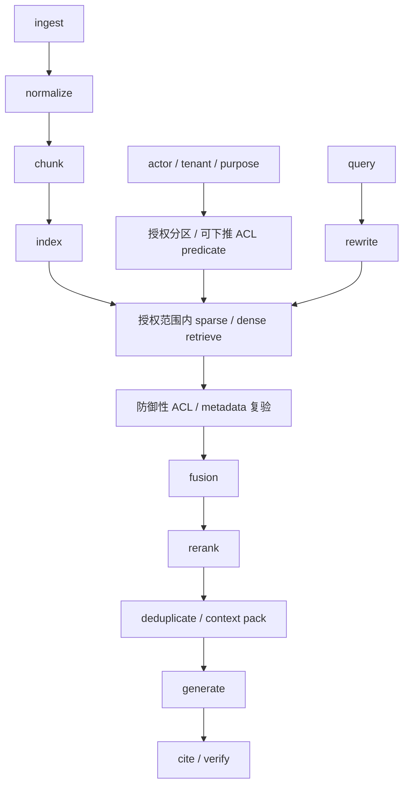

# 03 · 检索、RAG 与重排

有了来源、权限和时间字段，系统仍要回答一个实际问题：面对大量政策与业务资料，怎样把当前退款问题所需的证据送进有限 Context。检索增强生成（Retrieval-Augmented Generation，RAG）不是外挂在 Agent 旁边的“知识功能”，而是 Runtime 构造证据投影的一条受约束数据管线。

本章从候选生成、融合、重排一直走到引用验证，并始终保留前一章的 ACL 与 Provenance。这样才能分别判断是证据没有被召回、排序错误、Context 打包丢失条件，还是模型在已有证据上生成了错误结论。

## 学习目标

- 理解 RAG 是“检索候选 + 上下文增强 + 生成”的系统，不是防幻觉开关。
- 能分开评测检索与生成。
- 知道 ACL、来源和时间为何必须进入检索设计。

## 1. 最小管线

每一箭头都可能失败。向量数据库只是其中一个组件。

不能先在全局语料取 top-k 再 post-filter：无权候选可能被读取/计分，形成侧信道，并把有权候选挤出 top-k。优先 tenant partition、security-trimmed index 或由检索引擎原生执行 ACL predicate；进入 Context 前再复验。

## 2. 切分的权衡

- 太小：实体关系、限定条件和出处被拆散。
- 太大：噪声增加、召回信号稀释、Token 成本上升。
- 固定长度并非总是最佳；结构化文档应考虑章节、表格、记录边界。
- Chunk 必须保留 parent document、位置、版本和权限元数据。

## 3. Sparse、Dense 与 Rerank

- Sparse 擅长精确词项、编号、错误码和专有名词。
- Dense 擅长语义改写，但可能把主题相同、事实相反的内容拉近。
- Hybrid 通过 fusion 合并候选。
- Reranker 用更强模型重新判断 query-document 相关性。

最终选择必须以任务评测为准，不存在普适 top-k。

## 4. 分层评测

### Retrieval

- Recall\@k、Precision\@k、MRR、nDCG。
- 正确证据是否进入候选。
- 无权、过期和低质量来源是否被排除。

### Context packing

- 证据是否被截断、重复或互相冲突。
- 关键条件是否保留。

### Generation

- Claim 是否被证据支持。
- 引用是否真的蕴含相邻 Claim。
- 是否在无证据时 abstain。

## 5. Agentic Retrieval 的边界

允许 Agent 动态改写查询、选择来源或继续检索，能处理开放问题，但会增加调用、攻击面和停止难度。先建立固定检索 baseline，只有复杂任务有可测收益时才升级。

## 前置微实验（45 分钟）

建立一个含同义表达、冲突版本、过期政策、无权文档和恶意指令的微型语料库。分别报告 retrieval recall、ACL violation、引用支持率和最终任务成功，不能只报告“答案看起来不错”。

通过证据：无权文档不参与候选生成；若只做 post-filter，必须能复现 recall starvation 并判定设计不通过。

## 常见误区

- RAG 可以消除幻觉。
- Embedding 分数最高就是权威来源。
- 召回不足时继续优化 Prompt 即可。
- 引用了 URL 就说明 Claim 有依据。
- Agentic RAG 总比固定检索好。

## 本章小结

RAG 的质量来自一条可分层评测的数据管线：先在授权范围内召回，再重排、打包、生成并验证引用；任何一层失败都不应被笼统归咎于模型。下一章将区分[状态、记忆与压缩](/masterpiece-static-docs/05-上下文-知识与记忆/04-状态-记忆与压缩.md)，决定哪些检索结果和任务经验可以跨步骤或跨 Thread 保留。

## 章末检查

1. 正确文档未进入 top-k 属于哪一层失败？
2. 为什么同主题、相反结论可能在向量空间很近？
3. Groundedness 与 citation correctness 有什么差异？

## 一手资料

- [Retrieval-Augmented Generation for Knowledge-Intensive NLP Tasks](https://arxiv.org/abs/2005.11401)
- [Dense Passage Retrieval](https://arxiv.org/abs/2004.04906)
- [Stanford IR Book](https://nlp.stanford.edu/IR-book/)
