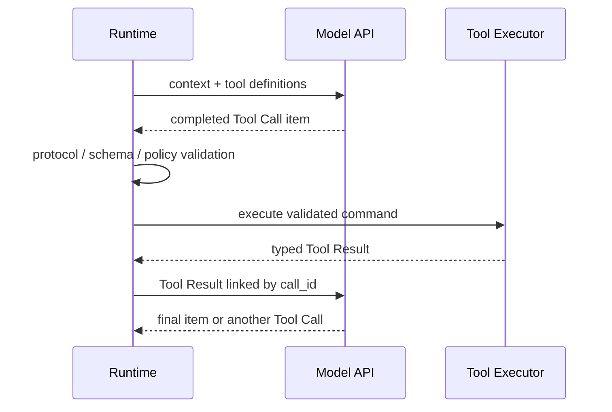
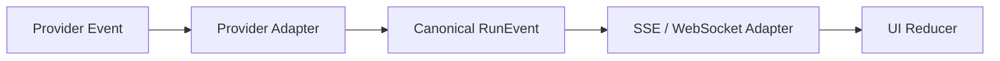

# 03 · 模型 API、状态与流式事件

浏览器调用普通 JSON API 时，`200 OK` 后通常可以一次性解析完整响应。模型 API 的行为更像一个事件源：文本、reasoning item、Tool Call 参数、拒绝和用量信息可能分批到达，连接也可能在任意位置中断。若应用只把所有 delta 拼成字符串，就无法判断工具参数是否完整，也无法可靠区分“用户看到了部分文本”和“本次运行已经完成”。

本章建立模型协议层的基本对象，并把 Provider Event 与应用自己的运行状态分开。这个分层会直接影响后续的工具执行、断线恢复和 UI 设计。

## 本章目标

- 理解 response、item、content part、Tool Call 与 Tool Result 的关系。
- 区分 provider state、application state 和 model context。
- 从流式事件安全地重建语义 Item。
- 建立可操作的错误分类，而不是对所有失败统一重试。

## 1. 模型调用不是“字符串进、字符串出”

现代模型 API 的输入和输出都可能包含多种 item：

- 用户或开发者消息；
- 模型生成的文本或结构化数据；
- reasoning item 或其受控摘要；
- Tool Call；
- 与 `call_id` 关联的 Tool Result；
- 拒绝、截断和其他模态内容。

一次工具交互的通用时序如下：



模型只负责产生候选调用。应用校验并执行工具，再把观察结果送回下一轮。Tool Result 必须与原始 `call_id` 关联，否则模型和 Runtime 无法判断它回答了哪一项请求。

## 2. 三种“状态”属于不同层

### Provider conversation state

模型提供方保存的 conversation、response 或 previous-response 关系。它能减少每次显式重发历史的工作量，但数据保留、计费和可移植性取决于具体 API。

### Application state

产品自己的 Thread、Run、Item、预算、权限、审批和业务引用。它是 UI 恢复、审计和领域规则的权威来源，不能委托给模型提供方。

### Model context

某一次调用实际进入模型窗口的 token。它是从应用状态和外部知识中选择出来的临时投影，并不等于完整历史。

三者的关系可以概括为：

```text
Application state ──select/compact──> Model context
Model context ──request──> Provider conversation/response
Provider events ──adapt/reduce──> Application state
```

Stateful 与 stateless 调用只是 provider state 的两种管理方式。无论采用哪一种，应用都必须保留自己的业务状态和版本。

## 3. 用 Thread、Run、Item 和 Event 组织产品语义

一种通用、与供应商无关的建模方式是：

| 对象     | 含义            | 示例                                          |
| ------ | ------------- | ------------------------------------------- |
| Thread | 一段长期任务或交互的容器  | 一次售后问题处理                                    |
| Run    | 针对一个目标的单次执行   | 判断退款资格并生成提案                                 |
| Item   | 有类型、可持久化的产物   | 消息、Tool Call、Tool Result、审批、报告              |
| Event  | Run 中发生的不可变变化 | item completed、approval required、run failed |

这些名称不是某一家 API 的强制标准。它们的价值在于避免一个 `messages[]` 同时承担聊天记录、事件日志、恢复状态、审批记录和长期记忆。

## 4. Streaming 是协议，不只是打字机效果

流式处理至少需要识别三层边界：

```text
TCP/HTTP chunk
→ 完整 SSE 或协议 event
→ 完整的应用语义 item
```

应用应按 `event.type` 分发，而不是从文本前缀猜测类型；同时保留 response ID、item ID、content-part ID 和 call ID。一个简化的 assembler 可以这样设计：

```ts
type Assembly = {
  itemId: string;
  kind: "message" | "tool_call";
  text: string;
  argumentsText: string;
  closed: boolean;
};

function reduceProviderEvent(
  state: Map<string, Assembly>,
  event: ProviderEvent,
): Map<string, Assembly> {
  switch (event.type) {
    case "item.created":
      return addItem(state, event.itemId, event.kind);
    case "text.delta":
      return appendText(state, event.itemId, event.delta);
    case "tool.arguments.delta":
      return appendArguments(state, event.itemId, event.delta);
    case "item.completed":
      return closeItem(state, event.itemId);
    default:
      return state;
  }
}
```

Assembler 只负责重建协议对象。`item.completed` 之后，Runtime 还需要解析 JSON、执行 Schema 校验和领域校验。收到第一段工具参数时绝不能提前执行。

## 5. OpenAI Responses Streaming：SSE 只是承载层

> 协议核验日期：2026-07-15。本节以 OpenAI Responses API 的 HTTP Streaming 为例。官方接口通过 Server-Sent Events（SSE）传输带 `type` 的语义事件；事件集合仍会演进，生产实现应固定 SDK 版本并保留 Wire Fixture。

“OpenAI SSE”不是独立于 Web 标准的通用 Agent 协议。这里至少有四层对象：

```text
HTTP byte chunk
→ SSE frame
→ OpenAI Responses event
→ Application Item / Canonical RunEvent
```

OpenAI 官方 TypeScript SDK 已经完成前两层解析。`for await` 取得的是类型化 Provider Event，不是任意网络分片：

```ts
import OpenAI from "openai";

const client = new OpenAI();
const stream = await client.responses.create({
  model: process.env.OPENAI_MODEL!,
  input: "检查订单退款资格；需要执行时只生成工具提议。",
  tools: [refundPreviewTool],
  stream: true,
});

for await (const event of stream) {
  providerAssembler.accept(event);
}
```

真正重要的不是把所有事件打印出来，而是按生命周期归并：

| Provider Event                                      | Adapter 中的含义              | 此时不能做什么                          |
| --------------------------------------------------- | ------------------------- | -------------------------------- |
| `response.created`                                  | Provider 已创建本次 Response   | 宣布业务 Run 已开始执行副作用                |
| `response.output_item.added`                        | 新 Output Item 出现          | 假设 Item 内容完整                     |
| `response.output_text.delta`                        | 向指定 Text Part 追加显示文本      | 把部分文本当最终答案或审计事实                  |
| `response.function_call_arguments.delta`            | 追加 Function Call 参数片段     | 解析后立即执行 Tool                     |
| `response.function_call_arguments.done`             | 参数文本已闭合                   | 跳过 JSON Schema、语义、授权与审批校验        |
| `response.output_item.done`                         | 对应 Item 已闭合               | 把 Provider Item 原样暴露为领域事件        |
| `response.completed`                                | 本次 Provider Response 已结束  | 把仍在等待 Tool、Approval 的业务 Run 标记完成 |
| `response.failed` / `response.incomplete` / `error` | Provider 失败、输出未完整结束或流处理出错 | 对可能产生副作用的操作盲目重试                  |

Chat Completions Streaming 与 Responses Streaming 也不能共用一个“拼 delta”分支。前者主要返回带 `delta` 的增量 Chunk；后者返回类型化 SSE Event。迁移时应重新建立 Event Dispatcher，而不是只替换 Endpoint。

Streaming 也会改变 Content Safety 边界：Partial Output 在终稿完整之前更难进行内容分类与 Moderation，“完整生成后通过”的结果不能反向成为已展示 Delta 的门禁。高安全场景应在展示前分段 Buffer 并执行 Guard / Moderation，或改用完整输出后展示；低延迟与展示前审查无法同时零成本获得。

一个最小 Provider Adapter 可以把文本和 Function Call 分开归并：

```ts
function acceptOpenAIEvent(state: ProviderState, event: OpenAIEvent): void {
  switch (event.type) {
    case "response.output_text.delta":
      state.textByItem.append(event.item_id, event.delta);
      return;
    case "response.function_call_arguments.delta":
      state.argumentsByItem.append(event.item_id, event.delta);
      return;
    case "response.function_call_arguments.done":
      state.argumentsByItem.close(event.item_id, event.arguments);
      return;
    case "response.output_item.done":
      state.items.close(event.item.id);
      return;
    case "response.completed":
      state.providerResponseClosed = true;
      return;
    case "response.failed":
    case "response.incomplete":
    case "error":
      state.fail(classifyProviderError(event));
      return;
    default:
      state.recordUnhandled(event);
  }
}
```

示例省略了不同 Output Item 类型的完整联合类型，不能直接复制成生产 Parser。生产实现还应记录本次流所属的 `response.id`，并校验事件中 `item_id`、`output_index`、`content_index`、`call_id` 和 `sequence_number` 等字段在出现时的关联关系。Provider 的 `sequence_number` 用于解释本次 Response 内的顺序，不等于应用为持久化重放定义的 `RunEvent.seq`。

HTTP SSE 断开后，也不能默认 Provider 支持浏览器 `Last-Event-ID` 语义。OpenAI 对 Background Response 另有基于 `sequence_number` 与 `starting_after` 的续流机制，但它属于特定 Provider 模式，不能替代应用的持久事件协议。Application Server 应保存已经提交的 Canonical Event，并用自己的 Snapshot + Replay 协议恢复 UI；是否重新请求模型，则由 Runtime 根据 Response、Item 和副作用状态决定。

### 用 Fixture 锁住 Provider Adapter

至少录制并脱敏以下 Wire / SDK Event Fixture：

1. 正常文本：`created → item added → text delta* → item done → completed`。
2. Function Call 参数跨多个 delta，并在闭合前断流。
3. 已闭合 Function Call 通过结构校验，但领域参数或权限不合法。
4. `response.completed` 后，业务 Run 仍处于 `waiting_approval`。
5. 重复事件、未知可选事件、关联 ID 错误与 `sequence_number` 缺口。

Adapter 升级 SDK 后先重放这些 Fixture。展示类未知事件可以记录并忽略；可能改变 Tool、状态或权限语义的未知事件应 Fail Closed，不能静默降级为普通文本。

## 6. Provider Event 不能直接成为产品事件

让浏览器直接消费供应商原始流看似简单，却会产生三类耦合：

- UI 依赖供应商事件名和增量格式；
- 页面刷新后难以判断哪些 item 已经成为应用事实；
- provider response 完成可能被错误映射为业务 Run 完成。

稳定链路应包含 adapter：



| 层                  | 负责                             | 不负责                   |
| ------------------ | ------------------------------ | --------------------- |
| Provider Adapter   | 解析厂商协议、闭合 item、保留 provider IDs | 判断退款是否成功              |
| Canonical RunEvent | 表达稳定的应用语义                      | 暴露原始 reasoning 或未校验参数 |
| Transport Adapter  | sequence、重连、心跳和兼容              | 定义业务状态                |
| UI Reducer         | 从事件派生可见状态                      | 执行工具或写领域事实            |

完整的 Canonical Event、Snapshot 与重连协议将在[Agent Application Server 与 UI 事件协议](/masterpiece-static-docs/05-模型接口与Agent内核/09-Agent-Application-Server与UI事件协议.md)中实现。

## 7. 完成、截断与断流

应用只有在满足以下条件时才能把一个模型 item 视为完整：

1. 收到协议定义的明确完成事件；
2. 所有引用 ID 可以解析；
3. 内容满足目标类型的完整性要求；
4. 对 Tool Call，参数能够解析且通过结构校验。

连接断开、内容截断或 provider 标记 incomplete 时，应保留已接收内容用于诊断，但不能把它升级为可执行动作。用户已经看到一段文本，与 Runtime 已经提交结果，是两个不同事实。

## 8. 错误按发生层分类

| 层               | 示例                    | 主要处理位置                        |
| --------------- | --------------------- | ----------------------------- |
| Transport       | DNS、TLS、连接中断          | HTTP client / network adapter |
| Protocol        | 未知必需事件、缺字段、关联 ID 错误   | Provider Adapter              |
| Provider        | rate limit、服务错误、拒绝、截断 | Model Gateway / Runtime       |
| Model semantics | 错工具、错误参数、无依据结论        | validation / policy / eval    |
| Tool            | timeout、业务冲突、权限拒绝     | Tool Adapter / Executor       |
| Application     | 非法状态转移、预算计算错误         | Runtime Core                  |

只有明确可重试的瞬时错误才应重试。Schema 错误、权限拒绝和协议不兼容不会因为指数退避自动恢复；Tool Command 超时还可能意味着副作用已经发生，必须先查询回执。

## 实践：从模型流重建一次退款资格判断

### 进入本章时已有能力

Resolution Desk 已能组织 Prompt、Context 与只读工具边界，但仍把模型响应近似看成一个最终字符串。

### 本章增加的能力

不连接真实模型，先为同一条退款资格判断准备类型化 Event Fixture：

1. 文本由三个 delta 组成并正常关闭。
2. Tool Call 参数跨四个 delta，在第三个 delta 后断流。
3. 同一完成 event 被重放两次。
4. response 标记 completed，但应用仍在等待审批。

实现 Provider Adapter，使 Provider Event 先闭合为 Item，再投影为 Resolution Desk 的内部事件。

### 验收证据

- 正常文本只生成一个 completed item；
- 未闭合 Tool Call 永远不会产生 `tool.proposed`；
- 重复事件不会重复创建 item；
- provider completed 不会把等待审批的 Run 标记为 completed。

## 常见误区

- Provider 保存 conversation 等于应用已经拥有持久状态。
- 收到 Tool Call delta 后即可执行工具。
- HTTP 200 表示模型任务完整成功。
- Streaming 只影响 UI 的显示速度。
- 一个 messages 数组足以承担状态、审计和长期记忆。

## 本章小结

模型 API 返回的是带类型、生命周期和关联 ID 的事件，而不是一个最终字符串。Provider state、应用状态和本轮 Context 分属不同层；Provider Event 也必须经过 adapter 才能成为稳定的产品事件。下一章将用 [JSON Schema](/masterpiece-static-docs/05-模型接口与Agent内核/04-JSON-Schema基础.md) 为模型输出和工具参数建立运行时结构契约。

## 延伸阅读

- [OpenAI: Streaming API responses](https://developers.openai.com/api/docs/guides/streaming-responses)
- [OpenAI: Responses streaming events](https://developers.openai.com/api/reference/resources/responses/streaming-events)
- [OpenAI: Background mode and streaming resume](https://developers.openai.com/api/docs/guides/background#streaming-a-background-response)
- [OpenAI: Migrate streaming consumers to Responses](https://developers.openai.com/api/docs/guides/migrate-to-responses#7-update-streaming-consumers)
- [OpenAI: Conversation state](https://developers.openai.com/api/docs/guides/conversation-state)
- [OpenAI: Function calling](https://developers.openai.com/api/docs/guides/function-calling)
- [WHATWG: Server-sent events](https://html.spec.whatwg.org/multipage/server-sent-events.html)
