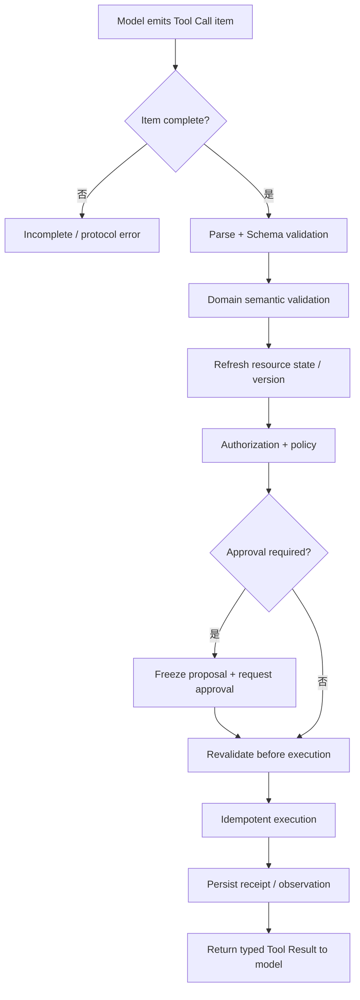

# 05 · Structured Outputs 与 Tool Calling

让模型返回合法 JSON，解决的是“应用能否解析”；让模型选择工具，解决的是“模型建议下一步调用什么”。两者都没有回答最关键的问题：这项动作是否符合当前业务状态、是否经过授权，以及失败后会不会产生重复副作用。

因此，Tool Call 应被建模为提案（Proposal），而不是命令（Command）。模型提出候选动作，Runtime 在确定性边界内逐层验证；只有通过全部检查后，动作才能交给 Executor。

## 本章目标

- 区分 JSON mode、Structured Outputs 与 Tool Calling。
- 理解 Tool Call 从增量事件到执行回执的完整生命周期。
- 建立结构、语义、状态、授权和输出位置安全（Sink Safety）的分层校验。
- 设计更容易被模型正确选择、也更容易被系统控制的工具。

## 1. 三种机制解决不同问题

| 机制                              | 主要保证                    | 不保证           |
| ------------------------------- | ----------------------- | ------------- |
| JSON mode                       | 输出可以解析为 JSON            | 字段符合预期、事实正确   |
| Structured Outputs              | 输出符合受支持的 JSON Schema 子集 | 业务合法、权限充分     |
| Tool Calling / Function Calling | 模型生成与工具定义关联的结构化调用       | 工具已经执行、动作已经获批 |

Structured Outputs 通常借助约束解码（Constrained Decoding）限制每一步可生成的 Token 集合，能够显著减少语法和结构错误。但现实世界的状态并不在解码器中：订单可能刚被另一个请求退款，用户权限也可能在生成期间被撤销。

## 2. Tool Call 的完整生命周期



模型不应持有数据库连接、支付密钥或宿主权限。Tool Definition 告诉模型有哪些候选能力；真正的执行能力（Capability）由 Executor、Credential Scope、Policy 和 Sandbox 共同决定。

## 3. 从模型 Item 转成领域 Proposal

Provider Adapter 收到完整 Tool Call 后，先转换为应用自己的对象：

```ts
type ToolProposal<TArguments> = {
  proposalId: string;
  runId: string;
  callId: string;
  toolName: string;
  schemaVersion: string;
  arguments: TArguments;
  createdAt: string;
};

type RefundArguments = {
  orderId: string;
  amountMinor: number;
  reason: string;
};
```

`actorId`、`tenantId`、Credential 和服务端已知的资源 Scope 不应由模型填写。它们来自已经完成身份验证的请求和 Runtime State，并在执行时由系统注入：

```ts
type ExecutionContext = {
  actorId: string;
  tenantId: string;
  scopes: string[];
  deadline: Date;
  signal: AbortSignal;
};
```

这能减少模型犯错的空间，也能阻止它通过参数自称管理员。

## 4. 七层校验

### 4.1 Protocol integrity

Tool Call Item 必须完整，`call_id` 可关联，并且 Run 当前允许产生新动作。断流后的残缺参数不能进入下一层。

### 4.2 Schema validation

检查字段类型、必填项、枚举、大小和额外字段。`strict` 主要加强这一层。

### 4.3 Domain semantics

确认实体存在、金额范围正确、参数组合有意义。例如退款金额不能大于可退余额。

### 4.4 State and concurrency

重新读取权威状态，检查 `expected_version`、前置状态以及相同 intent 是否已经执行。不能依赖模型 Context 中的旧快照。

### 4.5 Authorization and policy

根据 Actor、Tenant、Resource、Action、Purpose 和 Risk 在服务端进行判断。模型的解释可以作为输入特征，但不能直接成为授权决定。

### 4.6 Sink-specific safety

控制必须贴近最终解释器：

- SQL 使用参数化查询和限定表/租户；
- 进程调用使用固定的 Executable 和分离的 `argv`，不拼接 Shell Command；
- 文件操作限定根目录，并处理路径规范化、符号链接（Symlink）和 TOCTOU；
- HTTP 每次重定向都重新校验 Scheme、Host、IP 与 Egress；
- HTML、Markdown 或消息按最终输出上下文编码；
- 禁止对不可信输入执行危险反序列化。

不存在能够覆盖所有 Sink 的通用 `sanitize(input)`。

### 4.7 Execution reliability

写操作需要 Idempotency Key、Timeout、有限重试、Receipt、Audit 和必要的 Compensation。取消请求也必须与在途副作用一起处理。

## 5. 工具接口会影响模型的选择质量

工具不是越底层越好，也不是数量越多越强。好的 Tool definition 通常具备以下特点：

- 名称说明具体意图，例如 `get_order`，而不是 `manage_data`。
- 描述同时写明“何时使用”和“何时不要使用”。
- 输入只包含模型必须判断的字段。
- 非法组合由类型排除，例如 Enum 或 Tagged Union。
- 查询、预览和提交拆成不同工具。
- 高风险动作先返回 Preview 或 Diff，再进入 Approval 和 Commit。
- 同时暴露给模型的工具集与当前决策相关，避免大量近似能力相互干扰。

例如，不应暴露一个能查询、修改、退款和发消息的 `manage_customer`。更可控的设计是：

```text
search_orders       QUERY
get_order           QUERY
draft_refund        DRAFT
commit_refund       COMMAND + APPROVAL
send_refund_notice  COMMAND, depends on confirmed refund receipt
```

## 6. Tool Result 也是不可信观察

工具来自内部系统，并不意味着输出可以直接提升为指令。结果可能：

- 已过期或与随后状态冲突；
- 包含第三方写入的恶意文本；
- 过大，挤占下一轮 Context；
- 包含不应暴露给模型或 UI 的敏感字段；
- 只代表 transport 成功，不代表业务动作成功。

Runtime 应把输出转换为类型化观察结果（Typed Observation），保留来源、时间、资源版本和 Receipt，并只选择下一轮所需的字段。

```ts
type ToolObservation<T> = {
  callId: string;
  toolName: string;
  status: "succeeded" | "failed" | "in_doubt";
  observedAt: string;
  resourceVersion?: string;
  data?: T;
  error?: { code: string; retryable: boolean };
  receiptRef?: string;
};
```

## 7. 拒绝、不完整与无法回答是正常分支

请求 Structured Output 不代表每次都能得到合法对象。模型可能拒绝、达到输出上限、遇到安全限制或在流式过程中断开。应用应把这些情况建模为明确状态，而不是捕获异常后强行从残缺文本中提取 JSON。

缺少必要事实时，正确结果可能是 `needs_input` 或 `abstain`；权限不足时，正确结果是 `denied`。它们不是“模型没有完成任务”，而是可预期的业务分支。

## 实践：为退款 Tool Call 建立门禁矩阵

### 进入本章时已有能力

Resolution Desk 已能闭合模型 Item，并用 JSON Schema 验证 `RefundProposal`；它还不能把模型提出的工具参数直接当作业务命令。

### 本章增加的能力

为 `get_order`、`get_refund_policy` 和尚未接通 Executor 的 `commit_refund` Proposal 准备以下 Fixture：

1. JSON 缺少 `orderId`。
2. 金额超过可退余额。
3. 订单属于另一个 Tenant。
4. 读取后订单版本发生变化。
5. 同一调用并发出现两次。
6. 审批绑定 100 元，但执行参数变成 1000 元。
7. `reason` 结构合法，却被错误拼接到 Shell、SQL 或 HTML Sink 中。
8. 模型在最终文本中声称“退款已提交”，但当前系统只生成了 Proposal。

### 验收证据

为每个 Fixture 标注失败层、稳定错误码、Runtime 的下一状态、是否允许重试，以及需要保留的 Trace 字段。当前章节只证明候选动作能够被正确闭合、分类和拦截，不提交真实退款；[工具契约与错误模型](/masterpiece-static-docs/07-工具-协议与行动控制/01-工具契约与错误模型.md)将继续接入受控执行。验收标准不是“全部被拒绝”，而是每个问题都在最靠近责任边界的位置得到确定处理。

## 常见误区

- Structured Outputs 保证事实和业务语义正确。
- Function Calling 表示模型已经调用了本地函数。
- Tool Schema 中增加 `role` 字段即可完成授权。
- 内部 Tool Result 可以直接作为高优先级指令。
- 并行 Tool Call 只有性能影响，没有状态语义。

## 本章小结

Structured Outputs 把模型输出约束成可解析结构，Tool Calling 让模型能够提出下一项能力请求。真正的行动权仍属于 Runtime：完整性、Schema、业务语义、当前状态、授权、Sink Safety 和执行可靠性全部通过后，Proposal 才能成为 Command。下一章将在 [Agent Loop 与状态机](/masterpiece-static-docs/05-模型接口与Agent内核/06-Agent-Loop与状态机.md)中把提案、执行、观察和终止组织成完整运行过程。

## 延伸阅读

- [OpenAI: Structured Outputs](https://developers.openai.com/api/docs/guides/structured-outputs)
- [OpenAI: Function calling](https://developers.openai.com/api/docs/guides/function-calling)
- [JSON Schema Draft 2020-12](https://json-schema.org/draft/2020-12)
- [Grammar-Constrained Decoding](https://aclanthology.org/2023.emnlp-main.674/)
