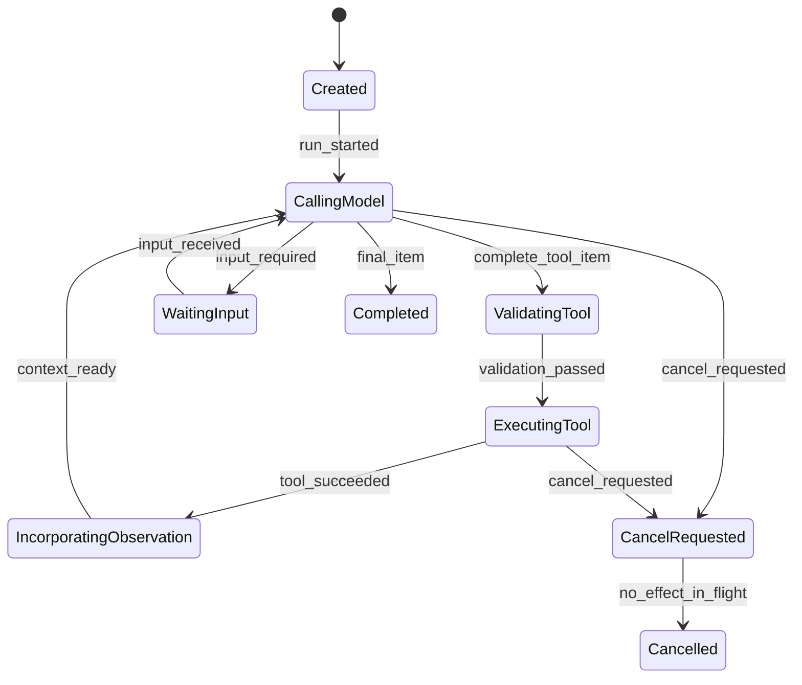
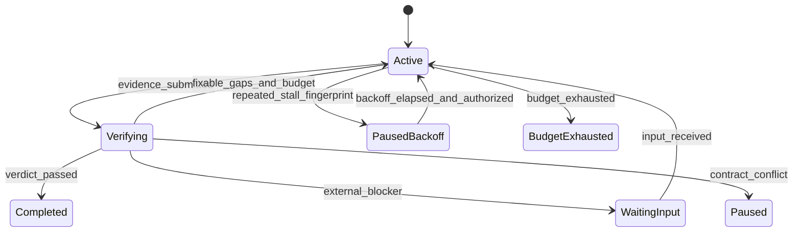
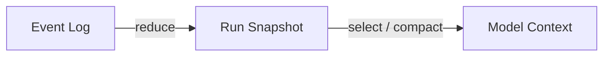

# 06 · Agent Loop 与状态机

Resolution Desk 判断退款资格时，会先读取订单，再查询当前有效政策，根据两次 Observation 决定补充证据、请求澄清或生成 Proposal。这段过程就是 Agent Loop：模型根据当前 Context 提出下一步，Runtime 验证并执行动作，新的 Observation 进入下一轮 Context。Claude Code 或 Codex 的“搜索文件—修改—运行测试”可以帮助理解同一反馈结构，但不是本章的实现案例。

Loop 本身并不复杂，难点在于“什么时候可以继续、什么时候必须停止、哪个状态才是事实”。只写一个 `while (true)` 可以完成 Demo，却无法可靠处理半截 Tool Call、预算耗尽、取消和重复事件。本章从最小只读循环开始，逐步把它收敛为显式状态机。

## 本章目标

- 理解 Proposal → Validation → Execution → Observation 的反馈回路。
- 区分 Agent Loop、Agent Harness 和跨 Run 的外层编排。
- 用 Event、State 与 Reducer 控制合法转移。
- 用目标契约（Goal Contract）、验收基线和证据约束“完成”的含义。
- 为步数、时间、Token、费用和并发建立预算。
- 正确区分模型完成、工具完成、Run 完成与业务结果通过。

## 1. 从一条熟悉的执行轨迹开始

假设客服打开一条信息完整的退款工单，Resolution Desk 的只读轨迹可能是：

```text
run.started
context.built
model.item_completed(tool_call: get_order)
tool.completed(observation: current order snapshot)
model.item_completed(tool_call: get_refund_policy)
tool.completed(observation: effective policy evidence)
model.item_completed(refund_proposal)
run.state_changed(state=completed)
outcome.graded(proposal facts and evidence: passed)
```

其中有四种容易混淆的完成状态：

| 状态                   | 含义                     | 不能推出         |
| -------------------- | ---------------------- | ------------ |
| Model Item completed | 一个模型语义 Item 已完整收齐      | Tool 已执行     |
| Tool completed       | Executor 收到工具回执        | 用户目标已完成      |
| Run completed        | Runtime 不会再创建新的规划或工具步骤 | 业务结果正确       |
| Outcome passed       | 独立证据确认成功               | 未来不会出现外部状态变化 |

订单字段、政策版本和 Proposal 引用可以由确定性 Grader 核对。模型在最终文本中声称“符合退款条件”，不能替代独立验收。

## 2. 最小可运行 Loop

第一个实现只接入 Mock 或只读工具，重点是看清控制流：

```ts
async function runAgent(input: RunInput, options: RunOptions) {
  let snapshot = createSnapshot(input);

  for (let step = 0; step < options.maxSteps; step += 1) {
    options.signal.throwIfAborted();
    assertBeforeDeadline(options.deadline);

    const context = await buildContext(snapshot);
    const item = await options.model.next(context, {
      signal: options.signal,
    });

    if (item.type === "final") {
      return completeRun(snapshot, item);
    }

    if (item.type !== "tool_call") {
      return failRun(snapshot, "UNSUPPORTED_MODEL_ITEM");
    }

    const proposal = validateCompleteToolItem(item);
    const observation = await executeReadOnlyTool(proposal, {
      signal: options.signal,
    });
    snapshot = reduceObservation(snapshot, observation);
  }

  return exhaustBudget(snapshot, "step");
}
```

这段代码已经具备 Agent 的基本反馈回路，但仍应限制在只读环境。审批、写操作、Multi-Agent 和持久工作流（Durable Workflow）会引入新的状态语义；过早叠加这些能力，会让基础错误难以归因。

## 3. Agent Loop、Harness 与 Outer Loop

三个层次经常都被简称为“Agent 系统”：

```text
Inner Agent Loop
  一次 Run 内反复执行：提案 → 验证 → 执行 → 观察

Agent Harness
  Context Builder + Loop + Tool Registry + Policy + Sandbox
  + State + Extension + Trace

Outer Orchestration Loop
  从任务队列或事件创建 Run，准备隔离环境，独立验收，
  必要时创建新 Attempt，并负责发布或人工门禁
```

同一 `run_id` 内的暂停与恢复属于 Runtime 或持久执行（Durable Execution）；外部任务重新领取后通常创建新的 `attempt_id`，必要时也创建新的 `run_id`。如果不区分两者，重试预算和副作用所有权会变得含糊。

## 4. 从一组最小状态开始

只读 Agent 可以使用较小的状态集合：

```ts
type RunState =
  | { kind: "created" }
  | { kind: "calling_model" }
  | { kind: "validating_tool"; callId: string }
  | { kind: "executing_tool"; callId: string }
  | { kind: "incorporating_observation"; callId: string }
  | { kind: "waiting_input"; missing: string[] }
  | { kind: "cancel_requested" }
  | { kind: "completed"; outputId: string }
  | { kind: "incomplete"; reason: string }
  | { kind: "failed"; error: AppError }
  | { kind: "cancelled" }
  | { kind: "budget_exhausted"; budget: BudgetKind };
```



状态数量不是质量指标。关键是每次转移都具有明确的 Event、Guard、Effect 和下一状态。

## 5. Reducer 持有状态转移权

模型只能产生 proposal；Reducer 和 Executor 才能改变权威状态。一个最小的内部状态转移事件（Runtime Transition Event）联合可以写成：

```ts
type RuntimeTransitionEvent =
  | { type: "run_started" }
  | { type: "model_tool_item_completed"; callId: string }
  | { type: "tool_validation_passed"; callId: string }
  | { type: "tool_succeeded"; callId: string; observationRef: string }
  | { type: "model_final_completed"; itemId: string }
  | { type: "model_incomplete"; reason: string }
  | { type: "input_required"; fields: string[] }
  | { type: "cancel_requested"; actorId: string }
  | { type: "budget_exhausted"; budget: BudgetKind };
```

`RuntimeTransitionEvent` 只服务于 Runtime Reducer，可以包含调度和故障处理细节。它不是客户端协议，也不直接写入公开事件流。后续 [Agent Application Server 与 UI 事件协议](/masterpiece-static-docs/05-模型接口与Agent内核/09-Agent-Application-Server与UI事件协议.md) 会将已提交的内部转移投影为稳定、脱敏的公开 `RunEvent`。

Reducer 至少守住以下不变量：

- 未闭合的 Tool Call 永远不能进入 Executor。
- 一个 `call_id` 的结果只归并一次；每次重试（Attempt）使用独立 ID。
- 终态不能再产生模型调用或新 Tool Call。
- 取消意图（Cancel Intent）先持久化，再向下游传播 `AbortSignal`。
- 状态更新使用 Expected Version、CAS 或事务，避免并发覆盖。
- 模型输出不能直接修改 Snapshot 或领域数据库。

Reducer 最好保持纯函数，Effect 由状态转移执行器（Transition Runner）在状态提交后执行。这样，相同的 Event 序列能够重放，状态机也更容易进行属性测试（Property Test）。

## 6. Goal Loop：从目标到可验证终止

前面的 `RunState` 回答“Runtime 正执行到哪里”，却没有回答“用户目标是否已经满足”。当任务需要多轮计划、执行和验证时，Harness 还要持有一层目标循环（Goal Loop）：

```text
freeze contract
→ plan
→ execute bounded work
→ submit evidence
→ verify
→ complete | return gaps | pause
```

模型可以建议下一步，但不能自行修改目标、降低验收标准或宣布业务完成。Goal Loop 不是另一段藏在 System Prompt 里的要求，而是由持久状态、权限和预算共同约束的 Runtime 协议。

### 6.1 用 Goal Contract 冻结任务边界

目标契约把一段自然语言请求转换成可追踪的执行边界：

```ts
type GoalBudget = {
  maxSteps: number;
  maxInputTokens: number;
  maxOutputTokens: number;
  maxToolCalls: number;
  maxConcurrency: number;
  maxCostUsd: number;
  deadline: string;
};

type GoalContract = {
  goalId: string;
  revision: number;
  objective: string;
  constraints: string[];
  acceptanceBaseline: {
    frozenAt: string;
    criteria: Array<{
      id: string;
      statement: string;
      requiredEvidence: string[];
    }>;
  };
  evidencePolicy: {
    authoritativeSources: string[];
    maxEvidenceAgeMs?: number;
  };
  budget: GoalBudget;
};
```

验收基线（Acceptance Baseline）在一个 Attempt 内不可变。Planner 可以调整达到目标的路径，却不能删除尚未满足的 Criterion；Verifier 也只能报告缺口，不能为了让结果通过而降低标准。若用户改变目标，应创建新的 `revision`，明确哪些旧证据仍可复用，而不是静默改写基线。

在 Resolution Desk 中，目标不能只写成“判断是否退款”。一份可验证的基线还应要求：订单快照带版本、政策条款在目标时间点有效、Proposal 中的每个事实可追溯，并且缺失证据时不得生成确定性结论。

### 6.2 Evidence Packet 把完成声明变成可检查材料

Worker 完成一次有界工作后，不提交“我已经处理好了”，而是提交证据包（Evidence Packet）：

```ts
type EvidencePacket = {
  goalId: string;
  baselineRevision: number;
  criterionResults: Array<{
    criterionId: string;
    claim: string;
    artifactRefs: string[];
    receiptRefs: string[];
    observedVersions: Record<string, string>;
    limitations: string[];
  }>;
  producedBy: string;
  producedAt: string;
};
```

独立验证器（Independent Verifier）读取冻结基线、Evidence Packet 和必要的权威只读快照，输出结构化 Verdict：

```ts
type VerificationVerdict =
  | { kind: "passed"; criterionIds: string[] }
  | { kind: "gaps"; gaps: VerificationGap[] }
  | { kind: "blocked"; blockers: VerificationGap[] }
  | { kind: "unverifiable"; reason: string };

type VerificationGap = {
  criterionId: string;
  code: string;
  expected: string;
  observed?: string;
  missingEvidence: string[];
  fixability:
    | "model_fixable"
    | "external_blocker"
    | "contract_conflict"
    | "unverifiable";
};
```

“独立”首先是状态与权限边界，而不一定意味着必须使用不同模型。Verifier 不参与生成被审材料，不调用有副作用的工具，也不能修改 Artifact、计划或验收基线。有客观规则时优先使用确定性校验；只有语义质量无法完全形式化时，才增加受限的模型 Verifier 或人工复核。

### 6.3 Gap Feedback 只能指导下一轮，不能接管状态

Verifier 返回的 Gap Feedback 是输入数据，不是状态转移命令。Harness 根据 `fixability`、剩余预算和当前权限决定后续动作：

| Gap 类型              | Harness 动作           |
| ------------------- | -------------------- |
| `model_fixable`     | 把缺口和证据要求交给下一次有界执行    |
| `external_blocker`  | 等待外部输入、回执或人工处理       |
| `contract_conflict` | 暂停并请求澄清，不能自行选择较容易的标准 |
| `unverifiable`      | 保留未知状态，不得标记为通过       |

反馈应定位到 Criterion、观察值和缺失证据，避免使用“再认真检查一下”之类无法判断是否收敛的文字。下一轮可以改变计划，但必须继续面对同一份 Acceptance Baseline。本书把它称为防降标约束（Anti-ratchet）：循环不能靠逐轮降低目标来制造完成。

### 6.4 Stall、预算与恢复共同决定是否继续

至少需要五类预算：

```text
step count
wall-clock deadline
input/output token
money/cost
tool calls and concurrency
```

子预算只能从父预算中划拨；Context Compaction、进程重启和重新规划都不能把累计用量清零。预算检查发生在创建下一项工作之前。已经在途的只读请求可以等待安全结束或取消，新的模型调用和 Tool Call 必须停止。

只限制轮数还不够。Harness 应把 `criterion_id + gap_code + missing_evidence + relevant_state_version` 规范化后计算停滞指纹（Stall Fingerprint）。若连续几轮收到相同指纹，同时没有新增 Artifact、Observation 或状态版本，就说明循环没有取得信息增益。此时可以先退避、请求 Strategist 只提供替代路径；达到阈值后必须暂停或升级人工，不能继续消耗预算。



预算耗尽不应统一映射为失败。若已有可靠的中间 Artifact，可以返回 `partial`；若外部 Command 的效果未知，则必须进入对账（Reconciliation），不能用 `budget_exhausted` 掩盖真实状态。

恢复也遵循同一原则。加载 Checkpoint 不等于立刻执行其中的 `active` Run：兼容 Worker 必须先取得 Fencing 所有权，校验 Schema 与行为版本，恢复预算高水位，并复核权限和在途效果。全部检查通过后，已知的 `active` 状态可以按既定恢复策略从持久游标继续；任一检查失败，或遇到未知枚举值、缺少版本的 Snapshot、无法确认的在途 Tool Call，都应进入 `paused_recovery`。这种 Fail-closed 恢复既允许兼容 Worker 接管，也能防止旧进程留下的任务在新进程中变成“僵尸自治”。

## 7. Event Log、Snapshot 与 Context 是三种数据



- **Event Log** 记录已经发生的不可变事实。
- **Snapshot** 表示当前权威运行状态，可由 Event 归并或定期持久化。
- **Context** 是某一轮模型调用的有限输入投影。

一个 messages 数组不能稳定承担三者。删除历史会破坏审计和恢复，无限追加则会污染 Context。面向 UI 时还要从应用 Event 派生一个脱敏的 Public Snapshot，详见[Agent Application Server 与 UI 事件协议](/masterpiece-static-docs/05-模型接口与Agent内核/09-Agent-Application-Server与UI事件协议.md)。

## 8. 写操作为什么需要更多状态

考虑一次退款：Runtime 已向支付服务提交 Command，但响应在网络中丢失。随后用户请求取消。

```text
proposal_frozen(hash=..., resource_version=41)
approval_granted(actor=user_7, expires_at=18:47)
command_sent(idempotency_key=refund:order_123:v41)
transport_timeout(effect=unknown)
cancel_requested
receipt_lookup(started)
effect_present(refund_id=rf_8891)
completed_with_effect_after_cancel
```

`timeout` 只能证明本地没有及时收到结果，不能证明退款没有发生；`cancel` 也不能撤销已经提交的副作用。因此写操作需要增加：

- `waiting_approval`：等待绑定具体提案的人工决定；
- `in_doubt`：command 可能已经产生效果，但证据不足；
- `reconciling`：正在查询回执或权威状态；
- `completed_with_effect_after_cancel`：用户请求取消，但效果已经确认；
- `manual_intervention`：在 deadline 内无法自动收敛。

这些状态不是为了展示架构复杂度，而是避免把“不知道”伪装成“失败”或“已取消”。

## 9. 一组代表性的写操作转移

| 当前状态              | Event                | Guard               | Effect               | 下一状态                                   |
| ----------------- | -------------------- | ------------------- | -------------------- | -------------------------------------- |
| calling\_model    | complete\_tool\_item | Item 完整             | 持久化 proposal         | validating\_tool                       |
| validating\_tool  | approval\_required   | proposal 已冻结        | 保存 hash、资源版本和 expiry | waiting\_approval                      |
| waiting\_approval | approved             | actor、hash、版本和有效期匹配 | 发送 command           | executing\_tool                        |
| executing\_tool   | receipt\_success     | receipt 与 intent 匹配 | 保存真实效果               | incorporating\_observation             |
| executing\_tool   | timeout\_unknown     | command 可能已提交       | 禁止更换 key 盲重试         | in\_doubt                              |
| in\_doubt         | reconcile\_started   | 有稳定查询键              | 查询 receipt/权威状态      | reconciling                            |
| reconciling       | effect\_present      | 存在 cancel intent    | 记录已发生效果              | completed\_with\_effect\_after\_cancel |
| reconciling       | deadline\_exceeded   | 仍无法确认效果             | 创建 incident          | manual\_intervention                   |

故障分类、重试和取消的完整语义见[失败、超时、重试与取消](/masterpiece-static-docs/09-可靠性与可观测/01-失败分类-超时-重试与取消.md)；跨进程恢复和 exactly-once 边界见[持久执行](/masterpiece-static-docs/09-可靠性与可观测/03-持久执行-Checkpoint与Exactly-Once.md)。

## 10. Trace 要记录决策边界

为了定位失败来自模型、Context、策略、工具还是 Runtime，Trace 至少包含：

```text
run_id / attempt_id / trace_id
context manifest and versions
model item lifecycle and usage
tool proposal and validation decision
policy / approval decision
tool attempt and receipt
state transition
final output and independent outcome
```

Trace 不应保存原始 Chain-of-Thought。可以记录 Decision Summary、动作、证据、结果和状态转移，同时对用户数据、密钥和工具结果执行最小化采集。

## 实践：完成 Resolution Desk 的有界只读 Loop

### 进入本章时已有能力

模型流可以重建完整 Item，Tool Proposal 已经过结构与门禁分类，但调用仍是彼此独立的步骤。

### 本章增加的能力

实现围绕同一售后工单运行的只读 Runtime：

1. 接入 3～5 个 Mock 或 Query Tool。
2. 支持完整 Item 校验、最大步数、Deadline、Cancel 和 Trace。
3. 注入错误 Schema、Tool timeout、重复 Event 和预算耗尽。
4. 证明半截 Tool Call 不执行、终态不继续行动。
5. 为每组 Fixture 冻结 Goal Contract，并由只读 Verifier 检查 Evidence Packet。
6. 注入重复 Gap、未知恢复状态和缺失预算高水位，验证 Runtime 会退避或暂停。

Runtime 可以生成并冻结 `RefundProposal`，随后进入 `waiting_approval`，但当前章节不提供 `commit_refund` Executor。完成[身份、授权与审批](/masterpiece-static-docs/07-工具-协议与行动控制/02-身份-授权与审批.md)和[幂等、补偿与沙箱](/masterpiece-static-docs/07-工具-协议与行动控制/04-幂等-补偿与沙箱.md)后，系统最多推进到 `command_ready`；只有完成[Agent 安全评测与 Red Team](/masterpiece-static-docs/08-安全与治理/07-Agent安全评测与Red-Team.md)并通过相应安全检查后，常规业务 Run 才能调用 Mock Executor。

### 验收证据

用信息完整、信息不足、政策冲突、Tool Timeout、重复 Event、预算耗尽和用户取消七组 Fixture 回放状态机。半截 Tool Call 不执行，终态不继续行动，等待审批不会被标记为业务完成；只有 Evidence Packet 满足冻结基线时 Goal 才能完成。相同 Gap 连续出现且没有新增证据时进入退避，恢复出未知状态时默认暂停；每个失败都能从 Trace 定位到 Model、Validation、Tool、Verifier 或 Runtime。

## 常见误区

- Agent Loop 只是不断询问模型“下一步是什么”。
- 文本停止流式输出即可把 Run 标记为 completed。
- 聊天历史可以同时作为 Event Log、Snapshot 和 Context。
- 第一个只读 Loop 必须先引入 durable workflow。
- 用户点击取消后可以立即写入 cancelled。
- Planner 或 Verifier 可以在执行中放宽 Acceptance Baseline。
- 模型给出完成文本，就可以跳过 Evidence Packet 和独立验收。
- 进程恢复后应自动继续所有曾经处于 active 的 Goal。

## 本章小结

Agent Loop 是一个受状态机控制的反馈系统：模型提出动作，Runtime 校验并执行，Typed Observation 再进入下一轮 Context。预算、终止、取消和副作用归属都由确定性系统持有。下一章将把视角扩大到整个 [Agent Harness、架构模式与 Multi-Agent 边界](/masterpiece-static-docs/05-模型接口与Agent内核/07-架构模式与多Agent边界.md)，说明 Resolution Desk 如何组合 Context、工具、策略、状态和扩展点。

## 延伸阅读

- [OpenAI: Function calling flow](https://developers.openai.com/api/docs/guides/function-calling)
- [OpenAI: Unrolling the Codex agent loop](https://openai.com/index/unrolling-the-codex-agent-loop/)
- [Codex App Server](https://learn.chatgpt.com/docs/app-server)
- [Claude Code Hooks reference](https://code.claude.com/docs/en/hooks)
- [ReAct](https://arxiv.org/abs/2210.03629)
- [Anthropic: Building effective agents](https://www.anthropic.com/engineering/building-effective-agents)
- [AWS: Making retries safe with idempotent APIs](https://aws.amazon.com/builders-library/making-retries-safe-with-idempotent-APIs/)
