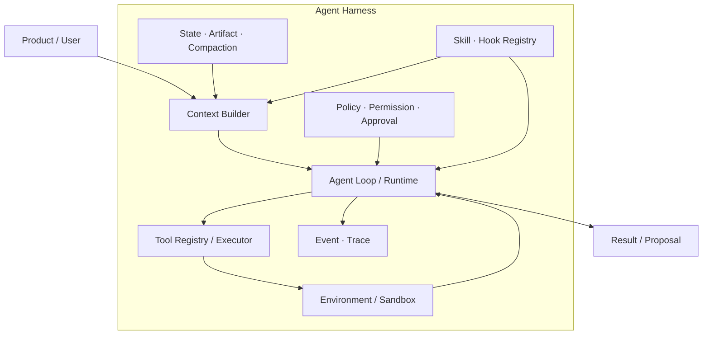
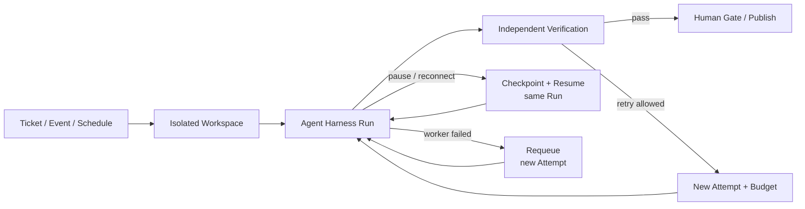

# 07 · Harness Engineering、架构模式与 Multi-Agent 边界

Resolution Desk 的模型并不知道订单从哪里读取、哪份政策正在生效，也不能自行获得退款权限。真正把模型变成可工作的 Agent 的，是围绕它建立的 Agent Harness：Context Builder、Loop、工具、策略、状态、沙箱、扩展和 Trace。Claude Code 或 Codex 的规则文件、工具、权限与测试反馈可以作为理解 Harness 的类比，但不替代业务应用自己的领域边界。

理解 Harness 后，许多流行概念会回到清晰的工程位置。Skill 是按需加载的程序性知识，Hook 是生命周期扩展点，Workflow 与 Agent 的差异在控制权，Multi-Agent 的价值来自可测的隔离或并行收益，而不是角色数量。

## 本章目标

- 识别 Agent Harness 与 Evaluation Harness 的职责边界。
- 理解 Skill、Hook、Subagent 和 Workflow 如何组合。
- 比较常见 Agent 架构模式的控制权、成本和失败方式。
- 区分 Inner Agent Loop、持久恢复（Durable Resume）与 Outer Orchestration Loop。
- 用 Baseline 和 Eval 决定是否引入 Multi-Agent。

## 1. Agent Harness 包含什么



Harness 的每个组件都补偿一种已知限制：

- 模型无法直接读取环境，因此提供 Tools。
- 较长的 Context 会被噪声污染，因此提供选择（Selection）、外置（Externalization）和压缩（Compaction）能力。
- 模型可能提出越权动作，因此必须在外部副作用发生前执行 Policy 与 Approval。
- 模型自评不可靠，因此使用独立 Grader 和 Evaluation Harness。
- 长任务会跨越连接和进程，因此需要持久化 Event、Snapshot 和 Checkpoint。

Harness Engineering 的任务不是持续增加组件，而是明确每个组件解决什么问题、如何测量收益，以及何时可以删除或替换。

## 2. Agent Harness 与 Evaluation Harness

两者都可能使用 Tools、Fixtures 和 Traces，却不属于同一系统：

| 对象                 | 主要职责                | 典型内容                                       |
| ------------------ | ------------------- | ------------------------------------------ |
| Agent Harness      | 让模型在生产环境中受控行动       | Context、Loop、Tools、Policy、State、Sandbox    |
| Evaluation Harness | 准备任务、运行 Trial、评分和聚合 | Dataset、Fixture、Trial Config、Grader、Report |

Evaluation Harness 可以向被测系统注入 Mock Provider、由 Fixture 支持的 Tool 和 Fake Clock，但这些测试设施不能代替生产 Agent 完成关键判断。两者可以共享规范的 Trace Schema，却不能共享未明确区分所有权的状态。

## 3. Skill 是按需加载的程序性知识

Skill 通常包含任务说明、参考资料、模板和脚本。它的价值不是“多一个 Prompt 文件”，而是渐进式披露（Progressive Disclosure）：先发现元数据，只有任务确实需要时才加载正文和资源。

```text
discover metadata
→ filter by workspace / tenant / trust
→ select for current task
→ authorize declared capabilities
→ load within Context budget
→ read referenced resource on demand
→ pin version and digest for this Run
```

一个厂商无关的扩展描述可以包含：

```ts
type SkillDescriptor = {
  id: string;
  version: string;
  description: string;
  source: {
    uri: string;
    digest: `sha256:${string}`;
    trust: "first_party" | "reviewed_third_party" | "untrusted";
  };
  context: {
    maxTokens: number;
    allowedReferences: string[];
  };
  capabilities: {
    tools: string[];
    dataScopes: string[];
    network: "none" | "allowlisted";
  };
  evalSuite: string;
};
```

Skill 声明的是能力上限，不是授权结果：

```text
effective capability
  = skill declaration
  ∩ actor permission
  ∩ tenant/workspace policy
  ∩ run allowlist
```

Skill 正文和引用内容仍属于 Context 输入，应保留来源与信任标签。Run 固定某个 Version 和 Digest 后，即使文件内容发生变化也不能静默热切换；系统应继续使用固定副本，或者创建新的 Attempt 并记录版本变化。

## 4. Hook 必须区分阻断与观察

Hook 是生命周期扩展点，不是任意回调。最重要的区分是：

- **Blocking Hook** 位于外部副作用之前，Runtime 等待其结构化决定。
- **Observation Hook** 消费已经持久化的事件，用于 Trace、指标或通知，无权改写业务结果。

```ts
type BeforeToolExecute = {
  type: "before_tool_execute";
  runId: string;
  actorRef: string;
  tool: string;
  proposalHash: string;
  argumentsRef: string;
  resourceVersion?: string;
  approvalRef?: string;
};

type BlockingDecision =
  | { decision: "allow"; policyVersion: string }
  | { decision: "deny"; code: string; publicReason: string }
  | { decision: "require_approval"; policyVersion: string };
```

Hook 不应原地改写已经审批的参数。参数若需规范化，应产生新的 Proposal，并重新进行 Schema、策略和审批校验。

| Hook                      | 是否阻断 | 超时策略               | 典型用途            |
| ------------------------- | ---: | ------------------ | --------------- |
| `before_tool_execute`     |    是 | 高风险写操作 Fail Closed | 授权、审批、风险策略      |
| `before_external_publish` |    是 | 敏感发布 Fail Closed   | 数据外发与内容策略       |
| `tool_completed`          |    否 | 异步有限重试             | Audit、Metric、通知 |
| `run_completed`           |    否 | 不回滚已完成 Run         | 触发 Eval、生成报表    |
| `context_compacted`       |    否 | 告警但不阻塞             | Token 与来源完整性观测  |

多个 Blocking Hook 的顺序和合并规则必须版本化。常见安全优先级是 `deny > require_approval > allow`。Observation Hook 应通过 Outbox 消费事件，避免观测平台故障阻塞业务主链路。

## 5. 从 Context Engineering 到 Harness Engineering

这两个概念关注不同层次：

```text
Context Engineering
  决定本轮模型看见哪些信息、工具说明和状态投影

Harness Engineering
  决定模型如何被调用、工具如何执行、状态如何持久化、
  策略怎样强制、扩展如何加载、结果如何验证
```

Context 是 Harness 的一个核心组件。只优化 Context 可以提高模型判断，却不能解决副作用幂等、工作区隔离和断线恢复；只堆 Harness 组件而不管理 Context，也会让模型被过期状态和无关工具淹没。

## 6. 复杂度应按问题逐层增加

```text
deterministic code
→ single model call
→ model + retrieval
→ fixed workflow
→ bounded single agent
→ multi-agent
```

这不是成熟度等级，而是成本递增的控制结构。确定性代码能够稳定解决的分类、过滤和事务，不需要改造成 Agent；下一步依赖观察、路径难以预先枚举时，单 Agent Loop 才有价值。

## 7. 常见架构模式

| 模式                   | 流程控制者                   | 适用场景                | 主要风险               |
| -------------------- | ----------------------- | ------------------- | ------------------ |
| Prompt Chaining      | 代码                      | 固定阶段，每步可验证          | 错误级联、额外延迟          |
| Router               | 代码 + Classifier / Model | 类别清楚、后续策略不同         | 误路由、类别漂移           |
| Parallelization      | 代码                      | 独立子任务或多样采样          | 成本、汇合、共享状态         |
| ReAct                | 模型逐步选择                  | 下一步依赖新的 Observation | 循环、局部贪心、Context 膨胀 |
| Plan-and-Execute     | 模型计划 + Runtime 执行       | 可分解的长任务             | 计划陈旧、误把计划当授权       |
| Evaluator-Optimizer  | Generator + Evaluator   | 存在明确改进标准            | Grader Gaming、无限迭代 |
| Orchestrator-Workers | Orchestrator 动态拆分       | 子任务数量未知且可并行         | 重复、协调和验证困难         |
| Handoff              | 新 Agent 接管责任            | 上下文或权限需要完整转移        | 责任边界与恢复复杂          |
| Agent-as-Tool        | 父 Agent 保留责任            | 专家只需返回有限结果          | 父 Context 和验证负担    |

Router 通常仍是 Workflow，因为路由后的分支由代码限定。多次调用模型也不等于 Multi-Agent；关键在于是否存在独立状态、职责、权限和生命周期。

### 反思不是一种单独的架构

Self-Critique、Self-Refine 与 Reflexion 经常被统称为“反思”，但它们位于不同的反馈范围：

- **Self-Critique** 让模型检查当前候选，产出批评或缺陷列表；
- **Self-Refine** 在同一次有界任务中依据反馈改写候选；
- **Reflexion** 把任务反馈整理成可供后续尝试读取的文字经验，需要明确 Memory Scope、写入质量和失效规则。

这三种模式都没有天然的正确性保证。Evaluator 若与 Generator 共享同一盲点，循环只会更自信地重复错误；反馈若未经验证写入长期 Memory，错误还会跨任务传播。当前 Run 内的改写属于 Agent Loop，跨 Run 的经验属于 Memory，而修改后续生产版本则必须进入[受控改进与独立发布门禁](/masterpiece-static-docs/09-可靠性与可观测/07-受控改进-从生产证据到候选Behavior-Bundle.md)。

## 8. ReAct 与 Plan 的工程化表达

ReAct 的 Reason → Act → Observe 在产品中应落为：

```text
Decision Summary
→ proposed action
→ validated execution
→ typed observation
```

不需要把原始 Chain-of-Thought 作为协议或审计数据。可观测对象是计划摘要、动作、参数、证据、结果和状态转移。

Plan 也不是一段一次性生成的文本。可执行计划至少包含：

```text
step_id, goal, dependencies, status,
completion_criteria, evidence_refs
```

新证据、权限变化、预算变化、工具失败或用户调整目标，都可能触发重新规划（Replanning）。Plan 描述意图，不能替代 Tool Gate 和 Approval。

## 9. Inner Loop、Durable Runtime 与 Loop Engineering

实践社区使用 “Loop Engineering” 描述更外层的自动工作闭环：系统从任务源发现工作，创建隔离环境，启动 Agent，独立验证，并在失败时创建下一次尝试。这个术语还不是边界统一的正式规范；更精确的名称是 Outer Orchestration Loop。



同一 Run 的 Checkpoint / Resume 属于 Durable Runtime；验收失败后创建新 Attempt 属于 Outer Orchestration。两者必须分别设置预算、终止和幂等策略。

## 10. Multi-Agent 的准入条件

Multi-Agent 可能有价值的情况：

- 子问题确实可以独立并行；
- 必须隔离上下文、工具、数据或权限；
- 单个 Context 无法容纳探索过程；
- 专家 Agent 在固定评测集上存在可测能力差异。

通常不值得引入的情况：

- 只是给同一模型增加多个角色名；
- 所有参与者需要共享完整状态；
- 没有父级验证器，也没有明确的结果所有权；
- 单 Agent 或固定 Workflow 尚未建立 Baseline；
- Token、延迟和故障放大不符合预算。

Multi-Agent 会增加通信损耗、上下文重述、权限传播、终止检测和失败归因成本。复杂度必须由 Eval 购买。

## 11. 委派不能只传一段自然语言

Agent 之间的委派信封（Delegation Envelope）至少包含：

```text
schema version
sender workload identity + original actor/delegation chain
parent_run_id + task_id + attempt_id + idempotency_key
goal + constraints + success criteria
allowed tools/scopes + data classification
deadline + cancel correlation
input refs + provenance + trust labels
expected result schema + result ownership
trace context + sequence/version
```

接收方必须重新验证身份和衰减后的权限。协调器还要处理重复、迟到、乱序、循环委派和取消传播；迟到结果不能覆盖已经关闭或更新版本的任务。

这份 Envelope 是应用内部的最低语义要求。当协作对象是跨团队、跨进程或跨供应商的独立 Agent 系统时，可以在这些不变量稳定后评估 [A2A 跨 Agent 协作协议](/masterpiece-static-docs/07-工具-协议与行动控制/05-A2A与跨Agent协作协议.md)；A2A 提供互操作层的 Wire Contract，但不会自动补齐权限衰减、预算、结果验收和循环检测。

## 实践：为 Resolution Desk 组装最小 Harness

### 进入本章时已有能力

Resolution Desk 已有 Provider Adapter、Tool Gate 和有界只读 Loop，但这些组件尚未作为一套可独立评测的运行环境组织起来。

### 本章增加的能力

为当前系统建立 Harness Component Map：

| 组件                   | 它补偿的风险         | 收益指标           | 成本        | 删除条件          |
| -------------------- | -------------- | -------------- | --------- | ------------- |
| Context Builder      | 全量历史污染判断       | 成功率、Token、证据覆盖 | 选择错误、实现复杂 | 简化后无退化        |
| Tool Gate            | 模型提出越界参数       | 策略违规率          | 额外延迟      | 安全边界不可删除，只能下沉 |
| Independent Reviewer | Generator 自评偏宽 | 缺陷召回率          | Token 与延迟 | 单 Agent 已稳定覆盖 |

然后完成三组实验：

1. Skill 超出 Context Budget 或 Digest 变化时，Harness 拒绝静默加载。
2. Blocking Hook 发生 Timeout 时，高风险 Command 不得进入 Executor；Observation Hook 发生 Timeout 时，不回滚已经产生的业务结果。
3. 对同一批退款工单比较固定 Workflow、单 Agent 和本地 Reviewer；本章不引入跨系统 Agent，风险复核的 A2A 路径留到 [A2A 与跨 Agent 协作协议](/masterpiece-static-docs/07-工具-协议与行动控制/05-A2A与跨Agent协作协议.md)。

### 验收证据

保存三组消融测试结果：Skill 超预算被拒绝、阻断型 Hook 失败时退款 Proposal 不进入后续执行路径、观察型 Hook 失败时既有结果不被回滚。固定 Workflow 与单 Agent 使用同一 Dataset 和预算；没有可测收益的 Reviewer 不进入默认路径。

## 常见误区

- 使用 Tool 就等于拥有完整 Agent Harness。
- Skill 声明某个工具后自动获得该工具权限。
- 所有 Hook 都是安全强制控制点（Enforcement Point）。
- 多次调用模型自然构成 Multi-Agent。
- 完整 Plan 一旦生成就不需要修改。
- Multi-Agent 天然比单 Agent 更全面。

## 本章小结

Harness Engineering 把 Context、Loop、Tool、Policy、State、Sandbox、Extension 和 Trace 组织为可测试系统。Workflow、单 Agent、Outer Loop 与 Multi-Agent 解决的是不同控制问题，不是从旧到新的技术代际。下一章将据此评估[框架与 SDK 的学习优先级](/masterpiece-static-docs/05-模型接口与Agent内核/08-框架与SDK学习优先级.md)：先理解抽象替代了哪些 Harness 组件，再决定是否采用。

## 延伸阅读

- [Anthropic: Building effective agents](https://www.anthropic.com/engineering/building-effective-agents)
- [Anthropic: Demystifying evals for AI agents](https://www.anthropic.com/engineering/demystifying-evals-for-ai-agents)
- [Anthropic: Harness design for long-running application development](https://www.anthropic.com/engineering/harness-design-long-running-apps)
- [OpenAI: Unlocking the Codex harness](https://openai.com/index/unlocking-the-codex-harness/)
- [OpenAI: Harness engineering](https://openai.com/index/harness-engineering/)
- [OpenAI: Symphony orchestration](https://openai.com/index/open-source-codex-orchestration-symphony/)
- [Claude Code Skills](https://code.claude.com/docs/en/skills)
- [Claude Code Hooks](https://code.claude.com/docs/en/hooks)
- [Claude Code Subagents](https://code.claude.com/docs/en/sub-agents)
- [Codex Customization and Subagents](https://learn.chatgpt.com/docs/customization/overview)
- [Addy Osmani: Loop Engineering](https://addyosmani.com/blog/loop-engineering/)
- [ReAct](https://arxiv.org/abs/2210.03629)
- [MAST: Why Do Multi-Agent LLM Systems Fail?](https://arxiv.org/abs/2503.13657)
