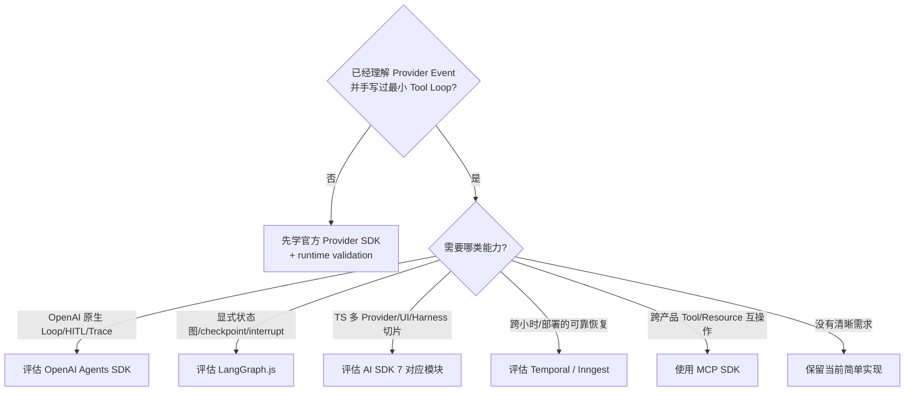

# 08 · 如何学习和选择 Agent SDK

Agent 生态中最容易浪费时间的方式，是把框架名称当成能力清单：学完一个 SDK，再追下一个 SDK，却仍然无法回答状态存在哪里、恢复时哪些代码会重跑、Tool Call 在哪里获得授权。

前几章已经手写了模型 adapter、Tool Gate 和 Agent Loop，因此现在可以从工程职责评估框架。SDK 的价值不是让示例代码更短，而是以可接受的抽象成本接管一部分 Harness 工作，同时保留领域状态、授权和副作用边界。

> 版本与状态核验基准：2026-07-15。本章涉及 AI SDK 7、preview/experimental 状态和框架能力的结论均基于文末官方资料；实施时必须重新核对目标版本。框架版本变化不应进入领域契约。

## 本章目标

- 区分 Provider SDK、Agent Runtime、UI Runtime、durable workflow 与互操作协议。
- 按学习依赖选择框架，而不是同时横向铺开。
- 用同一任务、Trace 和故障 fixture 比较手写 Runtime 与候选框架。
- 识别 SDK 接管的职责与应用仍需持有的职责。

## 1. 先把技术放回所属层

```text
Model API        official provider SDK
Agent Runtime    OpenAI Agents SDK / LangGraph / Mastra / AI SDK Core
UI Runtime       AI SDK UI / assistant-ui / CopilotKit / AG-UI adapter
Durable Runtime  Temporal / Inngest / workflow SDK
Integration      MCP SDK / provider tools / connectors
Observability    OpenTelemetry + one eval/trace product
```

这些组件不是同一类竞品。例如 MCP 解决 Host 与 Server 的能力发现和调用，并不提供 Agent Loop；Temporal 让 Workflow 跨故障恢复，并不替模型选择 Context；UI SDK 管理流式交互，也不应成为订单状态的 source of truth。

## 2. 第一站：Provider 官方 TypeScript SDK

学习原始模型协议的最短路径，是只选择一个主要 Provider 的官方 TypeScript SDK，完整实现一次请求、流式响应和 Tool Calling。

需要掌握：

- request、response、item 与 Tool Call 的真实对象模型；
- streaming event、完成、拒绝、截断和 usage；
- stateful 与 stateless conversation 的差异；
- timeout、rate limit、retry 和 error type；
- Structured Outputs 与 Provider 支持的 Schema subset。

不需要背诵全部模型参数和便利 API。Provider 类型只停留在 adapter 层，转换成应用自己的 `RunEvent`、`ToolProposal` 和 `AppError`。

官方 SDK 是协议客户端，不等于 Agents SDK。前者帮助理解模型 API，后者开始接管 Loop、Tool、Session、HITL 和 Trace 等 Harness 职责。

## 3. 第二站：用手写 Runtime 建立比较基线

在引入高层框架之前，至少保留一个可测试的最小实现：

```text
Context Builder
→ Provider Adapter
→ complete Tool Item validation
→ Tool Registry / Executor
→ typed Observation
→ budgets / cancellation
→ Event / Trace
```

这个实现不追求生产功能完备，它的作用是建立认知和测试基线。没有它，框架替应用处理了什么、隐藏了什么都无法判断。

## 4. OpenAI Agents SDK for TypeScript

当主要 Provider 是 OpenAI，并且需要减少 Agent Loop、tools、session/HITL、guardrail 和 tracing 的样板代码时，OpenAI Agents SDK 值得用同一任务做一次对照实现。

重点检查：

- Tool 调用在什么位置被校验和执行；
- session 保存哪些内容，哪些领域状态仍需外部存储；
- pause/resume 与 approval 如何关联具体 proposal；
- streaming、cancel 和 error 如何映射为 canonical event；
- trace 能否导出并接入既有 Eval。

Guardrail 不是业务授权系统。官方文档区分不同 guardrail 的适用路径，function tool、handoff 和 hosted/built-in tool 不能假定天然共享同一门禁。资源服务仍须在每次产生外部副作用前重新授权。

## 5. LangGraph.js

LangGraph 的价值出现在显式状态图、checkpoint、interrupt/resume、human-in-the-loop 或 subgraph 成为真实需求之后。短时、少量只读工具的 Loop 通常不需要先引入图运行时。

值得系统学习：

- StateGraph 或 Functional API 选择一种主写法；
- state、node、edge、conditional edge 和 reducer；
- checkpointer、thread、interrupt 与 resume；
- node 重跑、副作用幂等和状态 Schema 演进；
- cancellation、concurrency 与 subgraph 边界。

Checkpoint 解决图状态恢复，不会让外部副作用自动 exactly-once。恢复时 node 可能重跑，command 必须放在有幂等和回执语义的执行边界中。

## 6. AI SDK 7：按切片采用

截至核验基准，AI SDK 7 已覆盖多步 Agent、类型化 runtime/tool context、工具审批、timeout、telemetry、UI transport，以及 `WorkflowAgent` 和 `HarnessAgent` 等能力。它不再只是 React 流式 UI 封装，但也不应作为需要一次性全部采用的平台。

适合按真实需求选择切片：

| 需求                                 | 可评估的切片                   | 应用仍负责                        |
| ---------------------------------- | ------------------------ | ---------------------------- |
| 多 Provider 与有界 Tool Loop           | Core + `ToolLoopAgent`   | 领域 State/Event、Policy、Eval   |
| 将 Claude Code/Codex 等 Harness 接入产品 | `HarnessAgent` + adapter | 工作区授权、隔离、审计、结果验收             |
| 工具审批 UI                            | approval API             | proposal hash、actor、资源版本、有效期 |
| 跨进程长任务                             | `WorkflowAgent`          | 外部副作用的幂等性、流程版本、故障矩阵          |
| React/Next.js Agent UI             | UI message / transport   | Canonical RunEvent、重连和业务事实   |

在核验基准中，AI SDK 7 要求 Node.js 22 与 ESM；官方仍将 `HarnessAgent` 及相关 harness packages 标记为 experimental，并明确提示可能出现 breaking changes。任何采用决定都必须基于当前官方文档和故障实验，不能把版本状态写死进领域层。

## 7. MCP SDK 不是 Agent 框架

需要让应用通过标准协议发现 Tool、Resource 或 Prompt 时，再系统学习 MCP TypeScript SDK：

- initialize 与 capability negotiation；
- stdio / Streamable HTTP transport；
- Tool、Resource、Prompt 的不同控制关系；
- authentication、timeout、cancellation 和 audit；
- Server 来源、协议版本、Schema 演进和信任边界。

内部函数不必为了“标准化”全部包装成 MCP Server。只有存在跨进程、跨产品或生态互操作需求时，协议层才带来净收益。

## 8. Durable Workflow 只在任务需要跨故障生存时引入

当任务会跨分钟、小时或部署运行，需要等待审批、timer、webhook 或外部 event 时，应评估 Temporal、Inngest 或等价 durable runtime。

选择时要验证：

- Workflow 与 Activity/Step 的分离；
- history、replay、checkpoint 和版本迁移；
- retry、heartbeat、cancellation 与 timeout；
- worker 崩溃和滚动升级；
- 外部副作用的 Idempotency、Outbox 和 Reconciliation。

Durable Workflow 与 Agent Runtime 不是二选一。前者持有长期控制流与恢复，后者持有模型决策和 Context；两者通过明确的 Activity/Step 边界组合。

## 9. 一体化框架与广泛抽象的投入边界

- **Mastra**：适合需要 TypeScript 一体化 agent/workflow/memory/server 体验时做限时 POC。若采用，再深入其 state、suspend/resume、storage 和 eval；无需同时深学多个同层框架。
- **LangChain.js 高层组件**：某个 loader、retriever 或 integration 能节省明确成本时按需使用，并通过 adapter 隔离。无需背诵历史 chains 和全部 integrations。
- **AutoGen / CrewAI**：默认不作为 TypeScript-first、单 Agent-first 路线的前置。只有评测证明需要 Python-first Multi-Agent 模式时再做 POC。
- **Rust Agent 框架或非官方模型 SDK**：先稳定 wire contract 和 TypeScript 控制面。Rust 优先承接边界清晰的 executor、gateway 或 parser，不因语言偏好提前重写 Agent Runtime。

## 实践：框架对照实验

候选框架必须使用同一任务和故障集：

1. 固定模型、Prompt、Tool Schema、dataset 和预算。
2. 手写 Runtime 与候选框架分别运行多次 trial。
3. 注入流式断开、半截 Tool Call、Tool timeout、重复 event、approval 过期和 cancel。
4. 对写操作注入“服务端已提交但响应丢失”。
5. 检查是否能替换 model、tool、store 和 tracer，是否能导出原始事件。
6. 比较 outcome、trajectory、latency、cost、恢复和敏感数据暴露。

只有框架减少了已知实现成本，且没有破坏既有不变量，才值得进入主线。

## 10. 一张实用决策图



## 常见误区

- 示例代码最短的框架一定最适合生产。
- SDK 的 session 可以替代领域状态和长期工作流。
- Guardrail、approval UI 或 checkpointer 可以替代服务端授权与幂等。
- 采用 AI SDK UI 后应直接把 UI message 当作领域事件。
- 同时熟悉多个同层框架能自然降低技术风险。

## 本章小结

框架学习应沿着职责边界推进：先用 Provider 官方 SDK 理解协议，再用手写 Runtime 建立基线，之后才按状态图、HITL、UI、durability 或互操作需求选择相应工具。任何框架都不应接管应用的领域事实、授权和副作用语义。下一章将实现 [Agent Application Server 与 UI 事件协议](/masterpiece-static-docs/05-模型接口与Agent内核/09-Agent-Application-Server与UI事件协议.md)，把模型流转成前端能够可靠消费的产品状态。

## 官方资料

- [OpenAI SDKs and libraries](https://developers.openai.com/api/docs/libraries)
- [OpenAI Agents SDK for TypeScript](https://openai.github.io/openai-agents-js/)
- [OpenAI Agents SDK: Guardrails](https://openai.github.io/openai-agents-js/guides/guardrails/)
- [LangGraph.js overview](https://docs.langchain.com/oss/javascript/langgraph/overview)
- [LangGraph persistence](https://docs.langchain.com/oss/javascript/langgraph/persistence)
- [MCP TypeScript SDK](https://github.com/modelcontextprotocol/typescript-sdk)
- [Vercel: AI SDK 7](https://vercel.com/changelog/ai-sdk-7)
- [Vercel: Program Claude Code, Codex and other harnesses with AI SDK](https://vercel.com/changelog/program-agent-harnesses-with-ai-sdk)
- [Vercel AI SDK: Tool calling](https://ai-sdk.dev/docs/ai-sdk-core/tools-and-tool-calling)
- [Temporal: Workflow Execution](https://docs.temporal.io/workflow-execution)
- [Mastra](https://mastra.ai/)
