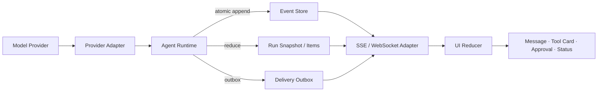

# 09 · Agent Application Server 与 UI 事件协议

前端可以直接连接模型 Provider 的流式接口，并把文本增量（Delta）渲染成打字机效果。只要界面开始展示 Tool Call、审批、取消和后台任务，这种连接方式就不再可靠：刷新页面会丢失工具状态，重复 Event 可能生成两张审批卡，而 Provider 发出 `response.completed` 时，业务 Run 可能仍在等待用户确认。

Agent Application Server 位于模型 Runtime 与产品 UI 之间。它把易变的 Provider Event 翻译成应用自己的事实，持久化后再投影为浏览器可重放、可去重、可脱敏的事件。对前端工程师而言，这一层很像“服务端状态机 + Event Store + Redux reducer”，只是状态会跨连接和进程存在。

## 本章目标

- 区分 Provider Event、Canonical RunEvent、Transport Frame 与 UI State。
- 设计 Thread、Run、Item、Pending Reverse Request 与用户控制的公开事件协议。
- 区分可持久重放事件、仅实时投递信号与仅供内部恢复的记录。
- 实现 Snapshot + Delta、SSE 重连、Sequence Gap、多客户端去重和幂等 Reducer。
- 理解 AG-UI、AI SDK UI 等方案位于 Adapter 层，而不是领域层，并为下一章实现 AG-UI Adapter 固定边界。

> **Agentic UI 核心路径 · 01 / 04**
>
> 本章是 Agentic UI 主线的第一站。第 1～4 节和第 7 节建立事件分层、Canonical RunEvent、Public Snapshot 与纯 UI Reducer；第 5～6 节和第 8 节补齐原子持久化、断线重放与协议兼容；第 9 节把这组产品状态语义交给下一章的 AG-UI Adapter。三部分共同构成可恢复 UI 的必修基础。

## 1. Agent Application Server 的位置



权威顺序是：

```text
Provider Event
→ close and validate semantic Item
→ append Canonical RunEvent
→ update Item / Snapshot / Outbox
→ deliver public event
→ reduce UI state
```

SSE 连接不是权威事实源（Source of Truth）。客户端离线时，Run 仍可能继续执行、等待审批或进入失败状态；重新连接后，页面根据服务端 Snapshot 和后续 Event 恢复。

## 2. 同一个事实有三种协议表示

Provider Adapter 可能收到厂商相关的增量：

```text
output_item.added(kind=function_call)
arguments.delta("{\"orderId\":\"order_")
arguments.delta("123\",\"amountMinor\":10000}")
output_item.done
response.completed
```

第一个 Delta 不能直接渲染为可批准的动作。只有完整 Item 已闭合，并通过 JSON 解析和 Schema 校验后，Runtime 才能产生稳定事件：

```text
41 item.started(kind=assistant_message)
42 item.text_chunk_committed("已找到适用政策。")
43 item.completed
44 tool.proposed(tool=commit_refund, proposal_hash=92ac...)
45 approval.required(proposal_hash=92ac...)
46 run.state_changed(state=waiting_approval)
```

UI 消费的是第二组应用事实。Provider 的 `response.completed` 只表示该 Response 已结束，不能越过 Runtime 直接把 Run 写成 `completed`。

## 3. 设计 Canonical RunEvent

公共事件要稳定、可版本化，并且只携带客户端获准看到的字段：

```ts
type BaseEvent = {
  schemaVersion: 1;
  eventId: string;
  threadId: string;
  runId: string;
  seq: number;
  occurredAt: string;
  traceId: string;
};

type PublicRunState =
  | "planning"
  | "waiting_input"
  | "waiting_approval"
  | "executing_tool"
  | "cancel_requested"
  | "in_doubt"
  | "reconciling"
  | "partial"
  | "manual_intervention"
  | "completed_with_effect_after_cancel"
  | "completed"
  | "cancelled"
  | "failed";

type PublicControl =
  | "submit_input"
  | "queue_follow_up"
  | "steer"
  | "cancel_and_send"
  | "ask_side_question"
  | "approve"
  | "reject"
  | "request_cancel"
  | "edit_and_retry"
  | "resume"
  | "retry_safe"
  | "contact_operator";

type EffectStatus =
  | "absent"
  | "committed"
  | "compensated"
  | "unknown"
  | "partially_committed";

type RunEvent =
  | (BaseEvent & {
      type: "run.started";
      data: { attemptId: string };
    })
  | (BaseEvent & {
      type: "run.state_changed";
      data: {
        state: PublicRunState;
        effectStatus: EffectStatus;
        reasonCode: string;
        availableControls: PublicControl[];
      };
    })
  | (BaseEvent & {
      type: "item.started";
      data: {
        itemId: string;
        streamId: string;
        kind: "assistant_message" | "tool_result";
      };
    })
  | (BaseEvent & {
      type: "item.text_chunk_committed";
      data: {
        itemId: string;
        streamId: string;
        fragments: Array<{
          offset: number;
          append: string;
        }>;
      };
    })
  | (BaseEvent & {
      type: "item.completed";
      data: {
        itemId: string;
        streamId: string;
        final:
          | {
              kind: "assistant_message";
              text: string;
              contentHash: string;
            }
          | {
              kind: "tool_result";
              resultRef: string;
              publicSummary?: string;
            };
      };
    })
  | (BaseEvent & {
      type: "input.required";
      data: {
        requestId: string;
        prompt: string;
        publicResponseSchema?: unknown;
        expiresAt?: string;
      };
    })
  | (BaseEvent & {
      type: "input.received";
      data: {
        requestId: string;
        commandId: string;
        actorLabel: string;
      };
    })
  | (BaseEvent & {
      type: "control.accepted";
      data: {
        commandId: string;
        kind: ControlKind;
        inputId?: string;
        queuePosition?: number;
        applicationMode: ControlApplicationMode;
      };
    })
  | (BaseEvent & {
      type: "control.applied";
      data: {
        commandId: string;
        kind: ControlKind;
        childRunId?: string;
        attemptId?: string;
        resumedFrom?: "durable_checkpoint";
      };
    })
  | (BaseEvent & {
      type: "control.rejected";
      data: {
        commandId: string;
        kind: ControlKind;
        reasonCode: string;
      };
    })
  | (BaseEvent & {
      type: "tool.proposed";
      data: {
        callId: string;
        tool: string;
        proposalHash: string;
        publicArguments: unknown;
      };
    })
  | (BaseEvent & {
      type: "approval.required";
      data: {
        requestId: string;
        approvalId: string;
        proposalHash: string;
        publicPreview: unknown;
        expiresAt: string;
      };
    })
  | (BaseEvent & {
      type: "approval.resolved";
      data: {
        requestId: string;
        approvalId: string;
        decision: "approved" | "rejected" | "expired";
        actorLabel: string;
      };
    })
  | (BaseEvent & {
      type: "tool.state_changed";
      data: {
        callId: string;
        status: "proposed" | "approved" | "executing" | "in_doubt" |
          "reconciling" | "succeeded" | "failed";
        resultRef?: string;
        publicSummary?: string;
      };
    })
  | (BaseEvent & {
      type: "run.error_recorded";
      data: { code: string; retryable: boolean; publicMessage: string };
    })
  | (BaseEvent & {
      type: "outcome.graded";
      data: {
        graderVersion: string;
        status: "passed" | "failed" | "inconclusive";
        score?: number;
      };
    });
```

这里省略的辅助类型仍属于应用协议，而不是某个 UI 标准的字段：

```ts
type ControlKind =
  | "queue_follow_up"
  | "steer"
  | "cancel_and_send"
  | "side_question"
  | "edit_and_retry"
  | "resume"
  | "retry_safe";

type ControlApplicationMode =
  | "after_current_turn"
  | "next_safe_boundary"
  | "cancel_then_next_safe_boundary"
  | "isolated_child_run"
  | "new_attempt_from_durable_checkpoint"
  | "resume_from_durable_checkpoint"
  | "runtime_selected_retry";

type LiveRunSignal = {
  schemaVersion: 1;
  deliveryId: string;
  threadId: string;
  runId: string;
  streamId: string;
  offset: number;
  observedAt: string;
  type: "item.text_delta";
  data: { itemId: string; append: string };
};
```

同一 `streamId` 内的 `offset` 从 `0` 开始严格递增。持久 Chunk 可以在一次数据库写入中保存多个连续 Fragment，但保留各自 Offset，使 Adapter 能过滤当前连接已经发送的实时 Fragment；不连续的 Chunk 是协议错误，不能静默拼接。

这里的 `RunEvent` 是 Application Server 对客户端公开的规范契约（Canonical Contract），与 Agent Loop 章节中的内部 `RuntimeTransitionEvent` 不是同一类对象。只有内部状态完成持久化、脱敏和可见性裁剪后，系统才产生公开事件：

| 内部转移                        | 公开投影                                | 说明                            |
| --------------------------- | ----------------------------------- | ----------------------------- |
| `run_started`               | `run.started` + `run.state_changed` | 一次内部转移可生成多个公开事件               |
| `model_tool_item_completed` | `tool.proposed`                     | 只投影已闭合、已校验和已脱敏的参数             |
| `tool_succeeded`            | `tool.state_changed`                | 公开事件使用结果引用和可公开摘要              |
| `input_required`            | `run.state_changed`                 | 将内部原因映射为稳定 `reasonCode` 与合法控件 |
| 内部调度、Lease 或 Retry 细节       | 不一定投影                               | 只在影响用户状态或审计语义时才公开             |

`EffectStatus` 与可靠性章共享同一组领域语义。`executing_tool` 属于 Run 执行状态，不是 Effect Status：Command 尚未发出时为 `absent`，发出后但尚无权威证据时为 `unknown`，获得 Receipt 或权威查询结果后才能进入 `committed` 或 `compensated`。`partially_committed` 只用于聚合多个 Effect 的视图，单个 Effect 仍使用前四种状态。

`publicArguments`、`publicPreview` 和 `publicSummary` 必须在写入公共事件前完成脱敏。密钥、完整 Context、原始 Reasoning 和敏感 Tool Result 分别进入受控存储，Event 只保存 UI 与审计需要的字段或引用。

Run Completed 表示 Runtime 已进入终态；Outcome Passed 表示独立 Grader 认可业务结果。两者应是不同事件，避免 UI 把“执行结束”错误展示为“目标成功”。

### 3.1 事件的持久性与可见性必须正交

“Event”不能默认等于“写入 Event Store”。应用至少要明确四个平面：

| 平面          | 例子                                                                           | 是否进入公开 Event Store | 断线后的处理                       |
| ----------- | ---------------------------------------------------------------------------- | -----------------: | ---------------------------- |
| 可持久、可重放、可公开 | `run.state_changed`、`approval.required`、`control.accepted`、`item.completed`  |                  是 | 按 `seq` 重放                   |
| 仅实时、可公开     | 高频 `item.text_delta`、连接质量、临时活动提示                                             |                  否 | 丢弃旧信号，以 Snapshot 或闭合 Item 为准 |
| 可持久、仅内部     | Durable Checkpoint、Provider Cursor、Lease、Retry Schedule、命令收件箱（Command Inbox） |                  否 | Runtime 恢复使用，禁止直接投影          |
| 仅实时、仅内部     | 调度唤醒、进程心跳、未校验的 Provider Delta                                                |                  否 | 丢失后重新观察或计算                   |

高频 Provider Delta 先形成可选的 `LiveRunSignal`，用于降低首字延迟；Adapter 可以按时间窗合并为 `item.text_chunk_committed`，降低持久化写放大。`item.completed` 保存最终文本和内容哈希，是该 Item 的规范终态（Canonical Terminal State）。客户端收到它时必须用最终文本替换实时草稿，而不是继续拼接。这样即使某个实时 Delta 丢失、重复或只在一个浏览器中出现，所有客户端最终仍会收敛。

若产品要求刷新后逐字还原生成过程，可以提高持久 Chunk 的频率；若只要求还原最终消息，则只保存较粗 Chunk 与闭合 Item。无论选择哪种成本模型，都不能只保存无法重放的 Delta 而缺少最终 Item。

### 3.2 用户控制先是 Command，接受后才成为事实

用户点击按钮或按下快捷键产生的是不可信 Command。Command 使用独立的 `commandId` 做幂等，不能直接占用 Run 的领域 `seq`：

```ts
type ControlCommandBase = {
  commandId: string;
  actorId: string;
  threadId: string;
  runId: string;
  expectedRunVersion: number;
  sentAt: string;
};

type ControlCommand =
  | (ControlCommandBase & {
      type: "queue_follow_up";
      inputId: string;
      text: string;
    })
  | (ControlCommandBase & {
      type: "steer";
      inputId: string;
      instruction: string;
    })
  | (ControlCommandBase & {
      type: "cancel_and_send";
      inputId: string;
      text: string;
    })
  | (ControlCommandBase & {
      type: "side_question";
      question: string;
      snapshotSeq: number;
    })
  | (ControlCommandBase & {
      type: "edit_and_retry";
      sourceAttemptId: string;
      replacementInput: string;
    })
  | (ControlCommandBase & {
      type: "resume";
    })
  | (ControlCommandBase & {
      type: "retry_safe";
      failedStepId: string;
    });
```

服务端验证身份、资源归属、当前状态、版本和控件能力后，才追加 `control.accepted` 或 `control.rejected`。接受不等于已经生效；真正改变 Prompt、取消后续步骤或创建隔离子 Run 时，再追加 `control.applied`。`cancel_and_send` 必须作为一个原子 Command 接受：不能出现“取消已接受，但新输入因进程崩溃而丢失”的半状态。

四种控制具有不同语义：

- **Queue follow-up**：不中断当前回合，把输入持久化到队列，在当前回合自然闭合后处理。
- **Steer without cancel**：保持同一 Run，不撤销已经确认的事实；指令只在 Runtime 声明的下一个安全边界注入。
- **Cancel-and-send**：请求停止尚未开始的工作，并把新输入排到安全排空之后；它不承诺撤销已经发出的外部 Command。
- **Side question**：基于指定 `snapshotSeq` 创建只读、隔离的子 Run；答案可以标记父状态已前进，但不得修改父 Run、解决审批或消费父 Run 的输入队列。

恢复类控制同样不能由浏览器直接操纵执行状态：

- **Edit and retry**：保留旧 Attempt 和证据，服务端校验 `sourceAttemptId` 后，从对应 Durable Checkpoint 创建带替代输入的新 Attempt。
- **Resume**：请求 Runtime 从其内部 Durable Checkpoint 恢复。Public Snapshot 只用于重建界面，不能作为执行恢复输入。
- **Retry safe**：只提交失败步骤引用；Runtime 根据 Effect Status、幂等语义、权限、审批和预算计算是否存在安全重试路径。

### 3.3 Reverse Request 必须跨连接存在

Runtime 向用户请求补充输入或审批，属于反向请求（Reverse Request）。等待状态不能只存在于某条 WebSocket 的 Pending Promise 中，否则断线就会丢失责任人和截止时间。Public Snapshot 应物化未决请求：

```ts
type PendingReverseRequest =
  | {
      requestId: string;
      kind: "input";
      openedSeq: number;
      version: number;
      prompt: string;
      publicResponseSchema?: unknown;
      expiresAt?: string;
    }
  | {
      requestId: string;
      kind: "approval";
      openedSeq: number;
      version: number;
      approvalId: string;
      proposalHash: string;
      publicPreview: unknown;
      expiresAt: string;
    };
```

回应反向请求仍是 Command。服务端以 `(requestId, expectedVersion)` 做比较并交换（Compare-and-Swap）；两个设备同时批准时，只有第一个合法决策能够追加 `approval.resolved`，另一个收到稳定的 `already_resolved` 结果。补充输入成功后则追加 `input.received`。审批的 `proposalHash`、过期时间和权限必须从服务端重读，不能采信客户端回传副本。

### 3.4 安全排空点隔离并发输入

控制请求不能插入任意 Token 或半段 Tool Arguments。Runtime 应声明安全排空点（Safe Drain Point），并只在以下边界应用待处理控制：

1. 当前结构化 Item 已闭合，或被明确标记为废弃；
2. 尚未派发新的外部副作用 Command；
3. 已派发的 Command 已获得 Receipt，或 Run 已进入 `in_doubt / reconciling`；
4. 当前 Canonical Event、Checkpoint 与命令收件箱已提交；
5. 应用控制后能够生成新的确定性 Prompt 或状态转移。

“立即”因此表示“立即接受并展示待应用”，不表示在 JSON 中间截断、越过原子提交或假装撤销在途效果。若运行时不支持同回合安全注入，`steer` 必须不出现在 `availableControls` 中，而不能暗中降级为取消。

## 4. Public Snapshot 与 Durable Checkpoint

Public Snapshot 是客户端恢复点：

```ts
type RunSnapshot = {
  schemaVersion: 1;
  runId: string;
  upToSeq: number;
  state: PublicRunState;
  items: Array<{
    id: string;
    kind: string;
    text?: string;
    status: string;
  }>;
  toolCards: Array<{
    callId: string;
    tool: string;
    proposalHash: string;
    publicArguments: unknown;
    status: string;
    publicSummary?: string;
  }>;
  pendingRequests: PendingReverseRequest[];
  queuedInputs: Array<{
    inputId: string;
    commandId: string;
    mode: "follow_up" | "steer" | "after_cancel";
    position: number;
  }>;
  pendingControls: Array<{
    commandId: string;
    kind: ControlKind;
    applicationMode: ControlApplicationMode;
    inputId?: string;
    queuePosition?: number;
    acceptedAt: string;
  }>;
  availableControls: PublicControl[];
  effectStatus: EffectStatus;
  lastError?: {
    code: string;
    retryable: boolean;
    publicMessage: string;
  };
  outcomeGrade?: {
    graderVersion: string;
    status: "passed" | "failed" | "inconclusive";
    score?: number;
  };
  generatedAt: string;
};
```

“完整”只指客户端获准看到的完整投影。Snapshot 必须包含未决反向请求、已进入队列的输入，以及已接受但尚未应用的控制命令，否则刷新会让用户误以为操作丢失。Durable Checkpoint 属于 Runtime，保存工作流游标、重试计数、幂等引用、lease 和内部状态。Public Snapshot 不能替代执行恢复状态；反过来，也不应把内部 Checkpoint 原样暴露给浏览器。

## 5. 原子持久化与 Outbox

Canonical Event、Snapshot 更新和 Delivery Outbox 应处于同一数据库事务：

```text
begin
  assert snapshot.version = expected_version
  allocate next seq
  insert run_event(run_id, seq, event_id, payload)
  upsert item
  reduce and update snapshot
  insert delivery_outbox(event_id)
commit
```

如果先向浏览器推送、随后才写数据库，进程在两步之间崩溃后，客户端会看到一个服务端无法重放的状态。Outbox 允许投递失败后重试，同时通过 `UNIQUE(run_id, seq)` 与 `UNIQUE(event_id)` 抵御重复追加和重复发送。

需要重放的文本 Chunk 可以在 Provider Adapter 内按较短时间窗合并，再分配应用 `seq`。合并只影响显示粒度，不能跨越 Item、Tool Call 或状态转移边界。仅实时 Delta 可以绕过持久 Outbox，但 UI 必须把它标记为草稿；闭合 Item 仍要先持久化，再通过 Outbox 投递。

## 6. SSE 的 sequence、gap 与重连

一帧公开事件可以表示为：

```text
id: run_7:45
event: run-event
data: {"schemaVersion":1,"eventId":"evt_45","runId":"run_7",
       "seq":45,"type":"approval.required","data":{...}}
```

协议规则：

- `seq` 由 Application Server 分配，仅在单个 Run 内严格递增。
- `seq < nextSeq` 表示重复，客户端幂等忽略。
- `seq > nextSeq` 表示缺口，客户端暂停归并并请求补发。
- 重连时携带 `Last-Event-ID` 或 `after_seq`，Server 从 Event Store 重放事件，不重新调用模型。
- 旧事件超过保留期时，Server 返回 `resync-required`；客户端先获取 `RunSnapshot(upToSeq=N)`，再订阅 `N+1`。
- Heartbeat 属于传输控制帧（Transport Control Frame），不占用领域 `seq`，也不进入 Event Store。
- Live Signal 使用独立的 `(streamId, offset)` 去重，不参与领域 Gap 判断；缺失时丢弃草稿并等待已持久 Chunk、闭合 Item 或 Snapshot。

Snapshot 解决“从一个完整状态重新开始”，Delta 解决“低成本追上后续变化”。两者缺一不可。

## 7. UI Reducer 应保持纯函数

```ts
type UIState = Omit<RunSnapshot, "upToSeq" | "generatedAt"> & {
  nextSeq: number;
  sync: "ready" | "gap";
  liveDrafts: Record<string, { nextOffset: number; text: string }>;
};

function applyEvent(state: UIState, event: RunEvent): UIState {
  if (event.runId !== state.runId || event.seq < state.nextSeq) return state;
  if (event.seq > state.nextSeq) return { ...state, sync: "gap" };

  let next = state;
  switch (event.type) {
    case "run.state_changed":
      next = {
        ...state,
        state: event.data.state,
        effectStatus: event.data.effectStatus,
        availableControls: event.data.availableControls,
      };
      break;
    case "approval.required":
    case "input.required":
      next = upsertPendingRequest(state, event);
      break;
    case "approval.resolved":
    case "input.received":
      next = removePendingRequest(state, event.data.requestId);
      break;
    case "item.started":
    case "item.text_chunk_committed":
    case "item.completed":
      next = reduceItem(state, event);
      break;
    case "control.accepted":
    case "control.applied":
    case "control.rejected":
      next = reduceControlReceipt(state, event);
      break;
    case "tool.proposed":
    case "tool.state_changed":
      next = reduceToolCard(state, event);
      break;
    case "run.error_recorded":
      next = { ...state, lastError: event.data };
      break;
    case "outcome.graded":
      next = { ...state, outcomeGrade: event.data };
      break;
  }

  return { ...next, nextSeq: event.seq + 1, sync: "ready" };
}

function applyLiveSignal(
  state: UIState,
  signal: LiveRunSignal,
): UIState {
  if (signal.runId !== state.runId) return state;
  const draft = state.liveDrafts[signal.streamId] ?? {
    nextOffset: 0,
    text: "",
  };

  if (signal.offset < draft.nextOffset) return state;
  if (signal.offset > draft.nextOffset) {
    return discardLiveDraft(state, signal.streamId);
  }

  return appendLiveDraft(state, signal);
}
```

Canonical Reducer 不发起网络请求，不执行 Tool，也不把 UI 状态写回领域数据库。相同 Snapshot 加相同 Event 序列必须得到相同结果，这使断线恢复和 Fixture Test 具有确定性。Live Signal Reducer 只改善当前连接的显示；`item.completed` 到达时清除对应 `liveDrafts`，并以 `final.kind === "assistant_message"` 分支中的 `final.text` 覆盖草稿。

### 7.1 多客户端一致性来自服务端顺序

浏览器 A 接受了 Queue Follow-up，不代表浏览器 B 可以从本地缓存推断队列。所有写操作都携带全局唯一 `commandId`，服务端去重并分配 Canonical `seq`；所有客户端只根据 `control.accepted / applied / rejected` 和后续状态事件更新业务视图。

客户端可以临时展示“正在提交”，但该状态只以 `commandId` 关联，刷新后以 Snapshot 为准。审批、过期、取消与队列出列使用服务端比较并交换；HTTP 返回顺序、设备时钟和某个 WebSocket 的到达先后都不能决定领域顺序。

## 8. 协议兼容

Event 协议应独立版本化，并在握手时协商 `supportedSchemaVersions`：

- 同一版本只增加 optional 字段；旧客户端忽略未知可选字段。
- 非关键展示 Event 可以让旧客户端只推进 sequence、不处理内容。
- 改变审批或终态语义时升级 schema version。
- Server 声明 `minimumClientVersion`，不让旧 UI 猜测关键状态。
- 保存 v1 Wire Fixture，并持续用它验证当前版本和仍受支持的旧版 Reducer。

## 9. UI 协议位于产品边缘层

AG-UI 提供类型化的 Agent ↔ UI Event，AI SDK UI 提供 Message、Stream 和 Transport 能力。它们可以承载产品交互，但不应反向定义领域事实：

```text
Canonical RunEvent ──AG-UI Adapter──> AG-UI Events
Canonical RunEvent ──AI SDK Adapter─> UI Message Parts / Stream
Canonical RunEvent ──Native SSE─────> Custom UI
```

更换 UI Runtime 时，proposal hash、approval 绑定、Event Store 和 Run 终态不应随之重写。

本章确定 Adapter 的位置；下一章将实现 [AG-UI 与前端事件适配](/masterpiece-static-docs/05-模型接口与Agent内核/10-AG-UI与前端事件适配.md)，继续处理运行输入、事件生命周期、Shared State、用户控制和 Contract Test。声明式生成界面 A2UI 属于 Renderer Contract，不是另一套 Run Event；Agent UX 建立可信交互边界后，[A2UI 与声明式生成界面](/masterpiece-static-docs/08-安全与治理/06-A2UI与声明式生成界面.md)会用一个受控 Surface 验证这条边界。

## 10. 故障测试矩阵

| Fixture                              | 期望结果                                                         |
| ------------------------------------ | ------------------------------------------------------------ |
| Tool arguments 只到一半就断流               | 不产生 `tool.proposed`，Run 不得完成                                 |
| Event 45 投递两次                        | Reducer 只应用一次                                                |
| 收到 44 后直接收到 46                       | UI 进入 `gap`，补齐前不应用 46                                        |
| Event 超过保留期                          | 先取 Snapshot，再从 `N+1` 订阅                                      |
| 等待审批时早期 Event 已裁剪                    | Snapshot 仍含审批卡、proposal hash 和 controls                      |
| Cancel 后处于 `in_doubt` 时重连            | 显示“结果未知/正在核对”，不显示 cancelled                                  |
| SSE 在审批后断开                           | replay 原事件，不重新生成 proposal                                    |
| 跨租户请求 stream                         | 读取 Event 前拒绝授权                                               |
| Tool Result 含密钥                      | Event 与 Snapshot 中均不存在密钥                                     |
| Provider completed，Runtime 等待审批      | UI 保持 `waiting_approval`                                     |
| 实时 Delta 7 后直接收到 Delta 9             | 丢弃该 Stream 的草稿；不触发领域 Gap，等待闭合 Item                           |
| 浏览器 A、B 用同一 `commandId` 重试 Follow-up | 服务端只接受一次，两个客户端最终看到同一队列位置                                     |
| 两个设备同时解决同一 Approval                  | 只有一个比较并交换成功，另一端显示已由他人处理                                      |
| `cancel_and_send` 接受后进程崩溃            | 恢复后同时保留 Cancel Intent 与新输入，不出现半状态                            |
| Tool Command 已发出时收到 Steer            | 在 Receipt 或 `in_doubt` 边界前不注入，不改写已审批参数                       |
| 浏览器拿 Public Snapshot 提交 Resume       | 服务端忽略其状态内容，只从已校验的 Durable Checkpoint 恢复；不存在兼容 Checkpoint 时拒绝 |
| Edit-and-retry 指向旧 Attempt           | 保留原 Attempt 与证据，以新 Attempt ID 追加分支，不覆盖旧历史                    |
| Retry-safe 指向效果未知的写步骤                | 拒绝普通 Retry，转入 Reconciliation                                 |

## 实践：把 Resolution Desk Runtime 接入可恢复的 Web UI

### 进入本章时已有能力

Resolution Desk 可以在服务端完成只读 Agent Loop 并生成退款 Proposal，但浏览器还不能在刷新、断线或重复事件后恢复权威状态。

### 本章增加的能力

1. 为现有 Runtime 定义 `RunEvent`、`LiveRunSignal`、`RunSnapshot` 和 JSON Schema。
2. 用录制的 Provider Fixture 实现 Adapter，覆盖文本 Delta、完整 Tool Item、截断和失败。
3. 实现 Event Store + Snapshot + Outbox 的原子追加，并让闭合 Item 成为文本的规范终态。
4. 提供 `GET /runs/:id/snapshot` 与 `GET /runs/:id/events?after_seq=`。
5. 实现幂等控制命令收件箱、Pending Reverse Request 与安全排空点，并覆盖 Edit-and-retry、Resume 和 Retry-safe 三类恢复命令。
6. 用 Native SSE 接入 Canonical Reducer 与 Live Signal Reducer，跑完故障矩阵。
7. 用同一组 Snapshot/Event Fixture 验证刷新恢复、重复投递、序列缺口与双客户端并发控制。

### 验收证据

从订单读取、政策检索、Proposal 生成到 `waiting_approval` 的任意断点刷新页面，UI 都与 Event Store 一致。重复 Event 不生成第二张 Proposal 卡，sequence gap 会触发 Snapshot 恢复，实时 Delta 丢失不会改变闭合消息。Queue Follow-up、Steer、Cancel-and-send、Side Question、Edit-and-retry、Resume 与 Retry-safe 都有独立 `commandId` 和接受回执；需要注入当前执行的控制还有明确排空边界。Resume 只读取 Durable Checkpoint，Edit-and-retry 不覆盖旧 Attempt，效果未知的写步骤不能普通 Retry。两个设备同时审批只能产生一个有效决策。未闭合参数和服务端私有字段不会进入公开事件。两个独立的 Native SSE 客户端必须从同一 Snapshot 和 Event 序列收敛到相同公开状态。

## 常见误区

- 浏览器可以长期直接消费 Provider Event。
- Provider response completed 可以直接映射为 Run completed。
- Tool arguments delta 足以生成审批卡。
- 实时文本 Delta 可以替代闭合 Item 和 Snapshot。
- Public Snapshot 可以直接作为 Runtime Checkpoint。
- UI reducer 中调用 Tool 能减少一层服务端往返。
- 接受 Steer 或 Cancel 就表示它已经在任意执行点生效。

## 本章小结

Agent Application Server 把 Provider 流转换成持久、稳定、可版本化的应用事实，并把高频实时信号与规范终态分开。Snapshot + Canonical Event、Sequence、Gap Detection、幂等 Command 和安全排空点，让多个前端在刷新、断线与并发控制后仍能恢复真实状态。下一章进入 [Agentic UI 02：AG-UI 与前端事件适配](/masterpiece-static-docs/05-模型接口与Agent内核/10-AG-UI与前端事件适配.md)，把同一组 Canonical Fact 投影为标准 Agent↔UI 事件。

## 延伸阅读

- [Codex App Server](https://learn.chatgpt.com/docs/app-server)
- [WHATWG: Server-sent events](https://html.spec.whatwg.org/multipage/server-sent-events.html)
- [AG-UI Events](https://docs.ag-ui.com/concepts/events)
- [Vercel: AI SDK 7](https://vercel.com/changelog/ai-sdk-7)
