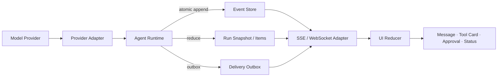

# 09 · Agent Application Server 与 UI 事件协议

前端可以直接连接模型 Provider 的流式接口，并把文本 delta 渲染成打字机效果。只要界面开始展示 Tool Call、审批、取消和后台任务，这种连接方式就不再可靠：刷新页面会丢失工具状态，重复 event 可能生成两张审批卡，Provider 宣布 response completed 时，业务 Run 可能仍在等待用户确认。

Agent Application Server 位于模型 Runtime 与产品 UI 之间。它把易变的 Provider Event 翻译成应用自己的事实，持久化后再投影为浏览器可重放、可去重、可脱敏的事件。对前端工程师而言，这一层很像“服务端状态机 + Event Store + Redux reducer”，只是状态会跨连接和进程存在。

## 本章目标

- 区分 Provider Event、Canonical RunEvent、Transport Frame 与 UI State。
- 设计 Thread、Run、Item 的公开事件协议。
- 实现 Snapshot + Delta、SSE 重连、sequence gap 和幂等 reducer。
- 把 AG-UI、AI SDK UI 等方案放在 Adapter 层，而不是领域层。

> 本章分为两个实现层次。第 1～4 节和第 7 节建立最小闭环：事件分层、Canonical RunEvent、Public Snapshot 与纯 UI Reducer；第 5～6、8～9 节处理生产环境中的原子持久化、断线重放、协议兼容和 UI Adapter。最小闭环稳定后，再加入后一个层次。

## 1. Agent Application Server 的位置



权威顺序是：

```text
Provider Event
→ close and validate semantic Item
→ append Canonical RunEvent
→ update Item / Snapshot / Outbox
→ deliver public event
→ reduce UI state
```

SSE 连接不是 source of truth。客户端离线时 Run 仍可能继续执行、等待审批或进入失败状态；重新连接后，页面从服务端 Snapshot 和后续 Event 恢复。

## 2. 同一个事实有三种协议表示

Provider Adapter 可能收到厂商相关的增量：

```text
output_item.added(kind=function_call)
arguments.delta("{\"orderId\":\"order_")
arguments.delta("123\",\"amountMinor\":10000}")
output_item.done
response.completed
```

第一个 delta 不能直接渲染成可批准动作。只有完整 Item 闭合、JSON 解析和 Schema 校验通过后，Runtime 才产生稳定事件：

```text
41 item.started(kind=assistant_message)
42 item.text_delta("已找到适用政策。")
43 item.completed
44 tool.proposed(tool=commit_refund, proposal_hash=92ac...)
45 approval.required(proposal_hash=92ac...)
46 run.state_changed(state=waiting_approval)
```

UI 消费的是第二组应用事实。Provider 的 `response.completed` 只表示该 response 已结束，不能越过 Runtime 直接把 Run 写成 completed。

## 3. 设计 Canonical RunEvent

公共事件要稳定、可版本化，并且只携带客户端获准看到的字段：

```ts
type BaseEvent = {
  schemaVersion: 1;
  eventId: string;
  threadId: string;
  runId: string;
  seq: number;
  occurredAt: string;
  traceId: string;
};

type PublicRunState =
  | "planning"
  | "waiting_input"
  | "waiting_approval"
  | "executing_tool"
  | "cancel_requested"
  | "in_doubt"
  | "reconciling"
  | "partial"
  | "manual_intervention"
  | "completed_with_effect_after_cancel"
  | "completed"
  | "cancelled"
  | "failed";

type PublicControl =
  | "submit_input"
  | "approve"
  | "reject"
  | "request_cancel"
  | "retry_safe"
  | "contact_operator";

type EffectStatus =
  | "absent"
  | "committed"
  | "compensated"
  | "unknown"
  | "partially_committed";

type RunEvent =
  | (BaseEvent & {
      type: "run.started";
      data: { attemptId: string };
    })
  | (BaseEvent & {
      type: "run.state_changed";
      data: {
        state: PublicRunState;
        effectStatus: EffectStatus;
        reasonCode: string;
        availableControls: PublicControl[];
      };
    })
  | (BaseEvent & {
      type: "item.started";
      data: { itemId: string; kind: "assistant_message" | "tool_result" };
    })
  | (BaseEvent & {
      type: "item.text_delta";
      data: { itemId: string; append: string };
    })
  | (BaseEvent & {
      type: "item.completed";
      data: { itemId: string };
    })
  | (BaseEvent & {
      type: "tool.proposed";
      data: {
        callId: string;
        tool: string;
        proposalHash: string;
        publicArguments: unknown;
      };
    })
  | (BaseEvent & {
      type: "approval.required";
      data: {
        approvalId: string;
        proposalHash: string;
        publicPreview: unknown;
        expiresAt: string;
      };
    })
  | (BaseEvent & {
      type: "approval.resolved";
      data: {
        approvalId: string;
        decision: "approved" | "rejected" | "expired";
        actorLabel: string;
      };
    })
  | (BaseEvent & {
      type: "tool.state_changed";
      data: {
        callId: string;
        status: "proposed" | "approved" | "executing" | "in_doubt" |
          "reconciling" | "succeeded" | "failed";
        resultRef?: string;
        publicSummary?: string;
      };
    })
  | (BaseEvent & {
      type: "run.error_recorded";
      data: { code: string; retryable: boolean; publicMessage: string };
    })
  | (BaseEvent & {
      type: "outcome.graded";
      data: {
        graderVersion: string;
        status: "passed" | "failed" | "inconclusive";
        score?: number;
      };
    });
```

这里的 `RunEvent` 是 Application Server 对客户端公开的 canonical contract，与 Agent Loop 章的内部 `RuntimeTransitionEvent` 不是同一类对象。只有内部状态已持久化，并且完成脱敏和可见性裁剪后，才产生公开事件：

| 内部转移                        | 公开投影                                | 说明                            |
| --------------------------- | ----------------------------------- | ----------------------------- |
| `run_started`               | `run.started` + `run.state_changed` | 一次内部转移可生成多个公开事件               |
| `model_tool_item_completed` | `tool.proposed`                     | 只投影已闭合、已校验和已脱敏的参数             |
| `tool_succeeded`            | `tool.state_changed`                | 公开事件使用结果引用和可公开摘要              |
| `input_required`            | `run.state_changed`                 | 将内部原因映射为稳定 `reasonCode` 与合法控件 |
| 内部调度、Lease 或 Retry 细节       | 不一定投影                               | 只在影响用户状态或审计语义时才公开             |

`EffectStatus` 与可靠性章共享同一组领域语义。`executing_tool` 属于 Run 执行状态，不是 Effect Status：Command 尚未发出时为 `absent`，发出后但尚无权威证据时为 `unknown`，获得 Receipt 或权威查询结果后才能进入 `committed` 或 `compensated`。`partially_committed` 只用于聚合多个 Effect 的视图，单个 Effect 仍使用前四种状态。

`publicArguments`、`publicPreview` 和 `publicSummary` 必须在写入公共事件前脱敏。密钥、完整 Context、raw reasoning 和敏感 Tool Result 分别进入受控存储，Event 只保存 UI 与审计需要的字段或引用。

Run completed 表示 Runtime 已进入终态；Outcome passed 表示独立 grader 认可业务结果。两者应是不同事件，避免 UI 把“执行结束”误画成“目标成功”。

## 4. Public Snapshot 与 Durable Checkpoint

Public Snapshot 是客户端恢复点：

```ts
type RunSnapshot = {
  schemaVersion: 1;
  runId: string;
  upToSeq: number;
  state: PublicRunState;
  items: Array<{
    id: string;
    kind: string;
    text?: string;
    status: string;
  }>;
  toolCards: Array<{
    callId: string;
    tool: string;
    proposalHash: string;
    publicArguments: unknown;
    status: string;
    publicSummary?: string;
  }>;
  pendingApprovals: Array<{
    approvalId: string;
    proposalHash: string;
    publicPreview: unknown;
    expiresAt: string;
  }>;
  availableControls: PublicControl[];
  effectStatus: EffectStatus;
  lastError?: {
    code: string;
    retryable: boolean;
    publicMessage: string;
  };
  outcomeGrade?: {
    graderVersion: string;
    status: "passed" | "failed" | "inconclusive";
    score?: number;
  };
  generatedAt: string;
};
```

“完整”只指客户端获准看到的完整投影。Durable Checkpoint 属于 Runtime，保存工作流游标、重试计数、幂等引用、lease 和内部状态。Public Snapshot 不能替代执行恢复状态；反过来，也不应把内部 Checkpoint 原样暴露给浏览器。

## 5. 原子持久化与 Outbox

Canonical Event、Snapshot 更新和 Delivery Outbox 应处于同一数据库事务：

```text
begin
  assert snapshot.version = expected_version
  allocate next seq
  insert run_event(run_id, seq, event_id, payload)
  upsert item
  reduce and update snapshot
  insert delivery_outbox(event_id)
commit
```

如果先向浏览器推送、随后才写数据库，进程在两步之间崩溃后，客户端会看到一个服务端无法重放的状态。Outbox 允许投递失败后重试，同时通过 `UNIQUE(run_id, seq)` 与 `UNIQUE(event_id)` 抵御重复追加和重复发送。

高频文本 delta 可以在 Provider Adapter 内按短时间窗合并，再分配应用 `seq`。合并只影响显示粒度，不能跨越 Item、Tool Call 或状态转移边界。

## 6. SSE 的 sequence、gap 与重连

一帧公开事件可以表示为：

```text
id: run_7:45
event: run-event
data: {"schemaVersion":1,"eventId":"evt_45","runId":"run_7",
       "seq":45,"type":"approval.required","data":{...}}
```

协议规则：

- `seq` 由 Application Server 分配，仅在单个 Run 内严格递增。
- `seq < nextSeq` 表示重复，客户端幂等忽略。
- `seq > nextSeq` 表示缺口，客户端暂停归并并请求补发。
- 重连携带 `Last-Event-ID` 或 `after_seq`，Server 从 Event Store replay，不重新调用模型。
- 旧事件超过保留期时，Server 返回 `resync-required`；客户端先获取 `RunSnapshot(upToSeq=N)`，再订阅 `N+1`。
- heartbeat 属于 transport control frame，不占领域 `seq`，也不进入 Event Store。

Snapshot 解决“从一个完整状态重新开始”，Delta 解决“低成本追上后续变化”。两者缺一不可。

## 7. UI Reducer 应保持纯函数

```ts
type UIState = Omit<RunSnapshot, "upToSeq" | "generatedAt"> & {
  nextSeq: number;
  sync: "ready" | "gap";
};

function applyEvent(state: UIState, event: RunEvent): UIState {
  if (event.runId !== state.runId || event.seq < state.nextSeq) return state;
  if (event.seq > state.nextSeq) return { ...state, sync: "gap" };

  let next = state;
  switch (event.type) {
    case "run.state_changed":
      next = {
        ...state,
        state: event.data.state,
        effectStatus: event.data.effectStatus,
        availableControls: event.data.availableControls,
      };
      break;
    case "approval.required":
      next = upsertApproval(state, event.data);
      break;
    case "approval.resolved":
      next = removeApproval(state, event.data.approvalId);
      break;
    case "item.started":
    case "item.text_delta":
    case "item.completed":
      next = reduceItem(state, event);
      break;
    case "tool.proposed":
    case "tool.state_changed":
      next = reduceToolCard(state, event);
      break;
    case "run.error_recorded":
      next = { ...state, lastError: event.data };
      break;
    case "outcome.graded":
      next = { ...state, outcomeGrade: event.data };
      break;
  }

  return { ...next, nextSeq: event.seq + 1, sync: "ready" };
}
```

Reducer 不发网络请求，不执行 Tool，也不把 UI 状态写回领域数据库。相同 Snapshot 加相同 Event 序列必须得到相同结果，这使断线恢复和 fixture test 变得确定。

## 8. 协议兼容

Event 协议应独立版本化，并在握手时协商 `supportedSchemaVersions`：

- 同一版本只增加 optional 字段；旧客户端忽略未知可选字段。
- 非关键展示 Event 可以让旧客户端只推进 sequence、不处理内容。
- 改变审批或终态语义时升级 schema version。
- Server 声明 `minimumClientVersion`，不让旧 UI 猜测关键状态。
- 保存 v1 wire fixtures，并持续喂给当前和仍受支持的旧 reducer。

## 9. UI 协议位于 Product Edge

AG-UI 提供类型化 Agent↔UI events，AI SDK UI 提供 message、stream 和 transport 能力。它们可以承载产品交互，但不应反向定义领域事实：

```text
Canonical RunEvent ──AG-UI adapter──> AG-UI Events
Canonical RunEvent ──AI SDK adapter─> UI Message Parts / Stream
Canonical RunEvent ──native SSE─────> custom UI
```

更换 UI Runtime 时，proposal hash、approval 绑定、Event Store 和 Run 终态不应随之重写。

本章只建立 Adapter 的位置。AG-UI 的运行输入、事件生命周期、Shared State、用户控制和 Contract Test，将在下一章 [AG-UI：把 Agent Runtime 接入产品前端](/masterpiece-static-docs/05-模型接口与Agent内核/10-AG-UI与前端事件适配.md)中展开。声明式生成界面 A2UI 属于 Renderer Contract，不是另一套 Run Event，后续将在安全与 Agent UX 模块单独讨论。

## 10. 故障测试矩阵

| Fixture                         | 期望结果                                    |
| ------------------------------- | --------------------------------------- |
| Tool arguments 只到一半就断流          | 不产生 `tool.proposed`，Run 不得完成            |
| Event 45 投递两次                   | Reducer 只应用一次                           |
| 收到 44 后直接收到 46                  | UI 进入 `gap`，补齐前不应用 46                   |
| Event 超过保留期                     | 先取 Snapshot，再从 `N+1` 订阅                 |
| 等待审批时早期 Event 已裁剪               | Snapshot 仍含审批卡、proposal hash 和 controls |
| Cancel 后处于 `in_doubt` 时重连       | 显示“结果未知/正在核对”，不显示 cancelled             |
| SSE 在审批后断开                      | replay 原事件，不重新生成 proposal               |
| 跨租户请求 stream                    | 读取 Event 前拒绝授权                          |
| Tool Result 含密钥                 | Event 与 Snapshot 中均不存在密钥                |
| Provider completed，Runtime 等待审批 | UI 保持 `waiting_approval`                |

## 实践：把 Resolution Desk Runtime 接入可恢复的 Web UI

### 进入本章时已有能力

Resolution Desk 可以在服务端完成只读 Agent Loop 并生成退款 Proposal，但浏览器还不能在刷新、断线或重复事件后恢复权威状态。

### 本章增加的能力

1. 为现有 Runtime 定义 `RunEvent`、`RunSnapshot` 和 JSON Schema。
2. 用录制的 Provider fixture 实现 adapter，覆盖文本 delta、完整 Tool Item、截断和失败。
3. 实现 Event Store + Snapshot + Outbox 的原子追加。
4. 提供 `GET /runs/:id/snapshot` 与 `GET /runs/:id/events?after_seq=`。
5. 用 native SSE 接入纯 UI Reducer，跑完故障矩阵。
6. 最后再实现一个 AG-UI 或 AI SDK UI adapter，验证领域层没有变化。

### 验收证据

从订单读取、政策检索、Proposal 生成到 `waiting_approval` 的任意断点刷新页面，UI 都与 Event Store 一致。重复 Event 不生成第二张 Proposal 卡，sequence gap 会触发 Snapshot 恢复，未闭合参数和服务端私有字段不会进入公开事件。验收标准不是“页面可以流式显示文字”，而是状态语义在连接变化后保持一致。

## 常见误区

- 浏览器可以长期直接消费 Provider Event。
- Provider response completed 可以直接映射为 Run completed。
- Tool arguments delta 足以生成审批卡。
- Public Snapshot 可以直接作为 Runtime Checkpoint。
- UI reducer 中调用 Tool 能减少一层服务端往返。

## 本章小结

Agent Application Server 把 Provider 流转换成持久、稳定、可版本化的应用事件。Snapshot + Delta、sequence、gap detection 和纯 reducer 让前端在刷新与断线后仍能恢复真实状态。下一章将实现 [AG-UI 前端事件适配](/masterpiece-static-docs/05-模型接口与Agent内核/10-AG-UI与前端事件适配.md)，验证公开领域事实可以稳定投影到标准 UI 协议。

## 延伸阅读

- [Codex App Server](https://learn.chatgpt.com/docs/app-server)
- [WHATWG: Server-sent events](https://html.spec.whatwg.org/multipage/server-sent-events.html)
- [AG-UI Events](https://docs.ag-ui.com/concepts/events)
- [Vercel: AI SDK 7](https://vercel.com/changelog/ai-sdk-7)
