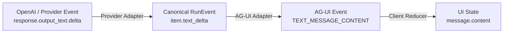
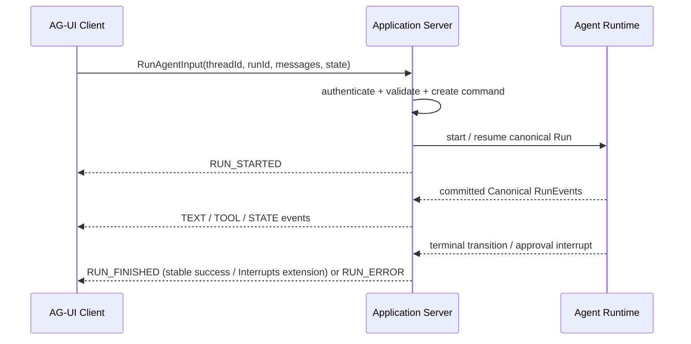
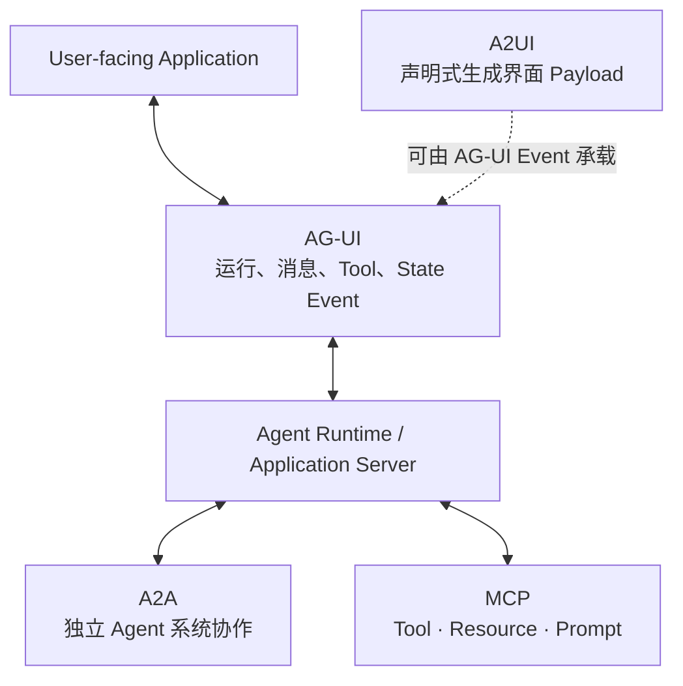

# Agentic UI 02 · AG-UI 与前端事件适配

上一章已经让 Resolution Desk 浏览器端通过 `RunSnapshot + RunEvent` 恢复任务状态。如果同一个后端还要接入另一套客服前端或标准 Agent UI，而每个客户端都重新设计消息、Tool Call 和状态事件，很快会产生多套不兼容的 Edge Contract。

Agent–User Interaction Protocol（AG-UI）解决的是这条边上的互操作问题：Agent 后端接收结构化运行输入，并持续向用户界面发送生命周期、文本、Tool Call 和共享状态事件。它不是 Agent Runtime，也不替代应用的 Event Store、Authorization 或 Durable Workflow。

本章把 AG-UI 纳入 Agentic UI 核心主线。Resolution Desk 必须实现 AG-UI Adapter，并用它证明同一组 Canonical RunEvent 可以服务标准 Agent UI，而不改写 Event Store、Authorization 或领域终态。采用标准协议的重点不是增加一种输出格式，而是建立稳定判断：协议位于 Product Edge，不能反向定义领域事实。

> 资料核验日期：2026-07-19。AG-UI 的事件和 SDK 仍在持续演进：稳定 TypeScript SDK 文档把 `RUN_FINISHED` 定义为成功结束，官方 Interrupts 概念文档则描述了带 `outcome.type = "interrupt"` 的中断感知扩展。两条基线不能混用；实现时应明确选择并固定协议与 SDK 版本，同时保存 Contract Fixture。

## 本章目标

- 判断 AG-UI 位于 Provider Stream、Canonical Event 与 UI State 的哪一层。
- 理解 Run、Text、Tool、State 与 Special Event 的生命周期。
- 实现 Canonical RunEvent 到 AG-UI Event 的单向 Adapter。
- 处理 Shared State、前端 Tool、用户控制、重连和协议升级的边界。
- 用 Contract Test 证明更换 UI 协议不会改变领域语义。

## 1. 先把四层 Event 分开

同一个“模型正在输出文本”的事实，在系统中可能有四种表示：



| 层                  | 优化目标                   | 生命周期由谁定义       |
| ------------------ | ---------------------- | -------------- |
| Provider Event     | 准确表达某个模型 API 的生成过程     | Model Provider |
| Canonical RunEvent | 持久表达应用已经确认的事实          | 应用领域与 Runtime  |
| AG-UI Event        | 让 Agent Backend 与前端互操作 | AG-UI Protocol |
| UI State           | 形成当前页面可渲染的投影           | 产品前端           |

AG-UI 应位于 Product Edge。若直接把 AG-UI Event 写成领域事实，日后更换前端协议时，审批、终态和审计语义也会被迫迁移。

## 2. AG-UI 的最小运行模型

AG-UI 的核心形态可以概括为：

```text
run(input: RunAgentInput) → stream<BaseEvent>
```

输入通常携带 `threadId`、`runId`、消息、可用 Tool、Context 与客户端状态；输出是一串带 `type` 判别字段的 Event。官方标准 HTTP Client 可以通过 POST 发起运行并接收 SSE，也可以使用其他 Transport。

官方 TypeScript `HttpAgent` 的参考路径使用 `fetch` 发起 POST，再从 `ReadableStream` 解析 SSE；它不是浏览器原生 `EventSource` 的直接封装。POST Body、Authorization Header、Abort 与双向后续输入都是选择 Client 时必须验证的能力，不能看到 `text/event-stream` 就默认 `EventSource` 足够。



`RUN_STARTED` 表示 AG-UI 运行流已经开始。稳定 TypeScript SDK 基线中的 `RUN_FINISHED` 只表示该 Adapter 所代表的运行成功结束；Interrupts 扩展只属于官方概念文档描述的中断感知语义。扩展中带 `outcome.type = "interrupt"` 的 `RUN_FINISHED` 会结束当前 AG-UI Run，但领域 Workflow 仍可停在等待审批或补充输入的状态。应用必须明确一个 AG-UI Run 映射的是一次模型 Response、一个 Runtime Run，还是 Workflow 的一个可恢复片段，不能仅凭流已闭合推断业务 Outcome。

在典型 Tool Loop 中，一个 AG-UI Run 会包含多次 Provider Response：模型先产生 Function Call，Runtime 执行 Tool，再发起下一次模型请求。第一段 Provider `response.completed` 不能投影为 AG-UI `RUN_FINISHED`。稳定基线必须等外层 Runtime 成功结束；中断感知扩展则只允许在满足 Snapshot 与 Resume Contract 后，以 `outcome.type = "interrupt"` 闭合当前 AG-UI Run。

## 3. 事件族与闭合边界

当前 AG-UI SDK 文档包含以下主要事件族：

| 事件族                  | 典型事件                                                                  | 前端用途              | 工程边界                                   |
| -------------------- | --------------------------------------------------------------------- | ----------------- | -------------------------------------- |
| Run Lifecycle        | `RUN_STARTED`、`RUN_FINISHED`、`RUN_ERROR`                              | 初始化与结束当前运行视图      | 稳定基线只表达成功/错误；中断扩展也不替代业务 Outcome Grader |
| Step Lifecycle       | `STEP_STARTED`、`STEP_FINISHED`                                        | 展示可公开的步骤进度        | 不暴露原始 Chain-of-Thought                 |
| Text Message         | `TEXT_MESSAGE_START`、`TEXT_MESSAGE_CONTENT`、`TEXT_MESSAGE_END`        | 增量渲染消息            | Start/End 必须与同一 Message ID 关联          |
| Tool Call            | `TOOL_CALL_START`、`TOOL_CALL_ARGS`、`TOOL_CALL_END`、`TOOL_CALL_RESULT` | 展示调用参数、状态和结果      | 参数 Delta 不等于可执行 Command                |
| State                | `STATE_SNAPSHOT`、`STATE_DELTA`、`MESSAGES_SNAPSHOT`                    | 同步共享状态与消息基线       | Snapshot 不是 Runtime Checkpoint         |
| Activity / Reasoning | Activity 与受控 Reasoning Event                                          | 展示进度、摘要与可解释线索     | 不应发送隐藏推理或敏感 Context                    |
| Special              | `RAW`、`CUSTOM`                                                        | 兼容 Provider 或业务扩展 | 必须定义 Namespace、Schema 与兼容策略            |

Text 与 Tool Event 都是有生命周期的对象，而不是无归属的 Token：

```text
TEXT_MESSAGE_START(messageId)
→ TEXT_MESSAGE_CONTENT(messageId, delta)*
→ TEXT_MESSAGE_END(messageId)

TOOL_CALL_START(toolCallId, toolCallName)
→ TOOL_CALL_ARGS(toolCallId, delta)*
→ TOOL_CALL_END(toolCallId)
→ TOOL_CALL_RESULT(toolCallId, content)?
```

若网络在 `TOOL_CALL_ARGS` 中途断开，客户端可以展示“不完整”，但 Runtime 不能据此执行 Tool。可执行提议仍必须来自已经闭合、解析、Schema 校验并经过 Policy 检查的 Canonical Event。

## 4. 从 Canonical RunEvent 映射到 AG-UI

Adapter 应只读取已经提交的公共领域事件：

| Canonical RunEvent                       | AG-UI 投影                                                                              | 说明                                  |
| ---------------------------------------- | ------------------------------------------------------------------------------------- | ----------------------------------- |
| `run.started`                            | `RUN_STARTED`                                                                         | 保留 `threadId`、`runId` 关联            |
| `item.started(kind=assistant_message)`   | `TEXT_MESSAGE_START`                                                                  | `itemId` 映射为稳定 `messageId`          |
| 活动 Assistant Message 的 `item.text_delta` | `TEXT_MESSAGE_CONTENT`                                                                | 只发送已脱敏的显示内容                         |
| 活动 Assistant Message 的 `item.completed`  | `TEXT_MESSAGE_END`                                                                    | 只闭合已经存在的 Message                    |
| `tool.proposed`                          | `TOOL_CALL_START/ARGS/END`                                                            | 对高风险 Tool 只投影已校验的 Proposal          |
| `tool.state_changed(succeeded)`          | `TOOL_CALL_RESULT`                                                                    | 发送公开摘要或引用，不发送 Secret                |
| Public Snapshot                          | `STATE_SNAPSHOT` / `MESSAGES_SNAPSHOT`                                                | 建立前端基线，不替代执行恢复状态                    |
| 可公开状态变化                                  | `STATE_DELTA` 或 `CUSTOM`                                                              | Delta 使用 RFC 6902 JSON Patch 时需限制路径 |
| `run.state_changed(waiting_approval)`    | 稳定基线：`STATE_*` / `CUSTOM`；中断扩展：Snapshots + `RUN_FINISHED(outcome.type = "interrupt")` | 关闭 UI Run 不等于关闭领域 Workflow          |
| `run.completed`                          | `RUN_FINISHED` 或 `RUN_FINISHED(outcome.type = "success")`                             | 只映射已经确认的成功终态                        |
| `run.error_recorded`                     | `RUN_ERROR` 或可恢复状态事件                                                                  | 可恢复错误不能被误投影为永久终态                    |

### 4.1 稳定终态与中断扩展不能混用

| 基线                | 等待审批时怎样结束当前交互                                                                                               | 怎样恢复                                                           | 必须锁定的 Contract                                    |
| ----------------- | ----------------------------------------------------------------------------------------------------------- | -------------------------------------------------------------- | ------------------------------------------------- |
| 稳定 TypeScript SDK | 不发送成功语义的 `RUN_FINISHED`；用公开 State / Custom Event 表达等待状态，继续方式由应用定义                                           | 通过应用 Command 恢复现有 Run，或由应用显式建立新 Run                            | `RUN_FINISHED` 只对应领域成功终态                          |
| Interrupts 扩展     | 先发送 `STATE_SNAPSHOT` 与 `MESSAGES_SNAPSHOT`，再发送带 `outcome.type = "interrupt"` 和 Interrupt 列表的 `RUN_FINISHED` | Client 用新的 `runId` 发起新 Run，并在 `resume` 数组中按 `interruptId` 提交结果 | Snapshot 顺序、Interrupt ID、Resume Payload 与新 Run ID |

中断扩展闭合的是本次 AG-UI 交互，而不是等待中的领域 Workflow。若 `outcome` 被省略，扩展文档仍按兼容规则把它解释为成功；因此 Adapter 不能用“缺少字段”暗示等待审批。稳定 SDK 的 Event Union 又不包含这组字段，生产代码必须以固定版本导出的类型和录制 Fixture 为准，不能把 Concepts 示例直接强制转换进 SDK 类型。

一个窄接口比在领域层导入 AG-UI SDK 类型更容易测试：

```ts
type AgUiAdapter = {
  fromSnapshot(snapshot: RunSnapshot): AgUiEvent[];
  fromEvent(event: RunEvent, state: AgUiProjectionState): AgUiEvent[];
};

type AgUiProjectionState = {
  activeTextMessageIds: Set<string>;
};

function fromEvent(
  event: RunEvent,
  state: AgUiProjectionState,
): AgUiEvent[] {
  switch (event.type) {
    case "item.started": {
      if (event.data.kind !== "assistant_message") return [];
      state.activeTextMessageIds.add(event.data.itemId);
      return [{
        type: "TEXT_MESSAGE_START",
        messageId: event.data.itemId,
        role: "assistant",
      }];
    }
    case "item.text_delta":
      return state.activeTextMessageIds.has(event.data.itemId)
        ? [{
            type: "TEXT_MESSAGE_CONTENT",
            messageId: event.data.itemId,
            delta: event.data.append,
          }]
        : [];
    case "item.completed": {
      if (!state.activeTextMessageIds.has(event.data.itemId)) return [];
      state.activeTextMessageIds.delete(event.data.itemId);
      return [{
        type: "TEXT_MESSAGE_END",
        messageId: event.data.itemId,
      }];
    }
    default:
      return projectNonMessageEvent(event);
  }
}
```

这段代码表达的是 Adapter 结构，不是完整 AG-UI SDK 类型。`activeTextMessageIds` 确保 `tool_result` 等非消息 Item 不会误发 `TEXT_MESSAGE_END`；生产实现还应把孤立 Text Delta / End 记录为协议错误。实际实现应直接使用固定版本 SDK 导出的 Discriminated Union，并对每一种受支持的 Event 生成 Golden Fixture。

## 5. Shared State 不是共享数据库

AG-UI 可以用 `STATE_SNAPSHOT` 建立状态基线，再用 `STATE_DELTA` 发送 RFC 6902 JSON Patch。对于熟悉 Redux、Immer 或 Query Cache 的前端工程师，这很容易理解；危险之处在于把浏览器 State 误当成领域权威。

建议只公开专用的 `PublicAgentState`：

```ts
type PublicAgentState = {
  run: {
    status: PublicRunState;
    availableControls: PublicControl[];
  };
  evidence: Array<{ id: string; title: string; sourceLabel: string }>;
  proposal?: {
    proposalHash: string;
    summary: string;
    expiresAt: string;
  };
};
```

State Delta 进入前端前应满足：

- JSON Pointer 只能落在公开 Schema 的 Allowlist 路径。
- Patch 应用失败、目标路径不存在或版本不匹配时，停止归并并请求新 Snapshot。
- 单帧和累计 State 大小有上限，避免内存与渲染耗尽。
- Secret、完整 Tool Result、原始 Context 和内部 Checkpoint 永不进入 Shared State。
- 前端回传的 State 一律视为不可信输入，服务端重新读取领域事实。

`STATE_SNAPSHOT` 解决 UI 投影同步；Durable Checkpoint 解决 Runtime 恢复。二者恰好都叫 Snapshot，也仍然属于不同一致性边界。

## 6. 用户输入与控制是 Command，不是事实

AG-UI 是双向交互协议，但“前端发回了 approve”不等于审批已经成立。服务端接到输入后仍需：

1. 验证 Session、Actor、Tenant 与 CSRF / Origin 边界。
2. 验证 `threadId`、`runId` 与当前资源归属。
3. 读取当前 Run State，而不是信任前端携带的状态。
4. 将 Approval 绑定到不可变 `proposalHash`、资源版本和过期时间。
5. 通过 Authorization 与 Policy 后追加 Canonical Event。
6. 再由 Adapter 投影新的 AG-UI Event。

```text
UI input / control
→ authenticated Application Command
→ validate current canonical state
→ authorize / approve / append event
→ project new AG-UI events
```

Frontend Tool 也遵循相同原则。剪贴板、页面选区或本地文件选择可以由浏览器执行；退款、发信和权限变更不能因为被包装成“前端 Tool”就绕过服务端 Policy。

## 7. Transport、断线与重放

AG-UI 是 Transport-agnostic，官方 HTTP Client 支持基于 HTTP 的事件传输，架构也允许 SSE、WebSocket、Webhook 或其他机制。协议 Event 与投递保证应分别设计：

| 问题        | AG-UI Event 层        | Application Transport 层         |
| --------- | -------------------- | ------------------------------- |
| 这是什么变化    | `type` 与事件 Payload   | 不定义业务含义                         |
| 是否重复、是否缺失 | Event 本身不应被假定为持久日志   | `eventId`、`seq`、Ack / Replay 策略 |
| 断线后从哪里继续  | 可用 Snapshot 重建 UI 基线 | Event Store、Cursor、保留期          |
| 心跳和连接存活   | 不应伪装成领域事件            | Heartbeat / Ping / Timeout      |
| 慢客户端      | 不改变领域状态              | Buffer、Backpressure、Resync      |

因此可以在 AG-UI Event 外增加产品 Envelope：

```ts
type DeliveredAgUiEvent = {
  eventId: string;
  runId: string;
  seq: number;
  schemaVersion: 1;
  event: AgUiEvent;
};
```

是否采用这层 Envelope 取决于客户端与 Server 的实现，但应用必须有一种明确的重复、Gap 和 Resync 语义。不能因为底层使用 SSE，就自动假设事件可重放。

## 8. AG-UI、A2UI、A2A 与 MCP 不可互换



- **AG-UI** 定义 Agent Backend 与用户界面的运行时交互事件。
- **A2UI** 定义受限、声明式的生成界面结构，可作为 AG-UI Payload 传输。
- **A2A** 定义独立 Agent 系统间的发现、消息与 Task 协作。
- **MCP** 定义 Host / Client 如何发现和调用 Tool、Resource 与 Prompt。

协议组合取决于系统边界，协议的价值来自真正的互操作需求，而不是缩写数量。Resolution Desk 在本书主线中实现 AG-UI，并在 Agent UX 之后实现一个受控 A2UI Surface，以分别掌握运行时交互平面与声明式渲染平面；A2A 与 MCP 则继续服从 Agent 协作和 Tool/Data 接入边界。

## 9. Contract Test 与故障矩阵

| Fixture                                                            | 期望结果                                  |
| ------------------------------------------------------------------ | ------------------------------------- |
| Text Content 在 Start 前到达                                           | Adapter 或 Client 明确拒绝，不创建无主 Message   |
| 同一 Text End 重复投递                                                   | UI 幂等归并，不产生第二条消息                      |
| Tool Args 中途断流                                                     | 不产生可执行 Proposal 或 Approval            |
| JSON Patch 修改未公开路径                                                 | Patch Gate 拒绝并记录协议错误                  |
| Patch 基线版本不匹配                                                      | 停止应用 Delta，获取新 Snapshot               |
| 稳定基线发送 `RUN_FINISHED` 时领域 Run 仍等待审批                                | Contract Test 失败，改用公开等待状态或应用定义的恢复流程   |
| 中断扩展未先发送两个 Snapshot 就发送 `RUN_FINISHED(outcome.type = "interrupt")` | 拒绝该序列并重新获取基线，修正 Adapter 的事件顺序         |
| Resume 使用旧 `runId` 或未知 `interruptId`                               | 服务端拒绝 Command，不猜测待恢复节点                |
| Client 回传伪造 `proposalHash`                                         | 服务端读取 Canonical Proposal 后拒绝          |
| Adapter 升级后新增 Event 字段                                             | 旧 Fixture 仍通过；未知 Optional Field 被安全忽略 |
| 慢客户端错过保留期                                                          | 返回 Resync，不能重新调用模型伪造历史                |

测试时用同一组 Canonical Fixture 同时驱动 Native SSE Adapter 与 AG-UI Adapter。两种客户端最终得到的公开 Run State 应一致，Tool、Approval 和 Outcome 语义不得因协议不同而变化。

## 实践：给 Resolution Desk 增加 AG-UI Adapter

### 进入本章时已有能力

Resolution Desk 已有 Canonical `RunSnapshot + RunEvent`、Event Store 和可恢复的 Native UI；领域状态不依赖任何标准 UI 协议。

### 本章增加的能力

1. 从上一章已有的 `RunSnapshot` 和 `RunEvent` 开始，不修改领域类型。
2. 先只映射 Run Lifecycle 与 Text Message Event。
3. 加入 Tool Proposal / Result，但只投影已经闭合和脱敏的参数。
4. 用 `STATE_SNAPSHOT` 发布最小 `PublicAgentState`，再增加受限 Delta。
5. 明确选择稳定基线或中断扩展；若选择扩展，为 Snapshot 顺序、Interrupt ID 和新 `runId` Resume 建立 Fixture。
6. 把 Approve、Reject、Cancel 转成服务端 Command，并重新校验当前状态。
7. 注入重复、Gap、断流、乱序、未知 Event 与 Patch 失败。
8. 用同一 Snapshot + Event 序列对拍 Native UI Reducer 与 AG-UI Client。

### 验收证据

用同一条“订单查询—政策检索—退款 Proposal—等待审批”Event 序列对拍 Native UI Reducer 与 AG-UI Client。协议替换前后，刷新恢复、Proposal 身份、终态、脱敏和故障处理保持一致；AG-UI 客户端不能直接执行退款或伪造审批成功。

## 常见误区

- AG-UI 是一个完整 Agent Framework。
- 使用 SSE 就自然拥有 Replay 与 Exactly-Once。
- `RUN_FINISHED` 总是意味着领域 Workflow 已经进入业务终态。
- `STATE_SNAPSHOT` 可以直接保存为 Runtime Checkpoint。
- Tool Args 已经显示在 UI，说明 Tool 可以执行。
- 前端发送 `approve` 后可以直接调用外部系统。
- AG-UI 与 A2UI 是同一种生成界面协议。

## 本章小结

AG-UI 标准化的是 Agent Backend 与用户界面之间的运行输入和事件流。稳定的应用仍应先拥有 Canonical RunEvent、Public Snapshot、Authorization 与 Event Store，再通过 Adapter 投影 AG-UI。这样既能利用生态客户端，也不会把领域状态、审批和恢复能力绑定到某个 UI Runtime。

下一章进入 [Agentic UI 03：Agent UX 与可控交互](/masterpiece-static-docs/08-安全与治理/05-Agent-UX与可控交互.md)，把标准事件流转化为能够诚实表达状态、证据、用户控制和失败恢复的产品界面。

## 官方资料

- [AG-UI Overview](https://docs.ag-ui.com/)
- [AG-UI Core architecture](https://docs.ag-ui.com/concepts/architecture)
- [AG-UI Events](https://docs.ag-ui.com/concepts/events)
- [AG-UI Interrupts](https://docs.ag-ui.com/concepts/interrupts)
- [AG-UI TypeScript SDK Events](https://docs.ag-ui.com/sdk/js/core/events)
- [AG-UI State Management](https://docs.ag-ui.com/concepts/state)
- [AG-UI 与 Generative UI Specs](https://docs.ag-ui.com/concepts/generative-ui-specs)
