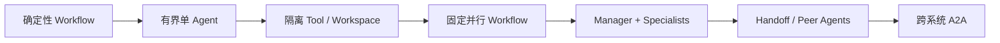
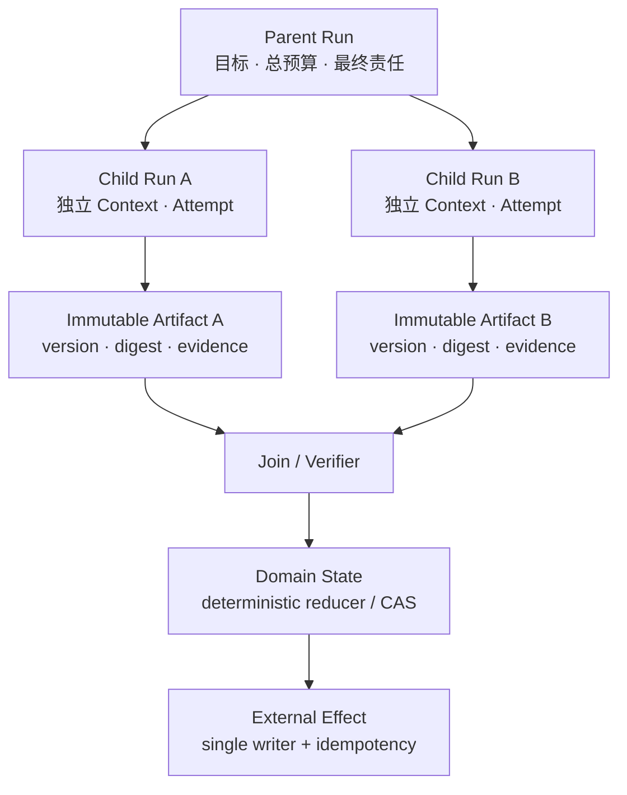
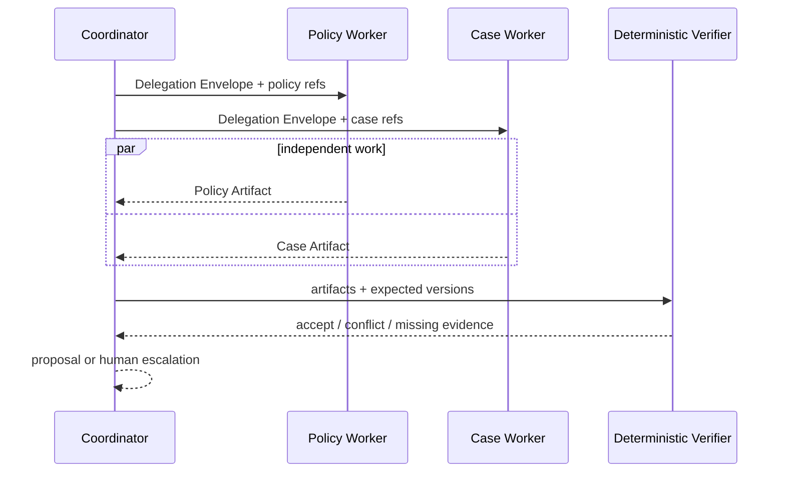

# 11 · Multi-Agent：协作、状态与验证

在 Claude Code 或 Codex 中，把代码检索、实现和复核交给不同 subagent，常常能减少单个上下文中的噪声，也能并行处理互不依赖的工作。产品中的 Multi-Agent（多智能体）系统使用了相似思路，却多出一组不能靠 Prompt 解决的问题：谁拥有任务、谁能使用哪些工具、子任务失败后如何恢复、多个结果冲突时由谁裁决。

因此，Multi-Agent 不是“让多个角色聊起来”，而是把一个 Run 拆成多个具有独立上下文、预算和生命周期的执行单元，再用确定性协议重新组合结果。只有隔离、并行或专业化带来的收益超过协调成本时，这种结构才成立。

> 时效性核验：2026-07-15。本章涉及 OpenAI Agents SDK、AI SDK、LangGraph、A2A 与 MAST 的结论依据文末一手资料；具体 API 与稳定性状态应在实现时重新核对。

> 阅读位置：这是模块 05 的进阶分支，不是单 Agent Runtime 的前置。建议先完成 06–09，理解 Knowledge、Authorization、A2A、安全、持久恢复与成本，再返回本章；首次主线阅读可从 05/10 直接进入模块 06。

## 本章目标

- 沿复杂度阶梯判断何时需要 Multi-Agent。
- 区分 Router、Agent-as-Tool、Handoff、Orchestrator-Workers 与跨系统 A2A。
- 为 Parent Run、Child Run、Artifact、权限和外部副作用建立清晰所有权。
- 设计汇合、取消、恢复与冲突裁决，而不是依赖 Agent 自行协商。
- 用同一 Dataset 和预算验证 Multi-Agent 的净收益。

## 1. 先沿复杂度阶梯做选择

下面的结构从左到右增加状态、通信和故障面，但并不代表技术成熟度：



选择时先问四个问题：

1. 子任务是否真的独立，能够在较少共享状态的情况下并行？
2. 是否需要隔离 Context、数据、工作区或工具权限？
3. 是否存在可以验证的专业能力差异，而不只是不同角色名？
4. 汇合规则能否由代码、独立 verifier 或人工明确表达？

如果答案主要是否定的，固定 Workflow 或有界单 Agent 通常更可靠。尤其是多个参与者必须频繁读写同一份状态时，增加 Agent 会把领域问题转化为分布式一致性问题。

## 2. 多次模型调用不等于多个 Agent

一个执行单元是否构成独立 Agent，取决于它是否拥有可辨认的运行边界：

| 维度      | 同一 Agent 的一次步骤 | 独立 Child Agent                           |
| ------- | -------------- | ---------------------------------------- |
| Context | 延续当前 Run       | 按任务重新构建，可与父级隔离                           |
| 生命周期    | 由当前 Loop 控制    | 独立 start、cancel、timeout 与 terminal state |
| 预算      | 消耗父级步骤预算       | 有显式子预算，并计入父级总预算                          |
| 工具与权限   | 沿用当前 Tool Gate | 使用衰减后的能力集合重新授权                           |
| 结果      | Observation    | 版本化 Result / Artifact，经父级验收              |
| Trace   | 当前 span 的步骤    | 可关联的 Child Run / span tree               |

并行调用三个模型生成候选答案，随后由代码选出最高分结果，通常是 Parallel Sampling；它可以只有一个 Agent Runtime。相反，一个只执行一次模型调用的远程专家，只要具有独立身份、状态和任务生命周期，也可能是独立 Agent 系统。

## 3. 用五个坐标描述拓扑

“Supervisor”“Swarm”或“专家团队”这些名称不足以说明系统。更可靠的描述方式是同时写清五个坐标：

| 坐标 | 常见选项                                                     | 需要回答的问题          |
| -- | -------------------------------------------------------- | ---------------- |
| 控制 | 确定性代码 / 模型决策                                             | 谁决定下一步与终止条件？     |
| 组织 | 中心化 / 去中心化 / 混合                                          | 是否存在唯一协调者？       |
| 责任 | Parent 保留 / Handoff 转移                                   | 最终结果由谁签收？        |
| 通信 | Message / Immutable Artifact / Blackboard / Shared State | 事实通过什么载体传播？      |
| 执行 | 顺序 / 同步并行 / 异步                                           | 何时开始汇合，迟到结果如何处理？ |

例如，“中心化协调、Parent 保留责任、Child 只返回不可变 Artifact、最多并行两个任务、由确定性 verifier 汇合”，比“采用 Supervisor 模式”更接近可实现的设计。

## 4. 九种常见模式及其边界

### 4.1 Router

Router 根据输入选择一个固定分支。分支和汇合由代码预先定义时，它仍是 Workflow。模型可以作为 classifier，但不因此形成 Multi-Agent。

### 4.2 Manager + Agent-as-Tool

Manager 把有限任务交给 Specialist，Specialist 像一个高延迟、非确定性的 Tool 返回结果。Manager 保留用户会话和最终责任，适合检索、分析或代码审查等可以独立验收的工作。

OpenAI Agents SDK 将这种结构称为 agents as tools；与 Handoff 相比，原 Agent 仍然负责后续对话和结果整合。

### 4.3 Orchestrator-Workers

Orchestrator 根据任务动态拆分 Worker 数量，常用于范围未知、可以并行探索的问题。它比固定并行 Workflow 多了一层模型决策，因此必须限制 fan-out、深度、总预算和递归委派。

### 4.4 Scatter-Gather

系统向多个 Worker 分发独立分片，再统一汇合。适合按文档、仓库、客户或区域分区的检索与分析。分片有重叠时，要显式测量重复工作和遗漏率。

### 4.5 Handoff

Handoff（责任移交）把当前任务或对话的 active owner 转移给另一个 Agent。它适合权限、语言或领域边界发生明显变化的场景，但需要完整交接上下文和恢复规则。OpenAI Agents SDK 的 Handoff 会改变后续负责处理输入的 Agent，这与“调用专家后回到 Manager”不同。

### 4.6 Evaluator-Optimizer

Generator 产生候选，Evaluator 按明确标准提出缺陷，再进入有限轮修订。Evaluator 必须与 Generator 的失败模式尽量独立，并设置最大轮数；否则容易出现 grader gaming 或无限往返。

### 4.7 Debate / Voting

多个 Agent 独立作答，再辩论或投票。多数票不是事实：参与者使用相同模型、Context 或检索源时，错误高度相关。只有存在可校验标准或互补证据源时，投票才可能增加信息。

### 4.8 Blackboard

多个 Agent 向共享工作区发布 Artifact，由其他参与者订阅或补充。Blackboard 适合异步协作，但每个 Artifact 必须不可变、可溯源、带版本；直接共同修改一段自然语言会让冲突和责任无法回放。

### 4.9 Hybrid

生产系统常把确定性 Workflow 作为骨架，只在少数节点启动 Agent。例如代码负责分片、并行、超时与汇合，Agent 只负责每个分片内的开放式判断。这通常比让 Agent 自行管理整个拓扑更容易验证。

## 5. Delegation、Handoff 与 A2A Task 不是同一件事

三者改变的责任范围不同：

| 机制                         | 谁保留用户责任                  | 典型生命周期          | 适用边界           |
| -------------------------- | ------------------------ | --------------- | -------------- |
| Delegation / Agent-as-Tool | Parent Agent             | 子调用完成后返回 Parent | 同一应用内的专家能力     |
| Handoff                    | 新的 active Agent          | 新 Agent 接管后续处理  | 职责或权限需要整体转移    |
| A2A Task                   | 调用方负责业务验收，远端拥有 Task 执行状态 | 可异步、可查询、可取消     | 跨团队、跨进程或跨供应商系统 |

A2A（Agent2Agent Protocol）定义的是跨系统发现和协作的 Wire Contract，不决定应用内部应该采用哪种组织模式。远程 Task 返回 `completed`，只表示对方的协议任务结束，不表示本地业务已经接受结果。

三种机制都需要明确的 Coordination Contract（协作边界契约），但只有 Handoff 会转移 active owner。通用信封可写成：

```ts
type CoordinationEnvelope = {
  schemaVersion: 1;
  parentRunId: string;
  taskId: string;
  attemptId: string;
  goal: string;
  constraints: string[];
  successCriteria: string[];
  inputRefs: Array<{ uri: string; digest: string; trust: string }>;
  allowedCapabilities: string[];
  expectedResultSchema: string;
  deadline: string;
  budget: { steps: number; tokens: number; moneyUsd: number };
  traceparent: string;
};
```

Delegation 中，Parent 仍是 active owner，子调用返回后继续原 Run。A2A Task 中，远端持有自己的 Task 生命周期，本地只通过协议句柄跟踪它，并在收到 Artifact 后独立验收。真正的 Handoff 还需要一份 Ownership Transfer Contract：

```ts
type OwnershipTransfer = {
  taskId: string;
  previousOwner: string;
  activeOwner: string;
  ownershipEpoch: number;
  allowReturn: boolean;
  escalationTarget?: string;
  hopPath: string[];
  maxHops: number;
};
```

Handoff 只有在旧 owner、当前 epoch 和新 owner 以原子方式持久化后才生效；旧 owner 随后产生的写入必须因 epoch 过期而被拒绝。`allowReturn`、升级目标和最大跳数应在移交前确定，不能由新 Agent 在自然语言对话中自行扩张。

无论采用哪种机制，接收者都不能把自然语言中的“可以处理退款”解释成执行权限。`allowedCapabilities` 只是本次协作的能力上限，实际权限仍由接收方根据 workload identity、original actor、tenant、purpose 和资源状态重新判定。

## 6. 状态所有权：四类对象不能混在一起

Multi-Agent 最常见的架构错误，是把聊天记录、任务状态和业务事实放在同一份共享对象中。至少应区分：



- **Parent Run**：持有用户目标、总预算、子任务目录、取消状态与最终结果 ownership。
- **Child Run**：持有独立 Context、模型与工具版本、子预算、Attempt、Checkpoint 和 terminal state。
- **Artifact**：持有可复查结果、证据引用、producer、版本与 digest；发布后不可原地修改。
- **Domain State**：由确定性 reducer 或 Compare-and-Swap 更新，不由多个 Agent 共同维护一段“当前事实”。

对订单、支付、发布等外部副作用，应维持 Single Writer（单写者）原则。Worker 可以提出 Proposal，只有持有资源服务授权和幂等语义的 Executor 可以提交 Command。

## 7. 汇合不是把回答拼在一起

Join（汇合）必须在启动 Worker 前确定基本策略：

| 策略                     | 何时结束              | 适用情况      | 主要风险             |
| ---------------------- | ----------------- | --------- | ---------------- |
| All                    | 所有必需结果终态          | 每个分片都不可缺失 | 尾延迟被最慢 Worker 决定 |
| Partial                | 达到最低覆盖后结束         | 可容忍部分缺失   | 需要标明未覆盖范围        |
| First Valid            | 首个通过 verifier 的结果 | 多个等价候选    | 必须取消其余工作         |
| Quorum                 | 达到独立多数            | 判断源确实独立   | 相关错误形成伪共识        |
| Deterministic Verifier | 契约、证据或测试通过        | 有客观验收标准   | verifier 可能覆盖不全  |
| Human Escalation       | 冲突或风险超过阈值         | 高风险、证据冲突  | 人工队列与响应时间        |

迟到结果只能作为新版本的候选 Artifact，不能覆盖已经关闭的 Parent Run。取消也必须向 Child Run、工具调用和远端 A2A Task 传播；系统同时记录 `cancel_requested_at` 与各执行单元实际停止时间，才能识别取消竞态。

## 8. Multi-Agent 特有的失败模式

MAST 研究从 1,600 多条运行轨迹中归纳了多智能体系统的 14 类失败，并将其组织为系统设计与规格、Agent 间失配、任务验证与终止三组。这类分类适合作为故障审查起点，但具体系统还要叠加分布式执行问题：

- **分解失败**：子任务重叠、遗漏关键依赖，或成功标准不可独立验证。
- **委派失败**：能力选择错误、权限过宽、预算和 deadline 没有传递。
- **通信失败**：结果缺少来源、版本或结构，Coordinator 只能再次猜测。
- **协作失配**：各 Agent 对术语、目标或完成条件理解不一致。
- **验证失败**：Coordinator 接受形式完整但事实错误的 Artifact。
- **级联失败**：上游错误被多个下游当成共享事实，投票反而放大置信度。
- **运行时失败**：重复、迟到、乱序、部分完成、孤儿任务和取消丢失。
- **恢复失败**：Coordinator 崩溃后重复创建 Child Run，或新 owner 接受旧 epoch 的写入。

Trace 必须保留 `parent_run_id`、`child_run_id`、`task_id`、`attempt_id`、`artifact_digest`、`delegation_depth` 与 `ownership_epoch`，否则成本和错误无法归因。

## 9. 安全边界会随委派扩张

Multi-Agent 会新增两类攻击面。第一类是权限放大：父级把自己无权使用或本不需要的能力传给 Worker。第二类是下游 Prompt Injection：恶意内容被包装成“另一个 Agent 的结论”，获得了不应有的信任。

应采用以下约束：

- 每个执行单元使用可辨认的 workload identity，不共用长期高权限凭证；
- 权限沿委派链只能衰减，不能由子 Agent 自行扩张；
- 默认禁止递归委派，需要时设置深度、fan-out 和累计预算上限；
- Artifact 保留 provenance 与 trust label，Agent 输出永远不是可信指令；
- 每次外部操作在资源服务重新授权，不接受 Parent 的自然语言担保；
- 敏感输入按最小化原则分发，Coordinator 也不必看到所有原始数据；
- 新 Agent、Tool 或远端系统进入拓扑前运行独立安全评测。

## 10. 框架如何映射这些语义

框架提供执行机制，不替应用决定状态与责任：

| 技术                | 适合表达                                                        | 仍需应用明确                         |
| ----------------- | ----------------------------------------------------------- | ------------------------------ |
| OpenAI Agents SDK | Agent-as-Tool、Handoff、Run 与 Trace                           | 领域 ownership、服务端授权、Artifact 验收 |
| AI SDK            | Subagent Tool、并行工具与 Harness 组件                              | Child budget、取消、持久状态与业务验收      |
| LangGraph         | StateGraph、`Send`/`Command`、subgraph、checkpoint 与 interrupt | reducer 语义、外部幂等、旧状态迁移          |
| A2A               | 独立系统的 Agent Card、Task、Message、Artifact 与异步交互                | 本地业务接受、权限衰减、预算和循环检测            |

不要先选框架再反推拓扑。先冻结 Parent/Child/Artifact/Effect 的领域契约，再把框架事件适配成这些对象。下一章会用同一条 Runtime Slice 对照 AI SDK 与 LangGraph。

## 实践：为 Resolution Desk 增加可删除的双 Worker 路径

### 进入本章时已有能力

Resolution Desk 已能由单 Agent 查询订单和政策、生成退款 Proposal，并由确定性 Policy 与审批链控制外部动作。这条单 Agent 路径是对照组，不应删除。

### 本章增加的能力

只对“证据冲突或高金额”Fixture 启动两个只读 Worker：

- **Policy Evidence Worker**：只读取版本化政策，输出适用条款、有效时间和冲突。
- **Case Evidence Worker**：只读取工单、订单与物流事实，输出事件时间线和缺失字段。

Coordinator 是唯一 Parent owner。两个 Worker 不共享可写状态、不互相调用，也没有退款执行权限；它们只返回不可变 Artifact。Join 按订单版本、政策有效时间和引用完整性运行确定性检查，再允许 Coordinator 生成 `RefundProposal`。



故障注入至少包括：重复结果、迟到结果、相互冲突的证据、恶意 Artifact 内容、一个 Worker 超时、Parent cancel、政策版本在汇合前变化，以及 Coordinator 在创建 Child 后崩溃恢复。

最后可以把一个 Worker 替换为 A2A 远端系统，验证 Adapter 是否保持相同领域契约。这个步骤属于跨系统互操作实验，不是默认产品路径。

### 验收证据

在相同 Dataset、模型家族和总预算约束下，比较：

1. 固定 Workflow；
2. 有界单 Agent；
3. 单 Agent 的 best-of-N；
4. Coordinator + 双 Worker；
5. 启用跨系统互操作实验时，再加入一个 Worker 经 A2A 调用的版本。

至少报告：任务成功率、证据覆盖率、重复工作率、契约违规率、冲突识别率、P50/P95 延迟、总 Token、单位成功任务成本、fan-out、取消收敛时间和各类失败占比。Multi-Agent 只有在目标切片上持续改善结果，并且恢复与权限测试通过时才保留；否则删除它。

## 常见误区

- 给同一个模型三个角色名称，就获得了三个独立专家。
- Agent 数量越多，结果越全面。
- 多数投票可以抵消事实错误。
- Parent 的权限可以原样传给所有 Child。
- Child Run 完成等于业务结果已经被接受。
- A2A 或框架会自动解决循环、预算、取消和状态一致性。

## 本章小结

Multi-Agent 的核心不是角色编排，而是控制权、状态所有权、能力衰减和结果验证。可靠系统通常以确定性 Workflow 为骨架，让 Agent 在可隔离、可并行、可验收的局部执行，再通过版本化 Artifact 与明确 Join 收敛。下一章将保持这些领域契约不变，对照 [AI SDK 与 LangGraph 的 Runtime 实现](/masterpiece-static-docs/05-模型接口与Agent内核/12-AI-SDK与LangGraph对照实践.md)。跨系统协作的 Wire Contract 见 [A2A 与跨 Agent 协作协议](/masterpiece-static-docs/07-工具-协议与行动控制/05-A2A与跨Agent协作协议.md)。

## 官方资料与研究

- [OpenAI Agents SDK: Multi-agent orchestration](https://openai.github.io/openai-agents-js/guides/multi-agent/)
- [OpenAI Agents SDK: Handoffs](https://openai.github.io/openai-agents-js/guides/handoffs/)
- [AI SDK: Subagents](https://ai-sdk.dev/docs/agents/subagents)
- [LangGraph: Graph API](https://docs.langchain.com/oss/javascript/langgraph/graph-api)
- [LangGraph: Subgraphs](https://docs.langchain.com/oss/javascript/langgraph/use-subgraphs)
- [A2A Protocol v1.0.0](https://a2a-protocol.org/v1.0.0/specification/)
- [Anthropic: How we built our multi-agent research system](https://www.anthropic.com/engineering/multi-agent-research-system)
- [MAST: Why Do Multi-Agent LLM Systems Fail?](https://arxiv.org/abs/2503.13657)
