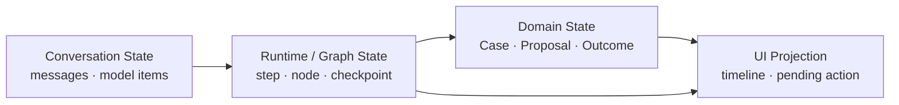
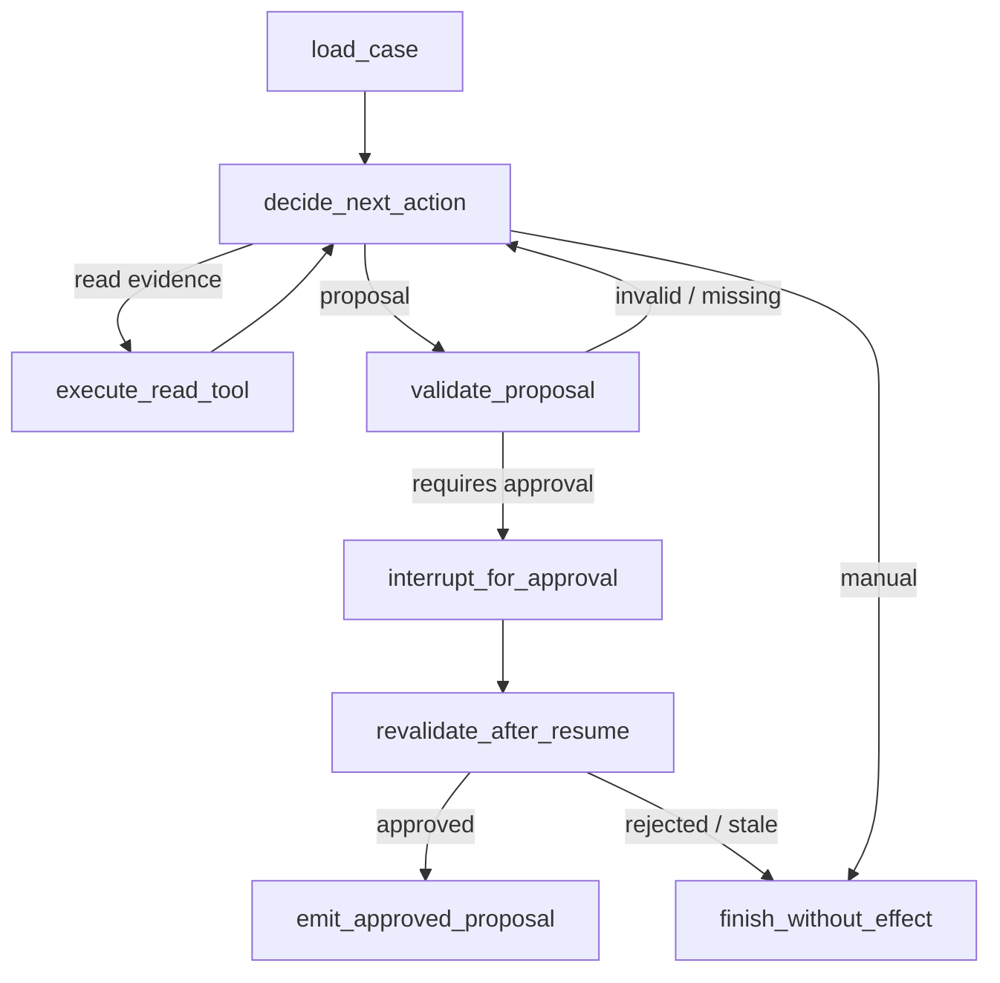

# 12 · 同一条 Runtime Slice：AI SDK 与 LangGraph 对照实践

框架示例通常展示各自最顺畅的路径：几行代码声明 Tool、流式返回一段文本，或者画出一张会暂停和恢复的图。这样的 Demo 适合了解 API，却无法回答更重要的问题：框架接管了哪些 Harness 职责，故障发生时哪些代码会重跑，应用能否保留自己的领域状态与验收体系。

本章不把 AI SDK 与 LangGraph 当成同一种产品，也不做功能清单竞赛。实验固定 Resolution Desk 的同一条 Runtime Slice——“读取订单与政策，生成退款 Proposal，必要时等待人工决定”——分别接入两个 Runtime，再比较它们的抽象、状态与故障语义。

> 时效性核验：2026-07-15。AI SDK 7、LangGraph.js API 与稳定性状态依据文末官方资料；采用时应固定实际版本，并重新运行本章故障矩阵。

> 阅读位置：本章沿用第 06 至 09 部分已经建立的领域状态、Authorization、Checkpoint、Telemetry 与发布语义。完成这些主线内容，并读过前一章的 Multi-Agent 状态边界后，再进行框架对照。

## 本章目标

- 建立不依赖框架的 Framework Port 与领域状态。
- 理解 AI SDK 适合解决的模型、Tool Loop、UI 与 Harness 切片。
- 理解 LangGraph 适合解决的显式状态图、Checkpoint、Interrupt 与 Subgraph。
- 区分框架恢复、持久工作流（Durable Workflow）与外部副作用的 Exactly-once 语义。
- 用 Ejection Test 验证框架没有侵入领域契约。

## 1. 比较框架前先冻结实验变量

两个实现必须共享以下输入，否则比较结果只是 Prompt、模型或 Tool Schema 的差异：

| 冻结项                    | 具体内容                                                          |
| ---------------------- | ------------------------------------------------------------- |
| Task Contract          | 输入、允许动作、成功标准、停止与转人工条件                                         |
| Domain Types           | `Case`、`Evidence`、`RefundProposal`、`Approval`、`RefundOutcome` |
| Tool Contract          | 名称、JSON Schema、类型化结果、超时、风险与幂等语义                               |
| Canonical Event        | Run、Model、Tool、Approval、Error、Usage 与终态事件                     |
| Dataset                | 正常、缺失信息、政策冲突、越权、超时与未知外部效果 Fixture                             |
| Trial Config           | 模型版本、Prompt 版本、Temperature、Step / Token / Time / Money Budget |
| Fault Injection        | 断流、Tool 超时、取消；durable tier 另加进程重启、过期审批与旧 checkpoint           |
| 持久化层级（durability tier） | 进程内 Loop 或跨进程恢复；同一轮比较必须处于同一层级                                 |

框架内部消息可以不同，最终都必须转换成相同 `RunEvent` 和领域对象。禁止为了让某个框架更容易接入而改变成功标准。

## 2. 用 Framework Port 隔离 Runtime

应用只通过一个窄接口调用 Agent Runtime：

```ts
type RunInput = {
  runId: string;
  caseId: string;
  actorRef: string;
  expectedCaseVersion: string;
  budget: {
    maxSteps: number;
    maxTokens: number;
    deadlineAt: string;
  };
};

type ResumeInput = {
  runId: string;
  interruptionId: string;
  decision: "approve" | "reject";
  proposalHash: string;
  actorRef: string;
};

interface AgentRuntimePort {
  start(input: RunInput, signal: AbortSignal): AsyncIterable<RunEvent>;
  resume(input: ResumeInput, signal: AbortSignal): AsyncIterable<RunEvent>;
  cancel(runId: string, reason: string): Promise<void>;
  inspect(runId: string): Promise<PublicRunSnapshot>;
}
```

Port 没有暴露某个 Provider 的 Response、AI SDK 的 UI Message 或 LangGraph 的 Checkpoint Tuple。框架专有对象只能存在于 Adapter 内部；这样，Native Client、AG-UI Adapter、Eval Harness 和领域服务就能继续使用同一协议。

## 3. 四类状态必须分离

比较过程中最容易误判的是“框架支持状态”。不同状态解决的是不同问题：



- **Domain State** 是订单、Proposal、Approval 与外部 Outcome，由应用服务持有。
- **Runtime / Graph State** 记录 Loop 或 Graph 如何继续执行，由 Runtime 与 Checkpointer 管理。
- **Conversation State** 是下一次模型调用所需的消息与 Item，可以压缩或重建。
- **UI Projection** 从 Canonical Event 和 Domain State 推导，不能反向成为事实源。

把这四类状态放进同一个 `messages` 数组，会让恢复、迁移和审计都依赖模型上下文；把它们全部放进 Graph State，也会让框架升级演变成领域数据迁移。

## 4. AI SDK 路径：以模型与 Tool Loop 为中心

AI SDK 的优势是 TypeScript-first 的模型抽象、Structured Output、Tool Calling、流式传输、Agent Loop 与 UI 组合。AI SDK 7 进一步提供类型化的 runtime/tool context、tool approval、timeout、telemetry，以及 Workflow/Harness 等 Agent 抽象。`ToolLoopAgent` 负责进程内循环，`WorkflowAgent` 才承担跨进程持久执行；官方将 `HarnessAgent` 和相关 Harness 抽象标记为实验性（experimental）。它适合希望优先解决多 Provider 和产品流式体验，同时保持控制流相对局部的应用。

### 4.1 适配思路

```text
RunInput
→ build application context
→ create AI SDK agent / bounded generation
→ adapt full stream parts
→ validate tool proposal
→ execute through application Tool Gate
→ convert result to typed observation
→ emit Canonical RunEvent
→ return RefundProposal or interruption
```

实现时关注职责位置，而不是追求最少代码：

- `ToolLoopAgent` 或等价的有界 Agent API 负责模型与 Tool 的多步循环；
- `stopWhen`、timeout 和应用预算共同限制运行，不能只依赖模型自行停止；
- runtime/tool context 传递本次 Run 的类型化依赖，不应塞入浏览器可见消息；
- Tool 的输入仍在 Tool Gate 做 Schema、领域、Policy 与资源版本校验；
- approval API 表达暂停与继续，应用仍要绑定 actor、Proposal Hash、有效期和资源版本；
- AI SDK 的 stream part 先进入 Adapter，再转换成应用的 Canonical Event；
- telemetry 导出到统一 Trace，但 Audit 和业务 Outcome 仍来自权威服务。

需要跨进程恢复时，再用 `WorkflowAgent` 实现持久化层级（durable tier）；不要把未承诺的 checkpoint 语义归给 `ToolLoopAgent`。`HarnessAgent` 适合单独进行 Claude Code / Codex Harness Adapter 实验，不进入本章 AI SDK 与 LangGraph 的稳定能力对照。

### 4.2 UI Message 不是领域事件

AI SDK UI 擅长处理聊天与流式交互，但它的 message/data part 面向展示与客户端同步。Resolution Desk 仍需要自己的：

```text
run.sequence
proposal_hash
approval_status
effect_status
resource_version
terminal_reason
```

这些字段不能只存在于某条 UI message 中。Adapter 可以把 `run.waiting_approval` 映射为 UI 可渲染的数据块，也必须能够从 Event Store 重建相同的公开状态。

### 4.3 测试切入点

AI SDK 提供 Mock Language Model 和可控流式测试能力，适合复现：

- 一个 Tool Call 被拆成多个流片段；
- 流在 Tool 参数尚未闭合时中断；
- Provider 返回重复或未知的 part；
- Tool 完成早于或晚于用户取消；
- 恢复审批流程时使用了过期的 Proposal Hash；
- 第二步超过总 Token 或时间预算。

Mock 只能验证 Adapter 和 Runtime 语义。模型质量仍要通过真实模型的 Trial 与 Dataset 评测。

## 5. LangGraph 路径：以显式状态转移为中心

LangGraph 是低层编排运行时（Orchestration Runtime）。它的核心抽象是显式状态（state）、节点（node）与边（edge），并提供持久化、持久执行、流式输出、`interrupt` 与 Human-in-the-loop。它适合流程存在多个可命名阶段、需要 checkpoint 与 resume，或者已经真正需要 subgraph 隔离和图状态调试的场景。

### 5.1 把 Slice 表达为状态图



Graph State 只保存继续运行所需的投影，例如消息、证据、Proposal 和中断记录的引用，以及剩余步数。订单全文、Approval 记录与退款 Outcome 仍由领域服务持有。

### 5.2 Reducer 决定并发语义

LangGraph state channel 的 Reducer 决定多个更新如何合并。默认覆盖只适合单写字段；并行 worker 向同一 channel 写入时，需要显式 Reducer 或拆分 channel。

```ts
type RuntimeState = {
  evidenceRefs: EvidenceRef[];
  proposalRef?: string;
  remainingSteps: number;
  interruptionRef?: string;
};
```

`evidenceRefs` 可以按稳定 key 去重合并；`proposalRef` 应保持单写者（Single Writer）；`remainingSteps` 不能由两个并行节点各自覆盖。Reducer 是状态机语义的一部分，需要单元测试和版本管理。

### 5.3 `Send`、`Command` 与 subgraph

- `Send` 适合动态 fan-out，把不同输入发送到同一 worker node；
- `Command` 可以同时更新状态并控制下一跳；
- subgraph 适合隔离一段独立状态或复用执行单元。

这些机制能够表达 Multi-Agent，却不会自动提供子任务预算、权限衰减或业务汇合（join）。多数一次性 subagent 适合单次调用（per-invocation）的 subgraph 状态；需要跨调用记忆时，再明确选择持久化模式和 namespace。

### 5.4 Interrupt 的重放边界

LangGraph 的 `interrupt` 会暂停运行，并在 resume 后从包含该 interruption 的 node 重新执行。因此，`interrupt` 之前的代码可能再次运行：

```text
读取当前 Proposal
→ 验证可审批
→ interrupt 等待人工决定
→ resume 后从该 node 开头重跑
```

这要求 `interrupt` 前的操作保持只读或幂等。不能先发送真实退款，再调用 `interrupt` 等待确认。对必须写入的准备记录，应使用稳定 key、upsert，或者把副作用移动到 resume 后的独立 node。

### 5.5 Checkpoint 迁移是产品责任

Graph 升级时，旧 Run 可能仍停留在某个 node 或旧 state schema 上。发布前至少验证：

- 新增、删除或重命名 node 后，旧 checkpoint 能否继续；
- state 字段新增、改名或 Reducer 变化时如何迁移；
- Tool Schema 与 Prompt 版本是否与 checkpoint 一同固定；
- 旧 interruption 恢复时，Proposal 和资源版本是否仍有效；
- 无法安全迁移时，如何进入人工接管而不是静默重跑。

## 6. 两条路径的真实差异

| 问题                     | AI SDK 更自然的切入点                | LangGraph 更自然的切入点                       |
| ---------------------- | ----------------------------- | --------------------------------------- |
| 多 Provider 与统一模型调用     | Model abstraction、Core API    | 通过模型集成或自建 Adapter                       |
| 有界 Tool Loop           | Agent / generation primitives | loop node + conditional edges           |
| React/Next.js 流式 UI    | AI SDK UI 与 transport         | 自建 Event Adapter 或上层 UI 集成              |
| 显式流程状态                 | 应用状态机或 Harness abstraction    | StateGraph、node、edge、Reducer            |
| checkpoint / interrupt | 取决于采用的 Agent/Workflow slice   | 原生 persistence 与 interrupt 模型           |
| 动态 fan-out / subgraph  | subagent / Tool orchestration | `Send`、subgraph 与 graph composition     |
| 故障可见性                  | stream part、step、telemetry    | state update、node transition、checkpoint |
| 主要抽象成本                 | UI/model 类型可能向领域泄漏            | Graph State 与执行语义可能向领域泄漏                |

选择不是“哪个功能更多”。如果核心问题是多 Provider、Tool Loop 与 Web UI，AI SDK 往往更短；如果核心问题是显式状态转移、长暂停和图级恢复，LangGraph 往往更直接。两者也可以组合，但只有独立需求同时存在时才值得承担双重状态与 Adapter 成本。

## 7. 再加入 OpenAI Agents SDK 作为第三个坐标

当主要模型能力来自 OpenAI，OpenAI Agents SDK for TypeScript 可作为限时对照：它提供 Agent Loop、tool、session、HITL、guardrail、tracing，以及 Agent-as-Tool 与 Handoff。它位于“Provider 原生 Agent Runtime”这一坐标，不必扩展成第三套完整主线。

同样的边界仍然成立：

- SDK 的 Run State 不替代订单和 Proposal 的领域状态；
- guardrail 不替代资源服务的 Authorization；
- Handoff 改变当前 Agent，但不会自动转移业务权限；
- tracing 不等于合规 Audit；
- session 不等于长期持久工作流（durable workflow）。

读者只需用相同的 Framework Port 实现一次最小 Adapter，观察 Provider 原生能力能够减少哪些粘合代码（Glue Code）。

## 8. Framework Runtime 不等于 Durable Workflow

LangGraph checkpoint、AI SDK `WorkflowAgent` 与 Temporal/Inngest 一类持久工作流可能都支持暂停和恢复，但不能仅凭“支持 resume”就视为等价。实验分成两个层级：

- **进程内层级（process-local tier）**：`ToolLoopAgent` 对比不承诺跨进程恢复的 LangGraph 实现，只运行流式、Tool、预算、取消和进程内状态测试。
- **持久化层级（durable tier）**：`WorkflowAgent` 对比使用持久 Checkpointer 的 LangGraph，实现进程重启、延迟审批、旧状态迁移和跨部署恢复。

只有处于同一持久化层级（durability tier）的结果才可以比较。随后分别验证：

| 语义             | 必须确认的问题                                                |
| -------------- | ------------------------------------------------------ |
| 持久化时点          | 哪些状态与事件已经写入持久存储，崩溃时最多丢失什么？                             |
| 重放模型           | resume 时会重跑整个函数、某个 node，还是从外部事件继续？                     |
| Timer / Signal | 跨小时等待、外部 webhook 和 deadline 如何可靠交付？                    |
| Worker 升级      | 旧执行记录如何与新代码共存？                                         |
| 外部副作用          | Command 是否幂等，ACK 丢失后如何 Reconciliation？                 |
| Ownership      | 多个 Worker 恢复同一 Run 时，如何用单调递增的 fencing token 拒绝旧 owner？ |

任何 checkpoint 都不会让支付、邮件或工单修改自动获得 exactly-once 语义。可靠性仍来自稳定 Intent、Idempotency Key、Outbox、Receipt、Reconciliation 和权威 Outcome。

## 9. 用故障矩阵代替 Happy Path 演示

两个 Adapter 应在各自声明的同一 durability tier 中通过对应矩阵：

| 故障                           | 预期不变量                                    |
| ---------------------------- | ---------------------------------------- |
| 模型流半途断开                      | 不执行不完整 Tool Call；Run 可重试或明确失败            |
| Tool 超时                      | Observation 区分“效果未知”与“已确认失败”；预算递减        |
| 用户取消与 Tool 完成竞态              | 不启动新步骤；已发生效果进入核对                         |
| Approval 过期后恢复（durable）      | 拒绝旧决定，重新生成或转人工                           |
| `interrupt` 前进程崩溃（durable）   | 恢复时不重复外部副作用                              |
| 外部服务已提交、ACK 丢失（durable）      | 使用相同 Intent / Key 查询，不创建新动作              |
| 节点/Prompt/Tool 版本升级（durable） | 旧 Run 使用固定版本或显式迁移                        |
| Provider / 模型切换              | 领域类型、Canonical Event、Dataset 与 Grader 不变 |
| 重复事件 / checkpoint            | Reducer 与 Projection 幂等                  |

除了 Outcome，还要比较 Trajectory、恢复步骤、P50/P95 延迟、Token 用量、单位成功任务成本、敏感数据进入模型或 Trace 的范围，以及开发者定位失败所需的时间。

## 10. Ejection Test：验证框架可以被替换

Ejection Test 不是要求随时删掉所有依赖，而是检查应用核心是否被框架类型锁住：

```text
替换 AgentRuntimePort Adapter
        │
        ├─ Domain Types 不变
        ├─ Tool Gate / Policy 不变
        ├─ Canonical RunEvent 不变
        ├─ Dataset / Grader 不变
        ├─ UI Public State 不变
        └─ Audit / Outcome 不变
```

如果替换 Runtime 需要重写退款 Proposal、审批契约、前端状态和整个 Dataset，问题不是“框架锁定”这个标签，而是领域边界没有建立。Ejection Test 通过后，即使长期保留框架，也能更安全地升级主要版本或替换 Provider。

## 实践：完成 Resolution Desk 的双 Adapter 实验

### 进入本章时已有能力

Resolution Desk 已有手写 Provider Adapter、Tool Gate、有界 Agent Loop、Canonical Event 与故障 Fixture。它们组成第三个对照：手写 Baseline。

### 本章增加的能力

1. 固定“读取订单与政策，生成 Proposal，等待审批”的 Runtime Slice。
2. 定义 `AgentRuntimePort`，使手写 Runtime、AI SDK Adapter 与 LangGraph Adapter 使用同一输入输出。
3. 先完成进程内层级：AI SDK 使用 `ToolLoopAgent`，LangGraph 不启用持久恢复，两者都不改变领域事件。
4. 需要验证跨进程恢复时，再完成持久化层级：AI SDK 使用 `WorkflowAgent`，LangGraph 显式定义持久 Checkpointer、state、Reducer、node、edge 与 `interrupt`。
5. 运行各层对应的故障矩阵，并保存每次 Trial 的版本、Trace 与 Artifact；不支持的能力记为 `unsupported`，不能算作通过。
6. 执行 Ejection Test：把同一层级的运行时从 A 切换到 B，不修改 Domain、Policy、Eval 和 UI Reducer。

### 验收证据

实验报告至少回答：

- 哪个实现减少了已知样板代码，而不是只缩短 Demo？
- 哪些状态由框架持有，哪些仍由应用持有？
- 恢复时哪些代码会重跑，外部副作用如何避免重复？
- 原始事件能否完整导出并映射到 Canonical Event？
- 旧 Run 跨部署能否恢复，失败时是否有人工接管路径？
- Ejection Test 改动了哪些文件与契约？

主线建议仍是“手写最小 Baseline + AI SDK Core/UI 的必要切片 + 一个经过同等级故障验证的候选 Runtime”。无须为了覆盖生态而同时在主路径中运行多套 Agent 框架。

## 常见误区

- 代码行数最少的 Adapter 就是工程成本最低的方案。
- 框架支持状态持久化，就可以承载全部业务状态。
- Checkpoint 意味着外部副作用具有 exactly-once 语义。
- Tool approval API 已经替代服务端 Authorization。
- AI SDK 与 LangGraph 必须二选一，或者应该默认同时使用。
- 框架升级只影响依赖包版本，不影响暂停中的旧 Run。

## 本章小结

框架评估的最小单位不是功能列表，而是一条冻结契约、可以注入故障的 Runtime Slice。AI SDK 更贴近模型、Tool Loop 与 Web UI，LangGraph 更贴近显式状态图、checkpoint 和 `interrupt`；应用仍需持有领域事实、授权、副作用与验收。通过 Framework Port、故障矩阵和 Ejection Test，框架才能成为可替换的 Harness 组件，而不是整套产品的数据模型。

## 官方资料

- [Vercel: AI SDK 7](https://vercel.com/changelog/ai-sdk-7)
- [Vercel: AI SDK 7 release](https://vercel.com/blog/ai-sdk-7)
- [AI SDK: Agents](https://ai-sdk.dev/docs/agents/overview)
- [AI SDK: Tools and tool calling](https://ai-sdk.dev/docs/ai-sdk-core/tools-and-tool-calling)
- [AI SDK: Testing](https://ai-sdk.dev/docs/ai-sdk-core/testing)
- [AI SDK: Telemetry](https://ai-sdk.dev/docs/ai-sdk-core/telemetry)
- [AI SDK: Versioning](https://ai-sdk.dev/docs/migration-guides/versioning)
- [LangGraph.js overview](https://docs.langchain.com/oss/javascript/langgraph/overview)
- [LangGraph: Graph API](https://docs.langchain.com/oss/javascript/langgraph/graph-api)
- [LangGraph: Interrupts](https://docs.langchain.com/oss/javascript/langgraph/interrupts)
- [LangGraph: Persistence](https://docs.langchain.com/oss/javascript/langgraph/persistence)
- [LangGraph: Subgraphs](https://docs.langchain.com/oss/javascript/langgraph/use-subgraphs)
- [LangGraph: Backwards compatibility](https://docs.langchain.com/oss/javascript/langgraph/backward-compatibility)
- [OpenAI Agents SDK for TypeScript](https://openai.github.io/openai-agents-js/)

[下一项进阶实验：A2A 与跨 Agent 协作](/masterpiece-static-docs/07-工具-协议与行动控制/05-A2A与跨Agent协作协议.md)
