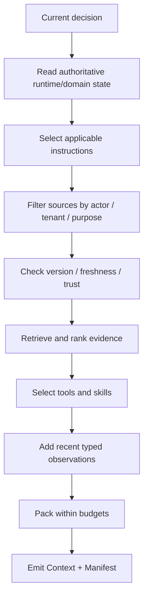

# 01 · Context Engineering

Resolution Desk 不应把整张订单表、全部政策、完整聊天历史和所有工具一次性塞进模型窗口。判断退款资格时需要当前订单与有效政策；等待审批时需要冻结的 Proposal、资源版本与审批期限。Context Engineering 的核心不是“窗口能装多少”，而是每一轮选择了什么、遗漏了什么、哪些内容已经过期。Claude Code 或 Codex 按需搜索文件和外置长任务工件，可以作为这种选择机制的类比。

Context 不是聊天历史的别名，而是 Runtime 针对当前决策生成的一份有限投影。本章把这份投影变成可实现、可追踪和可评测的构建流程。

## 本章目标

- 把 Context 建模为每轮从权威状态生成的函数结果。
- 理解 select、retrieve、compress、externalize、isolate 和 refresh 的差异。
- 为 Context 分配 token、延迟、费用与风险预算。
- 通过 Context Manifest 复现模型当时看到的内容。

## 1. Context 是一次决策的输入，不是全量数据

```text
Context_t = f(
  current_decision,
  stable_instructions,
  runtime_state,
  selected_history,
  tool_definitions,
  retrieved_evidence,
  recent_observations,
  output_contract,
  budgets
)
```

同一个 Run 的不同步骤需要不同 Context。例如售后 Agent 在判断退款资格时需要订单详情和政策证据；进入等待审批后，重点变成冻结的 proposal、金额、资源版本和审批有效期。继续附加全部旧消息，会把已经失效的订单快照重新带回模型。

Context 的基本原则是：从本轮唯一决策反推必要输入，而不是先收集一切，再试图在窗口超限时裁剪。

## 2. Context Engineering 的核心操作

| 操作          | 目的              | 典型例子                                 |
| ----------- | --------------- | ------------------------------------ |
| Select      | 只保留当前决策必要的信息    | 只读取与报错堆栈相关的两个源文件                     |
| Structure   | 分离指令、状态、证据和输出协议 | 把 Tool Result 标记为 untrusted evidence |
| Retrieve    | 按需从外部来源取得内容     | 查询当前生效的退款政策                          |
| Compress    | 用有损表示替换部分历史     | 将已完成的探索过程压缩成摘要                       |
| Externalize | 把工件放到模型窗口之外     | 保存计划、报告草稿、查询结果文件                     |
| Isolate     | 子任务使用独立 Context | Reviewer 只接收 diff、规范与测试结果            |
| Refresh     | 从最新权威状态重新构建     | 执行退款前重新读取订单版本                        |

这些操作可以组合，但不能混为同一个“缩短 Prompt”动作。Externalize 保留原始工件，Compress 会丢失细节，Isolate 改变信息边界，Refresh 则用新事实替代旧投影。

## 3. Context Builder 的执行顺序

一条可实施的构建流程如下：



### 3.1 定义本轮决策

`continue_task` 过于含糊；`decide_refund_eligibility`、`select_next_read_only_tool` 或 `draft_refund_proposal` 才能反推出输入边界和输出契约。

### 3.2 读取权威状态

从 Runtime Snapshot 和领域数据库读取当前阶段、资源版本、未决问题与允许动作。聊天历史中的旧描述不具备同等权威性。

### 3.3 选择稳定指令

根据 workspace、tenant、任务类型和版本选择适用规则。过期、冲突或 scope 不匹配的规则不应进入 Context。

### 3.4 在检索前过滤权限

先用 actor、tenant、purpose 和 destination 缩小候选范围，再执行 retrieval。不能在模型已经看到无权内容后，才要求它“不要使用”。

### 3.5 只暴露当前需要的工具

Tool definition 也消耗 Context，并改变模型可感知的行动空间。判断资格时只需要 query tools；`commit_refund` 应在策略允许且确实进入提交阶段后再出现。

### 3.6 打包输出契约与预算

明确允许的结果类型、停止条件、最大 evidence 数量和 token 预算。构建完成后记录排除理由，便于回放和消融。

## 4. 一个 TypeScript Context Builder 骨架

```ts
type ContextBuildRequest = {
  runId: string;
  decision: "decide_refund_eligibility" | "draft_refund";
  actor: { id: string; tenantId: string; scopes: string[] };
  tokenBudget: number;
};

type ContextManifest = {
  builderVersion: string;
  decision: string;
  stateVersion: string;
  instructionVersions: string[];
  evidence: Array<{
    sourceId: string;
    version: string;
    chunkIds: string[];
  }>;
  toolsetVersion: string;
  excluded: Array<{ id: string; reason: string }>;
  estimatedTokens: number;
};

async function buildContext(
  request: ContextBuildRequest,
): Promise<{ messages: ModelInput[]; manifest: ContextManifest }> {
  const state = await loadAuthoritativeState(request.runId);
  const instructions = await selectInstructions(request, state);
  const tools = selectTools(request.decision, request.actor, state);
  const mandatoryTokens = estimateMandatoryTokens({ state, instructions, tools });
  const outputReserve = outputReserveTokens(request.decision);
  const evidenceBudget = Math.max(
    0,
    request.tokenBudget - mandatoryTokens - outputReserve,
  );
  const candidates = await retrieveAuthorizedEvidence(request, state);
  const evidence = await rerankAndPack(candidates, evidenceBudget);

  return renderProviderInput({ request, state, instructions, evidence, tools });
}
```

Provider-specific message 结构只出现在 `renderProviderInput`。示例先为指令、状态、工具定义和模型输出预留空间，检索证据只能使用剩余预算。Manifest 使用应用自己的稳定字段。

## 5. Context Budget 不只是 token 上限

Context 同时受四类预算约束：

- **Token**：输入窗口与输出保留空间。
- **Latency**：检索、rerank、压缩和模型首 token 时间。
- **Cost**：模型输入费用、检索和工具调用费用。
- **Risk**：不可信内容暴露面、敏感数据与工具可供性。

一种常见优先级是：

```text
必须保留
  当前目标、硬约束、权威状态、关键证据、输出契约

按需保留
  相关历史、少量示例、recent observations

优先外置或丢弃
  重复背景、完整日志、大对象、无关工具说明
```

不能只按长度截断。把一条关键否定条件从政策段落末尾裁掉，可能比完全不提供该文档更危险。

## 6. 大型 Tool Result 应该外置

工具返回几万行日志或几百条记录时，不应原样回填下一轮。可采用：

```text
artifact store: 保存完整结果和 content hash
typed summary: 保存结构化统计与关键异常
cursor/query tool: 允许模型按需展开
source reference: 保留原始来源和版本
```

摘要必须标记为 derived。模型需要核对具体事实时，应通过引用重新读取原始工件，而不是把摘要当作不可质疑的事实。

## 7. Compaction、Reset、Externalize 与 Isolation

| 机制                      | 连续性              |        信息损失 | 适用场景                |
| ----------------------- | ---------------- | ----------: | ------------------- |
| Compaction              | 保持同一 Run/Session |           有 | 历史过长，但仍需延续当前任务      |
| Context Reset + Handoff | 创建干净 Context     | 取决于 handoff | 阶段切换或旧 Context 污染明显 |
| Externalize             | 状态留在窗口外          |        无或可控 | 计划、工件、证据和大结果        |
| Subagent Isolation      | 子任务独立 Context    |     只返回有限结果 | 并行探索、权限或专业知识隔离      |

Compaction 可能产生人类可读摘要，也可能产生 provider-specific opaque item。无论形式如何，它都是有损派生表示。Approval、receipt、领域事实和原始 Event 不得只存在于 compaction 结果中。

Reset 的关键不是“换一个新聊天”，而是结构化 handoff：目标、已完成动作、未决问题、证据引用、状态版本、预算和停止条件必须明确交接。

## 8. 可复现性与 Prompt Cache

Context Manifest 至少记录：

```text
builder version
instruction / toolset / schema versions
state snapshot version
evidence source / version / chunk ids
compaction version and source event range
input tokens / cached input tokens
exclusion reasons
```

隐私策略可能禁止长期保存完整 Context，但在允许的保留期内仍应能定位来源或重建输入。

稳定前缀的排列可能影响 Provider Prompt Cache。具体缓存键、保留和计费以目标 API 文档为准。缓存优化不能让过期规则长期固定，也不能删除完成判断所需证据。

## 9. Context 需要独立评测

模型结果下降时，可能并不是模型本身退化，而是 Context Builder：

- 选错政策版本；
- top-k 中缺少关键证据；
- 无关工具干扰了 Tool selection；
- compaction 丢失未决约束；
- 旧 observation 覆盖了新领域状态。

评测应同时观察 outcome、evidence coverage、tool-selection accuracy、input token、latency 和 policy violation。通过消融对比全量历史、selective history、retrieval、rerank 和 compaction，才能知道哪项机制真正有收益。

## 实践：为 Resolution Desk 建立 Context Builder

### 进入本章时已有能力

Resolution Desk 已有可恢复的 Web UI、Canonical Event 和有界只读 Loop，但模型输入仍缺少统一的来源、选择理由与预算清单。

### 本章增加的能力

改造上一模块的退款 Agent Loop：

1. `buildContext(snapshot)` 返回结构化输入和 Manifest。
2. 过期政策与无权文档在 retrieval 前被排除。
3. `commit` 工具只在允许提交的状态中暴露。
4. 大 Tool Result 以 artifact ref + typed summary 进入 Context。
5. Compaction 前后，禁止项、待审批动作和 evidence refs 不丢失。
6. 对无关工具做一次消融，比较质量、token 和 latency。

### 验收证据

为“判断资格”“请求澄清”“生成 Proposal”和“等待审批”各保存一份 Context Manifest。每份 Manifest 都能说明选择与排除理由、来源版本、信任级别和 Token 占用；Compaction 前后禁止项、待审批动作与 Evidence Ref 不丢失，无关工具消融结果包含质量、Token 和延迟变化。

## 常见误区

- Context 等于 Prompt 字符串。
- 全量历史天然比选择性历史更安全。
- 摘要生成后即可删除原始证据和回执。
- 暴露更多 tools 只会增加能力，不会降低选择质量。
- Context 只影响回答质量，不影响安全、延迟和费用。

## 本章小结

Context 是 Runtime 为当前决策生成的有限投影。Selection、retrieval、externalization、compaction、reset 与 isolation 各有不同语义，并通过 Manifest 获得可复现性。下一章进入[来源、权限与新鲜度](/masterpiece-static-docs/06-上下文-知识与记忆/02-来源-权限与新鲜度.md)，讨论哪些资料有资格进入候选集合，以及如何处理版本、冲突和删除传播。

## 延伸阅读

- [Anthropic: Effective context engineering](https://www.anthropic.com/engineering/effective-context-engineering-for-ai-agents)
- [Anthropic: Harness design for long-running application development](https://www.anthropic.com/engineering/harness-design-long-running-apps)
- [OpenAI: Conversation state and compaction](https://developers.openai.com/api/docs/guides/conversation-state)
- [OpenAI: Compaction](https://developers.openai.com/api/docs/guides/compaction)
- [OpenAI: Unrolling the Codex agent loop](https://openai.com/index/unrolling-the-codex-agent-loop/)
- [Lost in the Middle](https://aclanthology.org/2024.tacl-1.9/)
