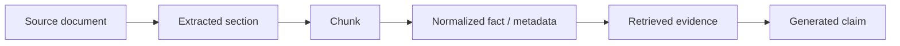

# 02 · 来源、权限与新鲜度

检索系统返回了一段看似相关的退款政策，但它可能是草案、已经失效的旧版本，甚至属于另一家租户的定制条款。模型无法仅凭文风判断这些差异。内容进入 Context 之前，系统必须先确定它来自哪里、谁可以使用、何时生效，以及派生副本如何随原文更正或删除。

这组问题分别由 provenance、access control 和 freshness 管理。它们不是文档检索后的补充字段，而是知识对象从 ingest 到生成答案都必须携带的约束。

## 本章目标

- 为知识对象建立稳定的来源、权限、时间和派生元数据。
- 区分 observed time、business validity 与 index freshness。
- 让访问控制在候选生成前生效。
- 处理冲突、更正、删除和派生数据传播。

## 1. 没有元数据的文本无法安全使用

一条可进入生产检索系统的知识对象至少需要：

```ts
type KnowledgeRecord = {
  resourceId: string;
  tenantId: string;
  ownerId?: string;
  sourceSystem: string;
  sourceUri: string;
  contentHash: string;
  version: string;
  createdAt: string;
  observedAt: string;
  validFrom?: string;
  validUntil?: string;
  classification: "public" | "internal" | "confidential" | "restricted";
  acl: Array<{ subject: string; actions: string[] }>;
  policyTags: string[];
  parentRefs: string[];
};
```

这些字段回答不同问题：

- `sourceUri`：原始内容位于哪里。
- `contentHash`：当前副本是否仍是同一内容。
- `version`：来源系统如何标识版本。
- `observedAt`：系统何时读取到这份内容。
- `validFrom/validUntil`：内容在业务上何时适用。
- `classification/acl`：谁能以什么方式使用。
- `parentRefs`：这份内容由哪些上游对象派生。

“索引更新时间最新”不等于“业务规则已经生效”。一份下周生效的政策可以今天写入索引，但不能用于今天的订单判断。

## 2. Provenance 是一条链

生成答案通常经历多次转换：



每一层都应能回溯上游。Embedding、摘要、翻译和模型生成的 normalized fact 都是 derived artifact，不能切断 parent reference。

Provenance 的实际用途包括：

- 为答案生成可核对引用；
- 原文更正后定位所有派生对象；
- 评测 claim 是否被证据支持；
- 安全事件中追踪敏感数据流向；
- 删除请求到来时计算影响范围。

一个 URL 本身不构成完整 provenance。还需要具体版本、片段位置、抓取时间和内容 hash。

## 3. 读取权限不等于任意使用权限

某位员工可以在内部系统阅读文档，不代表 Agent 自动获得以下权利：

- 把内容发送给第三方模型或外部 Tool；
- 把摘要写入跨租户共享 Memory；
- 把个人数据保存进 Eval dataset；
- 长期保留 embedding、cache 或 Trace；
- 委派给权限不同的 Subagent；
- 在公开结果中引用敏感片段。

知识使用决策至少考虑：

```text
actor
tenant / resource
purpose
transformation
destination
retention
time
```

因此，Context Builder 不应只接收 `documentIds`，还应接收 actor 和用途，并在实际发送给模型或 Tool 前再次校验 destination policy。

## 4. 权限过滤必须发生在检索前

一个常见错误流程是：

```text
global top-k retrieval → filter unauthorized documents → send remaining results
```

它有两个问题：

1. 无权文档已经被读取和计分，可能形成侧信道。
2. 无权候选占据 top-k，导致有权文档没有机会进入结果，即 recall starvation。

更合理的流程是：

```text
derive actor / tenant / purpose predicates
→ retrieve inside authorized partition
→ defensively recheck metadata
→ rerank and pack Context
```

可以通过 tenant partition、security-trimmed index 或检索引擎原生 ACL predicate 实现。进入 Context 前的复验用于防御索引漂移，不能替代候选生成阶段的权限约束。

## 5. Freshness 不是一个统一 TTL

不同事实具有不同的新鲜度模型：

| 数据       | 合理策略                        |
| -------- | --------------------------- |
| 价格、库存、权限 | 执行前查询 source of truth       |
| 政策与合同    | 保存版本和生效区间                   |
| 订单、工单状态  | 使用资源 version / ETag，写入前重新读取 |
| 用户偏好     | 允许更新、冲突、TTL 和删除             |
| 研究资料     | 记录发表时间、获取时间和来源质量            |

缓存的“退款资格结论”不能替代执行前的订单查询。它可以帮助模型生成 proposal，却不应成为 commit 的前置事实。

## 6. 冲突不能交给模型凭语气裁决

当两个来源给出不同结论时，先由确定性规则处理：

1. 比较来源权威等级。
2. 比较业务版本与生效区间。
3. 比较资源 scope、tenant 和适用条件。
4. 检查是否存在撤回、修订或 tombstone。
5. 无法确定时返回 conflict，而不是任意选择。

模型可以把冲突解释给用户，也可以提出需要补充的信息；它不应把“措辞更像正式文件”当作真值判断。

```ts
type EvidenceResolution =
  | { status: "resolved"; evidenceId: string; reasonCode: string }
  | { status: "conflict"; evidenceIds: string[]; requiredAction: "human_review" }
  | { status: "insufficient"; missing: string[] };
```

## 7. 删除和更正要沿派生图传播

用户删除或来源撤回可能影响：

```text
source record
chunks
search index / embedding
cache
summary
long-term memory
trace and eval dataset
backup and third-party copy
```

生产系统需要数据地图、retention policy 和 tombstone。常见策略是：先标记不可读，再异步清理各派生存储，最后通过审计任务验证读取路径不再返回。若某些审计记录依法必须保留，应把“不可用于模型 Context”与“合规保留”分开表达。

更正同样需要传播。原文版本更新后，旧 chunk 和 embedding 不能继续参与新查询；依赖旧证据生成的 Memory 或结论应标记 stale，等待重新计算或人工确认。

## 8. 案例：四份看似相同的政策

假设索引中存在：

- `policy-v3-draft`：下月可能生效的草案；
- `policy-v2`：当前全局政策；
- `policy-v2-tenant-a`：Tenant A 的有效补充条款；
- `policy-v1`：已经废止但仍留作审计的旧版本。

Tenant A 的用户查询今天的订单时，候选集合应包含 `v2` 和 `v2-tenant-a`，排除草案与旧版本；Tenant B 不能看到 Tenant A 的补充条款。若 `v2` 随后被紧急撤回，tombstone 必须让它立即退出读取路径，即使后台 embedding 删除尚未完成。

## 实践：建立退款政策的 Provenance 与删除传播 Fixture

### 进入本章时已有能力

Context Builder 已能记录选择理由，但政策内容尚未携带足以判断归属、有效期和派生关系的治理元数据。

### 本章增加的能力

为 Resolution Desk 的政策库准备旧版、新版、草案版、跨 Tenant 版和已撤回版内容：

1. 写出检索前 ACL predicate。
2. 为每条内容定义 `validFrom/validUntil`。
3. 生成 chunk 和 summary，并保留 parent refs。
4. 模拟原文更正，确认旧派生物不再进入 Context。
5. 模拟用户删除，检查 index、cache、Memory、Trace 和 Eval 的处理策略。

### 验收证据

每条退款资格 Claim 都能追溯到准确政策版本和父级内容；无权、未生效、已撤回内容不会成为候选。更正或删除原文后，Index、Cache、Summary 和 Context Fixture 的传播检查均通过。

## 常见误区

- 内部文档可以用于任何 Agent 目的。
- Embedding 不可逆，因此不属于敏感数据。
- 最新写入时间等于业务生效时间。
- 来源域名可信就无需保存具体版本。
- 删除主表记录后，索引和摘要会自然失效。

## 本章小结

知识是否可用，由来源、版本、生效时间、actor、purpose、destination 和 retention 共同决定。Provenance 让派生内容可追溯，检索前 ACL 防止越权候选，freshness 与 tombstone 则阻止旧事实继续影响决策。下一章把这些约束带入[检索、RAG 与重排](/masterpiece-static-docs/06-上下文-知识与记忆/03-检索-RAG与重排.md)的完整数据管线。

## 延伸阅读

- [NIST AI RMF Generative AI Profile](https://doi.org/10.6028/NIST.AI.600-1)
- [OpenAI Data Controls](https://developers.openai.com/api/docs/guides/your-data)
- [MCP Specification: Security and Trust](https://modelcontextprotocol.io/specification/2025-11-25)
