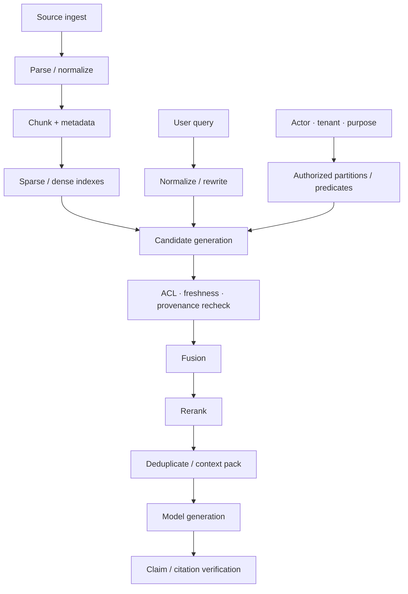

# 03 · Retrieval、RAG 与 Reranking

模型回答错了一个政策问题，最直觉的反应往往是修改 Prompt。但错误可能更早发生：正确文档没有被召回，过期版本排在前面，关键限定条件在切块时被截断，或者组装 Context 时因 Token 预算删去了证据末尾。

Retrieval-Augmented Generation（RAG）是一条数据管线，不是一个“开启后即可避免幻觉”的功能。本章会分别检查数据入库（Ingestion）、检索（Retrieval）、重排（Reranking）、Context 组装（Packing）、生成（Generation）和引用校验（Citation Validation），让每一层都可以独立测量。

## 本章目标

- 理解 RAG 的端到端数据流与各层失败方式。
- 组合稀疏检索（Sparse Retrieval）、稠密检索（Dense Retrieval）、混合检索（Hybrid Retrieval）与重排器（Reranker）。
- 在生成候选前落实 ACL 与 Freshness 约束。
- 分别评测检索、Context 组装和生成质量。
- 判断何时需要 Agentic Retrieval。

## 1. RAG 的完整管线



向量数据库只负责其中一部分。最终质量取决于每一个箭头是否保留了语义、权限和版本。

## 2. Ingest 决定了后续能否检索

Ingestion 不是把文件按固定长度切分后生成 Embedding。至少要处理：

- 文档格式解析与 OCR 质量；
- 标题、章节、表格、列表和记录边界；
- tenant、ACL、版本、生效时间与来源；
- 内容哈希、父级文档和位置；
- 删除、撤回与增量更新。

### 2.1 把数据管线建模为可重建工件

生产管线不应从“原始文件”直接跳到“向量库中的一行”。中间工件需要稳定身份、版本与来源，才能定位究竟是解析、切分、Embedding 还是索引发布造成了错误。

```text
SourceRecord
→ ParsedBlock
→ ChunkRecord
→ IndexDocument
→ IndexBuildManifest
```

下面是一组最小 TypeScript 契约：

```ts
type SourceRecord = {
  sourceId: string;
  sourceVersion: string;
  tenantId: string;
  sourceUri: string;
  contentHash: string;
  mediaType: string;
  observedAt: string;
  validFrom?: string;
  validUntil?: string;
  aclDigest: string;
  tombstonedAt?: string;
};

type ParsedBlock = {
  blockId: string;
  sourceId: string;
  sourceVersion: string;
  logicalPath: string; // 例如 heading:refunds/table:exceptions/row:3
  kind: "heading" | "paragraph" | "list" | "table" | "image_text";
  text: string;
  parserVersion: string;
  quality: {
    status: "accepted" | "quarantined";
    warnings: string[];
  };
};

type ChunkRecord = {
  chunkId: string;
  sourceId: string;
  sourceVersion: string;
  parentBlockIds: string[];
  logicalPath: string;
  text: string;
  contentHash: string;
  chunkerVersion: string;
  tokenCount: number;
  tenantId: string;
  aclDigest: string;
  validFrom?: string;
  validUntil?: string;
};

type IndexDocument = {
  indexDocumentId: string;
  chunkId: string;
  sparseText: string;
  embeddingRef?: string;
  filterFields: {
    tenantId: string;
    aclDigest: string;
    sourceVersion: string;
    validFrom?: string;
    validUntil?: string;
    tombstoned: boolean;
  };
};

type IndexBuildManifest = {
  buildId: string;
  sourceSnapshotVersion: string;
  parserVersion: string;
  chunkerVersion: string;
  embedding?: { model: string; dimensions: number };
  indexSchemaVersion: string;
  sourceCount: number;
  chunkCount: number;
  inputDigest: string;
  outputDigest: string;
  status: "building" | "validated" | "promoted" | "rejected";
};
```

`chunkId` 应由稳定输入确定性生成，例如 Source、Source Version、逻辑位置、Chunker Version 与 Content Hash。不能只使用数组下标或随机 UUID：在同一 Snapshot 上重复 Ingest 时，ID 必须相同；内容、边界或算法发生语义变化时，ID 则必须变化。

### 2.2 Parser Quality Gate 先于 Embedding

解析失败不能以空字符串、乱码或缺页内容静默进入索引。Quality Gate 至少检查：

- 文档是否完整读取，页数、段落数和表格数是否异常；
- 标题、列表、表格单元格和脚注关系是否保留；
- OCR 或格式转换是否产生低质量、重复或空白内容；
- Tenant、ACL、版本与来源是否成功继承到每个 Chunk；
- 关键政策编号、金额、日期和否定词是否在解析前后保持；
- 不受支持或低质量输入是否进入 Quarantine，而不是继续生成 Embedding。

Quarantine 需要明确状态、原因和人工修复入口。把“解析成功”定义为进程没有报错，会让缺失内容直到生成错误答案时才暴露。

### 2.3 Ingest 必须幂等，增量索引必须可回滚

同一 Source Snapshot、相同 Pipeline Version 重跑时，不应新增重复 Chunk 或改变输出 Digest。一个最小流程是：

```text
read source + content hash
→ unchanged: reuse deterministic artifacts
→ changed: parse and build new versioned artifacts
→ deleted/withdrawn: write tombstone before asynchronous cleanup
→ build a new index snapshot
→ run retrieval / ACL / citation eval
→ atomically promote the validated snapshot
```

增量更新不能直接在当前服务索引中留下半新半旧状态。可使用独立 Build、Shadow Index 或版本化 Partition 生成候选快照，验证通过后再切换读取别名。旧 Index Build 保留到回滚窗口结束；Tombstone、ACL 收紧和紧急撤回则必须优先阻断读取，不能等待完整重建。

### Chunk 太小

限定条件、主语和例外条款被拆开。例如“购买后 7 天可退款”与下一段“数字商品除外”分别进入不同 chunk，单独召回第一段会生成错误结论。

### Chunk 太大

相关信号被大量无关文本稀释，重排成本和 Context Token 占用也随之上升。

结构化文档应优先按语义边界切分，再设置最大长度和重叠范围。每个 Chunk 都必须继承父级文档的权限和版本元数据。Parent–Child Retrieval 可以用较小 Chunk 参与召回，再把相邻段落或父级章节打包给模型；它能恢复上下文，却不能替代对跨段限定条件的专门测试。

Chunking 是需要 Eval 的算法。至少比较两种策略，并同时观察边界条件召回率、重复 Token、候选数量、Rerank 延迟和最终任务成功率。只报告平均 Chunk 长度不能说明切分是否保留了业务语义。

## 3. Sparse、Dense 与 Hybrid Retrieval

### Sparse retrieval

基于词项匹配，擅长：

- 错误码、订单号和 API 名称；
- 法规编号和精确短语；
- 罕见专有名词。

### Dense retrieval

基于 embedding 相似度，擅长：

- 同义改写和自然语言表达差异；
- 用户问题与文档措辞不一致的场景；
- 主题层面的语义匹配。

Dense retrieval 也可能把“允许退款”和“不允许退款”拉得很近，因为它们共享大量主题词。相似度不是事实蕴含关系。

### Hybrid retrieval

先分别生成 Sparse 与 Dense 候选，再使用倒数排序融合（Reciprocal Rank Fusion，RRF）或其他方法合并。Hybrid Retrieval 通常能兼顾精确词项与语义改写，但仍需根据任务数据选择权重和候选数量。

## 4. Query Rewrite 可能提高召回，也可能改变意图

用户输入“上周买的课程能退吗”可能需要扩展为产品类型、购买时间和退款政策查询。Query rewrite 可以：

- 消除指代；
- 补充领域同义词；
- 拆成多个子查询；
- 生成 sparse 与 dense 的不同 query。

风险在于模型可能加入用户未提供的假设。改写后的 Query 应与原始 Query 一起记录，必要时还要用确定性规则检查关键实体和否定词。资源 ID、Tenant 和权限 Predicate 不应由模型改写。

可以把 Query Transformation 拆成三个层次：

1. **确定性 Normalize**：Unicode、空白、大小写和已知标识符规范化；
2. **确定性 Filter Extraction**：从可信 State 注入 Tenant、产品类型、业务时间与允许来源；
3. **模型 Rewrite / Decompose**：消除指代、生成同义表达或拆分子问题，但不得修改前两层的约束。

每种 Rewrite 策略都需要独立版本和 Fixture：

```ts
type QueryRewriteFixture = {
  id: string;
  originalQuery: string;
  trustedState: {
    tenantId: string;
    productType?: string;
    orderId?: string;
    effectiveAt: string;
  };
  mustPreserve: {
    entities: string[];
    negations: string[];
    temporalConstraints: string[];
  };
  forbiddenAssumptions: string[];
  relevantEvidenceIds: string[];
  hardNegativeEvidenceIds: string[];
};
```

Rewrite Eval 不只检查句子是否“更清楚”。它应分别比较原始 Query 与改写 Query 的 Recall\@k、Hard Negative 排名、ACL/Freshness 违规、延迟和最终任务结果。若改写增加召回却改变订单、否定条件或时间范围，必须拒绝该 Query，或回退到原始 Query。

## 5. 把 ACL 约束落实到检索实现

上一章已经说明了[为什么权限过滤必须发生在检索前](/masterpiece-static-docs/06-上下文-知识与记忆/02-来源-权限与新鲜度.md#4-权限过滤必须发生在检索前)。这里不再重复原理，只关注实现与验证：先根据 Actor、Tenant 和用途推导授权分区或 Predicate，再在该范围内生成 Top-K 候选，最后依据候选的元数据做防御性复验。

跨租户隔离可以由物理分区、行级安全（Row-level Security）或搜索引擎原生过滤器实现。无论采用哪种方式，都要在检索评测中加入高相似度的跨租户干扰文档，并分别记录“越权内容是否进入候选”和“有权内容是否因干扰而失去召回名额”。这两项断言比在生成结果上检查泄漏更早，也更容易定位故障。

### 5.1 Retrieval Cache 也属于授权边界

缓存一次有权查询的 Top-K 结果，再把它返回给权限不同的用户，会绕过正确实现的检索过滤。Cache Key 至少绑定：

```text
tenant / authorized-scope digest / purpose
original query + rewrite version
filter digest / index build id
retriever + fusion + reranker versions
top-k and packing policy
```

若 ACL 精确到用户或动态群组，不能只按 Tenant 缓存完整结果。更安全的选择是缓存公开的索引中间量，或者只缓存候选 ID 后再次执行授权过滤。Index Promotion、ACL 收紧、Tombstone 和 Source Version 变化都应使相关结果失效；删除验证还要确认旧 Cache Key 已不能服务被撤回内容。

## 6. Reranker 解决相关性排序，不解决权威性

Reranker 使用更强的模型或交叉编码器（Cross-encoder）重新比较 Query 与候选文档，通常比单一的 Embedding 分数更能识别细粒度相关性。但它仍不应决定：

- Actor 是否有权查看；
- 哪个版本当前生效；
- 来源是否具有法律或业务权威；
- 证据是否允许发送给目标模型。

这些条件应先由元数据和策略过滤。Reranker 只负责在合法候选中优化顺序。

## 7. Context Packing 是独立算法

重排后的 Top-K 结果不能直接拼接。Context Packing 还需要：

- 去除同一文档中重复或高度重叠的 Chunk；
- 合并相邻片段，恢复被切断的限定条件；
- 保留标题、来源、版本和位置；
- 对冲突证据显式分组；
- 在 Token 预算内为输出预留空间；
- 防止单一长文档占满 Context。

一种简化的 Evidence Block 如下：

```ts
type EvidenceBlock = {
  evidenceId: string;
  sourceId: string;
  version: string;
  location: string;
  validAt: string;
  trust: "verified_source_untrusted_content";
  text: string;
};
```

模型可以引用 `evidenceId`，应用再映射为用户可见引用。

### 7.1 Citation Validation 不是检查答案末尾有没有 URL

生成阶段应先把可验证结论与证据建立显式关系：

```ts
type ClaimEvidenceLink = {
  claimId: string;
  claimText: string;
  evidenceIds: string[];
  status: "supported" | "contradicted" | "insufficient";
  validatorVersion: string;
  reasons: string[];
};
```

Citation Validation 至少包含三层：

1. **Resolvable**：`evidenceId` 能解析到当前获准访问、未撤回的 Source Version 与具体位置；
2. **Attribution**：引用的 Evidence Block 确实对应相邻 Claim，而不是只与整篇回答主题相关；
3. **Support**：证据支持该结论，而非仅出现相同词语；相反证据和限定条件必须同时保留。

第一层适合程序化断言；第二、三层可以组合规则、经过校准的模型 Grader 与人工抽样。验证器不能把自身判断写回权威事实，只输出可复查结果。高影响 Claim 为 `contradicted` 或 `insufficient` 时，系统应删除该结论、明确暴露不确定性、请求补充信息或转人工，不能只给引用图标换颜色。

用户可见引用应能够回到稳定的 Source、Version、Location 和 Content Hash。若产品不能直接展示敏感原文，则返回经过授权的引用摘要或受控查看入口，而不是泄露 Source URI。

## 8. 分层评测

检索评测需要明确的 Query 与相关性判断（Relevance Judgment，常写作 Qrels），不能把“当前系统返回的结果”当作 Ground Truth：

```ts
type RetrievalQrel = {
  queryId: string;
  evidenceId: string;
  relevance: 0 | 1 | 2 | 3;
  requiredConditions?: string[];
  validAt: string;
  tenantId: string;
  annotationVersion: string;
};
```

同一 Query 还应准备 Hard Negative：主题和措辞高度相似，却因为否定条件、Tenant、版本、适用产品或生效时间而不能支持答案的内容。没有这类反例，Dense Retrieval 和 Reranker 很容易只学会主题匹配。

### 8.1 Ingestion 与 Chunking

- Parser Acceptance / Quarantine 是否与人工检查一致；
- 同一 Snapshot 重跑是否产生相同 Chunk ID 与 Build Digest；
- 关键表格、否定词、时间和例外条件是否保留；
- Source 更新或删除后，旧 Chunk、Embedding、Cache 是否退出服务路径；
- 不同 Chunk 策略的边界条件召回、重复 Token 与最终任务结果。

### 8.2 Retrieval

- Recall\@k：相关证据是否进入候选。
- Precision\@k：候选中有多少真正相关。
- MRR / nDCG：正确证据的排序位置。
- ACL Violation Rate：无权证据进入候选的比例，目标应为 0。
- Stale Evidence Rate：过期或撤回内容进入候选的比例。
- Hard Negative Rejection：高相似但不适用的证据是否被过滤或降序。
- Rewrite Preservation：Query Rewrite 是否保留实体、否定和时间约束。

### 8.3 Context packing

- 关键条件是否被截断；
- 重复内容占用了多少 token；
- 冲突证据是否同时保留；
- 来源、版本和位置是否完整。

### 8.4 Generation

- 结论是否由证据支持；
- 引用是否真正支持相邻结论；
- 无证据时是否拒绝作答；
- 回答是否使用了无权或过期内容；
- 最终任务是否成功，而不只是语言流畅。
- 每项高影响 Claim 是否具有 `supported` 的可解析引用。

答案有据可依（Groundedness）与引用正确（Citation Correctness）并非同一件事：回答可能整体基于检索内容，却把某项结论连接到错误引用；也可能引用本身正确，却同时添加了证据中没有的结论。

评测报告必须同时固定 Source Snapshot、Index Build、Parser/Chunker/Embedding、Rewrite、Retriever、Fusion、Reranker、Packing 和 Citation Validator 版本。否则无法判断一次提升来自算法变化，还是语料或索引已经改变。

## 9. 如何定位一次错误

| 现象                  | 优先检查                     |
| ------------------- | ------------------------ |
| 正确文档完全不在候选中         | Ingestion、Query、检索召回率    |
| 正确文档存在但排在很后         | Fusion、Reranking         |
| 正确 Chunk 被选中但例外条件丢失 | Chunking、Context Packing |
| Context 有完整证据，回答仍错误 | Prompt、模型语义理解、Grader     |
| 引用了旧版本              | Freshness Filter、索引失效机制  |
| 回答包含另一租户内容          | 授权分区，并按安全事件处理            |

这种分层能避免用 Prompt 修改掩盖数据管线问题。

## 10. Agentic Retrieval 的边界

Agentic Retrieval 允许模型根据中间结果继续改写 query、选择来源、展开引用或停止检索。它适合开放研究、信息缺口难以预先枚举的任务，但会增加：

- 模型与检索调用次数；
- Prompt Injection 暴露面；
- 终止和预算控制难度；
- 轨迹评测与缓存复杂度。

应先建立固定检索管线的 Baseline。只有当多轮检索能在复杂问题上稳定提高召回率或最终任务成功率，且成本与攻击面可接受时，才引入 Agent Loop。

本章只建立这条采用门禁，不把 Agentic Retrieval 变成政策 RAG 的默认路径。有明确多跳、跨来源或开放研究需求时，再进入进阶专题：[复杂知识检索：Agentic RAG 与 GraphRAG](/masterpiece-static-docs/06-上下文-知识与记忆/05-复杂知识检索-Agentic-RAG与GraphRAG.md)。

## 实践：构建 Resolution Desk 的政策 RAG

### 进入本章时已有能力

政策记录已有 Provenance、ACL 与有效期，但 Resolution Desk 还不能稳定地从多版本政策中召回、排序并打包支持当前工单的证据。

### 本章增加的能力

准备 30～50 份售后政策与条款片段，刻意加入：

- 同义表达；
- 相同主题、相反结论；
- 旧版与新版政策；
- 另一 Tenant 的私有条款；
- 包含恶意指令的内容；
- 一条跨两个 Chunk 的例外条件。

随后完成四组工件：

1. **Ingestion Fixture**：保存 Source、Parsed Block、Chunk、Index Document 与 Build Manifest；对同一 Snapshot 重跑两次，验证 ID、Digest 和数量稳定；
2. **Index Update Fixture**：修改一份政策、撤回一份政策并收紧一份 ACL，构建新 Index Snapshot；旧 Build 继续服务到候选 Build 通过验证，Tombstone 与 ACL 收紧立即阻断旧读取路径；
3. **Retrieval Dataset**：至少准备 20 条高信息量 Query、Qrels 与 Hard Negative，覆盖实体保持、否定、时间边界、跨 Tenant、缺失 Metadata 和跨 Chunk 例外；
4. **Citation Dataset**：把答案拆成 Claim，保存 Evidence Link 和 `supported | contradicted | insufficient` 判定，并校验用户可见引用可以定位到 Source、Version、Location 与 Content Hash。

实现时按下面的顺序只改变一个主要变量：

```text
固定长度 Chunk Baseline
→ 语义边界 Chunk
→ Sparse
→ Dense
→ Hybrid / RRF
→ Reranking
→ Query Rewrite
→ Context Packing
→ Citation Validation
```

### 验收证据

验收报告至少包含：

- Parser Quarantine、幂等 Ingest、稳定 Chunk ID 与增量 Build 的测试结果；
- 两种 Chunk 策略在边界条件召回、重复 Token、延迟和任务成功率上的对照；
- Sparse、Dense、Hybrid、Reranking 和 Query Rewrite 的 Recall\@k、MRR/nDCG、Hard Negative Rejection、Token、延迟与成本；
- ACL Violation Rate、Stale Evidence Rate 与跨 Tenant Cache 测试，安全关键项必须为 0；
- Claim–Evidence Citation Correctness、无证据拒答率和最终任务成功率；
- Source Snapshot、Index Build、Parser、Chunker、Embedding、Rewrite、Retriever、Reranker、Packing 与 Citation Validator 的完整版本清单。

复现一次“全局 Top-K 后过滤”造成的召回饥饿；在正确实现中，另一 Tenant 的高相似政策既不进入候选，也不会挤掉当前 Tenant 的有效证据。再复现一次错误 Cache Key 导致的跨权限复用，确认修复后 ACL 收紧、Tombstone 与 Index Promotion 都会使旧结果失效。

## 常见误区

- RAG 可以消除幻觉（Hallucination）。
- Embedding 分数最高的内容就是权威事实。
- 检索召回率不足时只需修改 Prompt。
- 回答附带 URL 就说明每项结论都有依据。
- Agentic RAG 天然优于固定检索管线。

## 本章小结

RAG 是一条从内容入库到结论验证都可测量的数据管线。在授权范围内生成候选、执行混合检索、重排和 Context Packing，分别解决不同问题；任何一层都不能被“模型更聪明”替代。下一章将区分[状态、记忆与压缩](/masterpiece-static-docs/06-上下文-知识与记忆/04-状态-记忆与压缩.md)，决定哪些任务信息可以跨步骤或跨 Thread 保留。

## 延伸阅读

- [Retrieval-Augmented Generation for Knowledge-Intensive NLP Tasks](https://arxiv.org/abs/2005.11401)
- [Dense Passage Retrieval](https://arxiv.org/abs/2004.04906)
- [Introduction to Information Retrieval](https://nlp.stanford.edu/IR-book/)
- [Microsoft Learn：RAG 与索引概览](https://learn.microsoft.com/en-us/azure/search/retrieval-augmented-generation-overview)
- [Microsoft Learn：Agentic Retrieval 的权限与查询活动](https://learn.microsoft.com/en-us/azure/search/agentic-retrieval-how-to-retrieve)

> 官方资料核验日期：2026-07-19。Azure AI Search 的部分 Agentic Retrieval 能力仍可能处于 Preview；本章只借其官方文档核对 Ingestion、权限、Query Activity 与引用对象，不把某个云产品接口作为通用 RAG 契约。
