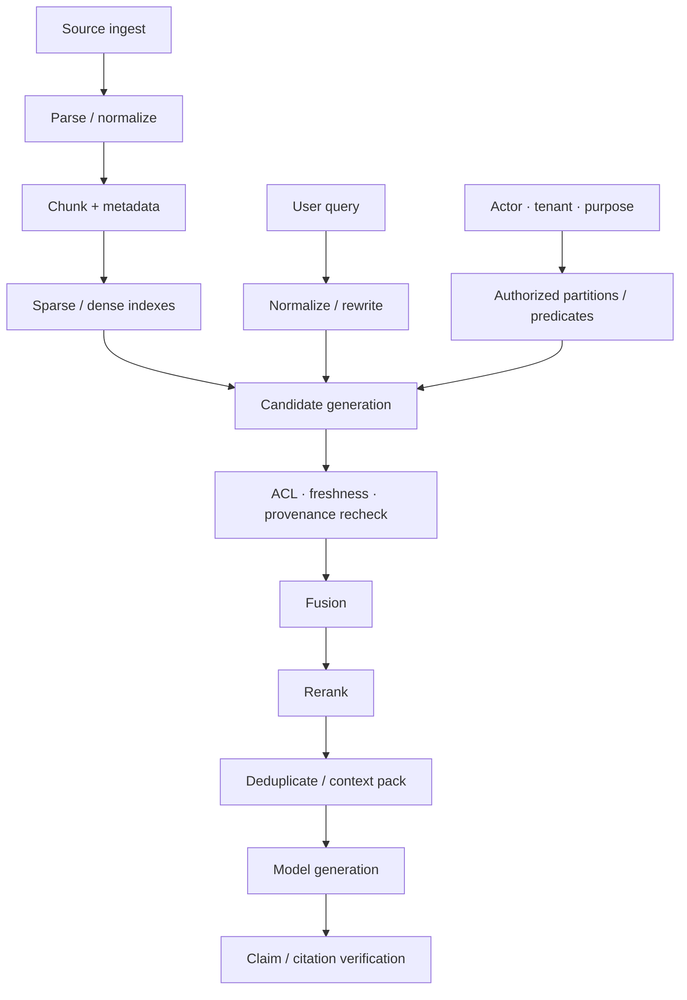

# 03 · Retrieval、RAG 与 Reranking

模型回答错了一个政策问题，最直觉的反应往往是修改 Prompt。但错误可能更早发生：正确文档没有被召回，过期版本排在前面，关键限定条件在切块时被截断，或者组装 Context 时因 Token 预算删去了证据末尾。

Retrieval-Augmented Generation（RAG）是一条数据管线，不是一个“开启后即可避免幻觉”的功能。本章会分别检查数据入库（Ingestion）、检索（Retrieval）、重排（Reranking）、Context 组装（Packing）、生成（Generation）和引用校验（Citation Validation），让每一层都可以独立测量。

## 本章目标

- 理解 RAG 的端到端数据流与各层失败方式。
- 组合 sparse、dense、hybrid retrieval 与 reranker。
- 在 candidate generation 前落实 ACL 与 freshness。
- 分别评测 retrieval、context packing 和 generation。
- 判断何时需要 Agentic Retrieval。

## 1. RAG 的完整管线



向量数据库只负责其中一部分。最终质量取决于每一个箭头是否保留了语义、权限和版本。

## 2. Ingest 决定了后续能否检索

Ingest 不是把文件文本切成固定长度后生成 embedding。至少要处理：

- 文档格式解析与 OCR 质量；
- 标题、章节、表格、列表和记录边界；
- tenant、ACL、版本、生效时间与来源；
- content hash、parent document 和位置；
- 删除、撤回与增量更新。

### Chunk 太小

限定条件、主语和例外条款被拆开。例如“购买后 7 天可退款”与下一段“数字商品除外”分别进入不同 chunk，单独召回第一段会生成错误结论。

### Chunk 太大

相关信号被大量无关文本稀释，reranker 成本和 Context token 也随之上升。

结构化文档优先按语义边界切分，再设置最大长度和重叠。每个 chunk 都必须继承 parent 的权限和版本元数据。

## 3. Sparse、Dense 与 Hybrid Retrieval

### Sparse retrieval

基于词项匹配，擅长：

- 错误码、订单号和 API 名称；
- 法规编号和精确短语；
- 罕见专有名词。

### Dense retrieval

基于 embedding 相似度，擅长：

- 同义改写和自然语言表达差异；
- 用户问题与文档措辞不一致的场景；
- 主题层面的语义匹配。

Dense retrieval 也可能把“允许退款”和“不允许退款”拉得很近，因为它们共享大量主题词。相似度不是事实蕴含关系。

### Hybrid retrieval

先分别产生 sparse 与 dense candidates，再使用 Reciprocal Rank Fusion（RRF）或其他方法合并。Hybrid 常能兼顾精确词项与语义改写，但仍需通过任务数据选择权重和 candidate 数量。

## 4. Query Rewrite 可能提高召回，也可能改变意图

用户输入“上周买的课程能退吗”可能需要扩展为产品类型、购买时间和退款政策查询。Query rewrite 可以：

- 消除指代；
- 补充领域同义词；
- 拆成多个子查询；
- 生成 sparse 与 dense 的不同 query。

风险是模型加入了用户未提供的假设。Rewrite 应与原 query 一起记录，必要时保留关键实体和否定词的确定性检查。资源 ID、tenant 和权限 predicate 不应由模型 rewrite。

## 5. ACL 必须进入 Candidate Generation

错误流程：

```text
global retrieve top 20 → remove unauthorized → keep 3
```

正确流程：

```text
authorized partition/predicate → retrieve top 20 → defensive recheck
```

前者不仅可能读取无权内容，也可能让无权候选挤掉真正相关的有权文档。跨租户隔离需要通过 partition、row-level security 或搜索引擎原生 filter 强制，而不是依赖模型忽略不该看的内容。

## 6. Reranker 解决相关性排序，不解决权威性

Reranker 用更强的模型或 cross-encoder 重新比较 query 与候选文档，通常比单一 embedding score 更能识别细粒度相关性。但它仍不应决定：

- actor 是否有权查看；
- 哪个版本当前生效；
- 来源是否具有法律或业务权威；
- 证据是否允许发送给目标模型。

这些条件应先由 metadata 和 policy 过滤。Reranker 只在合法候选中优化顺序。

## 7. Context Packing 是独立算法

Rerank 后的 top-k 不能直接拼接。Packing 需要：

- 去除同一文档的重复或高度重叠 chunk；
- 合并相邻片段，恢复被切断的限定条件；
- 保留标题、来源、版本和位置；
- 对冲突证据显式分组；
- 在 token budget 内为输出预留空间；
- 防止单一长文档占满 Context。

一种简化的 evidence block：

```ts
type EvidenceBlock = {
  evidenceId: string;
  sourceId: string;
  version: string;
  location: string;
  validAt: string;
  trust: "verified_source_untrusted_content";
  text: string;
};
```

模型可以引用 `evidenceId`，应用再映射为用户可见引用。

## 8. 分层评测

### 8.1 Retrieval

- Recall\@k：相关证据是否进入候选。
- Precision\@k：候选中有多少真正相关。
- MRR / nDCG：正确证据的排序位置。
- ACL violation rate：无权证据进入候选的比例，目标应为 0。
- stale evidence rate：过期或撤回内容进入候选的比例。

### 8.2 Context packing

- 关键条件是否被截断；
- 重复内容占用了多少 token；
- 冲突证据是否同时保留；
- 来源、版本和位置是否完整。

### 8.3 Generation

- Claim 是否由 evidence 支持；
- citation 是否真的蕴含相邻 Claim；
- 无证据时是否 abstain；
- 回答是否使用了无权或过期内容；
- 最终任务是否成功，而不只是语言流畅。

Groundedness 与 citation correctness 不完全相同：回答可能整体基于检索内容，却把某条 Claim 连接到错误引用；也可能引用正确，但同时添加了证据中没有的结论。

## 9. 如何定位一次错误

| 现象                  | 优先检查                                |
| ------------------- | ----------------------------------- |
| 正确文档完全不在 candidates | ingest、query、retrieval recall       |
| 正确文档存在但排在很后         | fusion、rerank                       |
| 正确 chunk 被选中但例外条件丢失 | chunking、context packing            |
| Context 有完整证据，回答仍错误 | prompt、model semantics、grader       |
| 引用了旧版本              | freshness filter、index invalidation |
| 回答包含另一租户内容          | authorization partition，安全事故处理      |

这种分层能避免用 Prompt 修改掩盖数据管线问题。

## 10. Agentic Retrieval 的边界

Agentic Retrieval 允许模型根据中间结果继续改写 query、选择来源、展开引用或停止检索。它适合开放研究、信息缺口难以预先枚举的任务，但会增加：

- 模型与检索调用次数；
- Prompt Injection 暴露面；
- 终止和预算控制难度；
- 轨迹评测与缓存复杂度。

先建立固定 retrieval pipeline 的 baseline。只有在复杂问题上，多轮检索能稳定提高 recall 或最终 outcome，并且成本与攻击面可接受时，才引入 Agent Loop。

## 实践：构建一个可分层评测的微型 RAG

准备 30～50 个小文档，刻意加入：

- 同义表达；
- 相同主题、相反结论；
- 旧版与新版政策；
- 另一 tenant 的私有条款；
- 包含恶意指令的内容；
- 一条跨两个 chunk 的例外条件。

依次比较 sparse、dense、hybrid 和 rerank，分别报告 retrieval recall、ACL violation、stale evidence rate、citation support 和最终任务成功率。再复现一次“global top-k 后过滤”造成的 recall starvation，作为权限设计的反例。

## 常见误区

- RAG 可以消除 hallucination。
- Embedding 分数最高的内容就是权威事实。
- Retrieval recall 不足时只需改 Prompt。
- 回答带 URL 就说明每条 Claim 有依据。
- Agentic RAG 天然优于固定检索管线。

## 本章小结

RAG 是一条从 ingest 到 claim verification 的可测数据管线。授权范围内的 candidate generation、hybrid retrieval、reranking 和 context packing 分别解决不同问题；任何一层都不能被“模型更聪明”替代。下一章将区分[状态、记忆与压缩](/masterpiece-static-docs/06-上下文-知识与记忆/04-状态-记忆与压缩.md)，决定哪些任务信息可以跨步骤或跨 Thread 保留。

## 延伸阅读

- [Retrieval-Augmented Generation for Knowledge-Intensive NLP Tasks](https://arxiv.org/abs/2005.11401)
- [Dense Passage Retrieval](https://arxiv.org/abs/2004.04906)
- [Introduction to Information Retrieval](https://nlp.stanford.edu/IR-book/)
