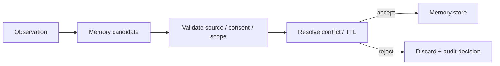

# 04 · State、Memory 与 Compaction

长任务会不断产生消息、Tool Result、计划、摘要和用户偏好。如果这些内容全部写入聊天历史或同一个向量库，系统很快失去事实层次：一次模型推断可能被当成长期偏好，旧摘要可能覆盖订单的最新状态，删除一条消息也无法清理已经生成的 embedding 和 cache。

State、Context、Knowledge 与 Memory 解决的是不同问题。分清它们的权威性和生命周期，才能让 Agent 跨步骤保持连续，又不把一次错误永久放大。

## 本章目标

- 区分 Event Log、Runtime State、Context、Long-term Memory 与 Knowledge Corpus。
- 设计 Memory 的写入、读取、冲突和删除门禁。
- 理解 Working、Semantic、Episodic 与 Procedural Memory 的用途。
- 把 Compaction 作为可追溯的有损派生，而不是状态存储。

## 1. 五类对象不能共用一个含糊的“记忆”概念

| 对象               | 作用域          | 典型内容                                        | 权威性                |
| ---------------- | ------------ | ------------------------------------------- | ------------------ |
| Event Log        | Run / Thread | Tool Call、approval、receipt、state transition | 已发生事件的权威记录         |
| Runtime State    | Run / Thread | 当前步骤、预算、待审批 proposal、in-flight command      | 当前执行状态的权威表示        |
| Context          | 单次模型调用       | 精选指令、状态、证据和工具                               | 临时、非权威             |
| Long-term Memory | 跨 Thread     | 用户偏好、稳定事实、历史经验                              | 取决于来源与治理           |
| Knowledge Corpus | 文档 / 业务域     | 有版本的政策、产品与领域知识                              | source system 持有权威 |

订单是否已退款属于领域数据库；“用户偏好邮件通知”可以进入 Long-term Memory；“本轮已经尝试查询两次”属于 Runtime State。它们的更新、权限和保留期完全不同。

## 2. 实用的 Memory 分类

### Working Memory

当前 Run 的短期信息，例如正在验证的 proposal、未决问题和临时计算结果。通常由 Runtime State 与 Context 共同表达，Run 结束后不一定保留。

### Semantic Memory

相对稳定的事实或明确偏好，例如用户选择的语言、项目约定和长期配置。它需要来源、适用 scope、版本和可更正能力。

### Episodic Memory

过去发生的事件与结果，例如某次部署失败的原因、某类任务的成功轨迹。它可以帮助后续决策，但不能代替当前权威状态。

### Procedural Memory

完成某类任务的方法。生产中更适合用版本化 Skill、Workflow 或代码表达，因为它们比自由文本记忆更容易评测、审查和回滚。

这是一组设计分类，不要求为每一类购买独立数据库。

## 3. 模型只能提出 Memory Candidate

模型在对话中推断“用户似乎偏好简洁回复”，这还不是可以跨会话保存的事实。合理流程是：



写入门禁至少检查：

- 是否对未来任务有稳定价值；
- 用户明确陈述，还是模型推断；
- 是否存在可回溯 evidence；
- namespace 是 user、tenant、project 还是 application；
- 是否包含敏感数据，用户是否同意；
- 是否需要 TTL 或 `validUntil`；
- 与已有记录是否冲突；
- 用户是否能够查看、更正、导出和删除。

## 4. Memory Record 需要结构化治理字段

```ts
type MemoryRecord = {
  id: string;
  namespace: {
    tenantId: string;
    userId?: string;
    projectId?: string;
  };
  kind: "semantic" | "episodic" | "procedural";
  value: unknown;
  sourceRefs: string[];
  assertion: "explicit" | "inferred";
  confidence?: number;
  sensitivity: "normal" | "sensitive";
  consentRef?: string;
  validFrom: string;
  validUntil?: string;
  version: number;
  conflictStatus: "clear" | "conflicted" | "superseded";
};
```

`confidence` 只适合表达推断的不确定性，不能覆盖权限和来源。高置信度的越权 Memory 仍然不可读；低置信度的用户明确陈述也不应被系统自动“纠正”。

## 5. 读取 Memory 时重新做权限与相关性判断

Memory 写入合法，不代表每个未来 Context 都应该包含它。读取流程应重新检查：

```text
actor / tenant / project scope
purpose and destination
validity and conflict status
current task relevance
token budget
```

例如，用户的旅行偏好不应出现在代码审查任务中；一个项目的内部约定不能跨到另一个客户项目；标记 conflicted 的偏好应提示澄清，而不是随机选择一个版本。

## 6. State 不应从自然语言摘要反向恢复

以下信息需要保持结构化和权威：

- 当前状态机节点；
- 已消耗预算与 deadline；
- 未决 Tool Call 和 attempt ID；
- approval 的 proposal hash、actor 与 expiry；
- idempotency key 和 receipt ref；
- 资源版本与 checkpoint cursor。

模型生成的摘要可以帮助下一轮理解任务，却不应作为恢复这些字段的唯一来源。自然语言“退款似乎已经提交”无法区分 confirmed、in\_doubt 和 failed。

## 7. Compaction 是有损派生

长 Context 需要压缩时，至少保留：

- 当前目标、禁止项和 completion criteria；
- 已完成动作与不可变 receipt；
- 未决问题、失败原因和下一步；
- 权限 scope、approval 范围和有效期；
- evidence 与 artifact refs；
- 预算、版本和恢复位置。

一个 compaction artifact 应记录来源：

```ts
type CompactionArtifact = {
  id: string;
  compactorVersion: string;
  sourceEventRange: { from: number; to: number };
  sourceDigest: string;
  summary: string;
  preservedRefs: string[];
  createdAt: string;
};
```

摘要中的结论不是新的领域事实。若源 Event、receipt 或文档仍在保留期内，应允许重新读取和校验；不能假设从 summary 可以精确还原原文。

## 8. 删除与更正不是单表操作

删除一条 Memory 可能需要清理：

```text
primary memory store
vector / search index
cache
context snapshot or summary
eval dataset
analytics copy
backup and third-party processor
```

生产系统应通过 tombstone 先阻断读取，再异步清理，并用 deletion verification 确认所有在线路径不再返回。更正则应创建新版本、标记旧版本 superseded，并让依赖旧 Memory 的派生物失效。

Event Log 和 Audit Log 可能受不同保留义务约束。此时需要从可供模型使用的读取路径中移除敏感内容，同时按政策保留最小、受限的审计证据。

## 9. Memory 必须独立评测

| 指标                           | 要回答的问题                                 |
| ---------------------------- | -------------------------------------- |
| Write precision              | 保存的内容有多少真正值得跨会话保留？                     |
| Retrieval precision / recall | 相关合法 Memory 是否命中，无关内容是否污染 Context？     |
| Stale/conflict handling      | 过期、冲突、低置信记录是否被降级或拒绝？                   |
| Cross-scope leakage          | 是否发生跨用户、tenant 或 project 泄漏？           |
| Downstream utility           | 加入 Memory 后，真实任务是否优于无 Memory baseline？ |
| Deletion effectiveness       | 删除后所有读取路径是否都不再返回？                      |

写入数量、向量库规模和“记住了多少用户信息”都不是质量指标。错误 Memory 会让一次模型失误跨会话重复出现。

## 10. 案例：一句偏好如何进入系统

用户明确说：“以后这个项目的发布报告都使用英文。”

合理记录为：

```text
namespace: tenant_1 / user_7 / project_alpha
kind: semantic
value: { release_report_language: "en" }
assertion: explicit
source_ref: message_418
valid_until: null
conflict_status: clear
```

如果模型根据两次简短回复推断“用户喜欢所有回答都很短”，只能生成 inferred candidate。没有明确 consent 和稳定证据时，可以保留在当前 Run 的 Working Memory，但不应直接发布为全局 Semantic Memory。

## 实践：为 Resolution Desk 的沟通偏好建立 Memory 门禁

### 进入本章时已有能力

Resolution Desk 已能检索权威订单与政策并生成带来源的 Proposal；跨 Thread 信息仍未区分领域事实、Runtime State、Context 派生物与长期 Memory。

### 本章增加的能力

只允许低风险且由客户明确表达的沟通语言、联系渠道和可访问性偏好成为 Memory Candidate。准备十条候选记录，覆盖：

- 用户明确偏好；
- 模型推断偏好；
- 已过期事实；
- 两条相互冲突的偏好；
- 另一 tenant 的记录；
- 敏感个人信息；
- 无来源结论；
- 用户已删除内容；
- 一次失败任务的经验；
- 应改写成 Skill 的程序性步骤。

退款资格、金额、订单状态和政策结论始终来自权威系统，不能由 Memory 覆盖。

### 验收证据

为每条记录给出 Write Decision、Read Decision、Namespace、TTL、Grader 和删除路径。比较启用与禁用 Memory 时客户回复的语言和渠道是否更匹配，同时确认退款 Outcome 不变；跨 Tenant、模型推断、过期、无来源和已删除记录均不得进入 Context。

## 常见误区

- 保存全部聊天记录等于建立长期 Memory。
- Vector Database 本身就是 Memory 系统。
- 模型最适合自行决定保存、冲突和删除。
- Compaction summary 可以覆盖原始 receipt 和 Runtime State。
- 用户偏好一旦保存就永久有效。

## 本章小结

Event Log、Runtime State、Context、Knowledge 与 Long-term Memory 具有不同的权威性和生命周期。Memory 必须经过写入、读取、冲突和删除门禁；Compaction 只能生成可追溯的有损派生物。信息边界建立后，下一部分从[工具契约与错误模型](/masterpiece-static-docs/07-工具-协议与行动控制/01-工具契约与错误模型.md)进入行动面。

## 延伸阅读

- [CoALA: Cognitive Architectures for Language Agents](https://arxiv.org/abs/2309.02427)
- [MemGPT](https://arxiv.org/abs/2310.08560)
- [OpenAI: Conversation state](https://developers.openai.com/api/docs/guides/conversation-state)
