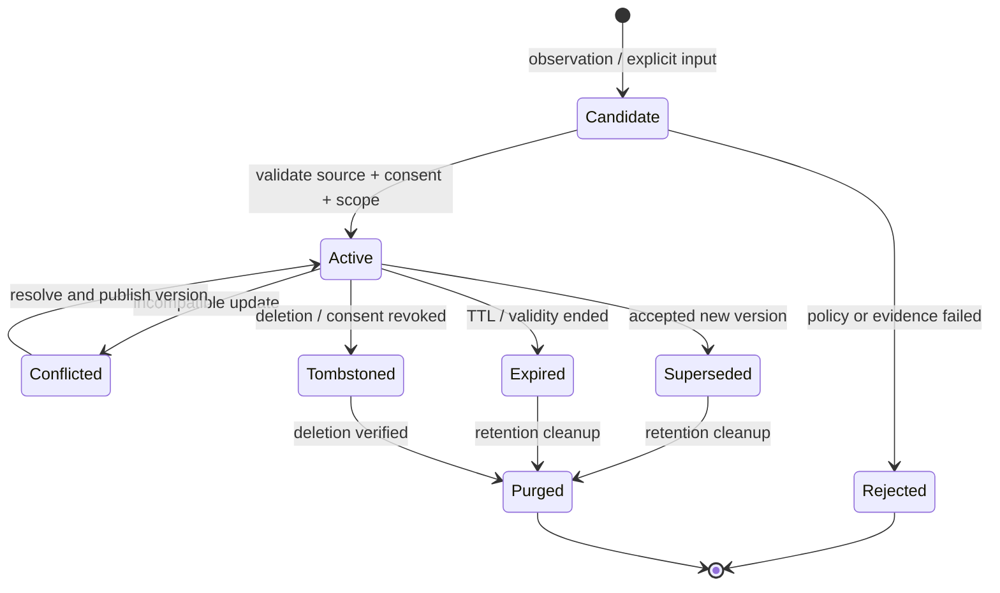
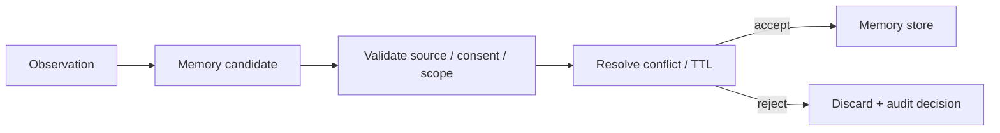
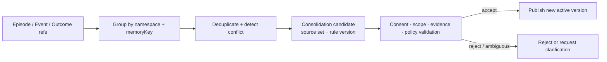

# 04 · State、Memory 与 Compaction

长任务会不断产生消息、工具结果、计划、摘要和用户偏好。如果这些内容全部写入聊天历史或同一个向量库，系统很快就会失去事实层次：一次模型推断可能被当成长期偏好，旧摘要可能覆盖订单的最新状态，删除一条消息也无法清理已经生成的 Embedding 和缓存。

State、Context、Knowledge 与 Memory 解决的是不同问题。分清它们的权威性和生命周期，才能让 Agent 跨步骤保持连续，又不把一次错误永久放大。

## 本章目标

- 区分 Event Log、Runtime State、Context、Long-term Memory 与 Knowledge Corpus。
- 区分 Provider Conversation Session、产品 Thread 与 Authentication Session 的生命周期。
- 设计 Memory 的写入校验、读取策略、冲突处理和删除机制。
- 理解 Working、Semantic、Episodic 与 Procedural Memory 的用途。
- 理解 Memory Consolidation（记忆巩固）与 Context Compaction（上下文压缩）的不同输入、产物和风险。
- 把 Compaction 作为可追溯的有损派生，而不是状态存储。

## 1. 五类对象不能共用一个含糊的“记忆”概念

| 对象               | 作用域          | 典型内容                              | 权威性         |
| ---------------- | ------------ | --------------------------------- | ----------- |
| Event Log        | Run / Thread | Tool Call、Approval、Receipt、状态转移   | 已发生事件的权威记录  |
| Runtime State    | Run / Thread | 当前步骤、预算、待审批 Proposal、执行中的 Command | 当前执行状态的权威表示 |
| Context          | 单次模型调用       | 精选指令、状态、证据和工具                     | 临时、非权威      |
| Long-term Memory | 跨 Thread     | 用户偏好、稳定事实、历史经验                    | 取决于来源与治理    |
| Knowledge Corpus | 文档 / 业务域     | 有版本的政策、产品与领域知识                    | 来源系统持有权威    |

订单是否已退款属于领域数据库；“用户偏好邮件通知”可以进入 Long-term Memory；“本轮已经尝试查询两次”属于 Runtime State。它们的更新、权限和保留期完全不同。

## 2. 先确定 Scope，再谈“记住多久”

同一条信息能否进入下一次调用、下一个 Run 或另一个项目，取决于应用定义的 Scope，而不是模型“是否还记得”。从窄到宽可以排列为：

| Scope                 | 生命周期      | 典型内容                     | 跨越边界时的规则                               |
| --------------------- | --------- | ------------------------ | -------------------------------------- |
| Model Call Context    | 单次模型调用    | 本轮指令、状态投影、证据和 Tool       | 调用结束后不自动保留                             |
| Run Working Memory    | 单次目标执行    | 未决问题、临时计算、近期 Observation | 由 Runtime State 与 Context Builder 管理   |
| Product Thread        | 一段长期任务或交互 | Run、Item、Event 与用户输入     | 新 Run 从权威 Thread State 恢复，不从自然语言猜测     |
| User / Project Memory | 跨 Thread  | 明确偏好、项目约定                | 同一 Tenant、User、Project 与 Purpose 下才可读取 |
| Tenant-shared Memory  | 跨用户或团队    | 经治理的组织约定                 | 需要明确 Owner、发布流程和 Tenant Policy         |

Application-wide 规则通常应进入版本化配置、Policy、Skill 或代码，而不是被包装成“全局记忆”。Scope 越宽，错误和敏感信息传播得越远，因此发布条件应更严格。

“Session”还可能指三种不同对象：

- **Provider Conversation Session（模型提供方会话）**：Provider 保存的 Message、Item 或 Response 关联，用于继续 API 交互；它不持有应用的权威状态。
- **Product Thread（产品线程）**：应用持有的长期任务容器，可以跨多个 Provider Session、网络连接和登录周期存在。
- **Authentication Session（认证会话）**：证明当前 Actor 身份及登录状态；它可以到期或更换，但不能决定 Memory 内容，也不能作为跨用户读取的 Namespace。

浏览器重新登录不应复制一份长期 Memory，Provider Conversation 结束也不应删除 Product Thread。所谓“跨会话记忆”必须继续说明跨越的是 Provider Session、Authentication Session 还是 Product Thread；只有经过治理的 Long-term Memory 才能跨 Thread 进入新任务。

## 3. 实用的 Memory 分类

### Working Memory

当前 Run 的短期信息，例如正在验证的 proposal、未决问题和临时计算结果。通常由 Runtime State 与 Context 共同表达，Run 结束后不一定保留。

### Semantic Memory

相对稳定的事实或明确偏好，例如用户选择的语言、项目约定和长期配置。它需要来源、适用范围、版本和更正机制。

### Episodic Memory

过去发生的事件与结果，例如某次部署失败的原因、某类任务的成功轨迹。它可以帮助后续决策，但不能代替当前权威状态。

Episodic Memory 与 Event Log 不能混为一谈。Event Log 是某个 Run / Thread 中已经发生事件的权威记录；Episodic Memory 是从 Event、Artifact 与 Outcome 中选择出的、带 `sourceRefs` 的非权威派生，用于在未来任务中发现相似经验。删除 Episodic Memory 不应改写历史 Event，召回一段 Episode 也不能证明当前订单状态或外部效果。

### Procedural Memory

完成某类任务的方法。生产中更适合用版本化 Skill、Workflow 或代码表达，因为它们比自由文本记忆更容易评测、审查和回滚。

这是一组设计分类，不要求为每一类购买独立数据库。

## 4. Memory 有显式生命周期

Long-term Memory 不应从一段文本直接变成“永久有效”。一个最小生命周期可以表示为：



只有 `Active` 且通过当前读取策略的记录可以进入 Context。`Conflicted` 应触发澄清或确定性裁决；`Superseded`、`Expired` 与 `Tombstoned` 必须立即退出服务路径，即使物理清理尚未完成。Working Memory 通常跟随 Run State 生命周期，不需要进入这套长期记录状态机。

## 5. 模型只能提出 Memory Candidate

模型在对话中推断“用户似乎偏好简洁回复”，这还不是可以跨 Thread 保存的事实。合理流程是：



候选记录写入前至少检查：

- 是否对未来任务有稳定价值；
- 用户明确陈述，还是模型推断；
- 是否存在可回溯的证据；
- Namespace 属于 User、Tenant、Project 还是 Application；
- 是否包含敏感数据，用户是否同意；
- 是否需要 TTL 或 `validUntil`；
- 与已有记录是否冲突；
- 用户是否能够查看、更正、导出和删除。

## 6. Memory Record 与更新协议需要结构化

`id` 标识一条不可变版本，`memoryKey` 标识 Namespace 内的同一项逻辑信息。两者分离后，更正可以发布新版本，而不必原地覆盖旧证据。

```ts
type MemoryRecord = {
  schemaVersion: 1;
  id: string;
  memoryKey: string;
  namespace: {
    tenantId: string;
    userId?: string;
    projectId?: string;
  };
  kind: "semantic" | "episodic" | "procedural";
  value: unknown;
  sourceRefs: string[];
  assertion: "explicit" | "inferred";
  confidence?: number;
  sensitivity: "normal" | "sensitive";
  consentRef?: string;
  purposeTags: string[];
  validFrom: string;
  validUntil?: string;
  status:
    | "candidate"
    | "active"
    | "conflicted"
    | "superseded"
    | "expired"
    | "tombstoned";
  version: number;
  policyVersion: string;
  createdAt: string;
  updatedAt: string;
};

type MemoryWriteCommand = {
  idempotencyKey: string;
  namespace: MemoryRecord["namespace"];
  memoryKey: string;
  expectedVersion?: number;
  candidate: unknown;
  sourceRefs: string[];
};
```

`confidence` 只适合表达推断的不确定性，不能覆盖权限和来源。高置信度的越权 Memory 仍然不可读；用户明确陈述的内容即使置信度较低，也不应被系统自动“纠正”。

Memory Writer 还需要明确处理重复与并发：

- 同一个 `idempotencyKey` 重试时返回同一写入结果，不重复创建版本。
- 相同 Namespace、`memoryKey`、内容摘要和来源集合的 Candidate 可以幂等归并，但不能借重复出现提高置信度。
- 更新使用 Compare-and-Swap（比较并交换，CAS）或等价的 Optimistic Concurrency Control（乐观并发控制），要求 `expectedVersion` 与当前版本一致。
- 两个并发更新内容不同，后到者不能用 Last-write-wins（后写覆盖）静默覆盖；它应收到版本冲突，进入 `conflicted` 或基于新版本重新提交。
- 更正发布新的不可变版本，并把旧版本标记为 `superseded`；删除和撤销同意则发布 Tombstone，不能复用普通更新接口。

这些约束防止网络重试制造重复偏好，也防止两个页面、Worker 或后台 Consolidation Job 相互覆盖。

## 7. 读取 Memory 时重新做权限与相关性判断

Memory 写入合法，不代表每个未来 Context 都应该包含它。读取流程应重新检查：

```text
actor / tenant / project scope
purpose and destination
validity and conflict status
current task relevance
token budget
```

例如，用户的旅行偏好不应出现在代码审查任务中；一个项目的内部约定不能进入另一个客户项目；标记为冲突的偏好应触发澄清，而不是随机选择一个版本。

读取方式也应服从记录类型。明确的项目偏好适合按 `memoryKey` 精确读取；Episodic Memory 可以在合法分区中做时间、标签或相似度检索；Procedural 内容优先由版本化 Skill / Workflow Registry 选择。三者不能只用一个全局 Vector Search 和相同 Top-K 策略处理。

Memory Store Outage（记忆存储不可用）时，应按任务风险显式降级：

- 个性化偏好不可用时，回到经过评测的 No-memory Baseline，或向用户澄清，不得根据当前语气编造长期偏好。
- 可访问性或沟通渠道等必要配置无法确认时，使用安全默认值并说明限制。
- 不得绕过 Tombstone、TTL 或 Namespace 校验，退回未经治理的本地 Cache。
- Trace 记录 `memory_unavailable` 与降级路径，但不把临时默认值重新写成 Memory。

## 8. State 不应从自然语言摘要反向恢复

以下信息需要保持结构化和权威：

- 当前状态机节点；
- 已消耗预算与 Deadline；
- 未决 Tool Call 和 attempt ID；
- Approval 对应的 Proposal Hash、Actor 与失效时间；
- Idempotency Key 和 Receipt Ref；
- 资源版本与 Checkpoint Cursor。

模型生成的摘要可以帮助下一轮理解任务，却不应成为恢复这些字段的唯一来源。自然语言“退款似乎已经提交”无法区分已确认、效果未知和已失败三种状态。

## 9. Memory Consolidation 不等于 Context Compaction

两者都可能生成摘要，但解决的问题完全不同：

| 机制                   | 输入                                    | 输出                                   | 目的                       | 权威性                            |
| -------------------- | ------------------------------------- | ------------------------------------ | ------------------------ | ------------------------------ |
| Memory Consolidation | 多条带来源的 Episode、Feedback 与 Outcome     | 待验证的 Semantic / Procedural Candidate | 判断是否存在值得跨 Thread 保留的稳定模式 | 非权威，仍需发布策略                     |
| Context Compaction   | 当前 Run 的 Event、Message、Artifact 与状态引用 | `CompactionArtifact`                 | 在 Token 预算内延续当前任务        | 有损 Context 派生，不是 Runtime State |

### 9.1 Consolidation 只能生成新 Candidate

Memory Consolidation 把多条 Episodic Memory 或权威 Outcome 汇总为候选模式。例如，多次工单都显示同一客户明确选择邮件通知，可以产生“项目内默认邮件通知”的 Semantic Candidate；它不能仅凭几次系统回复较短，就推断用户永久偏好短答案。



Consolidation Job 必须：

- 只读取当前 Actor / Tenant / Project 获准的记录，并保留完整 Source Set；
- 先去重再统计，防止同一 Episode 重放多次制造虚假多数；
- 记录 Consolidator Version、聚合规则、来源时间范围和冲突项；
- 把输出交给与普通写入相同的 Consent、Scope、CAS 与发布门禁；
- 在任一来源被更正、删除或降级后，使依赖它的 Candidate 或 Active Version 重新验证；
- 不把自然语言反思直接发布为 Procedural Memory，高风险流程仍应进入 Skill、Workflow 或代码评审。

少量偶发 Episode 被归纳成全局偏好属于 False Consolidation（错误巩固）。防线不是给摘要增加更高“置信度”，而是限制 Scope、要求独立证据或明确确认，并与 No-memory Baseline 比较真实收益。

### 9.2 Compaction 是有损派生

长 Context 需要压缩时，至少保留：

- 当前目标、禁止项和完成条件；
- 已完成动作与不可变 Receipt；
- 未决问题、失败原因和下一步；
- 权限范围、Approval 范围和有效期；
- Evidence Ref 与 Artifact Ref；
- 预算、版本和恢复位置。

一个 Compaction Artifact 应记录来源：

```ts
type CompactionArtifact = {
  id: string;
  compactorVersion: string;
  sourceEventRange: { from: number; to: number };
  sourceDigest: string;
  summary: string;
  preservedRefs: string[];
  createdAt: string;
};
```

摘要中的结论不是新的领域事实。若源 Event、Receipt 或文档仍在保留期内，系统应允许重新读取和校验；不能假设从摘要可以精确还原原文。

## 10. 删除与更正不是单表操作

删除一条 Memory 可能需要清理：

```text
primary memory store
vector / search index
cache
context snapshot or summary
eval dataset
analytics copy
backup and third-party processor
```

生产系统应先通过 Tombstone 阻断读取，再异步清理，并通过删除验证（Deletion Verification）确认所有在线路径都不再返回相关内容。更正时应创建新版本，把旧版本标记为已取代（Superseded），并使依赖旧 Memory 的派生物失效。

Event Log 和 Audit Log 可能受不同保留义务约束。此时需要从可供模型使用的读取路径中移除敏感内容，同时按政策保留最小、受限的审计证据。

## 11. Memory 必须独立评测

| 指标                           | 要回答的问题                                      |
| ---------------------------- | ------------------------------------------- |
| Write precision              | 保存的内容有多少真正值得跨 Thread 保留？                    |
| Write recall                 | 明确应该保留的低风险偏好是否被正确发布？                        |
| Retrieval precision / recall | 相关合法 Memory 是否命中，无关内容是否污染 Context？          |
| Source attribution           | 读取结果能否回到真实来源，而不是引用另一段派生回答？                  |
| Consolidation precision      | 聚合出的稳定模式有多少得到独立来源或用户确认支持？                   |
| Stale/conflict handling      | 过期、冲突、低置信记录是否被降级或拒绝？                        |
| Scope selection / leakage    | 合法 Scope 是否命中，是否发生跨用户、Tenant 或 Project 的泄漏？ |
| Downstream utility           | 加入 Memory 后，真实任务是否优于无 Memory baseline？      |
| Deletion effectiveness       | 删除后所有读取路径是否都不再返回？                           |
| Availability degradation     | Store 不可用时是否安全回到 Baseline，而不是编造或读取过期副本？     |

写入数量、向量库规模和“记住了多少用户信息”都不是质量指标。错误 Memory 会让一次模型失误跨 Thread 重复出现。

### 11.1 用顺序 Fixture 验证跨 Thread 行为

单条写入与单条读取测试不足以证明跨 Thread 语义。至少保留一条按时间推进的 Fixture：

| 步骤 | 独立边界                                           | 操作                              | 期望结果                                              |
| -- | ---------------------------------------------- | ------------------------------- | ------------------------------------------------- |
| A  | Auth Session A / Provider Session A / Thread A | 用户明确声明 `project_alpha` 使用英文发布报告 | 生成 Candidate，经确认后发布 Project-scoped Active Version |
| B  | 新 Auth Session / 新 Provider Session / Thread B | 同一 Tenant、User 与 Project 创建相关任务 | 精确读取该版本，并在 Context Manifest 中记录 Source Ref        |
| C  | Thread C                                       | 同一用户进入 `project_beta`           | 不召回 `project_alpha` 记录                            |
| D  | 两个并发页面                                         | 分别提交不同更正                        | 只有一个 CAS 成功；另一个收到版本冲突，不发生静默覆盖                     |
| E  | Thread D                                       | 用户撤销同意并要求删除                     | 先写 Tombstone；新读取、Index 与 Cache 立即不可见              |
| F  | 新 Provider Session / Thread E                  | 使用清洁输入再次执行相似任务                  | 已删除内容不进入 Context，系统不从旧回答恢复偏好                      |
| G  | Memory Store Outage                            | 重放同一任务                          | 回到 No-memory Baseline 或请求澄清，任务结果与权限边界保持不变         |

这组 Trial 应同时包含 Memory On / Off 对照，并固定 Context Builder、Model、Tool 与 Dataset Version。个性化文案可以变化，退款资格、金额、权限和真实 Outcome 必须保持一致。

### 11.2 把失败模式变成可定位的测试

| Failure Mode                          | 典型表现                         | 必须验证的不变量                                        |
| ------------------------------------- | ---------------------------- | ----------------------------------------------- |
| Source Laundering（来源洗白）               | Memory 影响模型回答，回答又被当作新的独立来源写回 | 保留完整 Source Chain；没有新外部证据或明确确认时拒绝循环升级           |
| False Consolidation                   | 少量偶发 Episode 被归纳为全局偏好        | Consolidation 只生成 Candidate，Scope、独立证据与确认门槛生效   |
| Namespace Collision（命名空间碰撞）           | 同名用户、项目或外部账号被映射到错误 Namespace | 只使用可信稳定 ID 与 Tenant Predicate，显示名称不参与授权或主键      |
| Duplicate / Concurrent Write（重复或并发写入） | Retry 或并发页面生成重复、互相覆盖的版本      | Idempotency Key 去重，CAS 冲突可见，Last-write-wins 被拒绝 |
| Retrieval Flooding（检索洪泛）              | 大量低价值 Memory 占满 Context      | 按 Scope、Kind、Relevance 与 Budget 过滤，并保留排除原因      |
| Store Outage（存储不可用）                   | 系统读取过期 Cache，或根据当前文本虚构旧偏好    | 进入显式降级路径，不绕过 Tombstone/TTL，不把默认值写回              |

## 12. 案例：一句偏好如何进入系统

用户明确说：“以后这个项目的发布报告都使用英文。”

合理记录为：

```text
namespace: tenant_1 / user_7 / project_alpha
memory_key: release_report_language
kind: semantic
value: { release_report_language: "en" }
assertion: explicit
source_ref: message_418
valid_until: null
status: active
version: 1
policy_version: memory-policy-1
```

如果模型根据两次简短回复推断“用户喜欢所有回答都很短”，只能生成 inferred candidate。没有明确 consent 和稳定证据时，可以保留在当前 Run 的 Working Memory，但不应直接发布为全局 Semantic Memory。

## 实践：治理 Resolution Desk 的沟通偏好 Memory

### 进入本章时已有能力

Resolution Desk 已能检索权威订单与政策并生成带来源的 Proposal；跨 Thread 信息仍未区分领域事实、Runtime State、Context 派生物与长期 Memory。

### 本章增加的能力

只允许低风险且由客户明确表达的沟通语言、联系渠道和可访问性偏好成为 Memory Candidate。准备十条候选记录，覆盖：

- 用户明确偏好；
- 模型推断偏好；
- 已过期事实；
- 两条相互冲突的偏好；
- 另一 tenant 的记录；
- 敏感个人信息；
- 无来源结论；
- 用户已删除内容；
- 一次失败任务的经验；
- 应改写为 Skill 的程序性步骤。

退款资格、金额、订单状态和政策结论始终来自权威系统，不能由 Memory 覆盖。

随后执行第 11.1 节的跨 Thread 顺序 Fixture，并追加四个故障变体：同一 Candidate 重放、两个并发更正、旧 Memory 影响回答后被再次提交、Memory Store 在读取阶段不可用。为 Episodic Memory 保留 Event / Outcome Ref，但不复制完整 Event Log；模拟 Consolidation 时只生成待验证 Candidate，不自动扩大到 User 或 Tenant Scope。

### 验收证据

为每条记录给出写入决策、读取决策、Namespace、TTL、Lifecycle State、Grader 和删除路径。比较启用与禁用 Memory 时，客户回复的语言和渠道是否更匹配，同时确认退款结果不变；来自其他 Tenant、由模型推断、已经过期、没有来源或已经删除的记录均不得进入 Context。

顺序 Fixture 还必须证明：新 Authentication / Provider Session 不会丢失合法的 Project Memory；切换 Project 后不会越界召回；并发更正不会静默覆盖；撤销同意后清洁 Thread 无残留；Store Outage 时回到 No-memory Baseline。Source Laundering 和 False Consolidation 变体不能发布新的 Active Version。

## 常见误区

- 保存全部聊天记录等于建立长期 Memory。
- Vector Database 本身就是 Memory 系统。
- 模型最适合自行决定保存、冲突和删除。
- Provider Conversation Session、Product Thread 与 Authentication Session 是同一种状态容器。
- 多次重复出现的 Episode 可以自动巩固成全局事实。
- Last-write-wins 足以处理并发 Memory 更新。
- 从 Memory 生成的回答可以作为新的独立来源写回。
- Compaction summary 可以覆盖原始 receipt 和 Runtime State。
- Memory Store 不可用时可以退回任意本地 Cache。
- 用户偏好一旦保存就永久有效。

## 本章小结

Event Log、Runtime State、Context、Knowledge 与 Long-term Memory 具有不同的权威性和生命周期。Provider Conversation Session、Product Thread 与 Authentication Session 也不能互相替代。Memory 必须具备 Scope、Candidate Validation、幂等写入、CAS 更新、Consolidation 门禁、读取授权、冲突处理和删除验证；Context Compaction 只能生成可追溯的有损派生物。

固定检索仍无法覆盖多跳补证、关系遍历或全局语料归纳时，可以先进入进阶专题 [Agentic RAG 与 GraphRAG](/masterpiece-static-docs/06-上下文-知识与记忆/05-复杂知识检索-Agentic-RAG与GraphRAG.md)做对照实验；其他场景继续主线，从[工具契约与错误模型](/masterpiece-static-docs/07-工具-协议与行动控制/01-工具契约与错误模型.md)进入行动面。

## 延伸阅读

- [CoALA: Cognitive Architectures for Language Agents](https://arxiv.org/abs/2309.02427)
- [MemGPT](https://arxiv.org/abs/2310.08560)
- [OpenAI: Conversation state](https://developers.openai.com/api/docs/guides/conversation-state)
