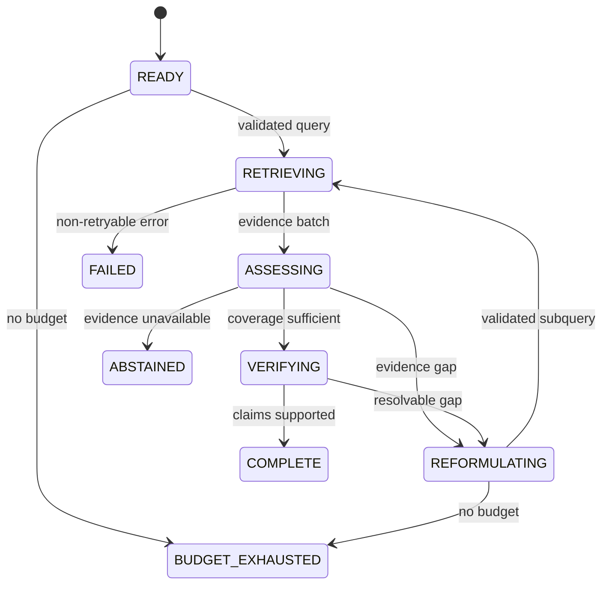
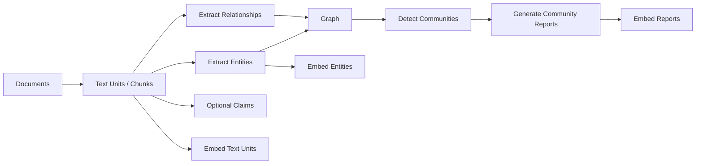

# 05 · 复杂知识检索：Agentic RAG 与 GraphRAG

固定的 Hybrid Retrieval、Reranking 和 Context Packing 已经能够解决大量知识任务。只有当问题确实需要多轮探索、跨来源补证、关系遍历或全局主题归纳时，才有理由引入 Agentic RAG 或 GraphRAG。

本章属于进阶专题，不是 Resolution Desk 的核心运行依赖。进入本章前，应先完成[检索、RAG 与重排](/masterpiece-static-docs/06-上下文-知识与记忆/03-检索-RAG与重排.md)中的固定 Pipeline，并保留它作为 Baseline。新增复杂度只有在相同 Dataset、近似预算和相同安全边界下取得稳定净收益，才进入生产候选。

TypeScript / Node.js 继续持有 Task、Runtime、Policy、Trace 与 Eval。需要验证 Microsoft GraphRAG 等非 Node 参考实现时，可以把它作为独立离线实验或受控 Sidecar，通过版本化 Adapter 交换 Artifact；不在本书仓库创建相关工程，也不要求把主应用迁移到 Python。

## 本章目标

- 把 Agentic Retrieval 实现为有状态、有预算、有停止条件的受控 Loop。
- 区分固定 RAG、Agentic RAG 与 GraphRAG 解决的问题。
- 理解 Entity、Relationship、Claim、Community 与 Community Report 的派生链。
- 正确选择 Local、Global 与 DRIFT 等查询模式。
- 让 Graph 派生物继续服从 Provenance、Temporal、ACL、更新与删除约束。
- 用相同 Baseline、成本与故障模型决定是否采用复杂检索。

## 1. 先证明固定 Hybrid Baseline 的边界

复杂检索的起点不是“换一个更先进的框架”，而是一个可以复现的失败切片。

| Baseline 失败            | 可能的候选能力                     | 仍需先排除                               |
| ---------------------- | --------------------------- | ----------------------------------- |
| 一次 Query 无法覆盖多个独立信息缺口  | Agentic Query Decomposition | Chunk、Metadata、Top-K 或 Rewrite 配置错误 |
| 需要沿某个实体查找多跳关系          | Graph Local Search          | 关系本可由结构化数据库直接查询                     |
| 问题要求概括整个大型语料的主题        | Community / Global Search   | 普通摘要或分层 Map-Reduce 已经足够             |
| 初始问题宽泛，后续需要由全局信息引导局部追问 | DRIFT 类搜索                   | 固定 Multi-Query 与 Rerank 已能满足        |

进入实验前至少保留：

```text
fixed source snapshot + index build
fixed query / qrels / hard negatives
fixed Hybrid + Rerank baseline
task success + citation + ACL graders
token / latency / money budgets
prompt-injection and stale-data slices
```

没有这些资产，复杂系统即使给出更长、更像研究报告的回答，也无法证明检索质量真正提高。

## 2. Agentic RAG 是受控 Retrieval Loop

Agentic Retrieval 允许模型根据当前证据决定是否改写 Query、拆分子问题、选择来源、展开引用或停止。它不是让模型无限搜索，也不是把搜索 API 暴露后期待模型自行收敛。



### 2.1 模型提出动作，Runtime 持有边界

```ts
type RetrievalAction =
  | {
      type: "search";
      query: string;
      sourceIds: string[];
      reason: string;
    }
  | {
      type: "expand_citation";
      evidenceId: string;
      reason: string;
    }
  | {
      type: "finish";
      claimDrafts: Array<{
        claim: string;
        evidenceIds: string[];
      }>;
    }
  | {
      type: "abstain";
      missingEvidence: string[];
    };

type RetrievalBudget = {
  maxSteps: number;
  maxQueries: number;
  maxSources: number;
  maxRetrievedTokens: number;
  maxModelTokens: number;
  deadlineAt: string;
  maxCostMinor: number;
};
```

Runtime 必须在每一步重新校验：

- Actor、Tenant、Purpose 与允许访问的 Source；
- Query 是否保留资源 ID、否定条件和时间约束；
- Source Selection 是否在允许列表内；
- Query、Token、时间、费用与并发预算；
- 已有 Evidence 是否重复，继续搜索是否仍可能增加信息；
- Tool Result 与检索内容是否被标记为不可信数据；
- `finish` 中每个高影响 Claim 是否具有可解析、未过期的 Evidence。

模型的“我已经找到足够证据”只是候选停止动作。最终完成条件由 Coverage Grader、Citation Validator 和 Task Contract 决定。

### 2.2 停止条件必须可观察

一次 Run 至少因为以下一种原因停止：

```text
claims_supported
evidence_insufficient
source_unavailable
policy_blocked
budget_exhausted
deadline_exceeded
cancelled
loop_detected
```

不能把“模型不再调用搜索工具”当作唯一停止条件。Runtime 还应检测重复 Query、同义改写循环、相同 Evidence Batch 和无新增覆盖率的连续步骤。

## 3. Agentic Retrieval 需要完整 Query Trace

每一步保存：

```text
original query
query / planner / tool versions
trusted filter and authorized-scope digest
subquery and parent query
selected source ids
index / remote source versions
candidate ids and ranking stages
evidence added / rejected
coverage before / after
budget before / after
stop reason
```

Query Trace 不保存隐藏 Chain-of-Thought。`reason` 只是一段面向调试的动作摘要，不能替代结构化 Evidence、Policy Decision 或 Outcome。

对照 Eval 至少覆盖：

- 单跳问题：Agentic Loop 不应无意义增加调用；
- 多信息缺口：是否真正提高 Evidence Recall 与 Task Success；
- 信息不足：能否及时 Abstain，而不是持续改写；
- 冲突来源：是否保留矛盾并请求澄清；
- Prompt Injection：恶意内容能否诱导选择额外 Source 或外发数据；
- Timeout / Partial Result：是否能输出有限结果、重试受限并正确停止。

Azure AI Search 的官方 Agentic Retrieval 文档展示了一种产品实现：由模型规划 Subquery、选择 Knowledge Source，并在 Query Activity 中返回计划、调用与引用。它能帮助理解“检索本身也需要 Trace”，但其 Knowledge Source、Reasoning Effort 和 REST Contract 是供应商接口，不是本书的通用 Runtime 类型。相关稳定性状态以官方文档为准。

## 4. GraphRAG 处理关系与全局语料结构

GraphRAG 是一类先从语料构建图派生物，再利用图结构辅助检索和生成的方法。它不等于“把 Chunk 存进图数据库”，也不意味着图中的 Entity、Relationship 或 Community Report 自动成为权威事实。

Microsoft GraphRAG 当前官方索引架构包含下列主要阶段：



官方默认管线会从非结构化文本提取 Entity、Relationship 与可选 Claim，对实体图执行 Community Detection，并生成多层 Community Report；输出默认写入结构化表，Embedding 写入配置的向量存储。[GraphRAG 索引架构](https://microsoft.github.io/graphrag/index/architecture/)与[索引概览](https://microsoft.github.io/graphrag/index/overview/)描述了这条当前实现。

### 4.1 图对象都是带来源的派生工件

一个应用侧契约可以表达为：

```ts
type GraphEvidenceRef = {
  sourceId: string;
  sourceVersion: string;
  textUnitId: string;
  location: string;
  contentHash: string;
};

type DerivedRelation = {
  relationId: string;
  sourceEntityId: string;
  targetEntityId: string;
  relationType: string;
  description: string;
  evidenceRefs: GraphEvidenceRef[];
  tenantId: string;
  aclDigest: string;
  validFrom?: string;
  validUntil?: string;
  extractionVersion: string;
  status: "active" | "conflicted" | "tombstoned";
};
```

Entity Merge、Relation Extraction、Claim Extraction 与 Community Summary 都可能出错。用户问“哪些政策相互覆盖”时，图可以帮助选择候选证据；真正的政策优先级仍由版本、生效时间、Tenant 与确定性业务规则判断。

## 5. Local、Global 与 DRIFT 是不同查询问题

下面的名称与语义特指 Microsoft GraphRAG 当前官方 Query Engine，不应推广为所有 GraphRAG 系统的统一标准。

| 模式            | 官方定位                                                  | 适合的问题           | 主要代价与风险                  |
| ------------- | ----------------------------------------------------- | --------------- | ------------------------ |
| Basic Search  | 以 Text Unit 做基础向量 RAG                                 | 与普通 Baseline 对拍 | 不使用图结构                   |
| Local Search  | 从与 Query 相关的 Entity 进入，组合关系、Community 信息和原始 Text Unit | 某个实体及其具体关系      | Entity Linking 错误会带偏整条路径 |
| Global Search | 对 Community Report 执行 Map-Reduce                      | 整个语料的主题、趋势与全局问题 | 资源密集，摘要误差可能逐层累积          |
| DRIFT Search  | 以相关 Community Report 作为广阔起点，再用局部搜索回答后续问题              | 需要全局背景引导局部深入的问题 | 多轮、成本高，必须限制深度和 Follow-up |

官方文档说明，Local Search 会把知识图中的结构化数据与原始 Text Chunk 共同放入 Context；Global Search 在 Community Report 上执行 Map-Reduce；DRIFT（Dynamic Reasoning and Inference with Flexible Traversal）先利用相关 Community Report 形成 Primer 和 Follow-up，再用局部搜索继续细化。[Query Engine 概览](https://microsoft.github.io/graphrag/query/overview/)与[DRIFT Search](https://microsoft.github.io/graphrag/query/drift_search/)给出了当前定义。

这些模式不是由模型随意选择的“风格”。Router 应以 Query Slice、预算和离线 Eval 为依据；高风险业务问题还可以固定模式，或只允许 Basic / Local 候选检索。

## 6. Provenance、Temporal 与 ACL 必须传播到图

图结构会扩大信息组合能力，也会扩大泄漏面。

### 6.1 Provenance

每个 Entity Description、Relationship、Claim、Community Membership 与 Report Finding 都应能回到一个或多个 Text Unit。Community Report 只是一份派生摘要；引用它时，仍需能够展开到支持该结论的原始证据。

### 6.2 Temporal

实体可能保持不变，关系却只在某段时间成立。至少区分：

```text
source observed time
business valid time
extraction / graph build time
community report generation time
query effective time
```

把不同月份的组织关系、政策版本或事故状态合并成一条无时间关系，会让图产生并不存在的“长期事实”。

### 6.3 ACL 与 Multi-tenancy

不能先在跨 Tenant 全局图中检索或生成 Community Report，再过滤最终节点。无权 Entity 和 Relationship 已经可能影响 Community、Rank 和摘要。可接受方案包括：

- 按授权域构建物理图或独立 Community；
- 只在 ACL 兼容的 Partition 内执行 Traversal 和 Community Detection；
- 让每个派生对象携带来源 ACL，并在候选生成前求安全交集；
- 对进入 Context 的节点、边、Report 与原始 Text Unit 再做防御性复验。

若不同文档的 ACL 无法安全聚合，就不应生成跨文档 Community Report。图的连通性不能覆盖数据治理边界。

## 7. 更新和删除是图系统最难的部分之一

Source 更新可能影响：

```text
Text Unit
→ Entity / Relationship / Claim
→ Community Membership
→ Community Report
→ Embedding
→ Retrieval Cache
→ Generated Citation
```

应用需要从 Source Tombstone 出发计算派生影响范围，先阻断旧对象读取，再重建受影响的 Entity、Relationship、Community 与 Report。Entity Resolution 变化还可能导致节点拆分或合并，不能只覆盖一条文本属性。

Microsoft GraphRAG 当前 CLI 提供 `update` 工作流，配置中也提供独立的 Update Output Storage；这说明增量构建是正式的运行问题。[GraphRAG CLI](https://microsoft.github.io/graphrag/cli/)与[配置说明](https://microsoft.github.io/graphrag/config/yaml/)可用于核对当前能力。但产品仍需自行验证：

- 删除与 ACL 收紧是否传播到所有派生表和向量；
- 增量结果是否与同 Snapshot 全量重建一致；
- 新旧 Community ID 和 Citation 是否可以迁移；
- 候选 Build 未通过 Eval 时能否继续服务旧 Build；
- Cache、Report 和下游 Artifact 是否随 Build Promotion 失效。

官方工具存在更新命令，不代表业务删除与合规义务已经自动完成。

## 8. 成本模型必须同时覆盖索引和查询

普通 RAG 的主要离线成本通常来自解析与 Embedding；GraphRAG 还可能增加 Entity / Relationship / Claim 抽取、Community Detection、Report 生成及其重建成本。

```text
total cost
= initial indexing
+ incremental extraction and report rebuild
+ graph / vector / artifact storage
+ local / global / DRIFT query
+ citation validation
+ eval and human review
```

GraphRAG 官方入门文档明确警告索引可能消耗大量 LLM 资源；当前方法说明也把 Standard GraphRAG 与更便宜但图更噪的 FastGraphRAG 区分开来。[Getting Started](https://microsoft.github.io/graphrag/get_started/)与[Indexing Methods](https://microsoft.github.io/graphrag/index/methods/)体现了这项取舍。

成本报告应按成功任务计算，并同时报告初次 Build、每次增量 Update、Local / Global / DRIFT Query 和失败重试。把昂贵索引成本从单次查询账单中隐藏，会让采用结论失真。

## 9. GraphRAG Eval 不能只评最终答案

至少分成五层：

| 层次                | 主要指标                                                                  |
| ----------------- | --------------------------------------------------------------------- |
| Extraction        | Entity / Relation / Claim Precision、Recall、冲突与重复                      |
| Graph / Community | Entity Resolution、Community Stability、来源覆盖                            |
| Retrieval         | Local / Global / DRIFT Evidence Recall、Hard Negative、Context Coverage |
| Generation        | Claim Support、Citation Correctness、Abstention 与任务结果                   |
| Operations        | Build/Update Cost、Index Lag、Delete Residue、ACL Violation、P95 Latency  |

Eval Dataset 应把问题切成：

- **Local**：围绕具体 Entity 与 Relationship；
- **Global**：要求总结整个语料，而不是命中某一段；
- **Multi-hop**：需要多个独立证据才能回答；
- **Temporal / Conflict**：关系随时间变化或来源互相矛盾；
- **Negative**：图中没有足够证据，系统必须 Abstain；
- **Security**：跨 Tenant 关系、恶意 Entity Description 与污染的 Community Report。

同一 Dataset 至少比较：

```text
fixed Hybrid + Rerank
vs bounded Agentic Retrieval
vs Graph Basic / Local / Global / DRIFT（按问题类型）
```

不能只比较答案偏好。还要比较 Evidence Recall、Citation、延迟、索引成本、查询成本、权限违规、删除传播和失败可诊断性。

## 实践：独立验证复杂检索

这个实验不修改 Resolution Desk 主线，也不要求连接真实企业知识库。

### 实验语料

准备一个小型、版本化的虚构事故语料，包含：

- 多个团队、服务、依赖和负责人；
- 同名实体与别名；
- 随时间变化的依赖关系；
- 分散在多份文档中的因果链；
- 两份互相冲突的事故结论；
- 跨 Tenant Hard Negative；
- 一份带 Prompt Injection 的会议记录；
- 已撤回并要求传播删除的 Source。

### 实验步骤

1. 先运行固定 Hybrid + Rerank Baseline，并保存 Qrels、Claim–Evidence Link、成本与 Trace；
2. 实现有界 Agentic Retrieval Adapter，固定最大 Query、深度、Token、时间和费用；
3. 仅在独立实验环境运行 Graph Build，保存 Entity、Relationship、Community、Report 与 Source Ref；
4. 为 Local、Global、Multi-hop、Conflict 和 Negative Slice 分别选择查询模式；
5. 更新一份 Source、撤回一份 Source、收紧一个 Tenant ACL，验证所有派生物与 Cache；
6. 用同一 Dataset 比较任务成功、Evidence Recall、Citation、延迟、总成本和安全不变量。

TypeScript / Node 侧只需要统一的 Adapter：

```ts
interface AdvancedRetriever {
  retrieve(input: {
    query: string;
    actor: { tenantId: string; scopes: string[] };
    purpose: string;
    effectiveAt: string;
    budget: RetrievalBudget;
  }): Promise<{
    evidence: Array<{
      evidenceId: string;
      sourceRefs: GraphEvidenceRef[];
      text: string;
    }>;
    traceRef: string;
    buildId: string;
    stopReason: string;
  }>;
}
```

领域代码不依赖 GraphRAG 的 Parquet Schema、Prompt 或 Python 类型。实验 Adapter 未达到门禁时可以被删除，而不影响固定 RAG、Context Builder 与 UI。

### 采用门禁

只有同时满足以下条件，复杂检索才进入生产候选：

- 目标 Slice 相对固定 Hybrid Baseline 存在稳定、实际有意义的净收益；
- 单跳、Negative、安全与 Freshness Protected Slice 无回归；
- 每项高影响 Claim 仍可追到获准访问的原始 Text Unit；
- Index Build、增量 Update、删除和回滚能够重复演练；
- P95 延迟、每成功任务成本和人工复核量在预算内；
- Agent Loop 能在预算、取消、错误与部分结果下确定停止。

## 什么时候应该停止采用

出现以下情况时，优先保留固定 RAG 或结构化查询：

- 语料较小，问题主要是单跳查找；
- 数据已经存在可查询的关系数据库或领域 API；
- Chunk、Metadata、Query Rewrite 或 Reranker 尚未调通；
- ACL 高度动态，安全 Community 无法稳定构建；
- Source 更新频繁，派生图长期落后于权威状态；
- 无法把 Entity、Relationship 和 Report 追溯到原始证据；
- Global / DRIFT 的质量收益不足以覆盖索引、延迟和费用；
- 复杂度只让答案更长，没有提高真实 Task Outcome。

停止实验不是能力不足，而是完成了一次有效的架构判断。

## 本章小结

Agentic RAG 把检索变成受控 Loop，GraphRAG 则在文本之外增加 Entity、Relationship、Community 与 Report 等派生结构。两者都扩大了可回答问题的范围，也扩大了状态、成本、安全和更新责任。固定 Hybrid Baseline、原始证据、ACL、时间、Citation 与 Eval 始终保留；复杂检索只有通过相同任务和预算下的 Admission Test 才进入生产。

## 官方一手资料

- [Microsoft GraphRAG：Indexing Architecture](https://microsoft.github.io/graphrag/index/architecture/)
- [Microsoft GraphRAG：Indexing Methods](https://microsoft.github.io/graphrag/index/methods/)
- [Microsoft GraphRAG：Query Engine](https://microsoft.github.io/graphrag/query/overview/)
- [Microsoft GraphRAG：Local Search](https://microsoft.github.io/graphrag/query/local_search/)
- [Microsoft GraphRAG：DRIFT Search](https://microsoft.github.io/graphrag/query/drift_search/)
- [Microsoft GraphRAG：Configuration 与 Incremental Update](https://microsoft.github.io/graphrag/config/yaml/)
- [Microsoft GraphRAG：CLI](https://microsoft.github.io/graphrag/cli/)
- [Microsoft Research：From Local to Global](https://www.microsoft.com/en-us/research/publication/from-local-to-global-a-graph-rag-approach-to-query-focused-summarization/)
- [Azure AI Search：Agentic Knowledge Source](https://learn.microsoft.com/en-us/azure/search/agentic-knowledge-source-overview)
- [Azure AI Search：Query Activity、References 与权限](https://learn.microsoft.com/en-us/azure/search/agentic-retrieval-how-to-retrieve)

> 官方资料核验日期：2026-07-19。Microsoft GraphRAG 的 Local、Global、DRIFT、索引方法、配置和输出属于持续演进的具体实现；Azure Agentic Retrieval 的部分能力仍处于 Preview。本章固定的是通用工程边界，采用时仍需固定具体版本并重新运行 Contract、Eval、安全与成本测试。

[返回核心路径：State、Memory 与 Compaction](/masterpiece-static-docs/06-上下文-知识与记忆/04-状态-记忆与压缩.md) · [继续主线：Tool Contract 与错误模型](/masterpiece-static-docs/07-工具-协议与行动控制/01-工具契约与错误模型.md)
