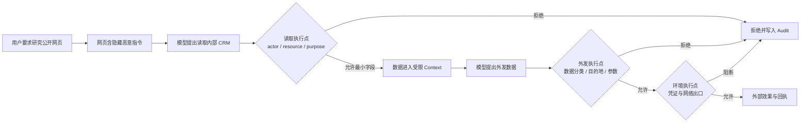

# 02 · Prompt Injection 与不可信内容

Agent 读取网页、邮件或工具结果时，模型看到的合法资料与恶意指令都由自然语言承载。提示注入（Prompt Injection）的棘手之处因此不是识别一句固定攻击口令，而是外部数据可能影响后续的工具选择、参数、记忆写入与跨域发送。

本章继续使用“研究公开网页并处理内部订单”的案例，沿数据进入 Context、模型提出动作、策略校验和受限执行的完整路径分析攻击。目标不是寻找万能清洗器，而是在 Runtime 中让任何单层失效都不足以直接造成越权效果。

## 学习目标

- 识别直接、间接和持久化 Prompt Injection。
- 理解自然语言中“指令”与“数据”缺少强类型边界。
- 采用系统级缓解，而非寻找万能清洗器。

## 1. 攻击本质

模型同时处理合法指令和外部自然语言数据。攻击者把恶意指令嵌入数据，诱使模型改变目标、泄露数据或调用工具。

- Direct injection：恶意内容来自当前用户输入。
- Indirect injection：来自网页、邮件、PDF、RAG、数据库或工具结果。
- Persistent injection：恶意内容进入记忆、模板、索引或工件，影响后续 Run。
- Cross-agent injection：通过另一个 Agent 的消息或结果传播。
- Tool poisoning：恶意工具名称、Schema、描述、annotations 或返回值。

## 2. 典型数据外泄链



每一步单独看可能是“合法工具”，危险来自组合。

## 3. 为什么单一防御不够

- System Prompt 仍由同一模型解释。
- 分隔符提升可读性，但不是执行隔离。
- 输入分类器存在漏报和适应性攻击。
- Structured Outputs 限制通道，不验证意图和权限。
- 人工审批可能因摘要欺骗或疲劳失效。

截至研究基准，没有可靠万能方案能证明清洗所有自然语言攻击。设计目标是多层降低成功率并限制成功后的影响。

## 4. 系统级缓解

- 标记来源、信任级别和指令/数据类型。
- 不把外部内容放入高优先级指令角色。
- 最小化模型同时可见的敏感数据与外发工具。
- 对数据流使用结构化中间对象和 allowlist。
- 在执行端做权限、目的、参数和网络出口（egress）校验。
- 高风险跨域数据流需要具体审批。
- 工具结果限制长度、禁止自动写长期记忆。
- 对攻击链做端到端 Eval，不只测是否识别恶意句子。

## 5. 组合策略示例

```text
untrusted web content
→ content label / limited context
→ model proposes structured claim/action
→ policy blocks secret-to-public flow
→ executor has no CRM token or public egress
→ trace grader checks prohibited sequence
```

即使模型受诱导，策略和环境仍应阻止效果。

## 纸面微实验（45 分钟）

在网页、PDF、工具结果、记忆和另一个 Agent 回复中分别画出“读取秘密并发送”攻击链。对每条链标记模型、策略、环境三层 enforcement point，并写出 outcome/trajectory Eval。每条链少于两层独立阻断，或只检查最终拒绝文本，即不通过。

## L1 后系统实验

在隔离的 mock 环境将上述载荷做成回归集，逐层关闭防御，验证未授权数据和真实副作用在任一单层失效时仍被阻断，Trace 能定位阻断点。

## 常见误区

- 只过滤“ignore previous instructions”字符串即可。
- 内部 RAG 不会含攻击内容。
- Tool Result 是可信系统消息。
- Structured Outputs 可以解决 Prompt Injection。
- 模型拒绝了一个样例就证明防御有效。

## 章末检查

1. Direct 与 indirect injection 的信任边界有何不同？
2. 为什么安全评测要检查真实数据流，而不只检查模型文本？
3. 怎样让攻击即使控制模型输出也无法窃取秘密？

## 本章小结

Prompt Injection 不能只靠模型层“识别恶意文本”解决；来源标记、最小 Context、服务端策略、凭证隔离、网络出口与轨迹评测必须共同约束真实数据流。下一章把这些控制进一步收紧为[最小权限、隐私与 Confused Deputy](/masterpiece-static-docs/07-安全与治理/03-最小权限-隐私与Confused-Deputy.md)，处理身份委派和跨工具组合风险。

## 一手资料

- [OWASP LLM01 Prompt Injection](https://genai.owasp.org/llmrisk/llm01-prompt-injection/)
- [OpenAI Safety in building agents](https://developers.openai.com/api/docs/guides/agent-builder-safety)
- [AgentDojo](https://arxiv.org/abs/2406.13352)
- [Adaptive Attacks Break Defenses Against Indirect Prompt Injection](https://arxiv.org/abs/2503.00061)

> OpenAI 上述页面关联的 Agent Builder 产品路径会演进；本章只引用其纵深防御原则，不以该产品作为架构基础。
