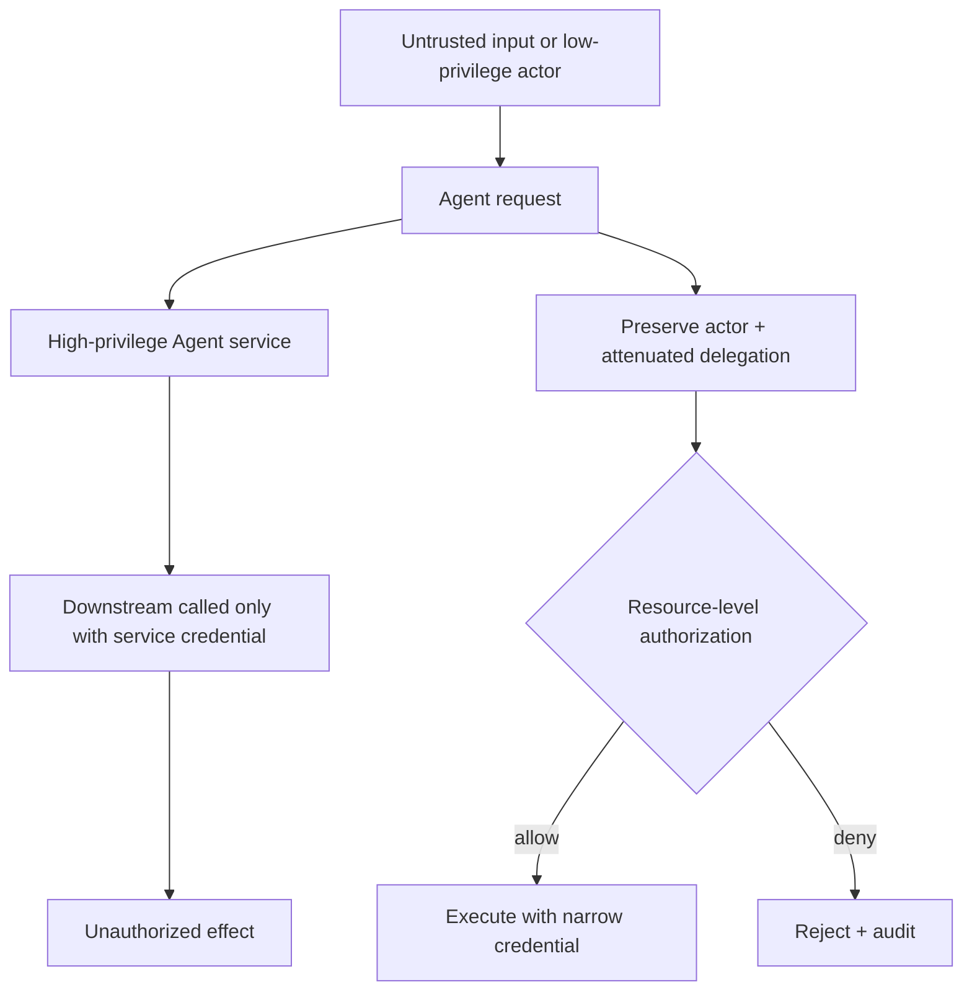

# 02 · Identity、Authorization 与 Approval

Agent 往往通过服务账号调用后端，因此在技术上“有能力”读取大量数据或提交写操作。但用户登录成功，不代表可以访问任意订单；用户说过“帮我处理退款”，也不代表已经确认某一笔具体金额。若 Runtime 只检查 Tool Schema，Agent 很容易成为混淆代理（Confused Deputy）：利用自己的高权限凭证，替低权限请求者完成越权动作。

本章把 Authentication、Authorization、Consent、Delegation 和 Approval 分开建模。它们回答不同问题；在任何外部副作用发生前，执行层都必须重新核对这些条件。

## 本章目标

- 区分身份、授权、同意、委派与审批。
- 把 Actor、Resource、Action 和 Purpose 带入每次工具执行。
- 防止 Confused Deputy、跨 Tenant 访问和权限放大。
- 将 Approval 绑定到不可变 Proposal，并处理过期与 TOCTOU。

## 1. 五个概念回答五个问题

| 概念             | 回答的问题                                |
| -------------- | ------------------------------------ |
| Authentication | 当前调用者是谁？                             |
| Authorization  | 这个 Actor 此刻能否对该 Resource 执行该 Action？ |
| Consent        | 数据主体是否同意这种处理、共享或保留？                  |
| Delegation     | Agent 代表谁、在什么范围和期限内行动？               |
| Approval       | 用户是否确认这一项具体且可理解的外部效果？                |

它们不能互相推出：

- 已认证用户仍可能无权读取目标资源。
- OAuth scope 允许调用某类 API，不等于满足业务授权。
- 用户批准一项动作，不能创造后端原本不存在的权限。
- 有权退款，不代表每笔退款都无需确认。
- 同意将数据用于当前任务，不代表可以长期写入 Memory 或评测数据集。

## 2. 把调用者拆成 User Identity 与 Workload Identity

Agent 应用中常同时存在：

- **Original Actor**：发起任务的人或系统。
- **Workload Identity**：Agent Server 或 Worker 的服务身份。
- **Delegation Context**：工作负载代表 Original Actor 可以做什么。
- **Downstream Credential**：面向特定受众（Audience）的短期凭证。

下游服务不能只看到 Agent 的宽泛服务账号。它至少需要可验证的 Actor、Tenant、Delegated Scope 和 Target Audience，并在自身的资源边界重新授权。

```ts
type AuthorizationContext = {
  actor: { id: string; tenantId: string };
  workload: { serviceId: string };
  delegation: {
    scopes: string[];
    audience: string;
    expiresAt: string;
    chainRef: string;
  };
};
```

不要让模型生成这些字段，也不要把用户 Token 原样传给任意工具。

## 3. 授权是一项资源级决策

```text
decision = policy(
  actor,
  tenant,
  resource,
  action,
  purpose,
  scope,
  environment,
  resource_version,
  time,
  risk
)
```

一个实用的结果类型：

```ts
type PolicyDecision =
  | { effect: "allow"; policyVersion: string }
  | { effect: "require_approval"; policyVersion: string; reason: string }
  | { effect: "deny"; policyVersion: string; code: string };
```

策略应默认拒绝，只显式允许满足条件的请求。Policy 可以把模型产生的分类结果作为低信任特征，但最终决定必须由可测试的代码或策略引擎作出。

### 3.1 Capability 与 Authorization 约束不同层次

Capability（能力集合）规定一个执行主体在当前运行环境中最多可能做什么；Authorization 判断某一次具体 Proposal 是否允许执行。二者缺一不可：

- 一个只读 Worker 根本不应注册写入或任意执行工具，即使模型请求、用户点击或 Approval 记录声称允许。
- 一个拥有写入工具的 Worker，也必须针对当前 Actor、Resource、Action 和 Purpose 重新授权。
- Approval 只能确认既有权限边界内的具体效果，不能把被 Capability 或组织 Policy 禁止的动作重新开放。

可以把能力描述成带约束的 Grant 集合，而不是一组容易互相矛盾的布尔开关：

```ts
type CapabilityAction =
  | "read"
  | "search"
  | "write"
  | "execute"
  | "network"
  | "delegate";

type CapabilityGrant = {
  action: CapabilityAction;
  toolIds: readonly string[];
  canonicalResourceSelectors: readonly string[];
  networkOrigins: readonly string[];
  executableDigests: readonly string[];
  limits: {
    maxCalls: number;
    maxBytes: number;
    maxCostUsd?: number;
  };
  notAfter: string;
};

type CapabilitySnapshot = {
  snapshotId: string;
  policyVersion: string;
  grants: readonly CapabilityGrant[];
  digest: string;
};

declare function covers(
  parent: CapabilityGrant,
  child: CapabilityGrant,
): boolean;

const isAttenuation = (
  child: CapabilitySnapshot,
  parent: CapabilitySnapshot,
) =>
  child.grants.every((childGrant) =>
    parent.grants.some((parentGrant) => covers(parentGrant, childGrant)),
  );
```

`covers` 必须逐维证明 Child 的 Action、Tool、Canonical Resource、Path、Origin、Executable、调用次数、数据量、费用和期限都不宽于 Parent；无法比较的 Selector 或通配规则应 Fail-closed。`execute` 尤其不能只比较动词：被允许的进程可能间接写文件、访问网络或读取 Credential，其有效能力还要与 Sandbox 的 Filesystem、Network 和 Secret 约束求交。

`read + write` 与 `read + execute` 不是天然的上下级关系：前者可以修改受限资源但不能启动进程，后者只能运行特定 Digest 的程序，且不能因此自动获得文件或网络访问。委派时的 `child ⊆ parent` 指所有约束维度都被 Parent 覆盖，而不是只比较动作名称或用一个大小数字表示权限等级。

Tool Registry 还必须要求每种工具显式声明 Effect Class、Resource Derivation 和所需 Capability。遇到未知 Tool 类型、缺失声明或无法从参数确定目标资源时，安全结果是拒绝或进入人工审查，不能因为“尚未识别”就默认把它归为只读。

## 4. Confused Deputy 如何发生



典型缓解措施：

- 保留 Original Actor 和 Delegation Chain；
- 使用短期、最小权限 Credential；
- 将 Token 绑定到正确的 Audience；
- 按 Resource 与 Action 缩减 Scope；
- 下游服务重新执行授权；
- 不让一个 Server 的 Credential 被另一个工具复用；
- 对跨 Tenant 的数据流做独立审计。

## 5. 风险分级决定是否需要 Approval

授权通过后，策略可以根据外部效果的风险决定：

```text
AUTO_ALLOW
REQUIRE_APPROVAL
DENY
```

一种可解释的风险分层：

| 能力                  | 默认处理                     |
| ------------------- | ------------------------ |
| 当前 Actor 有权读取的低敏数据  | 可自动执行，仍需审计               |
| 生成草案、Preview 或 Diff | 通常自动执行                   |
| 可逆、低影响的内部写入         | 按 Scope 预授权或批量确认         |
| 外部发送、资金或权限变化        | 对具体 Proposal 进行 Approval |
| 不可逆、跨 Tenant 或超出政策  | 拒绝或升级到人工处理               |

模型可以解释风险，不能自行把高风险动作降级为低风险。

## 6. Approval 必须绑定不可变 Proposal

“允许退款工具”过于宽泛。可审批对象至少包含：

```text
actor
tool / action
exact normalized arguments
target resource
expected effect / diff
data disclosure
risk
resource version
expiry
proposal hash
idempotency key
```

```ts
type ApprovalRequest = {
  approvalId: string;
  actorId: string;
  proposalHash: string;
  toolName: string;
  publicPreview: unknown;
  resourceVersion: string;
  expiresAt: string;
};
```

参数、目标、资源版本或有效期发生变化后，旧 Approval 即失效。模型或 Hook 不能在 Approval 之后原地修改参数；任何修改都必须创建新的 Proposal。

## 7. 执行前必须重新校验

Approval 与执行之间可能相隔几秒、几小时或一次服务部署。执行前需要重新完成：

1. 验证 Approver 的身份与权限。
2. 校验 Approval 未过期、未撤回、未使用。
3. 重新计算 Proposal Hash。
4. 读取当前 Resource Version 与状态。
5. 再次执行 Authorization Policy。
6. 使用已绑定的 Idempotency Key 提交 Command。

这一步防止 Time-of-Check to Time-of-Use（TOCTOU）：用户批准时订单尚未退款，执行时状态可能已经改变。

## 8. Approval 不是 UI 组件

按钮只是人机交互表面，真正的审批状态必须在服务端持久化：

```text
requested → approved / rejected / expired / revoked
```

审批记录包括 Actor、Proposal Hash、Policy Version、决策时间和失效时间。客户端提交 `approve` 只是一条 Command，服务端仍要验证当前用户、Run Ownership 和 Proposal 状态。

界面应展示：

- 将改变什么对象；
- 精确金额、收件人或目标；
- Diff 与不可逆效果；
- 哪些数据会发送给第三方；
- Approval 的有效期和撤销方式。

“是否允许 Tool X”通常不足以支持有意义的决定。

## 9. 通过风险设计减少 Approval Fatigue

每一步都弹窗会训练用户机械点击。更好的方法是先降低能力本身的风险：

- 默认最小权限；
- 分离 Query、Draft 与 Commit；
- 限制 Workspace、Network 和 Data Scope；
- 在明确的 Scope 内预授权低风险动作；
- 对多个同类低风险变更提供可理解的批量 Diff；
- 对高风险和不可逆效果保持逐项审批。

Approval 的目标不是把所有责任转给用户，而是在真正需要人类判断的节点提供充分信息。

## 10. Subagent 与 MCP Server 不能自动继承全部权限

委派给 Subagent 或外部 Server 时，权限必须逐级缩减（Permission Attenuation）：只传递完成子任务所需的 Scope、数据和期限。接收方仍要重新认证与授权，不能因为请求来自“内部 Agent”就默认可信。

Delegation Envelope 还应包含 Parent Run、Task、Attempt、Deadline、Data Classification 和 Result Ownership。子任务结束后，临时 Credential 应立即失效。

能力缩减首先发生在 Harness 层：父 Agent 创建子任务时生成冻结的 Capability Snapshot，子 Agent 只能看到该 Snapshot 允许的工具；恢复或继续运行时重新加载同一版本，不能因为 Registry 已新增工具而静默扩权。随后每次 Tool Proposal 仍经过资源级 Authorization 和必要的 Approval。

```ts
type DelegationEnvelope = {
  parentRunId: string;
  taskId: string;
  capabilitySnapshot: CapabilitySnapshot;
  policyVersion: string;
  credentialRef: string;
  deadline: string;
  resultOwner: "parent";
};
```

Snapshot 必须冻结完整 Grant 与 Digest，而不只是动作名数组。恢复时可以重新验证它是否仍满足更严格的新 Policy，但 Registry 新增 Tool、Origin 或资源范围不能自动进入旧 Snapshot。

Planner、Researcher、Writer 和 Verifier 也不应套用同一配置。例如 Verifier 通常只需要读取 Artifact、运行确定性检查并生成 Verdict，不需要发布、发送或修改实施结果。角色名称本身没有安全意义，真正的边界仍是 Tool Registry、Credential、Filesystem、Network 与 Policy 的交集。

## 实践：为退款 Proposal 绑定授权与 Approval

### 进入本章时已有能力

Resolution Desk 已把退款拆成 Draft、Command 与 Outcome Query，但模型生成的 `commit_refund` Proposal 还没有获得代表具体客服人员执行的资格。

### 本章增加的能力

模拟以下场景：

1. 用户批准 `order_A` 退款 1000 分。
2. 模型随后把参数改为 `order_B`、100000 分。
3. Approval 等待期间，`order_A` 已被另一流程退款。
4. Approval 过期后，Worker 从 Checkpoint 恢复。
5. 另一 Tenant 的用户重放同一 `approvalId`。
6. 父 Agent 拥有 `delegate`，但只持有当前 Tenant、订单范围和期限内的 `read + search` Grant；它尝试创建带 `write`、`execute`、额外 Origin、更大额度或更长期限的子 Agent。
7. Registry 出现一个没有声明 Effect Class 的新工具。

### 验收证据

为每一步输出 Actor–Resource–Action Policy 结果、Capability Snapshot 和 Proposal State。只要 Hash、Actor、Tenant、Resource Version 或 Expiry 不匹配，隔离测试 Executor 就不能收到 Command；子 Agent 的 Capability 不是父 Agent 的子集，或者 Tool 缺少 Effect 声明时，也必须在执行前拒绝。合法审批只能让原始订单、金额和业务 Intent 进入 `command_ready`；常规业务 Run 此时仍不能调用 Mock Executor，真正执行前还必须重新授权。

## 常见误区

- 有 OAuth scope 就已经完成业务授权。
- 用户点击 Approve 后，服务端无需再次检查。
- 批准 Tool 名称等于批准任意参数。
- Agent、Subagent 和内部 Server 可以默认互信。
- 只需在 Run 开始时检查一次权限。
- 未知 Tool 先按只读执行，发现问题后再补分类。
- Approval 可以绕过 Capability 或组织级拒绝规则。

## 本章小结

Authentication 确认身份，Authorization 判断 Actor 能否对 Resource 执行 Action，Delegation 限定 Agent 代表谁行动，Approval 则确认一项不可变的具体效果。所有条件都要在执行前由确定性系统重新校验。下一章把同样的边界带到 [MCP 与互操作协议](/masterpiece-static-docs/07-工具-协议与行动控制/03-MCP与互操作协议.md)。

## 延伸阅读

- [OWASP Authorization Cheat Sheet](https://cheatsheetseries.owasp.org/cheatsheets/Authorization_Cheat_Sheet.html)
- [NIST SP 800-207: Zero Trust Architecture](https://csrc.nist.gov/pubs/sp/800/207/final)
- [MCP Authorization](https://modelcontextprotocol.io/specification/2025-11-25/basic/authorization)
- [RFC 9700: OAuth 2.0 Security Best Current Practice](https://www.rfc-editor.org/rfc/rfc9700.html)
