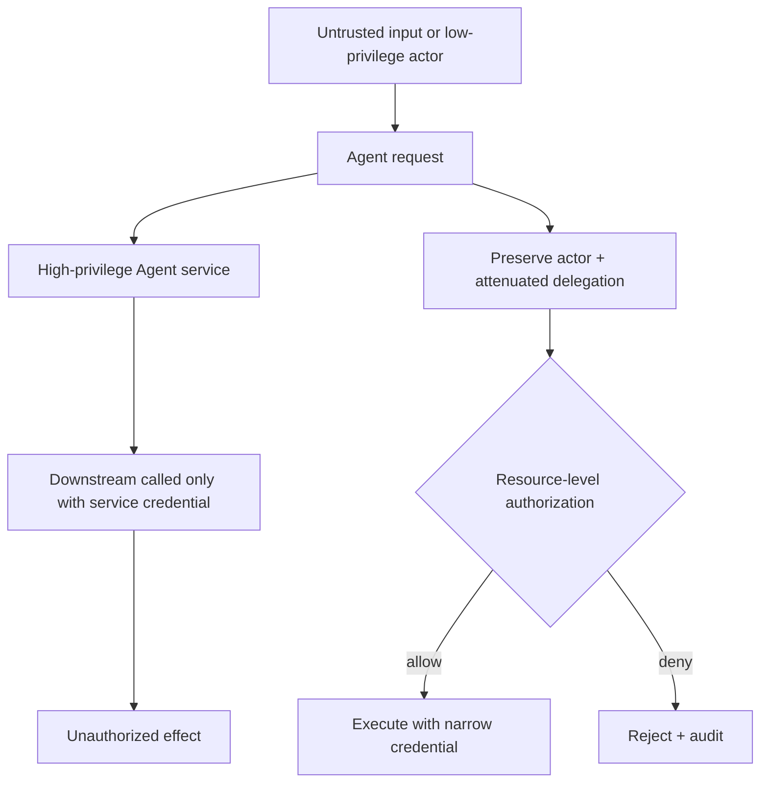

# 02 · Identity、Authorization 与 Approval

Agent 往往通过服务账号调用后端，因此它在技术上“有能力”读取大量数据或提交写操作。但用户登录成功，不代表可以访问任意订单；用户说过“帮我处理退款”，也不代表已经确认某一笔具体金额。若 Runtime 只检查 Tool Schema，Agent 很容易变成 Confused Deputy：使用自己的高权限凭证替低权限请求者完成越权动作。

本章把 Authentication、Authorization、Consent、Delegation 和 Approval 分开建模。它们回答不同问题；在任何外部副作用发生前，执行层都必须重新核对这些条件。

## 本章目标

- 区分身份、授权、同意、委派与审批。
- 把 actor、resource、action 和 purpose 带入每次 Tool execution。
- 防止 Confused Deputy、跨 tenant 访问和权限放大。
- 将 Approval 绑定不可变 proposal，并处理过期与 TOCTOU。

## 1. 五个概念回答五个问题

| 概念             | 回答的问题                               |
| -------------- | ----------------------------------- |
| Authentication | 当前调用者是谁？                            |
| Authorization  | 这个 actor 此刻能否对该 resource 执行 action？ |
| Consent        | 数据主体是否同意这种处理、共享或保留？                 |
| Delegation     | Agent 代表谁、在何种 scope 和期限内行动？         |
| Approval       | 用户是否确认这一项具体、可理解的 effect？            |

它们不能互相推出：

- 已认证用户仍可能无权读取目标资源。
- OAuth scope 允许调用某类 API，不等于满足业务授权。
- 用户批准一项动作，不能创造后端原本不存在的权限。
- 有权退款，不代表每笔退款都无需确认。
- 同意将数据用于当前任务，不代表可以长期写入 Memory 或 Eval。

## 2. 把调用者拆成 User Identity 与 Workload Identity

Agent 应用中常同时存在：

- **Original actor**：发起任务的人或系统。
- **Workload identity**：Agent Server 或 Worker 的服务身份。
- **Delegation context**：工作负载代表 original actor 可以做什么。
- **Downstream credential**：面向具体 audience 的短期凭证。

下游服务不能只看到 Agent 的宽泛服务账号。它至少需要可验证的 actor、tenant、delegated scopes 和 target audience，并在自己的资源边界上重新授权。

```ts
type AuthorizationContext = {
  actor: { id: string; tenantId: string };
  workload: { serviceId: string };
  delegation: {
    scopes: string[];
    audience: string;
    expiresAt: string;
    chainRef: string;
  };
};
```

不要让模型生成这些字段，也不要把用户 token 原样传给任意 Tool。

## 3. 授权是一项资源级决策

```text
decision = policy(
  actor,
  tenant,
  resource,
  action,
  purpose,
  scope,
  environment,
  resource_version,
  time,
  risk
)
```

一个实用的结果类型：

```ts
type PolicyDecision =
  | { effect: "allow"; policyVersion: string }
  | { effect: "require_approval"; policyVersion: string; reason: string }
  | { effect: "deny"; policyVersion: string; code: string };
```

默认拒绝，显式允许。Policy 可以使用模型产生的分类结果作为低信任特征，但最终决定必须由可测试的代码或策略引擎执行。

## 4. Confused Deputy 如何发生



典型缓解措施：

- 保留 original actor 和 delegation chain；
- 使用短期、最小权限 credential；
- token 绑定正确 audience；
- 按 resource/action 缩减 scope；
- 下游服务重新执行授权；
- 不让一个 Server 的 credential 被另一个 Tool 复用；
- 对跨 tenant 数据流做独立审计。

## 5. 风险分级决定是否需要 Approval

授权通过后，策略可以根据 effect 风险决定：

```text
AUTO_ALLOW
REQUIRE_APPROVAL
DENY
```

一种可解释的风险分层：

| 能力                  | 默认处理                 |
| ------------------- | -------------------- |
| 当前 actor 有权读取的低敏数据  | 可自动执行，仍需 audit       |
| 生成草案、preview 或 diff | 通常自动执行               |
| 可逆、低影响的内部写入         | 按 scope 预授权或批量确认     |
| 外部发送、资金、权限变化        | 具体 proposal approval |
| 不可逆、跨 tenant、超出政策   | deny 或人工升级           |

模型可以解释风险，不能自行把高风险动作降级为低风险。

## 6. Approval 必须绑定不可变 Proposal

“允许退款工具”过于宽泛。可审批对象至少包含：

```text
actor
tool / action
exact normalized arguments
target resource
expected effect / diff
data disclosure
risk
resource version
expiry
proposal hash
idempotency key
```

```ts
type ApprovalRequest = {
  approvalId: string;
  actorId: string;
  proposalHash: string;
  toolName: string;
  publicPreview: unknown;
  resourceVersion: string;
  expiresAt: string;
};
```

参数、目标、资源版本或有效期变化后，旧 Approval 失效。不能在 approval 之后由模型或 Hook 原地修改参数；任何修改都应创建新 proposal。

## 7. 执行前必须重新校验

Approval 与执行之间可能相隔几秒、几小时或一次服务部署。执行前需要重新完成：

1. 验证 approver identity 与权限。
2. 校验 approval 未过期、未撤回、未使用。
3. 重新计算 proposal hash。
4. 读取当前 resource version 与状态。
5. 再次执行 authorization policy。
6. 使用已绑定 idempotency key 提交 command。

这一步防止 Time-of-Check to Time-of-Use（TOCTOU）：用户批准时订单尚未退款，执行时状态可能已经改变。

## 8. Approval 不是 UI 组件

按钮只是人机交互表面，真正的审批状态必须在服务端持久化：

```text
requested → approved / rejected / expired / revoked
```

审批记录包括 actor、proposal hash、policy version、decision time 和 expiry。客户端提交 `approve` 只是一条 command，服务端仍要验证当前用户、Run ownership 和 proposal 状态。

界面应展示：

- 将改变什么对象；
- 精确金额、收件人或目标；
- diff 与不可逆效果；
- 哪些数据会发送给第三方；
- approval 有效期和撤销方式。

“是否允许 Tool X”通常不足以支持有意义的决定。

## 9. 通过风险设计减少 Approval Fatigue

每一步都弹窗会训练用户机械点击。更好的方法是先降低能力本身的风险：

- 默认最小权限；
- query、draft 与 commit 分离；
- workspace、network 和 data scope 受限；
- 低风险动作在明确 scope 内预授权；
- 多个同类低风险变更提供可理解的批量 diff；
- 高风险和不可逆 effect 保持具体审批。

Approval 的目标不是把所有责任转给用户，而是在真正需要人类判断的节点提供充分信息。

## 10. Subagent 与 MCP Server 不能自动继承全部权限

委派给 Subagent 或外部 Server 时，权限必须逐级收敛（permission attenuation）：只传递完成子任务所需的 scope、数据和期限。接收方仍要重新认证与授权，不能因为请求来自“内部 Agent”就默认可信。

Delegation envelope 还应包含 parent run、task、attempt、deadline、data classification 和 result ownership。子任务结束后，临时 credential 应失效。

## 实践：复现 Approval TOCTOU

模拟以下场景：

1. 用户批准 `order_A` 退款 1000 分。
2. 模型随后把参数改为 `order_B`、100000 分。
3. Approval 等待期间，`order_A` 已被另一流程退款。
4. Approval 过期后，Worker 从 checkpoint 恢复。
5. 另一 tenant 的用户重放同一 `approvalId`。

为每一步画出 actor–resource–action 决策和 proposal state。只要 hash、actor、tenant、resource version 或 expiry 不匹配，Executor 就不能收到 command。

## 常见误区

- 有 OAuth scope 就已经完成业务授权。
- 用户点击 Approve 后，服务端无需再次检查。
- 批准 Tool 名称等于批准任意参数。
- Agent、Subagent 和内部 Server 可以默认互信。
- 只需在 Run 开始时检查一次权限。

## 本章小结

Authentication 确认身份，Authorization 判断 actor 能否对 resource 执行 action，Delegation 限定 Agent 代表谁行动，Approval 则确认一项不可变的具体 effect。所有条件都要在执行前由确定性系统重新校验。下一章把同样的边界带到 [MCP 与互操作协议](/masterpiece-static-docs/07-工具-协议与行动控制/03-MCP与互操作协议.md)。

## 延伸阅读

- [OWASP Authorization Cheat Sheet](https://cheatsheetseries.owasp.org/cheatsheets/Authorization_Cheat_Sheet.html)
- [NIST SP 800-207: Zero Trust Architecture](https://csrc.nist.gov/pubs/sp/800/207/final)
- [MCP Authorization](https://modelcontextprotocol.io/specification/2025-11-25/basic/authorization)
- [RFC 9700: OAuth 2.0 Security Best Current Practice](https://www.rfc-editor.org/rfc/rfc9700.html)
