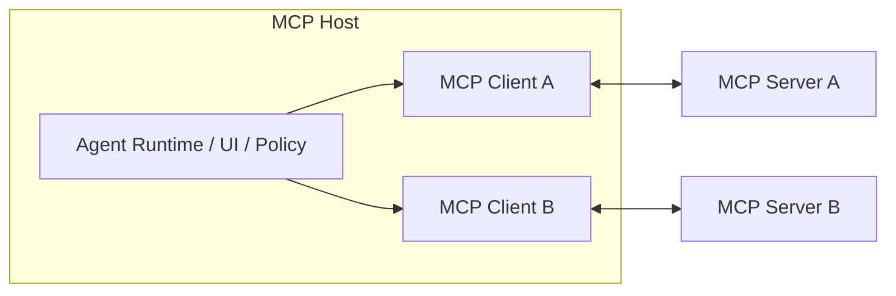
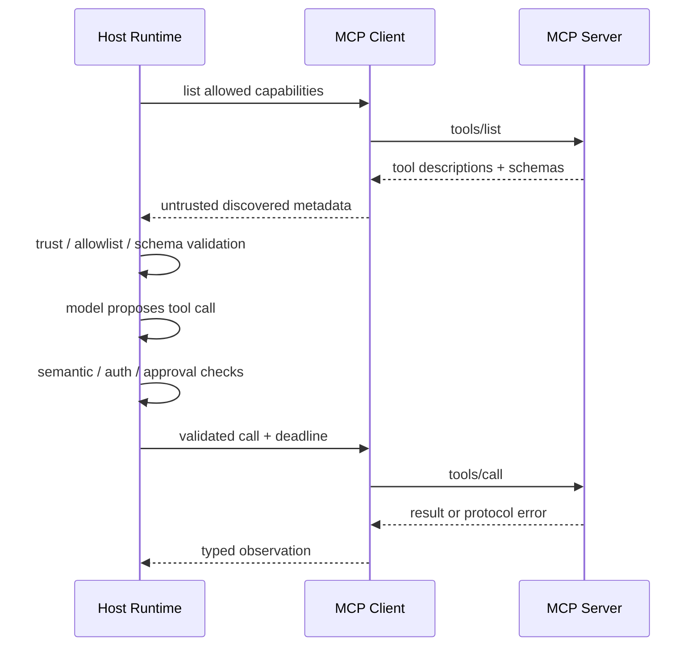

# 03 · MCP：能力发现与互操作边界

应用内工具可以直接注册为 TypeScript 函数；当同一项能力需要由多个 Agent Host 使用，或由独立进程和外部服务提供时，就需要稳定的发现与调用协议。Model Context Protocol（MCP）为 Tool、Resource 和 Prompt 提供统一的连接方式，但不会替应用完成 Agent Loop、业务授权或沙箱隔离。

标准化连接扩大了可复用性，也扩大了信任边界。Host 接入一个 MCP Server 时，等于接入了新的代码、数据源、描述文本和网络路径。本章同时讲协议结构与 Host 必须承担的安全责任。

> 版本核验日期：2026-07-15。此时最新的稳定 MCP Protocol Revision 为 `2025-11-25`；已经冻结的 `2026-07-28` Release Candidate 包含破坏性变更，计划于 7 月 28 日发布最终版，因此不作为本章的实现基线。实际开发前必须重新核对最终规范和目标 SDK。

## 本章目标

- 理解 MCP Host、Client、Server 的职责。
- 区分数据层（Data Layer）与传输层（Transport Layer）。
- 掌握 Tool、Resource、Prompt 的不同控制关系。
- 理解 Initialize、Capability Negotiation、Timeout 与 Cancellation。
- 明确 MCP 不提供哪些 Runtime 与安全能力。

## 1. Host、Client 与 Server



- **Host** 是完整 AI 应用，管理模型、Context、权限、用户同意和多个 Client。
- **Client** 代表 Host 与一个 Server 建立隔离、有状态的协议会话。
- **Server** 暴露聚焦的 Tool、Resource 或 Prompt，可以是本地进程，也可以是远端服务。

Host 不能把多个 Server 当成一个共享信任域。Server A 返回的敏感内容，不应未经数据流策略就发送给 Server B。

## 2. Data Layer 与 Transport Layer

### Data layer

负责 JSON-RPC 2.0 消息、生命周期、Capability Negotiation、请求、响应和通知，以及 Tool、Resource、Prompt 等原语。

### Transport layer

负责消息如何传输、连接如何建立，以及认证和传输安全。稳定规范中的常见 Transport 包括 stdio 与 Streamable HTTP。

两层分离意味着同一个数据层方法可以运行在不同 Transport 上，但认证、Session、Origin 和网络威胁会随传输方式变化。本地 stdio 也不天然可信：Server 进程仍可能来自恶意软件包，拥有过宽的文件权限，或输出诱导性内容。

## 3. 三个 Server 原语

| 原语        | 主要用途            | 谁控制使用                     |
| --------- | --------------- | ------------------------- |
| Tools     | 查询或执行能力         | 模型可以提出调用建议，Host 或用户决定是否执行 |
| Resources | 可读取的 Context 数据 | Host 应用选择和加载              |
| Prompts   | 可复用的交互模板        | 通常由用户显式选择                 |

这三者不是同一种“插件内容”：

- Tool 可能产生副作用，需要工具准入、Authorization 和 Approval。
- Resource 是数据，仍需 ACL、Provenance、Freshness 和 Prompt Injection 防御。
- Prompt 是模板，不应自动获得高优先级或绕过 Host 指令策略。

Client 还可能向 Server 提供 Sampling、Roots、Elicitation 等能力。它们会扩大模型调用、文件访问和用户交互边界，应分别授权、限额和审计。

## 4. 生命周期与 Capability Negotiation

```text
client connects
→ initialize(protocol version, client capabilities)
← server version and capabilities
→ initialized
↔ list / get / call + notifications
→ shutdown / disconnect
```

双方只能使用协商后明确支持的能力。不兼容版本应显式失败，不能静默猜测。

Capability Negotiation 解决的是“双方会说什么协议”，不是“调用是否获准”。Server 声明支持 `tools` 后，Host 仍需决定：

- 是否信任这个 Server；
- 哪些 Tool 对当前 Run 可见；
- 当前 Actor 是否有权调用；
- 参数、数据披露和风险是否可接受；
- 是否需要 Approval。

## 5. 从 Tool discovery 到执行

一条安全调用链可以表示为：



Tool Description 和 Schema 来自 Server，也应视为供应链输入。Host 可以缓存已审查的版本，但需要固定 Server Identity、Protocol/SDK Version 和 Capability Digest，避免它们在运行期间静默变化。

## 6. 用 Adapter 连接 MCP 与应用 Tool Registry

领域层不应直接依赖某个 MCP SDK 类型。可以把远端 Tool 映射到统一接口：

```ts
type RemoteToolDescriptor = {
  serverId: string;
  toolName: string;
  schemaVersion: string;
  inputSchema: unknown;
  trust: "first_party" | "reviewed" | "untrusted";
  capabilitiesDigest: string;
};

type ToolRegistryEntry = {
  canonicalName: string;
  kind: "query" | "draft" | "command";
  remote?: RemoteToolDescriptor;
  policyId: string;
  timeoutMs: number;
};
```

Provider、模型和 UI 只看到统一的 Tool Contract。MCP Client Adapter 负责转换 Transport、JSON-RPC、Server Error 和 Cancellation，不让协议细节进入领域层。

## 7. Authentication 与 Authorization 分属不同边界

远程 MCP 连接可能使用 OAuth 或其他认证方式。连接认证确认 Client/Server 身份，不自动完成业务资源授权。

Host 仍需：

- 使用面向正确 Audience 的最小权限 Token；
- 保留 Original Actor 与 Delegation Scope；
- 防止 Token Passthrough 到错误的 Server；
- 在 Tool 产生外部副作用前执行资源级授权；
- 安全处理 Redirect、Session 和 Token Lifecycle；
- 记录 Server Identity、Actor、Tool、参数哈希和结果引用。

Server 也应在自身边界重新授权，不能只因为请求来自受信 Host 就允许任意资源访问。

## 8. Timeout、Cancellation 与动态变化

MCP 请求需要 Deadline 与 Cancellation，但取消不能撤销已经产生的外部副作用。Command 超时后，应进入与其他工具相同的 `in_doubt → reconcile` 路径。

Tool 与 Resource 列表可能动态变化。Host 应定义：

- 何时刷新 Capability；
- 当前 Run 是否固定 Capability Digest；
- Tool 消失或 Schema 变化时如何失败；
- 旧 Run 恢复时使用哪个协议和 Tool Version；
- 未知 Notification 是否可以安全忽略。

## 9. MCP 不提供什么

MCP 不是：

- planner 或 Agent Loop；
- Workflow / durable runtime；
- RAG 算法或长期 Memory；
- Identity Provider 或业务 Policy Engine；
- Sandbox；
- Multi-Agent coordination protocol；
- Tool 外部副作用的 exactly-once 保证。

它标准化的是能力如何被发现和调用。采用 MCP 不会降低 Tool Contract、Authorization、Idempotency 和 Isolation 的必要性。

如果远端对象拥有自己的 Runtime、Task 生命周期和 Artifact，而且需要在不暴露内部 Tool 或 Memory 的情况下协作，它就不再是普通的 MCP Tool。完成本部分的行动控制主线后，再评估 [A2A 跨 Agent 协作协议](/masterpiece-static-docs/07-工具-协议与行动控制/05-A2A与跨Agent协作协议.md)。

当核心 Tool、Resource 与授权边界稳定后，还可以按需引入 [Agent Skills、动态工具发现与 MCP 扩展](/masterpiece-static-docs/07-工具-协议与行动控制/06-Agent-Skills与MCP扩展.md)：它们分别补充可复用工作方法、大规模 Tool Catalog、内嵌 View、长时协议操作和特定身份接入，不会改变 Host 对业务授权与副作用的责任。

## 10. Host 的安全检查表

- 固定并验证 Server 来源、版本和 digest。
- 只暴露当前任务需要的 Tools 和 Resources。
- 把 Server metadata、Resource 和 Tool Result 视为不可信输入。
- 在生成候选前执行 Tenant/ACL 过滤。
- 验证参数、结果和结果大小。
- 对 Command 使用 Approval、Idempotency 和 Receipt。
- 设置 Timeout、Rate Limit、Concurrency 和 Cancellation。
- 限制一个 Server 向另一个 Server的数据流。
- 记录协议版本、Capability、Actor、Decision 和 Trace。
- 对本地进程设置文件系统、网络、Credential 与资源隔离。

## 实践：通过 MCP 接入订单、物流与政策

### 进入本章时已有能力

Resolution Desk 已有稳定 Tool Contract、资源级 Authorization 和不可变 Approval，但订单、物流和政策能力仍以应用内 TypeScript 函数注册。

### 本章增加的能力

建立两个最小 MCP Server：

1. Commerce Server 提供 `get_order` 与 `get_shipment` 只读 Query Tool。
2. Policy Server 提供版本化退款政策 Resource 与只读检索 Tool。
3. 手工推演 `initialize → tools/list → tools/call`。
4. 针对 Server Schema 变化、Timeout、重复响应和 Cancellation 准备 Fixture。
5. 验证 Resource 内容中的恶意指令不能扩大 Tool 权限。
6. 验证 Server A 的敏感结果不会自动进入 Server B 的请求。

`commit_refund` 继续留在 Resolution Desk 的受控 Executor 中，不因为 MCP 接入而下放业务授权或付款凭证。

### 验收证据

Contract Fixture 覆盖 Server Schema 变化、Timeout、重复响应和 Cancellation。恶意政策 Resource 不能扩大 Tool 权限，Commerce Server 的敏感结果不会自动进入 Policy Server 请求。关闭任一 Server 时，Run 应进入明确的“部分完成”或失败状态。实现完成后，应当能够指出协议协商、身份认证、业务授权、用户审批和真实副作用分别发生在哪一层。

## 常见误区

- 接入 MCP 后应用自然获得完整 Agent 能力。
- MCP 自动解决 OAuth、业务授权和 Prompt Injection。
- 所有内部函数都应该包装成 MCP Tool。
- 本地 stdio Server 天然可信。
- Elicitation 可以直接替代应用自己的 Approval。

## 本章小结

MCP 统一了 Host、Client 与 Server 之间发现和调用能力的方式，但 Host 仍然持有 Context、策略、授权、审批和数据流责任。标准连接让工具生态更可组合，也要求更严格的供应链、版本与隔离治理。下一章将用[幂等、补偿与沙箱](/masterpiece-static-docs/07-工具-协议与行动控制/04-幂等-补偿与沙箱.md)处理 Command 结果不明、重复副作用和受限执行。

## 官方资料

- [MCP 2025-11-25 Specification](https://modelcontextprotocol.io/specification/2025-11-25)
- [MCP Architecture](https://modelcontextprotocol.io/specification/2025-11-25/architecture)
- [MCP Transports](https://modelcontextprotocol.io/specification/2025-11-25/basic/transports)
- [MCP Security Best Practices](https://modelcontextprotocol.io/docs/tutorials/security/security_best_practices)
- [MCP 2026-07-28 Release Candidate 公告](https://blog.modelcontextprotocol.io/posts/2026-07-28-release-candidate/)
