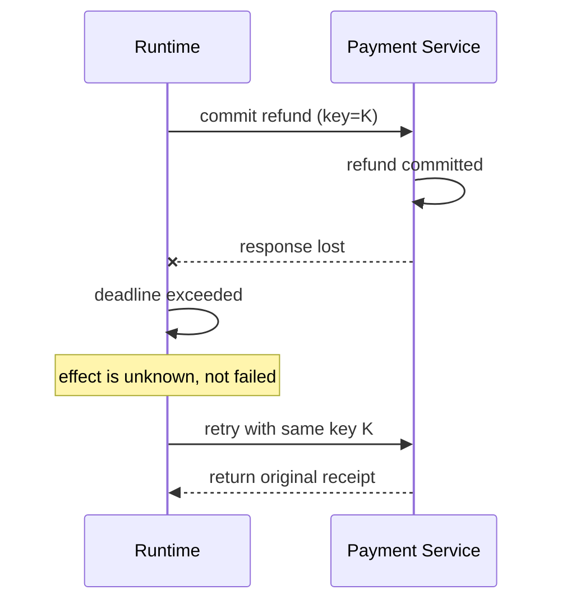

# 04 · Idempotency、Compensation 与 Sandbox

一次 Command 不总能得到明确的成功或失败。服务端可能已经提交退款，响应却在网络中丢失；Worker 恢复后看到 Timeout，如果使用新请求再次提交，就会产生第二次退款。类似问题也存在于发邮件、创建工单、发布内容和修改权限。

可靠行动的关键不是“尽量重试”，而是识别同一业务意图、保存真实回执，并在结果未知时收敛状态。与此同时，Executor 必须在受限环境中运行，使一次错误 Tool Call 的影响被控制在明确能力边界内。

## 本章目标

- 理解 unknown effect 与 duplicate side effect。
- 区分 idempotency、deduplication、transaction、outbox 和 compensation。
- 设计 preview → approval → commit → verify 的执行协议。
- 建立 sandbox 的 filesystem、network、process、credential 与 resource 边界。
- 理解 sink validation 与 sandbox 为什么需要同时存在。

## 1. 最危险的失败发生在提交之后



没有 Idempotency 时，第二次请求可能产生第二次副作用。Timeout 只证明调用方没有在 Deadline 前拿到确定响应，不能证明服务端没有执行。

## 2. Idempotency Key 代表业务意图

同一 intent 的所有 retry 使用同一个 key；新的 intent 使用新 key。Key 应由 Runtime 根据稳定业务对象生成或分配，不能让模型每次随机生成。

```text
idempotency scope:
  tenant + operation + business object + intent version

example:
  tenant_7:refund:order_123:proposal_92ac
```

服务端需要原子保存：

```text
idempotency_key
payload_fingerprint
status: processing / succeeded / failed
receipt or result reference
created_at / expires_at
```

处理规则：

- 首次 key：占位并执行，持久化 result。
- 相同 key + 相同 fingerprint：返回同一语义结果，或等待正在处理的 attempt。
- 相同 key + 不同 fingerprint：拒绝，说明 key 被错误复用。
- key 超过 retention：根据业务风险决定拒绝、查询 source of truth 或人工处理，不能静默当成新请求。

HTTP method 在规范层面的幂等性，不会自动让业务实现满足这些规则。

## 3. Idempotency、Deduplication 与 Transaction

| 机制                   | 解决的问题                        | 不能单独解决            |
| -------------------- | ---------------------------- | ----------------- |
| Idempotency          | 同一 intent 多次请求产生同一语义效果       | 跨多个资源的原子提交        |
| Deduplication        | 识别重复 request、message 或 event | 首次执行后的业务一致性       |
| Database transaction | 单一一致性边界内原子更新                 | 外部 API 与消息系统的联合提交 |
| Outbox / Inbox       | 数据库状态与消息交付之间的可靠衔接            | 外部系统已经产生的不可逆副作用   |
| Compensation         | 通过相反或修复动作缓解已发生效果             | 精确回到过去状态          |

一个健壮系统通常组合使用，而不是寻找一个“exactly-once 开关”。

## 4. Outbox 连接状态提交与异步交付

假设创建退款记录后还要发布 `refund.created` event。若先写数据库再发消息，进程可能在中间崩溃；若先发消息再写数据库，消费者可能读到不存在的退款。

```text
begin transaction
  insert refund
  insert outbox_event
commit

outbox worker
  publish event
  mark delivered
```

消息可能重复投递，因此消费者使用 Inbox 或业务 key 去重。Outbox 提供 at-least-once delivery 的可靠基础，不等于消费者天然 exactly-once。

## 5. Result Unknown 需要 Reconciliation

Runtime 对 Command Timeout 的状态转移应是：

```text
EXECUTING
→ timeout after request may have been accepted
→ IN_DOUBT
→ query receipt / source of truth with stable key
→ SUCCEEDED / FAILED_CONFIRMED / MANUAL_INTERVENTION
```

Reconciliation 只执行预先允许的核对动作：

- 按 idempotency key 查询 receipt；
- 按业务对象查询权威状态；
- 比较 ledger、outbox 或 audit record；
- 在明确规则下补偿；
- 无法确认时进入人工异常队列。

它不是让模型在未知状态下重新规划一项新退款。

## 6. Compensation 不是时间倒流

分布式系统中的许多副作用无法 Rollback：

- 邮件已经被收件人阅读；
- 公告已经被抓取；
- 第三方支付已经产生手续费；
- 权限变化期间已经发生访问。

Compensation 是新的业务动作，例如发送更正邮件、创建反向账务、撤销权限并触发审计。它需要独立授权、idempotency 和 receipt，也可能失败。

```ts
type CompensationPlan = {
  originalReceiptRef: string;
  action: string;
  preconditions: string[];
  irreversibleResidue: string[];
  requiresApproval: boolean;
};
```

UI 应解释哪些效果可以撤销、哪些只能缓解，不能用统一的“Undo”隐藏业务差异。

## 7. Preview 与 Commit 是产品协议

高风险动作适合分为：

```text
draft
→ validate
→ preview / diff
→ authorize
→ approve if required
→ commit(idempotency_key, expected_version)
→ verify receipt
```

这不是通用分布式 two-phase commit。它的价值是把用户看见并批准的 proposal，与最终 command 的精确参数和资源版本绑定。

执行前若 `expected_version` 不匹配，应重新生成 preview，而不是把旧 approval 套到新状态上。

## 8. Sandbox 控制 Executor 的最大能力

当 Tool 可以执行代码、访问文件或控制浏览器时，至少考虑以下隔离面：

### Filesystem

- 只挂载任务需要的目录；
- 默认 read-only，写入使用临时 workspace；
- 路径规范化与根目录约束；
- 防止 symlink、hard link 和 mount escape；
- 任务结束后销毁临时数据。

### Network

- 默认拒绝 egress；
- 按域名、IP、port 和 protocol allowlist；
- 阻断 metadata endpoint 和 private network；
- 每次 redirect 与 DNS resolution 后重新校验；
- 记录外连目标与流量上限。

### Process 与 syscall

- 限制子进程、系统调用、signal 和 namespace；
- 固定 executable，不允许任意 shell；
- 限制进程数和执行时间；
- 对高风险操作使用更强隔离边界。

### Credentials

- 不把宿主环境变量和长期密钥注入沙箱；
- 使用短期、面向具体 audience 的 credential；
- 只在调用瞬间提供必要 secret；
- 避免 secret 进入日志、Context 和 artifact。

### Resources 与 Lifecycle

- CPU、memory、disk、file descriptor、network 和 wall time 配额；
- 镜像、依赖和 tool version 固定；
- 每任务独立生命周期与清理；
- 创建、使用和销毁过程可审计。

容器通常共享宿主内核，不自动等于强安全边界。Rust 可以减少一类内存安全漏洞，但不会自动提供文件、网络、身份和 syscall 隔离。

### Policy 声明不等于 Enforcement

配置对象中出现 `network: deny`、`workspace: read_only` 或 `allowedOrigins`，只能证明系统表达了期望策略，不能证明所有执行路径都落实了策略。每一种子进程、外部 Tool Server、浏览器、语言服务和后台任务入口都要回答：

1. 谁创建了它，继承了哪些环境变量与文件描述符；
2. Filesystem、Network、Credential 和 Resource 限制在哪里安装；
3. 当前操作系统不支持某项限制时，是拒绝启动、降级还是继续；
4. UI 和 Trace 如何展示实际生效的 Enforcement，而不是期望配置；
5. Contract Test 如何证明旁路启动路径也受到同一限制。

高风险 Capability 应采用 Fail-closed：无法确认 Enforcement 已安装时拒绝执行或转入受控人工路径。低风险开发环境若允许显式降级，也必须把 `requestedPolicy` 与 `effectivePolicy` 分别记录，不能继续向上层报告“Sandbox 已启用”。

### 路径授权、并发锁与实际 I/O 必须共享同一身份

文件工具常见的隐患不是忘记检查字符串前缀，而是三层使用了不同的“文件身份”：

```text
Approval:  看见模型传入的 path
Lock:      使用未经规范化的字符串作为 key
Executor:  解析 ..、绝对路径或 symlink 后访问真实目标
```

正确流程是在授权前建立 Canonical Resource Identity：

```ts
type FileTarget = {
  workspaceId: string;
  lexicalPath: string;
  canonicalParent: string;
  finalName: string;
  operation: "create" | "replace" | "delete" | "move";
};
```

- 拒绝绝对路径、越过 Workspace Root 的 `..` 和不允许的 Mount；
- 使用不跟随符号链接的元数据检查，必要时在打开文件时使用平台提供的安全标志；
- Move 同时验证源和目标，Patch 在审批前枚举全部目标；
- Authorization、Resource Lock、Audit 与最终 I/O 复用同一个解析结果；
- 并发写按照 Canonical Identity 串行，而不是按照模型提供的原始字符串加锁。

多文件 Patch 还需要明确提交语义。至少应先完成全量解析、权限检查、冲突检查和内存中的结果计算，再进入 Commit；写到一半失败时保留可恢复日志或临时文件，不能把“部分文件已更新”伪装成统一失败。文件级原子替换也不等于跨文件 Transaction，恢复与 UI 必须暴露部分提交状态。

### 并发 Tool Call 先完成整批预检

同一模型响应包含多个 Tool Call 时，可以并发执行彼此独立的只读动作，但不能一边审批第一项、一边已经让它产生副作用。更安全的批次协议是：

```text
parse every call
→ freeze ordinal, derive resource and effect
→ run policy, hook and approval gates
→ reject the batch or freeze the approved execution plan
→ execute independent calls under bounded concurrency
→ correlate by call_id, commit results by frozen ordinal
```

这样可以避免后面的高风险调用被拒绝时，前面的写操作已经发生。确实允许部分执行时，必须在 Contract 中说明 `all / partial / first-valid` 语义，并为每项结果保留独立 Receipt。

## 9. Sandbox 与 Sink Validation 是两道不同防线

Sandbox 回答“这个进程最多能接触什么”；sink-specific validation 回答“这份输入能否以这种方式进入目标解释器”。

以 HTTP Tool 为例：

- URL adapter 校验 scheme、host、IP、redirect 和 DNS rebinding。
- Network sandbox 从能力层阻断 private network 与未授权 egress。

两者同时存在，即使一层配置错误，另一层仍能缩小影响。

Shell Tool 也类似：固定 executable 与分离 argv 防止输入被 shell 解析；sandbox 则限制进程即使被利用后还能访问哪些文件、网络和 credential。

## 10. Cancellation 与 Sandbox Lifecycle

取消一个 Tool 不只是终止进程：

1. Runtime 先持久化 cancel intent。
2. 停止创建新 Tool attempt。
3. 向可中断执行传播 signal。
4. 对进程执行 graceful termination，超时后强制终止。
5. 清理临时 workspace 和 credential。
6. 对可能已提交的 Command 查询真实副作用。
7. 写入 cancelled、in\_doubt 或 completed-with-effect，而不是统一标记 cancelled。

## 11. 故障矩阵

| 故障                               | 期望处理                              |
| -------------------------------- | --------------------------------- |
| 相同 key、相同 payload 并发到达           | 只执行一次，其余等待或返回同一 receipt           |
| 相同 key、不同 payload                | 明确拒绝并告警                           |
| Command 提交后响应丢失                  | 进入 `in_doubt`，用同一幂等键查询或重试         |
| Outbox event 重复投递                | Consumer 幂等归并                     |
| Compensation timeout             | 独立进入 unknown effect，不假设已回滚        |
| 进程尝试读取宿主密钥                       | Filesystem/credential boundary 拒绝 |
| URL redirect 到 metadata endpoint | URL adapter 与 network policy 双重拒绝 |
| Cancel 与 command commit 同时发生     | 查询 receipt，显示真实效果                 |
| 未知 Tool 类型或无法解析目标资源              | Fail-closed，不按只读工具放行              |
| Patch 包含绝对路径、`..`、symlink 或多个目标  | 统一解析真实资源，越界拒绝，多目标按冻结计划提交          |
| 某一子进程启动路径未安装 Network Policy      | 不宣称 Sandbox 完整生效；高风险任务拒绝启动        |
| 并发批次中一个写操作未获批准                   | 写操作启动前终止该批次或按已声明的 Partial 语义处理    |

## 实践：让受控退款在 ACK 丢失后收敛

### 进入本章时已有能力

Resolution Desk 已能通过 MCP 读取订单、物流和政策，并用服务端 Policy 与 Approval 决定退款 Proposal 是否可以执行；它还不能证明网络故障不会造成重复退款。

### 本章增加的能力

在与常规业务 Run 隔离的故障测试 Harness 中实现一个 Mock `commit_refund`：服务端首次调用时写入退款记录，但故意在返回响应前断开连接。这个 Executor 只接受测试 Fixture，不接入 Resolution Desk 的用户路径。第 08 部分先完成威胁建模、Prompt Injection 防线、最小权限、纵深防御和可信 UX，再由 08/07 的完整 Red Team 验证组合攻击链；只有全部适用门禁通过后，常规业务 Run 才能调用 Mock Executor。

依次验证：

1. 无 Idempotency Key 时，盲目重试产生两次副作用。
2. 相同 key + 相同 payload 时，只存在一条退款并返回同一 receipt。
3. 相同 key + 不同 payload 时，服务端拒绝。
4. Runtime 从 `in_doubt` 通过 receipt query 收敛。
5. 用户在 timeout 后点击 cancel，UI 不会误报“退款已取消”。
6. 从备用 Executor 入口启动同一 Tool 时，仍能证明 Network、Credential 和 Resource Policy 已生效。
7. Tool 尝试读取其他 Tenant 的退款 Receipt 或访问 Private Network 时，在发出请求前被拒绝。
8. Tool 创建未声明子进程或产生超量输出时，Sandbox 终止整个进程树并保留结构化失败证据。

再让 Sandboxed Mock Executor 尝试读取宿主 Credential、访问 Private Network、从备用启动路径创建子进程并制造过量输出，验证每类敏感能力都有独立的拒绝证据。

### 验收证据

隔离 Harness 中，相同 Intent 与 Payload 始终收敛到同一 Receipt；同一 Key 配不同 Payload 被拒绝；Timeout 后 Run 进入 `in_doubt` 而不是 `failed`，并通过 `get_refund_outcome` 核对权威状态。用户取消只停止新动作，不会把已经发生的退款显示为“已撤销”。所有 Executor 入口都报告实际生效的 Sandbox Policy，跨 Tenant、Private Network、Credential、子进程和输出预算测试均留下明确拒绝证据；任何一项无法证明时验收失败。常规 Resolution Desk Run 仍不能调用该 Executor。

## 常见误区

- Retry 总能提高系统可靠性。
- Idempotency key 由模型随机生成即可。
- Cancellation 会撤销已经提交的 command。
- Compensation 等同于数据库 rollback。
- Docker 或 Rust 自动解决 Agent 执行安全。
- 配置中写了 deny，就等于所有进程路径已经执行 deny。
- 路径字符串通过前缀检查，就足以防止 Workspace Escape。
- 并行 Tool Call 可以边审批边启动已经通过的写操作。

## 本章小结

可靠行动要求同一业务 Intent 可以幂等重试，未知副作用能通过 Receipt 和权威数据源收敛，不可回滚结果有明确的 Compensation 或人工处置。Sandbox 限制 Executor 的最大能力，Sink Validation 则控制输入如何进入具体解释器。至此，单 Agent 的受控行动链已经闭合；下一章进入 [A2A 与跨 Agent 协作协议](/masterpiece-static-docs/07-工具-协议与行动控制/05-A2A与跨Agent协作协议.md)，把第 05/11 章的 Multi-Agent 状态责任扩展为跨系统 Wire Contract。

## 延伸阅读

- [AWS: Making retries safe with idempotent APIs](https://aws.amazon.com/builders-library/making-retries-safe-with-idempotent-APIs/)
- [OWASP Agentic Top 10 2026](https://genai.owasp.org/resource/owasp-top-10-for-agentic-applications-for-2026/)
- [NIST SP 800-190: Application Container Security Guide](https://csrc.nist.gov/pubs/sp/800/190/final)
