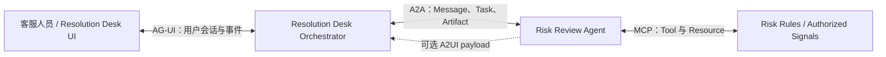
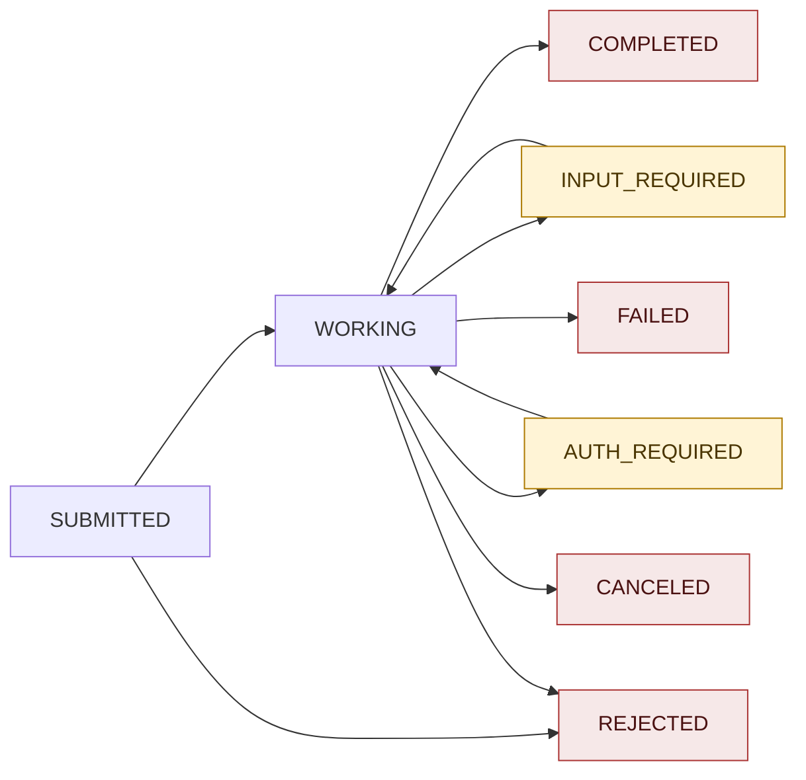
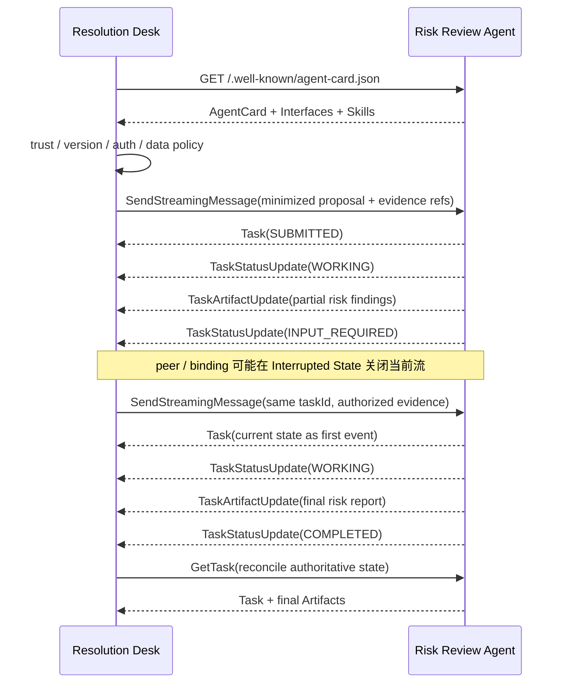
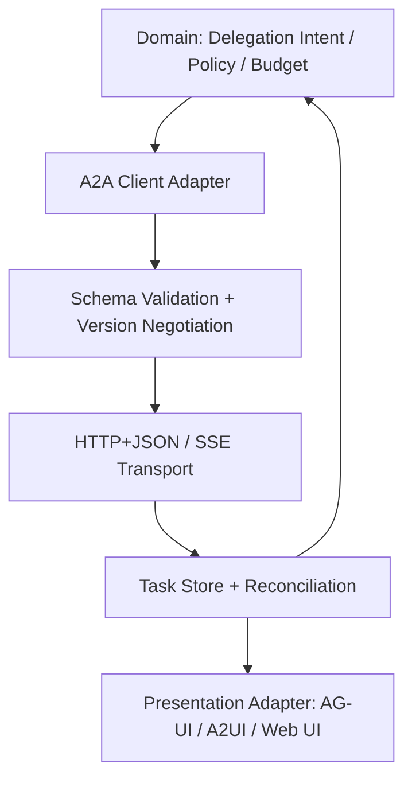

# 05 · A2A：跨 Agent 协作协议

Resolution Desk 可以独立处理大多数售后工单。高金额或证据冲突只是评估跨 Agent 风险复核的候选切片，不意味着系统默认需要远程 Agent：只有 A2A 路径在同一 Dataset、预算和 Eval 下优于单 Agent Baseline，并通过权限与恢复测试后，才可以进入生产候选。Resolution Desk 不需要知道对方的 Prompt、Memory、Tool 实现或内部执行步骤，远端 Agent 也不应获得退款执行权限。

这正是 Agent2Agent Protocol（A2A）处理的边界：让相互独立、实现不透明的 Agent 发现能力、交换消息、管理长任务并交付结果。A2A 不把远端 Agent 降格为一个函数，也不要求双方共享 Runtime；它为跨框架、跨进程和跨组织的协作提供应用层协议。

> 版本核验日期：2026-07-19。本章以 Linux Foundation A2A 项目的 `v1.0.0` 为基线。该版本于 2026-03-12 发布，官方将其定义为首个稳定、可用于生产环境的版本。A2A JavaScript SDK 的稳定通道此时仍实现 v0.3，v1 支持位于 `@a2a-js/sdk@next` 预发布通道，因此本章使用协议级 TypeScript 与 `fetch` 伪代码，不引入预发布依赖。

> 阅读位置：本章承接 [Multi-Agent：协作、状态与验证](/masterpiece-static-docs/05-模型接口与Agent内核/11-Multi-Agent协作状态与验证.md)。前一章回答“一个应用内部怎样拆分与汇合”，本章回答“独立系统之间怎样发现能力、跟踪任务与交付 Artifact”。完成后进入 Agentic UI 主线，把 Agent 的权威状态映射为人可以理解和控制的界面。

## 本章目标

- 区分 A2A 与 MCP、AG-UI、A2UI 的职责边界。
- 理解 AgentCard、AgentInterface、AgentSkill、Message、Part、Task、Artifact 与 `contextId`。
- 掌握 Task 状态机，以及同步、Streaming、Polling 和 Webhook 的组合方式。
- 为 SSE 断线、重复事件、Cancel 竞态和终态不可变设计恢复逻辑。
- 明确跨 Agent 委派中的身份、授权、数据最小化、SSRF、预算和循环风险。
- 识别开放协议生态的版本漂移，并用 Adapter 和 Contract Fixture 隔离差异。

## 1. 从高金额退款复核开始

设想 Resolution Desk 中的一条条件分支：

1. 客服人员处理一笔退款请求，应用已经取得订单、物流和政策证据。
2. Runtime 发现退款金额超过自动处置阈值，或不同证据给出冲突结论。
3. Orchestrator 发现独立 Risk Review Agent，并确认对方支持退款风险复核。
4. Orchestrator 只发送最小化的 Proposal、Evidence Ref、金额区间与复核原因。
5. Risk Review Agent 创建 Task，流式返回进度与风险报告 Artifact。
6. 若缺少必要证据，它进入 `INPUT_REQUIRED`，等待补充已授权材料。
7. Resolution Desk 将 Artifact 作为建议证据展示；只有本地 Policy、Approval 与 Executor 能决定并提交退款。



这张图中有四条不同的协议边界。A2A 只负责 Resolution Desk 与独立 Agent 的协作，不负责 Risk Review Agent 如何取得获准信号，也不授予远端系统退款执行能力。

## 2. A2A 与其他协议的边界

| 协议    | 主要连接对象                       | 核心抽象                                 | 不负责                      |
| ----- | ---------------------------- | ------------------------------------ | ------------------------ |
| MCP   | Agent 与 Tool、Resource、Prompt | Capability、Request、Result            | 跨 Agent 长任务与协作状态         |
| A2A   | 独立 Agent 与独立 Agent           | AgentCard、Message、Task、Artifact      | Agent 内部 Tool、规划与 Memory |
| AG-UI | User App 与 Agent Runtime     | 前端事件、共享状态、实时会话                       | 通用的跨组织 Agent 委派          |
| A2UI  | Agent 与 Renderer             | Surface、Catalog、Component、Data Model | 网络传输、认证与 Task 生命周期       |

一个系统可以同时使用四者：Risk Review Agent 内部可以通过 MCP 访问受控风险信号，外部通过 A2A 接受委派；Resolution Desk 通过 AG-UI 与前端通信，并在需要时把远端返回的 A2UI 数据交给受信 Renderer。协议可以组合，但退款 Command 始终留在本地受控执行链。

不能因为它们都使用 JSON 或 Streaming，就把它们视为相互竞争的协议。判断边界的关键在于：当前对端究竟是一个 Tool、一个自主 Agent，还是面向用户的 UI Runtime。

## 3. AgentCard：先发现能力，再建立交互

A2A Server 必须提供 AgentCard。公开发现的标准位置是：

```text
https://{agent-domain}/.well-known/agent-card.json
```

AgentCard 是可机器读取的服务清单，至少回答以下问题：

- 这个 Agent 是谁，由谁提供；
- 它有哪些 Skills；
- 支持哪些协议 Binding 和版本；
- 是否支持 Streaming、Push Notification 或 Extended AgentCard；
- 接受和返回哪些 Media Type；
- 客户端应使用哪种 Authentication Scheme。

### AgentInterface

`supportedInterfaces` 按服务端偏好顺序声明可用接口。每个 AgentInterface 包含：

- `url`：实际服务地址，生产环境必须是绝对 HTTPS URL；
- `protocolBinding`：核心值包括 `HTTP+JSON`、`JSONRPC` 和 `GRPC`；
- `protocolVersion`：例如 `1.0`；
- `tenant`：可选的服务端路由值；存在时由 Binding Adapter 将其安全编码为 Path Parameter，再带入请求。

客户端应选择自己支持的第一个 Interface，而不是看到 URL 就猜测协议。`protocolVersion` 与 Agent 自身的 `version` 也不是同一个概念：前者决定线上协议契约（Wire Contract），后者描述服务实现版本。

### AgentSkill

AgentSkill 描述 Agent 能完成的一类任务，通常包含稳定 ID、名称、描述、Tags、示例，以及可覆盖全局默认值的 `inputModes`、`outputModes` 和安全要求。

Skill 是路由与能力匹配的依据，不是授权证明。Risk Review Agent 声明 `refund-risk-review`，只说明它声称理解这类工作；Resolution Desk 仍需验证 Agent 来源、允许处理的 Tenant、数据分级和委派范围。

```ts
type AgentInterface = {
  url: string;
  protocolBinding: "HTTP+JSON" | "JSONRPC" | "GRPC" | string;
  protocolVersion: string;
  tenant?: string;
};

type AgentSkill = {
  id: string;
  name: string;
  description: string;
  tags: string[];
  examples?: string[];
  inputModes?: string[];
  outputModes?: string[];
  securityRequirements?: unknown[];
};

type AgentCard = {
  name: string;
  description: string;
  version: string;
  supportedInterfaces: AgentInterface[];
  skills: AgentSkill[];
  capabilities: {
    streaming?: boolean;
    pushNotifications?: boolean;
    extendedAgentCard?: boolean;
    extensions?: unknown[];
  };
  defaultInputModes: string[];
  defaultOutputModes: string[];
  securitySchemes?: Record<string, unknown>;
  securityRequirements?: unknown[];
};

function selectHttpV1(card: AgentCard): AgentInterface {
  const selected = card.supportedInterfaces.find(
    item =>
      item.protocolBinding === "HTTP+JSON" &&
      item.protocolVersion === "1.0",
  );

  if (!selected) throw new Error("A2A_HTTP_JSON_V1_NOT_SUPPORTED");
  if (new URL(selected.url).protocol !== "https:") {
    throw new Error("A2A_PRODUCTION_ENDPOINT_MUST_USE_HTTPS");
  }
  return selected;
}
```

AgentCard 来自网络，也是不可信输入。客户端应验证 Schema、限制大小、检查 Endpoint Host、缓存策略和签名；不能直接把 Card 中的描述注入高优先级 Prompt，也不能自动连接任意 URL。

## 4. Message、Part、Task 与 Artifact

### Message 是一次通信 Turn

Message 表示 Client 或 Agent 的一次通信，核心字段包括：

- `messageId`：由消息创建者生成，可用于重复检测；
- `role`：`ROLE_USER` 或 `ROLE_AGENT`；
- `parts`：消息内容；
- `contextId`：可选的上下文分组；
- `taskId`：可选的具体 Task 引用；
- `referenceTaskIds`：引用先前 Task，适合 refinement；
- `metadata` 与 `extensions`：扩展信息。

`ROLE_USER` 指 A2A Client 发往 Server 的方向，不等同于“这条消息一定由人类手写”。Orchestrator 代表用户发起委派时，也使用这一角色。

### Part 是内容的最小容器

A2A v1 的 Part 必须且只能包含下列内容字段之一：

- `text`：文本；
- `raw`：Base64 编码的二进制内容；
- `url`：文件或内容地址；
- `data`：任意 JSON 值。

Part 还可以携带 `mediaType`、`filename` 和 `metadata`。v1 使用字段本身表达内容类型，不再使用 v0.3 的 `kind` discriminator。

```ts
type JsonValue =
  | null
  | boolean
  | number
  | string
  | JsonValue[]
  | { [key: string]: JsonValue };

type PartContent =
  | { text: string; raw?: never; url?: never; data?: never }
  | { raw: string; text?: never; url?: never; data?: never }
  | { url: string; text?: never; raw?: never; data?: never }
  | { data: JsonValue; text?: never; raw?: never; url?: never };

type Part = PartContent & {
  mediaType?: string;
  filename?: string;
  metadata?: Record<string, JsonValue>;
};
```

类型只能减少应用内部的误用，Wire Input 仍需运行时 Schema Validation。对于 `url` Part，还必须在实际下载时重新执行 URL、DNS、Redirect 和响应大小校验。

### Message 或 Task 是两种不同响应

Agent 可以直接返回 Message，表示一次无需持久状态的即时交互；也可以创建 Task，表示需要跟踪的工作。

Risk Review Agent 若只回答“该金额不需要远端复核”，可以返回 Message。若要排队、读取获准证据、请求补充信息并生成报告，则应创建 Task。

### Task 是有状态的工作单元

Task 包含：

- 服务端生成的唯一 `id`；
- 把多次交互归组的 `contextId`；
- 当前 `status`；
- 输出 `artifacts`；
- 可选的 Message `history`；
- 自定义 `metadata`。

客户端不能为新 Task 指定 `taskId`。如果 Message 同时提供 `taskId` 与 `contextId`，两者必须匹配；只提供 `taskId` 时，Server 从 Task 推导 Context。

### Artifact 是 Task 的正式输出

Artifact 由 `artifactId`、可选名称与描述、一个或多个 Parts 组成。复核进度属于 Status Message；最终风险等级、证据缺口和处置建议 JSON 才适合作为 Artifact。Artifact 不是退款 Approval，也不能直接转换为 `commit_refund` Command。

流式生成 Artifact 时，`TaskArtifactUpdateEvent` 使用相同 `artifactId`，并通过 `append` 与 `lastChunk` 表达追加和结束。客户端必须按 Artifact ID 合并，不能把每个 Chunk 当成独立报告。

## 5. `contextId` 不是 Task ID

`contextId` 把多个相关 Message 和 Task 组成同一业务上下文；`taskId` 只标识一项有明确生命周期的工作。

例如：

```text
context: refund proposal RP-842 risk review
  task A: initial risk review          → COMPLETED
  task B: review after evidence update → COMPLETED
  task C: conflict clarification       → WORKING
```

终态 Task 不可复活。订单证据更新后要求“基于刚才的报告重新复核”时，应在同一 `contextId` 下创建新 Task，并通过 `referenceTaskIds` 引用旧 Task。这样每份 Artifact 都能追溯到确切输入和执行单元。

不要把 `contextId` 当成授权边界或数据库租户字段。它是由服务端解释的 opaque identifier，资源访问仍需基于已认证 Actor 和服务端授权模型。

## 6. Task 状态机

下图是本章退款风险复核路径，用于突出 Interrupted 与 Terminal State 的差别，不穷举服务端可能实现的所有迁移。



| 状态                          | 语义             | Client 动作                               |
| --------------------------- | -------------- | --------------------------------------- |
| `TASK_STATE_SUBMITTED`      | 已接收，尚未开始或刚进入队列 | 展示已接收；允许 Cancel                         |
| `TASK_STATE_WORKING`        | 正在执行           | 消费 Status/Artifact Update；执行预算检查        |
| `TASK_STATE_INPUT_REQUIRED` | 缺少继续执行所需的信息    | 以相同 `taskId` 和 `contextId` 发送补充 Message |
| `TASK_STATE_AUTH_REQUIRED`  | 需要额外认证或授权      | 通过受控的 out-of-band 流程完成，不把凭据写入普通 Message |
| `TASK_STATE_COMPLETED`      | 成功终态           | 固化 Artifact 与 Receipt                   |
| `TASK_STATE_FAILED`         | 失败终态           | 保存原因；新需求创建新 Task                        |
| `TASK_STATE_CANCELED`       | 已取消终态          | 核对外部副作用，不自动重启                           |
| `TASK_STATE_REJECTED`       | Agent 拒绝执行终态   | 记录 Policy/Capability 原因，必要时重新路由         |

Terminal State 包括 `COMPLETED`、`FAILED`、`CANCELED` 和 `REJECTED`。对终态 Task 再发送 Message 必须失败；Refinement 使用新 Task。

`INPUT_REQUIRED` 和 `AUTH_REQUIRED` 是 Interrupted State，不代表失败。Orchestrator 必须暂停当前自动循环，等待明确输入或授权，而不是让模型猜测缺失信息。

## 7. Core Operations 如何组合

A2A v1 定义的主要操作包括：

- `SendMessage`：发送 Message，得到直接 Message 或 Task；
- `SendStreamingMessage`：发送 Message 并订阅实时结果；
- `GetTask`：读取 Task 当前状态、Artifact 和可选 History；
- `ListTasks`：按 Context、状态与时间分页查询可见 Task；
- `CancelTask`：请求取消仍可取消的 Task；
- `SubscribeToTask`：订阅已存在且未终止 Task；
- Push Notification Config 的 Create、Get、List、Delete；
- `GetExtendedAgentCard`：认证后获取更详细的 Card。



`SendMessageConfiguration.returnImmediately` 可以要求服务端创建 Task 后尽快返回。默认情况下，非 Streaming 调用会等待 Task 到达 Terminal 或 Interrupted State。交互式应用通常选择 Streaming；后台批处理可以先返回 Task，再 Poll 或 Subscribe。

`SendStreamingMessage` 有两种合法流形态。若 Agent 直接完成即时回答，首个事件可以是 `Message`，它同时也是唯一事件，随后关闭 Stream；若 Agent 创建可追踪工作，首个事件必须是 `Task`，之后才能出现 Status 或 Artifact Update。Client 应先按首个 Payload 分支解析，不能把所有 Streaming Response 都假定为 Task 生命周期。

A2A v1.0.0 的核心 Operation 与部分 Binding 文本对“Interrupted State 是否结束当前 Stream”的表述并不完全一致。Client 不应依赖原连接必然继续：进入 `INPUT_REQUIRED` / `AUTH_REQUIRED` 后先持久化 Task ID，用相同 `taskId` 发送补充 Message，再通过新流、`GetTask` 与 `SubscribeToTask` 恢复。具体 Peer 行为必须用固定版本的 Binding Contract Fixture 锁定。

## 8. HTTP+JSON 与 SSE

A2A v1 提供三种标准 Binding：

| Binding        | 请求方式                               | Streaming        |
| -------------- | ---------------------------------- | ---------------- |
| HTTP+JSON/REST | 标准 HTTP Verb 与资源路径                 | SSE              |
| JSON-RPC       | JSON-RPC 2.0 over HTTP             | SSE              |
| gRPC           | Protocol Buffers over HTTP/2 + TLS | Server Streaming |

本章选择 HTTP+JSON，因为它最接近前端工程师熟悉的 API 模型，也能直接看到协议语义。请求和响应建议使用 `application/a2a+json`；流式响应使用 `text/event-stream`。

### 发送并订阅 Task

```ts
type A2AClientOptions = {
  token: string;
  signal: AbortSignal;
};

function operationUrl(
  endpoint: AgentInterface,
  operation: "message:stream",
): URL {
  const relativePath = endpoint.tenant
    ? `${encodeURIComponent(endpoint.tenant)}/${operation}`
    : operation;

  return new URL(relativePath, withTrailingSlash(endpoint.url));
}

async function streamRefundRiskReview(
  endpoint: AgentInterface,
  riskReviewInput: JsonValue,
  options: A2AClientOptions,
) {
  const response = await fetch(operationUrl(endpoint, "message:stream"), {
    method: "POST",
    headers: {
      Authorization: `Bearer ${options.token}`,
      "A2A-Version": "1.0",
      "Content-Type": "application/a2a+json",
      Accept: "text/event-stream",
    },
    body: JSON.stringify({
      message: {
        messageId: crypto.randomUUID(),
        role: "ROLE_USER",
        parts: [
          {
            data: riskReviewInput,
            mediaType: "application/json",
          },
        ],
      },
      configuration: {
        acceptedOutputModes: ["application/json", "text/markdown"],
      },
    }),
    signal: options.signal,
  });

  if (!response.ok || !response.body) {
    throw await toA2AHttpError(response);
  }
  if (!response.headers.get("content-type")?.startsWith("text/event-stream")) {
    throw new Error("A2A_EXPECTED_SSE_RESPONSE");
  }

  for await (const frame of parseSSE(response.body)) {
    const event = validateStreamResponse(JSON.parse(frame.data));
    taskStore.apply(event);
  }
}
```

在 HTTP+JSON Binding 中，`tenant` 是可选的 Path Parameter：无租户 Endpoint 使用 `/message:stream`，多租户 Endpoint 使用 `/{tenant}/message:stream`。上层调用方不应手工拼接 URL；Adapter 必须负责路径编码，并防止不受信任的 `tenant` 逃逸路径边界。

这里使用 `fetch` Stream，而不是假设浏览器原生 `EventSource` 足够。HTTP+JSON 的 Streaming 入口是 POST，并需要 Authorization 与 `A2A-Version` Header；实际 Web App 通常通过支持流式转发的 Backend-for-Frontend 隔离 Token、CORS 和 Agent Endpoint。

### StreamResponse 是 One-of

```ts
type StreamResponse =
  | { task: Task; message?: never; statusUpdate?: never; artifactUpdate?: never }
  | { message: Message; task?: never; statusUpdate?: never; artifactUpdate?: never }
  | {
      statusUpdate: TaskStatusUpdateEvent;
      task?: never;
      message?: never;
      artifactUpdate?: never;
    }
  | {
      artifactUpdate: TaskArtifactUpdateEvent;
      task?: never;
      message?: never;
      statusUpdate?: never;
    };
```

Task Lifecycle Stream 的第一个事件必须是当前 Task，随后才是 Status 或 Artifact Update。实现必须保持服务端生成顺序；客户端也应拒绝缺少初始 Task、Task ID 不匹配或 Artifact Chunk 非法的流。

## 9. 断线后用 GetTask 对账

SSE 是实时通知通道，不是持久事件日志。官方规范明确指出，Client 断开后重新连接，可能错过部分 Status Message；关键事实不能只存在于瞬时 Streaming Message 中。

A2A v1 核心事件也没有提供跨 Binding 通用的单调 Sequence 或 Event ID。若 Peer 没有通过 Extension Metadata 提供稳定游标，Client 只能使用已知字段和内容摘要做尽力去重，并最终以 GetTask 返回的完整 Task 与 Artifact 校准本地状态，不能声称实现了无损重放。

恢复流程应是：

```text
stream disconnected
→ preserve last taskId / contextId / artifact cursor
→ GetTask(taskId) from authoritative server state
→ merge status and complete artifacts
→ terminal: finish locally
→ non-terminal: SubscribeToTask or controlled polling
```

```ts
async function recoverTask(
  endpoint: AgentInterface,
  taskId: string,
  token: string,
) {
  const task = await getTask(endpoint, taskId, token, { historyLength: 20 });
  taskStore.reconcile(task);

  if (isTerminal(task.status.state)) return task;

  await subscribeToTask(endpoint, taskId, token, event => {
    taskStore.apply(validateStreamResponse(event));
  });

  return taskStore.require(taskId);
}
```

Reconciliation 的权威对象是服务端 Task，不是本地“最后收到的第几个 SSE”。如果业务要求无损审计，服务端还需把关键事实持久化到 Task、Artifact 或独立 Audit Log；A2A 本身不提供 Event Store。

## 10. Cancel、Timeout 与结果未知

`CancelTask` 是请求服务端尝试取消，不保证取消一定成功。请求到达时 Task 可能已经完成、失败，或进入不可取消阶段。

A2A 把重复 Cancel 定义为幂等语义，但实现仍需处理 Task 已清理时的 `TaskNotFoundError`。对于产生外部副作用的 Remote Agent，`CANCELED` 也不等于所有副作用已经回滚。

Orchestrator 应把 Timeout 与 Cancel 分开建模：

```text
SSE timeout / network loss
  → connection state UNKNOWN
  → GetTask reconcile

user requests cancel
  → persist cancel intent
  → CancelTask with same taskId
  → reconcile returned Task
  → inspect Artifact / external receipt
```

本书中的 Risk Review Agent 只返回只读 Artifact，不持有支付凭据，也不能执行退款。若其他场景允许远端 Agent 写入外部系统，仍需上一章的 Idempotency、Receipt 与 Compensation 机制；A2A 统一交互语义，不提供跨 Agent Exactly-once Side Effect。

## 11. Webhook 处理断开连接的长任务

Push Notification 适合持续数分钟或数小时的 Task：Client 注册 Webhook 后可以断开连接，由 Agent 在状态或 Artifact 变化时主动 POST `StreamResponse`。

协议只要求 Agent 对每个已配置 Webhook 至少尝试投递一次；失败重试是可选能力，且 Agent 可以在若干次失败后停止。因此通知可能重复，也可能因网络失败而丢失；这不是可靠的 At-least-once Delivery 保证。接收端至少要：

- 验证 Agent 使用的认证凭据或签名；
- 核对 Payload 中的 `taskId` 是否属于当前 Actor 可见的已知 Task；
- 在字段可用时使用 Task ID、事件类型、状态时间、Artifact ID、Extension Cursor 或内容摘要去重；
- 先持久化 Inbox，再异步处理；
- 成功接收时快速返回 2xx；
- 对 Payload 大小、速率和并发做限制；
- 最终调用 GetTask 对账，而不是完全信任通知顺序。

Agent 作为 Webhook Caller 时也承担安全责任。Client 提供的 URL 是不可信输入，必须阻断 Loopback、Link-local、Cloud Metadata 和 Private Network，校验 DNS 与每次 Redirect，并优先使用静态 Allowlist。否则 Push Notification 会成为 SSRF 通道。

## 12. 身份、授权与数据边界

### AgentCard 声明认证，不签发身份

AgentCard 可以声明 API Key、HTTP Authentication、OAuth 2.0、OpenID Connect 或 Mutual TLS。实际身份建立在 HTTP/Transport 层，A2A Payload 不应自行携带一套平行的用户身份字段。

Public AgentCard 不应包含 Secret 或内部实现。需要暴露更详细 Skills 时，可以在认证后通过 Extended AgentCard 返回，并根据 Caller 权限裁剪内容。

### JWS 签名不是业务授权

AgentCard 可以使用 JSON Web Signature（JWS）证明来源与完整性。Client 应在存在签名时验证可信 Key、过期与撤销状态，但签名只说明“这张 Card 来自哪个 Provider 且未被篡改”，不说明当前客服可以把订单和客户数据交给它。

### 每个 Operation 都要重新授权

Server 必须在每个 Operation 上执行授权与租户范围检查，包括 `GetTask`、`ListTasks`、Cancel、Subscribe 和 Push Notification Config。即使请求给出了合法 `contextId` 或 `taskId`，也不能先查询资源再判断权限，否则会泄露资源是否存在。

Orchestrator 还需保留委派链：

```text
human actor
→ Resolution Desk
→ orchestrator service identity
→ remote risk review agent
→ downstream tool/resource
```

每一跳都应限制 Audience、Scope、Tenant、Order、有效期和可执行动作。不要把用户的长期 Token 或支付凭据原样透传给 Remote Agent。

### `AUTH_REQUIRED` 使用受控流程

当 Task 进入 `AUTH_REQUIRED`，Agent 可以说明需要哪项授权，但 Credential 获取与交换应通过 OAuth、设备码或组织定义的 out-of-band 流程完成。普通 Message、Task History、Artifact 和模型 Context 都不适合承载 Secret。

### 订单数据与 Artifact 最小化

跨系统风险复核不应默认发送完整客户档案、完整工单历史或支付凭据。优先发送：

- 冻结的 Refund Proposal 与必要 Evidence Ref；
- 已脱敏的订单、物流和金额区间；
- 触发复核的政策冲突或风险原因；
- 明确的数据使用目的、保留期限和输出模式。

Remote Agent 返回的 Text、URL、Data 与文件同样是不可信内容，进入 UI、Prompt、Shell、SQL 或文件系统前需要对应 Sink Validation。

## 13. 预算、循环与幂等不属于协议默认能力

A2A 支持 Agent 之间协作，但不会自动阻止 Agent A 委派 Agent B、Agent B 又委派回 Agent A。

Orchestrator 必须维护显式的 Delegation Policy：

```ts
type DelegationBudget = {
  rootRunId: string;
  visitedAgentIds: string[];
  maxHops: number;
  maxParallelTasks: number;
  maxRemoteTasks: number;
  maxWallTimeMs: number;
  maxCostUsd: number;
};

function authorizeDelegation(
  targetAgentId: string,
  budget: DelegationBudget,
) {
  if (budget.visitedAgentIds.includes(targetAgentId)) {
    throw new Error("A2A_DELEGATION_CYCLE_DETECTED");
  }
  if (budget.visitedAgentIds.length >= budget.maxHops) {
    throw new Error("A2A_MAX_HOPS_EXCEEDED");
  }
  if (budget.maxRemoteTasks <= 0 || budget.maxWallTimeMs <= 0) {
    throw new Error("A2A_BUDGET_EXHAUSTED");
  }
}
```

可靠性还需要：

- 相同业务意图复用稳定 `messageId` 或应用级 Idempotency Key；
- 对重复 Status 和 Artifact Chunk 做 Deduplication；
- 限制每个 Context 的并行 Task 数；
- 在 Trace 中记录 Source Agent、Target Agent、Task、Context、Hop 与预算消耗；
- 对终态后的迟到事件丢弃并告警；
- 对未知结果优先 GetTask/Reconcile，不创建“看起来一样”的新 Task。

协议允许 Server 使用 `messageId` 检测重复 Message，但是否实现幂等由 Agent 决定。涉及外部副作用时，仍需应用级 Intent Key 与 Receipt。

## 14. 生态版本漂移：不要混用 A2A v0.3 与 v1

开放协议的规范、Extension 和 SDK 不会总在同一天完成迁移。2026-07-19 核验时，A2UI 的 A2A Extension 页面仍有若干旧式示例，与 A2A v1.0.0 的权威定义不一致：

| 关注点              | A2UI Extension 页面中的旧式示例 | A2A v1.0.0 权威定义            |
| ---------------- | ----------------------- | -------------------------- |
| Extension Header | `X-A2A-Extensions`      | `A2A-Extensions`           |
| Part 类型判别        | `kind: "data"`          | v1 移除 `kind`，由 `data` 字段判别 |
| Media Type       | `metadata.mimeType`     | Part 顶层 `mediaType`        |

A2A v1 规定 [`specification/a2a.proto`](https://github.com/a2aproject/A2A/blob/v1.0.0/specification/a2a.proto) 是所有数据对象与请求/响应的单一规范性定义。因此本书采用以下优先级：

1. 固定 Tag 的 `v1.0.0 a2a.proto`；
2. 固定版本的 A2A Specification；
3. 经验证的官方 SDK 类型；
4. Extension 文档与博客示例。

对于 A2UI over A2A，领域层只保留 A2UI Message；线上格式差异由 Adapter 处理：

```ts
const A2UI_EXTENSION_URI =
  "https://a2ui.org/a2a-extension/a2ui/v0.9.1";

type A2AV1A2UIDataPart = {
  data: JsonValue;
  mediaType: "application/a2ui+json";
};

function encodeA2UIForA2AV1(messages: JsonValue[]): A2AV1A2UIDataPart {
  return {
    data: messages,
    mediaType: "application/a2ui+json",
  };
}

const requestHeaders = {
  "A2A-Version": "1.0",
  "A2A-Extensions": A2UI_EXTENSION_URI,
};

type A2AV1A2UIMessage = {
  messageId: string;
  role: "ROLE_AGENT";
  extensions: string[];
  parts: A2AV1A2UIDataPart[];
};

function buildA2UIMessage(messages: JsonValue[]): A2AV1A2UIMessage {
  return {
    messageId: crypto.randomUUID(),
    role: "ROLE_AGENT",
    extensions: [A2UI_EXTENSION_URI],
    parts: [encodeA2UIForA2AV1(messages)],
  };
}
```

`A2A-Extensions` Service Parameter 表示 Client 在该请求中选择使用哪些 Extension；Message 自身的 `extensions` 列表则声明该 Message 实际贡献了哪些 Extension 语义。两者不应被合并成一个业务字段。

兼容旧 Peer 时，不要在业务代码中散落条件分支，也不要默认同时发送新旧 Header。应为已知 Peer 配置明确的 Adapter，并维护对应的 Contract Fixture：

```text
fixtures/
  a2a-v1/
    agent-card.json
    message-data-part.json
    stream-task-lifecycle.ndjson
    a2ui-extension-part.json
  legacy-peer-x/
    negotiated-wire-shape.json
```

Contract Test 至少验证 Header 名称、协议版本、Part One-of、`mediaType` 位置、枚举值、Message-only 关闭规则、Task Lifecycle 首事件、Artifact 合并和未知字段处理。这样，Extension 更新时只需修改 Adapter 与 Fixture，不会污染 Task 领域模型。

## 15. 一个可维护的 TypeScript 分层



建议保持以下边界：

- Domain 只表达委派意图、允许的 Agent、输入数据级别和预算；
- A2A Adapter 负责 AgentCard、Operation、Header 与线上消息格式；
- Validator 负责 v1 Runtime Schema，不使用 Type Assertion 代替验证；
- Transport 负责 HTTP、SSE、Deadline、Retry 与 Backpressure；
- Task Store 负责事件合并、终态约束和 GetTask 对账；
- Presentation Adapter 决定如何把 Task/Artifact 映射到 AG-UI 或受信 A2UI Renderer。

远端 Agent 不应直接控制本地路由、授权或高风险 UI。它只能返回协议数据，由 Host 在自己的 Policy 与 Renderer 边界内解释。

## 16. 故障矩阵

| 故障                                         | 错误处理                                                 | 禁止动作                          |
| ------------------------------------------ | ---------------------------------------------------- | ----------------------------- |
| AgentCard 不支持 v1                           | 显式版本不兼容；选择已测试 Adapter 或停止                            | 静默按 v0.3 猜测字段                 |
| AgentCard Endpoint 指向未授权 Host              | 拒绝并审计                                                | 自动跟随到内网或 Metadata 地址          |
| SSE 在 WORKING 时断开                          | GetTask 对账，再 Subscribe/Poll                          | 直接创建同一工作的第二个 Task             |
| 首个 Stream Event 是 Status / Artifact Update | 协议错误，关闭 Stream                                       | 假设存在未收到的 Task 后继续             |
| Message-only Stream 在首个 Message 后继续推送      | 记录 Peer 违约并关闭 Stream                                 | 把后续事件拼成一个虚构 Task              |
| 重复 Status Event                            | 按 Task、状态时间和已应用版本去重                                  | 重复触发业务副作用                     |
| 重复 Artifact Chunk                          | 用 Artifact ID、Extension Cursor 或内容摘要去重，并以 GetTask 对账 | 生成两份最终报告                      |
| `INPUT_REQUIRED`                           | 暂停自动执行，向授权用户收集输入                                     | 让模型虚构答案                       |
| `AUTH_REQUIRED`                            | 进入受控认证流程                                             | 把 Token 写进 Message 或 Artifact |
| Cancel 与 Complete 竞态                       | 接受服务端最终 Task 并对账副作用                                  | 本地强制改成 CANCELED               |
| Webhook 重复或乱序                              | Inbox、Dedup、GetTask Reconcile                        | 把 Webhook 当 Exactly-once      |
| Webhook URL 指向私网                           | SSRF 防护并拒绝配置                                         | 仅做字符串前缀检查                     |
| 收到终态后的更新                                   | 丢弃、告警并记录 Peer 违约                                     | 重新打开终态 Task                   |
| Agent 委派形成环                                | visited set、hop limit、budget gate                    | 继续递归等待自然结束                    |
| A2UI Part 使用旧 Wire Shape                   | Adapter/Fixture 显式兼容或拒绝                              | 在领域层混用 v0.3 与 v1 类型           |

## 实践：实现高金额退款的跨 Agent 风险复核

### 进入本章时已有能力

Resolution Desk 已经具有可复现的单 Agent Baseline、确定性 Policy 与原生 Approval 边界；Mock Executor 仍留在隔离的 Dry Run / 故障 Harness 中。本章使用本地 Mock Peer 为高金额或证据冲突切片验证跨 Agent 契约。远程 Agent 始终只返回只读 Artifact，不获得退款权限，也不改变 Proposal、Approval 和 Mock Executor 的写入准入规则。一般工单不需要第二个 Agent；真实业务采用还要等待后续 Eval 与安全门禁。

### 本章增加的能力

建立一个不依赖预发布 SDK 的最小实验：

1. 创建本地 Mock Risk Review Agent，提供 v1 AgentCard 与 `refund-risk-review` Skill；它只接受最小化证据并返回只读 Artifact。
2. 实现 `POST /message:stream`，依次输出 Task、WORKING、Artifact Chunk 和 COMPLETED。
3. 实现 `GET /tasks/{id}` 与 `GET /tasks/{id}:subscribe`。
4. 在 Resolution Desk 中验证 AgentCard、选择 HTTP+JSON v1 Interface，并发送冻结 Proposal、脱敏订单摘要和 Evidence Ref。
5. 模拟 `INPUT_REQUIRED`，用相同 `taskId` 与 `contextId` 补充获准的政策或物流证据。
6. 在 Artifact 生成一半时断开 SSE，通过 GetTask 恢复并去重 Chunk。
7. 模拟 Cancel/Complete 竞态，以服务端 Task 为最终事实。
8. 增加 Webhook Receiver，验证重复投递、认证失败与 SSRF URL 拒绝。
9. 增加 Delegation Budget，验证 Agent 环路与 Hop Limit。
10. 为 A2A v1 与 A2UI Extension 建立固定 Contract Fixtures。

### 验收证据

验收时应能够证明：

- 线上 Payload 不包含 v0.3 的 `kind`；
- 每个请求发送 `A2A-Version: 1.0`；
- `messageId`、`taskId`、`contextId` 的职责没有混用；
- 断线不会创建重复 Task；
- 终态 Task 不会被本地事件重新打开；
- Remote Agent 只能获得已授权且最小化的数据；
- Remote Agent 没有 `commit_refund` 能力、支付凭据或本地 Approval，返回 Artifact 不能绕过 Resolution Desk 的 Policy；
- 所有外部 URL 都经过 SSRF 与大小限制；
- 未经测试的 Extension 消息格式无法穿过 Adapter。

## 常见误区

- A2A 是把所有 Tool Call 再包装一层 HTTP。
- AgentCard 声明某个 Skill，就证明该 Agent 可信且获准接收数据。
- `contextId` 等于 Conversation、Tenant 或 Authorization Scope。
- SSE 重新连接后一定能补回所有遗漏事件。
- CancelTask 可以回滚 Remote Agent 已经产生的副作用。
- Task 失败后可以复用原 `taskId` 重启。
- A2A 自动防止 Multi-Agent 循环和无限预算消耗。
- A2A 与 MCP 二选一。
- A2UI 是 A2A 的默认 UI 层，Remote Agent 可以直接控制本地组件。
- 官方 Extension 示例一定与当前核心规范同步。

## 本章小结

A2A v1.0 把独立 Agent 之间的能力发现、消息交换、长任务状态和 Artifact 交付统一为可协商协议。AgentCard 让 Client 知道对端能做什么，Task 与 `contextId` 则让长任务、补充输入和后续 Refinement 可追踪。

协议标准化不会消除分布式系统风险。SSE 断线后，生产实现仍需通过 GetTask 对账；对于可能重复或丢失的 Webhook，则要使用 Inbox、去重和 GetTask 对账，同时实施 SSRF 防护。每个 Operation 都需重新授权，Orchestrator 也必须限制委派循环、预算和数据披露。开放生态还会出现 SDK 与 Extension 的版本漂移，因此固定权威 Proto、隔离 Adapter 并维护 Contract Fixture，是实现互操作性的必要条件。

下一章进入 Agentic UI 主线的 [Agent Application Server 与 UI 事件协议](/masterpiece-static-docs/05-模型接口与Agent内核/09-Agent-Application-Server与UI事件协议.md)：先建立 Canonical Event 与 Public State，再分别接入 AG-UI 的运行时交互和 A2UI 的受控声明式界面。[Agent Skills、动态工具发现与 MCP 扩展](/masterpiece-static-docs/07-工具-协议与行动控制/06-Agent-Skills与MCP扩展.md)可在主线完成后按场景查阅。

## 官方资料

- [A2A Protocol v1.0.0 Specification](https://a2a-protocol.org/v1.0.0/specification/)
- [A2A v1.0.0 authoritative a2a.proto](https://github.com/a2aproject/A2A/blob/v1.0.0/specification/a2a.proto)
- [A2A v1.0.0 Release](https://github.com/a2aproject/A2A/releases/tag/v1.0.0)
- [A2A Protocol Ships v1.0](https://a2a-protocol.org/latest/announcing-1.0/)
- [Core Concepts](https://a2a-protocol.org/latest/topics/key-concepts/)
- [Life of a Task](https://a2a-protocol.org/latest/topics/life-of-a-task/)
- [Agent Discovery](https://a2a-protocol.org/latest/topics/agent-discovery/)
- [Streaming and Asynchronous Operations](https://a2a-protocol.org/latest/topics/streaming-and-async/)
- [Enterprise Features and Security](https://a2a-protocol.org/latest/topics/enterprise-ready/)
- [A2A and MCP](https://a2a-protocol.org/latest/topics/a2a-and-mcp/)
- [Official A2A JavaScript SDK](https://github.com/a2aproject/a2a-js)
- [A2UI v0.9.1 Extension for A2A](https://a2ui.org/specification/v0.9.1-a2ui-extension-specification/)
- [Google Cloud donates A2A to Linux Foundation](https://developers.googleblog.com/en/google-cloud-donates-a2a-to-linux-foundation/)
