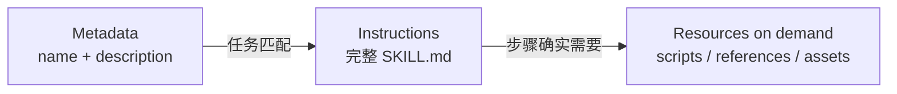
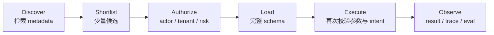
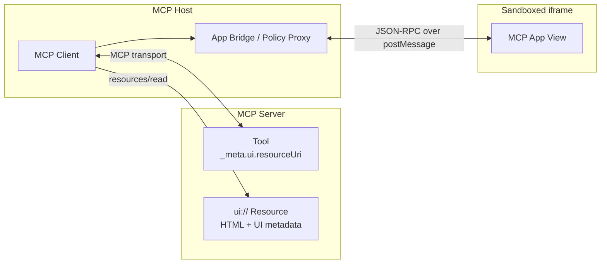
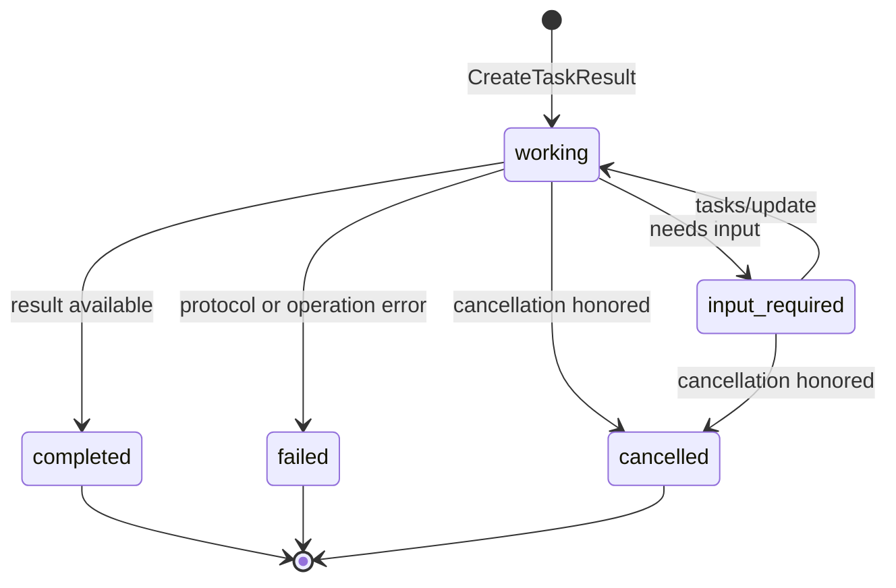
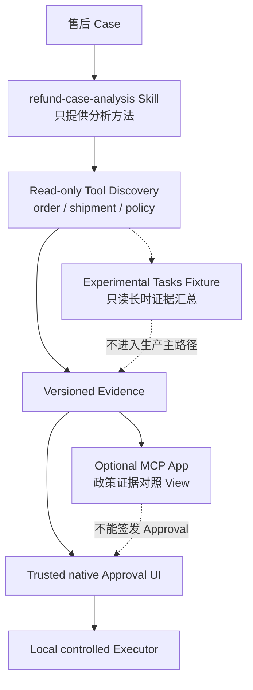

# 06 · Agent Skills、动态工具发现与 MCP 扩展

Claude Code、Codex 等 Agentic Harness 可以按需加载一套工作方法，也可以从大量工具中只取当前任务需要的几个定义。MCP Server 还可以返回交互界面，或者把长时间操作表示成可恢复查询的任务句柄。这些能力共同改善了 Agent 的可组合性，却分属不同的系统边界。

Agent Skills 解决“如何封装可复用的做事方法”，动态工具发现（Dynamic Tool Discovery）解决“本轮应让模型看到哪些能力”，MCP Apps 解决“远端能力如何向 Host 提供交互界面”，MCP Tasks 解决“协议调用无法在一次请求内完成时如何继续追踪”，授权扩展则解决特定身份如何取得 MCP Access Token。它们都不会替应用决定某笔退款是否获准。

> 版本核验日期：2026-07-15。Agent Skills 以当前开放格式规范为基线。MCP Apps 对应的 SEP-1865 状态为 Final，官方 `2026-01-26` 规范为 Stable；MCP Tasks 仍是 experimental extension。OAuth Client Credentials 与 Enterprise-Managed Authorization 属于官方 MCP Authorization Extensions，但客户端支持仍需逐项核验。下一版 MCP Core `2026-07-28` 此时仍是锁定的 Release Candidate，不作为实现基线。

## 本章目标

- 理解 Agent Skill、Tool、MCP Resource 与 A2A AgentSkill 的不同语义。
- 掌握 Agent Skills 的渐进式披露、版本固定和供应链边界。
- 设计 `discover → shortlist → authorize → load → execute → observe` 的动态工具发现链。
- 区分 MCP Apps、AG-UI、A2UI 与普通 Web UI。
- 理解 MCP Tasks 的长时调用语义，以及它不能替代的持久化责任。
- 为机器身份和企业身份选择合适的 MCP Authorization Extension。

## 1. 先把五种能力放回正确层次

| 能力                     | 被组合的对象                                       | 主要产物                    | 不能证明什么                             |
| ---------------------- | -------------------------------------------- | ----------------------- | ---------------------------------- |
| Agent Skills           | Agent 与可复用工作方法                               | 指令、脚本、参考资料、资产           | 当前 actor 获得了 Tool 或数据权限            |
| Dynamic Tool Discovery | 当前任务与 Tool Catalog                           | 经过筛选的 Tool Definition   | Tool Call 已被业务授权                   |
| MCP Apps               | MCP Server 与 Host 内嵌界面                       | `ui://` Resource 与交互消息  | 界面中的操作已获准执行                        |
| MCP Tasks              | MCP 长时请求与 Client                             | 可轮询的 Durable Handle     | 应用 Workflow 已具备恢复、补偿与 exactly-once |
| MCP Auth Extensions    | Client、IdP/Authorization Server 与 MCP Server | Access Token 与身份 Claims | 具体业务资源、Intent 或金额已获授权              |

其中最容易混淆的是三个名称相近的对象：

- **Agent Skill** 是开放目录格式，用于向 Agent 提供任务方法和资源。
- **Tool** 是可调用能力，拥有输入、输出和副作用语义。
- **A2A AgentSkill** 是远端 Agent 在 AgentCard 中声明的能力描述，用于发现和路由，详见[A2A 跨 Agent 协作协议](/masterpiece-static-docs/07-工具-协议与行动控制/05-A2A与跨Agent协作协议.md)。

相同的“Skill”一词不代表它们可以互换。一个 `refund-case-analysis` Agent Skill 可以教 Agent 如何整理售后证据，却不因此成为 MCP Tool，也不会自动成为 A2A Server 的能力声明。

## 2. Agent Skills：把工作方法做成可加载能力

### 2.1 开放格式的最小结构

Agent Skills 规定一个 Skill 至少包含 `SKILL.md`；其余目录按需存在：

```text
refund-case-analysis/
├── SKILL.md          # 必需：YAML metadata + Markdown instructions
├── scripts/          # 可选：确定性检查或转换脚本
├── references/       # 可选：领域规则、格式和详细说明
└── assets/           # 可选：模板、图片、Schema 或静态数据
```

`SKILL.md` 的 `name` 与 `description` 是必填字段；`license`、`compatibility` 和 `metadata` 是可选字段。`description` 不只是介绍文案，它还承担触发检索的职责：过宽会误触发，过窄则会漏掉本应使用该 Skill 的任务。

```yaml
---
name: refund-case-analysis
description: 整理退款工单中的订单、物流与政策证据；在证据冲突、缺失或超出自动处置边界时停止并转人工。
license: Proprietary
compatibility: Requires read-only access to versioned policy resources.
metadata:
  owner: resolution-desk
  version: "1.2.0"
---

# Refund case analysis

1. 先确认订单与 actor 属于同一 tenant。
2. 只引用带版本和来源的政策证据。
3. 证据不足时输出缺口，不猜测资格。
4. 只生成 Proposal，不调用退款 Command。
```

这段示例中的 `metadata.version` 是维护方约定，不是规范要求的统一版本字段。Agent Skills 规范允许自定义字符串 Metadata，但没有定义跨平台通用的发布版本和内容 Digest 语义。因此，生产 Host 不能仅凭 `version: "1.2.0"` 就认定内容未被替换。

### 2.2 Progressive Disclosure 是 Context 设计

渐进式披露（Progressive Disclosure）把加载分成三层：



Host 启动时只需索引少量 Metadata；匹配任务后再加载 `SKILL.md`；详细参考资料和脚本只在实际步骤需要时读取。与一次性把数十份手册拼进 System Prompt 相比，这种方式的价值不只是节约 Token：

- 不相关规则不会互相竞争注意力；
- Skill 触发与资源加载可以分别评测；
- 每次 Run 可以记录实际加载了哪些内容；
- 敏感参考资料不必因为“可能有用”就提前披露。

Progressive Disclosure 不是权限控制。未加载某个文件，只表示当前 Context 中没有它，不代表进程无法读取它；真正的文件、网络和工具权限仍由 Sandbox、Credential Scope 与 Policy 决定。

### 2.3 `scripts/` 会把说明包变成供应链输入

只有 Markdown 的 Skill 也可能携带 Prompt Injection；包含脚本后，它还引入普通软件供应链风险：

- 脚本可能读取环境变量、用户目录或 Credential；
- 安装步骤可能拉取未固定版本的依赖；
- Asset 可能是畸形文件、宏或超大压缩包；
- Reference 可能诱导 Agent 绕过现有 Policy；
- 同名 Skill 或宽泛 description 可能劫持本应由其他 Skill 处理的任务。

可信加载链应独立于 Agent 自己的判断：

```text
acquire
→ verify publisher and license
→ compute package digest
→ inspect instructions, scripts and dependencies
→ run in a restricted fixture environment
→ approve exact version + digest
→ expose metadata
→ load on a matching task
→ execute under runtime policy
→ audit and revoke
```

建议把下列字段放入 Host 的受控清单，而不是依赖 Skill 自述：

```ts
type ApprovedSkill = {
  canonicalName: string;
  publisher: string;
  source: string;
  release: string;
  packageDigest: string;
  reviewedAt: string;
  allowedTenants: string[];
  runtimeProfile: "read_only" | "isolated_compute";
};
```

一个 Run 应固定 `canonicalName + release + packageDigest`。恢复旧 Run 时，如果批准清单已经指向新版本，应继续使用原 Digest，或显式终止并重新开始，不能在中途静默换一套指令。

### 2.4 Skill 声明不等于授权

Agent Skills 规范包含实验性的 `allowed-tools` 字段，但不同 Agent 实现的支持可能不同。即使某个实现把它解释为“预批准 Tool”，它也不能替代应用的业务 Authorization：

```text
Skill says: use commit_refund
        ↓
Runtime resolves actual Tool identity
        ↓
Actor / tenant / resource / intent authorization
        ↓
Policy + immutable Approval + idempotency gate
        ↓
Executor may run
```

Skill 最多声明“完成这种工作通常需要什么能力”。Tool Registry 决定能力是否存在；Authorization 决定当前 actor 能否对当前资源使用它；Approval 决定高风险 Intent 是否得到可验证的人类确认。任何 Skill 指令与更高层 Policy 冲突时，必须失败关闭（Fail Closed）。

### 2.5 Skill 也需要 Eval

Skill 的质量至少包含两个独立问题：

1. **Trigger Quality**：应触发的任务是否加载，不应触发的任务是否保持未加载。
2. **Outcome Quality**：加载后是否比无 Skill 或旧版本产生更可靠的任务结果。

评测集应包含 Should-trigger、Should-not-trigger、边界输入和对抗输入。同一个测试样本分别在启用 Skill 和 Baseline 条件下运行，比较任务通过率、Token、耗时和失败类型。安全相关断言不能只检查最终文字，还要检查 Trace 中是否读取了未授权 Reference、执行了脚本，或尝试调用 Command。

## 3. Dynamic Tool Discovery：只把候选能力送进 Context

当 Registry 只有五个稳定 Tool 时，静态注册通常最简单。Tool 数量增长到数十、数百，或者同时接入多个 MCP Server 后，把所有名称、描述和 JSON Schema 放进每一轮 Context，会增加 Token、延迟和选错能力的概率。动态工具发现将“发现候选”从“选择并执行 Tool”中拆出。

Anthropic Tool Search 是一种 Provider 实现：延迟加载的 Tool 不进入初始 Context，搜索返回 `tool_reference` 后才展开完整定义。其他 Runtime 也可以使用 BM25、Embedding、规则索引或 MCP Catalog 实现同一种模式。Provider API 不等同于应用架构，核心链路应保持可移植。

OpenAI Agents SDK 在 Responses 路径中提供了另一种具体实现：`toolSearchTool()` 负责检索，Function Tool 或 Hosted MCP Tool 可以标记 `deferLoading: true`，`toolNamespace()` 则把一组延迟函数作为命名空间按需展开。这是 Responses 专用能力；官方文档明确说明，AI SDK Adapter 当前不支持 Deferred Responses Tool Loading。因此，“Adapter 能调用 OpenAI 模型”不能推导出“Deferred Tool Loading 也能通过该 Adapter 工作”。采用前需要验证 API、Model 与 Adapter 的具体组合，并继续保留 Catalog 可见性控制、Authorization 和 Contract Fixture。



### 3.1 六个阶段各有不同责任

| 阶段        | 允许处理的信息                                       | 必须阻止的错误                       |
| --------- | --------------------------------------------- | ----------------------------- |
| Discover  | 名称、用途、标签、风险级别、版本摘要                            | 把未审查描述直接当成高优先级指令              |
| Shortlist | 与任务相似的少量 Descriptor                           | 因语义相似而混入跨 Tenant 或高风险 Tool    |
| Authorize | Actor、Tenant、Resource Class、Intent、Run Policy | 把“搜到了”解释成“允许调用”               |
| Load      | 已获准候选的完整说明与 Schema                            | 一次性展开整个 Catalog；运行中静默换 Schema |
| Execute   | 结构校验后的参数、Deadline、Idempotency Key             | 跳过语义校验、Approval 或副作用控制        |
| Observe   | Typed Result、Receipt、Trace 与指标                | 把不可信 Tool Result 当成系统指令       |

某些 Provider 会把 Shortlist 与 Load 合并为一次服务端操作。此时，应用必须在提交 Catalog 前确认其中每个延迟 Tool 都已通过可见性授权，并在真正执行前再次检查 Resource 和 Intent；不能因为 API 自动展开定义，就省略执行前校验。

### 3.2 能力描述质量决定检索上限

Tool Search 搜索的通常是 Tool name、description、argument name 与 argument description。下面的描述几乎没有区分度：

```text
get_data: Get data for a request.
```

更有效的 Descriptor 会说明对象、适用条件、排除条件、数据边界和副作用：

```text
get_shipment:
Read the carrier status and event timeline for one order in the current tenant.
Use for delivery-delay evidence. Do not use for refund eligibility or payment state.
Read-only; requires an authorized order_id.
```

检索字段可以比送给模型的完整 Schema 更短，但不能省略安全分类。至少维护：

- Canonical Name 与稳定的 Namespace；
- 正向用途与明确的非目标（Non-goals）；
- `query | draft | command` 分类；
- Tenant、数据分级和所需 Scope；
- Schema Version 与 Capability Digest；
- Owner、Latency Class 和 Deprecation State。

Tool Description 由远端 MCP Server 提供时仍是不可信供应链输入。索引前需要 Schema 校验、大小限制、名称冲突检测与批准清单；搜索结果也不能把 Description 原样提升成 System Instruction。

### 3.3 Tool Discovery 的 Eval 不能只测“最终答对”

| 指标                    | 说明                                         |
| --------------------- | ------------------------------------------ |
| Recall\@k             | 正确 Tool 是否出现在前 k 个候选中                      |
| Precision\@k          | 候选中真正与任务相关的比例                              |
| Selection Accuracy    | 加载后是否调用了正确 Tool，或正确选择不调用                   |
| Unauthorized Exposure | 模型是否看到了不属于 actor/tenant 的定义，目标必须为 0        |
| Wrong-Action Rate     | Query 任务是否错误进入 Draft/Command 路径            |
| Context Reduction     | 相对 eager loading 减少的 Tool Definition Token |
| Added Latency         | Discover 与 Load 增加的端到端时间                   |
| Recovery Quality      | Tool 消失、Schema 变化、无结果时是否安全降级               |

Dataset 不能只用“查询物流”这种显眼样本，还应包含：

- 名称相近但业务语义不同的 Tool；
- 正确行为是回答“不需要调用 Tool”的测试样本；
- 只能看到某一 Tenant 能力的相同请求；
- 恶意 Description、重复 Canonical Name 和过大的 Schema；
- Discovery 后 Tool 被撤销或版本发生变化；
- 搜索无结果、低置信度与候选冲突。

以 Eager Loading 作为 Baseline，固定模型、任务、总推理预算和 Tool 可用范围，再比较 Discovery 方案。若 Token 占用下降、错误动作却增加，就不能视为工程改进。

## 4. MCP Apps：让 Server 提供可审查的内嵌 View

MCP Apps 是 Final MCP Extension。它把展示模板作为 `ui://` Resource 暴露，并由 Tool metadata 关联该 Resource。Host 获取 HTML 后在沙箱化 iframe 中渲染，View 与 Host 使用基于 `postMessage` 的 JSON-RPC 通信。



最小 Tool-UI 关联类似：

```json
{
  "name": "show_policy_evidence",
  "description": "Return versioned policy evidence for an authorized case.",
  "_meta": {
    "ui": {
      "resourceUri": "ui://resolution-desk/policy-evidence"
    }
  }
}
```

Host 可以在 Tool Call 前预取和审查模板；Tool Result 仍应提供有意义的文本或结构化回退，不能让不支持 MCP Apps 的 Client 只得到空结果。

### 4.1 Sandbox 是边界起点，不是信任结论

官方模型要求 Host 使用沙箱化 iframe 隔离 View；UI metadata 还可以声明 Content Security Policy（CSP）和 camera、microphone 等权限请求。安全实现至少包含：

- 默认拒绝未声明的网络、Frame 与媒体来源；Host 可以进一步收紧 CSP，不能放宽到未声明域名；
- 对 iframe `sandbox` 与 Permission Policy 使用显式 Allowlist；
- 校验 `postMessage` 的来源、目标 Window、消息 Schema、Request ID 和允许的方法；
- View 发出的 `tools/call` 必须经过 Host Proxy、Tool Visibility 与正常 Authorization；
- 区分仅 App 可见的 UI Tool 与可交给模型的 Tool，避免用分页、筛选等界面操作污染模型 Context；
- 限制 HTML、消息、Tool Result、CPU、Memory 与刷新频率；
- 将 UI Resource 的 Server identity、版本和 Digest 写入 Trace；
- 用清晰的受信边框标识第三方 View，防止界面伪装成 Host 的确认对话框。

CSP 只能限制浏览器资源连接，不能判断一段界面文案是否在诱导用户。Sandbox 也不会把界面中的“确认退款”按钮变成可信 Approval。高风险确认需要由 Host 自己控制的原生 UI 展示 actor、Intent、关键参数、有效期和不可变 Proposal Digest。

### 4.2 与 AG-UI、A2UI 和普通 Web UI 的边界

| 方案        | 主要输入                               | Renderer 所在位置           | 适合场景                               | 不应承担                    |
| --------- | ---------------------------------- | ----------------------- | ---------------------------------- | ----------------------- |
| MCP Apps  | Server 提供的 `ui://` HTML Resource   | Host 的 sandboxed iframe | MCP Tool 的图表、复杂表单、媒体与数据探索          | 冒充 Host 的可信安全界面         |
| AG-UI     | Agent Runtime 的事件与状态更新             | 应用自己的前端                 | Run Streaming、Tool Event、共享状态和中断恢复 | 分发第三方 HTML 应用           |
| A2UI      | 声明式 Surface、Component 与 Data Model | Host 控制的受信组件 Catalog    | 模型生成受约束界面结构                        | 网络传输、Tool 授权和 Task 生命周期 |
| 普通 Web UI | 应用 API 与前端资源                       | 独立页面或应用 Shell           | 完整产品导航、账户、运营与可信 Approval           | 自动嵌入任意 Agent Host       |

AG-UI 详见[前端事件适配](/masterpiece-static-docs/05-模型接口与Agent内核/10-AG-UI与前端事件适配.md)，A2UI 详见[声明式生成界面](/masterpiece-static-docs/08-安全与治理/06-A2UI与声明式生成界面.md)。MCP App 可以出现在使用 AG-UI 的产品里，也可以把低风险交互结果写回应用状态；这不表示两种协议承担同一责任。

## 5. MCP Tasks：给长时协议操作一个 Durable Handle

普通 `tools/call` 希望在一次请求内得到结果。批处理、外部 Job 或需要中途输入的操作可能持续数分钟，连接和中间代理未必能一直保持。MCP Tasks 允许 Server 返回持久任务句柄（Durable Handle），Client 随后轮询进度、补充输入、取消并读取最终结果。



核心交互是：

1. Client 与 Server 显式协商 Tasks extension。
2. Server 在发送响应前持久创建 Task，并返回 `taskId`、状态、TTL 和建议轮询间隔。
3. Client 持久保存 `taskId`，通过 `tasks/get` 轮询；断线后可继续。
4. `input_required` 状态携带 Input Request，Client 通过 `tasks/update` 提交对应 Response。
5. Client 可以发送 `tasks/cancel`，但取消是协作式的；Server 确认收到不等于外部工作已经停止。

Tasks 当前仍是实验扩展，Client 与 Server 都必须显式 opt-in。生产代码还要准备同步结果与 Task Handle 两种响应形态，并固定 Extension version、状态映射和 Fixture。

### 5.1 Protocol Task 不等于 Application Workflow

| 对象                           | Owner                        | 解决的问题                                   | 仍需外部系统提供                   |
| ---------------------------- | ---------------------------- | --------------------------------------- | -------------------------- |
| MCP Task                     | MCP Server，Client 持有 Handle  | 一次 MCP operation 的延迟结果、轮询和中途输入          | 业务状态、补偿、跨步骤编排、授权、幂等副作用     |
| Application Durable Workflow | 应用 Runtime / Workflow Engine | 整个业务 Run 的恢复、Timer、Retry、Signal 与多步骤一致性 | 具体 Tool/协议 Adapter         |
| A2A Task                     | 独立 Remote Agent              | 跨 Agent Message、状态与 Artifact 协作         | 本地业务 Approval 与 Command 执行 |

MCP Task 可以成为 Application Workflow 的一个等待节点，但不能反向取代整个 Workflow。应用至少要持久保存 `run_id ↔ server_id ↔ task_id ↔ capability_digest`，处理 TTL 到期、重复 Poll、迟到终态、Cancel 竞态和 Server 丢失任务状态。若长时 Tool 最终产生外部副作用，仍要使用 Idempotency Key、Receipt 与 Reconciliation；`completed` 只是协议终态，不自动证明业务权威状态。

## 6. MCP Authorization Extensions：为不同身份取得 Token

MCP Core 的 OAuth 模型适合有用户参与的交互授权。两个官方扩展覆盖了不同环境：

| 场景                                   | 合适机制                             | Actor 语义               | 不合适的替代用途             |
| ------------------------------------ | -------------------------------- | ---------------------- | -------------------- |
| 后台 Worker、CI、Daemon、Server-to-Server | OAuth Client Credentials         | Service Principal 代表自身 | 冒充正在操作界面的用户          |
| 企业员工通过组织 Client 访问批准的 MCP Server     | Enterprise-Managed Authorization | 企业 IdP 管理的用户身份与组织策略    | 取代 MCP Server 的资源级授权 |
| 用户主动连接一个 MCP Server                  | MCP Core interactive OAuth       | 用户委派给当前 Client         | 无人值守后台任务             |

### 6.1 OAuth Client Credentials

OAuth Client Credentials 使用应用级凭据取得 Token，无需浏览器或用户交互。机器身份应使用独立 Service Principal、最小 Scope 与面向正确 MCP Server 的 Audience；优先使用短时 JWT Bearer Assertion，长期 Client Secret 必须进入 Secret Manager 并可轮换。

这种 Token 不携带“当前客服人员已经批准退款”的事实。后台 Worker 若处理用户发起的 Run，应同时保留 original actor、delegation scope 与 Proposal Digest，Server 再对 tenant、order 与 operation 重新授权。

### 6.2 Enterprise-Managed Authorization

企业托管授权（Enterprise-Managed Authorization）让组织 Identity Provider（IdP）集中管理员工可连接的 MCP Server，并通过 Identity Assertion JWT Authorization Grant（ID-JAG）完成 Token Exchange。它适合企业 SSO、统一入离职回收和组织级访问策略。

IdP 决定“该员工能否取得访问这个 Server 的 Token”，业务服务仍要决定“该员工能否读取这张订单、使用哪个 Tool、对多少金额发起什么 Intent”。认证（Authentication）、协议访问授权与业务 Authorization 是连续的三个 Gate，不是一个 Gate 的三个名称。

### 6.3 Extension Negotiation 不能被静默猜测

两类 Authorization Extension 都要求 Client 支持，且不会默认启用。部署前需要：

- 固定 Extension identifier 与 SDK version；
- 验证 Authorization Server metadata、Issuer、Audience、JWKS 与 Token lifetime；
- 禁止把一个 Server 的 Token passthrough 给另一个 Server；
- 为不支持 Extension 的 Client 提供明确失败或受控回退；
- 在 Audit 中记录 Service Principal 或原始用户、Scope、Server、Tool 和业务决策。

## 7. Resolution Desk：只扩展知识、只读发现与证据界面

### 进入本章时已有能力

Resolution Desk 已通过 MCP 读取订单、物流和政策，并用本地 Tool Registry、Authorization、Approval 与 Executor 控制退款副作用；高金额或证据冲突的工单还可以通过 A2A 请求只读风险复核。新增扩展不能改变退款 Command 仍归本地应用所有这一事实。

### 本章增加的能力

在读者自己的练习项目中完成四项可独立关闭的扩展：



1. **售后流程 Skill**：`refund-case-analysis` 只描述证据顺序、缺失处理、冲突升级和 Proposal 边界。实际政策继续来自版本化 Resource，不把会变动的政策正文复制成 Skill 的权威事实。固定 Skill Release 与 Package Digest；脚本只能在只读 Fixture 环境运行。
2. **动态只读 Tool Discovery**：Catalog 只包含 `get_order`、`get_shipment` 与 `search_refund_policy` 等 Query Tool。先按 Actor 和 Tenant 过滤，再加载完整 Schema；`commit_refund` 不进入动态 Catalog。
3. **可选 MCP App**：为 `show_policy_evidence` 提供只读政策对照 View，展示来源、版本、生效时间、适用条件和冲突。View 可以筛选证据，不能生成或提交 Approval；退款确认继续由应用原生可信 UI 完成。
4. **MCP Tasks Fixture**：仅模拟“长时只读证据汇总”，覆盖 `CreateTaskResult`、Poll、`input_required`、Cancel、TTL 和终态。当前产品路径不依赖实验扩展，Task Result 也不能触发退款。

### 必须保留的负向边界

- Skill 指令要求调用 Command 时，Runtime 仍拒绝。
- 未批准 Digest、被篡改脚本或未知 Publisher 的 Skill 不进入 Metadata Index。
- Dynamic Discovery 不向模型暴露跨 Tenant Tool 或任何退款 Command。
- MCP App 的网络请求、Permission 和 Tool Call 都经过 Host Allowlist；错误 origin 的消息被丢弃。
- MCP App 中绘制的“确认”控件不产生 Approval Record。
- Tasks Server 不可用时，主流程回退到常规只读查询或转人工，不阻塞退款工单的基本处置。
- 使用机器 Token 连接成功后，资源级 Authorization 仍可以拒绝订单访问。

### 验收证据

| 扩展                | 正向证据                                                      | 失败证据                                                 |
| ----------------- | --------------------------------------------------------- | ---------------------------------------------------- |
| Agent Skill       | should-trigger Case 加载正确 Digest，Outcome Eval 优于 baseline  | should-not-trigger、篡改 Digest、越权指令与缺失 Reference 均安全失败 |
| Tool Discovery    | 正确 Query Tool 进入 Top-k，Context Token 相比 eager baseline 下降 | Unauthorized Exposure 为 0；无候选时不虚构 Tool               |
| MCP App           | 支持 Host 能交互查看政策证据，不支持 Host 获得完整文本回退                       | CSP 违规、错误 origin、未授权 Tool Call 与伪 Approval 被拒绝       |
| MCP Tasks Fixture | 断线后从持久 `taskId` 恢复 Poll，终态只接受一次                           | TTL、重复 Update、Cancel 竞态、迟到结果与 Server 丢状态可解释          |
| Auth Extension    | Service Principal 或企业身份可被 Trace 到明确 Issuer 与 Scope        | 正确 Token 仍无法绕过 Tenant、Resource、Intent 与 Approval 校验  |

完成实验后，应能从一次 Trace 中回答：哪个 Skill 版本进入了 Context、哪些 Tool 被发现和加载、哪个身份取得了 MCP Token、哪条 Policy 允许读取 Resource、MCP App 请求了什么能力，以及退款 Approval 为什么仍只能由本地可信界面产生。

## 常见误区

- Skill 文件能够调用某个 Tool，等同于用户已经授权。
- `metadata.version` 是 Agent Skills 规范保证的全局版本标识。
- Tool Search 返回候选后，可以跳过 Resource-level Authorization。
- Dynamic Discovery 适合任何规模的 Tool Registry。
- iframe 已经 sandbox，因此 View 可以直接渲染可信审批界面。
- MCP App、A2UI 与 AG-UI 都是“Agent 前端协议”，可以任选其一替换。
- MCP Task 有持久 ID，所以应用不再需要 Durable Workflow。
- `tasks/cancel` 成功返回，说明外部副作用已经撤销。
- Client Credentials Token 可以代表当前登录用户。
- Enterprise-managed policy 已批准 Server，业务服务就不需要重新授权。

## 本章小结

Agent Skills 把工作方法做成可渐进加载的开放目录，但其内容和脚本必须像依赖包一样固定版本、Digest 与运行权限。Dynamic Tool Discovery 让 Tool Catalog 可以按需检索，安全链路仍要在发现、加载和执行三个阶段保留 Authorization。MCP Apps 为 Server 提供标准内嵌 View，Sandbox、CSP 和 Host Proxy 决定其安全上限；MCP Tasks 为长时协议操作提供 Handle，却不接管应用 Workflow。Authorization Extensions 解决 Token 的获取方式，业务资源与副作用仍由应用授权。

这些扩展的共同原则是：可发现不等于可加载，可加载不等于可调用，可认证不等于业务获准，可展示也不等于可信确认。

## 官方资料

- [Agent Skills Specification](https://agentskills.io/specification)
- [Agent Skills：Optimizing Descriptions](https://agentskills.io/skill-creation/optimizing-descriptions)
- [Agent Skills：Evaluating Skills](https://agentskills.io/skill-creation/evaluating-skills)
- [Anthropic Tool Search Tool](https://platform.claude.com/docs/en/agents-and-tools/tool-use/tool-search-tool)
- [OpenAI Agents SDK：Tools 与 Deferred Tool Loading](https://openai.github.io/openai-agents-js/guides/tools/)
- [MCP Extensions Overview](https://modelcontextprotocol.io/extensions/overview)
- [MCP Apps Overview](https://modelcontextprotocol.io/extensions/apps/overview)
- [MCP Apps Stable Specification 2026-01-26](https://github.com/modelcontextprotocol/ext-apps/blob/main/specification/2026-01-26/apps.mdx)
- [MCP Tasks Overview](https://modelcontextprotocol.io/extensions/tasks/overview)
- [MCP Authorization Extensions](https://modelcontextprotocol.io/extensions/auth/overview)
- [OAuth Client Credentials Extension](https://modelcontextprotocol.io/extensions/auth/oauth-client-credentials)
- [Enterprise-Managed Authorization Extension](https://modelcontextprotocol.io/extensions/auth/enterprise-managed-authorization)

[相关核心章节：Agentic UI 04——Generative UI 与 A2UI](/masterpiece-static-docs/08-安全与治理/06-A2UI与声明式生成界面.md)
