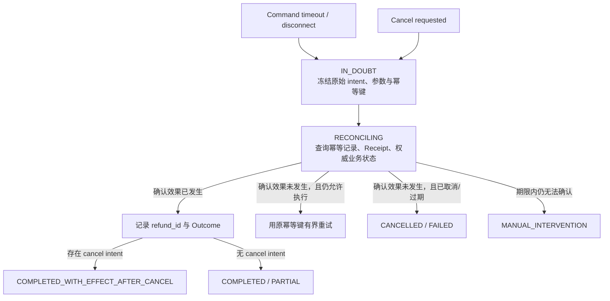

# 01 · 未知效果：失败、超时、重试与取消

小林批准了订单 `order_123` 的 100 元退款。Runtime 以幂等键 `refund:order_123:v42` 发出提交命令；支付系统已经 Commit，ACK 却在返回途中丢失。客户端超时后，小林点击 Cancel。

如果系统把 Timeout 写成“退款失败”，下一次 Retry 可能重复退款；如果把 Cancel 写成“退款已撤销”，界面就在制造不存在的事实。本章是全书处理 **未知效果（unknown effect）与核对收敛（reconciliation）** 的权威章节：其他章节消费这里定义的状态，不再各自发明失败语义。

## 学习目标

- 分开记录本地执行状态与外部效果状态。
- 区分 Deadline、Timeout、Retry 与 Cancellation。
- 用稳定意图、幂等键、权威查询和有限核对把未知效果收敛为事实。

## 1. 先保存这条时间线

```text
14:03:10 proposal_approved(order_123, CNY 100.00, resource_version=42)
14:03:11 command_started(idempotency_key=refund:order_123:v42, attempt=1)
14:03:12 payment_committed(refund_id=rf_789)       # 发生在支付系统
14:03:12 ack_lost                                   # Runtime 没有收到
14:03:16 tool_timeout(execution=timeout, effect=unknown)
14:03:17 cancel_requested(actor=小林)
14:03:17 run_state=IN_DOUBT, cancel_intent=true
```

最后两项可以同时成立：用户已经要求停止后续工作，退款效果仍然未知。Cancel 是控制意图，不是效果证据。

## 2. 执行状态与效果状态是两条轴

| 维度               | 可能状态                                                  | 回答的问题                  |
| ---------------- | ----------------------------------------------------- | ---------------------- |
| Execution status | running、response、timeout、disconnect、cancelled locally | 当前 attempt 在本系统看来怎样结束？ |
| Effect status    | absent、committed、compensated、unknown                  | 权威业务系统中到底发生了什么？        |

一次查询超时通常不会改变环境；一次 command 超时却可能落在 Commit 前、Commit 后 ACK 前，或 ACK 到达但 checkpoint 尚未写入。没有权威证据时，效果必须保持 `unknown`。

## 3. `IN_DOUBT → RECONCILING` 的权威协议



核对步骤必须遵守六条规则：

1. 冻结原始业务意图、精确参数、资源版本和幂等键。
2. 停止新的模型规划和无关业务动作。
3. 先查询幂等记录、Receipt 或权威业务状态，不先重新提交。
4. 只有权威证据确认效果未发生，且没有 Cancel、Deadline/预算耗尽或策略变化时，才可用**原幂等键**重试。
5. 查询到效果已发生时如实记录；Cancel 不会把已发生效果改写成未发生。
6. 到达 reconciliation deadline 仍未知时转人工，并保留明确所有者和证据。

对于 `order_123`，支付查询返回 `refund_id=rf_789, amount=CNY 100.00`。最终状态因此是 `COMPLETED_WITH_EFFECT_AFTER_CANCEL`：退款确实完成，但停止请求发生在 Commit 之后。这是事实说明，不是惩罚用户的错误码。

## 4. Deadline、Timeout 与核对期限

- **Deadline**：整个用户目标最晚何时还值得创建新工作。
- **Step timeout**：某个调用最多等待多久，从剩余 Deadline 派生。
- **Reconciliation deadline**：停止新工作后，系统自动核对未知效果到何时转人工。

下游不能在每一层重新获得完整时间预算。业务 Deadline 或普通预算耗尽后，系统停止创建新的模型/工具工作；已经在途或未知的 command 仍要在独立、有界的核对预算内收敛，不能用 `BUDGET_EXHAUSTED` 掩盖未知副作用。

## 5. Retry 只处理已知可重试的失败

仅在错误明确瞬时、操作语义安全且仍有总预算时重试：

- 使用有限 `max_attempts`，数字包含首次调用。
- 指数退避并加入抖动（jitter）。
- 由一个责任层持有全局 Retry Budget。
- 每次 attempt 有独立 `attempt_id`；同一业务意图共享幂等键。

若第 `i` 层最多重试 `r_i` 次，它最多尝试 `r_i + 1` 次。层层独立重试的下游上界是：

```text
Π (r_i + 1)
```

- 三层各 `max_attempts = 4`：最底层最多 `4 × 4 × 4 = 64` 次。
- 三层各“最多重试 4 次”：每层共 5 次，最底层最多 `5³ = 125` 次。

Command Timeout 不属于“看到错误就重试”；它先进入核对协议。

## 6. 失败矩阵

| 观察                 | Effect status | 下一步                                  |
| ------------------ | ------------- | ------------------------------------ |
| 输入无效、策略拒绝          | absent        | 修正输入、澄清或结束；不重试                       |
| 资源版本冲突             | absent        | 重新读取状态，旧审批失效                         |
| 查询限流/瞬时不可用         | absent        | 在 Deadline/Retry Budget 内有界退避        |
| 查询 Timeout         | absent 或无副作用  | 若仍有预算可重试                             |
| Command Timeout/断连 | unknown       | `IN_DOUBT → RECONCILING`             |
| Cancel 且确认无在途效果    | absent        | `CANCELLED`                          |
| Cancel 后查到效果已发生    | committed     | `COMPLETED_WITH_EFFECT_AFTER_CANCEL` |
| 核对到期仍未知            | unknown       | `MANUAL_INTERVENTION`                |

## 纸面微实验（30 分钟）

1. 重画 `order_123` 的时间线，分别改变 ACK 在 Commit 前失败、Commit 后丢失、收到后 checkpoint 前崩溃三种位置。
2. 为每个位置写 execution/effect status、允许转移、幂等键和用户文案。
3. 计算三层 `max_attempts=4` 与 `max_retries=4` 的不同调用上界。

将 Timeout 解释为“未执行”，使用新幂等键盲目重试，或将 Cancel 写成“已回滚”，即不通过。

## 常见误区

- Timeout 是业务失败证据。
- Cancel 本地 Promise 等于第三方停止。
- Retry 总会提高可用性。
- 每一层都独立重试最稳妥。
- 核对期间可以让模型自由规划补救动作。

## 章末检查

1. Execution status 与 Effect status 为什么必须分开？
2. 什么证据允许从 `RECONCILING` 进入 `CANCELLED`？
3. 查到效果已发生且存在 Cancel intent 时，为什么不能写成 `CANCELLED`？
4. Command Timeout 后第一步为什么是查询而不是重新提交？

## 本章小结

`order_123` 揭示了分布式行动最重要的边界：本地调用结束，不代表外部效果已知。稳定意图、同一幂等键、权威查询和有限 reconciliation 让系统最终说出真话。下一章不再重复这套协议，而是回答另一个问题：当大量 Run 同时进入重试或核对时，[并发、背压与预算](/masterpiece-static-docs/08-可靠性与可观测/02-并发-背压与预算.md)怎样保证这条安全路径不会被挤死。

## 一手资料

- [AWS Timeouts, retries and backoff with jitter](https://aws.amazon.com/builders-library/timeouts-retries-and-backoff-with-jitter/)
- [AWS Idempotent APIs](https://aws.amazon.com/builders-library/making-retries-safe-with-idempotent-APIs/)
- [gRPC Deadlines](https://grpc.io/docs/guides/deadlines/)
- [gRPC Cancellation](https://grpc.io/docs/guides/cancellation/)
- [Google SRE: Addressing Cascading Failures](https://sre.google/sre-book/addressing-cascading-failures/)
