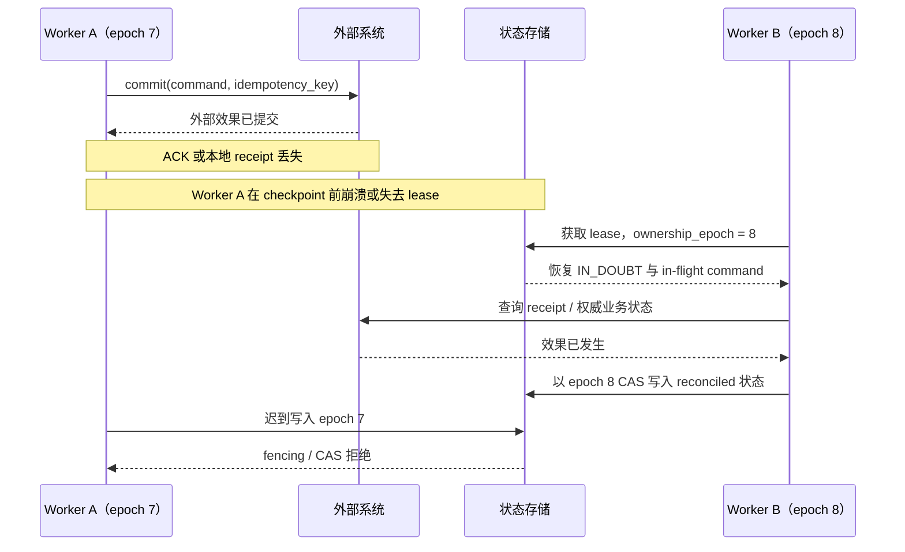

# 03 · 持久执行、Checkpoint 与 Exactly-Once

一个需要等待审批数小时的 Run，不能把正确性寄托在某个 Node 进程一直存活。进程崩溃、Worker 接管和流程升级都会迫使系统回答：哪些决定已经完成、哪些外部效果仍不确定、当前由谁拥有写入权，以及旧审批能否继续使用。

本章讨论持久执行（Durable Execution）的核心状态与恢复协议。检查点（Checkpoint）负责保存可恢复语义，却不能神奇地让第三方副作用只发生一次；所谓恰好一次（Exactly-Once）必须被拆成投递、处理、提交和用户可观察效果分别验证。

> 本章是核心心智模型，但引入 durable workflow 引擎、多 Worker 恢复和长任务是 **L1 之后** 的实施项，不是首个 Agent 的前置依赖。

## 学习目标

- 理解长任务为什么需要持久化语义状态和单写所有权。
- 区分 replay、delivery、handler execution 与真实业务效果。
- 设计能恢复、可升级、不盲目重复动作的 event/checkpoint 协议。

## 1. Checkpoint 保存什么

至少包含：

```text
run/thread identity
workflow/runtime/schema/prompt/tool/policy version
current state + ownership epoch + event cursor
completed tool receipts / idempotency keys
in-flight commands and their effect status
pending approval proposal, hash and expiry
budgets, attempts, deadlines and cancel state
context artifact/source references
error, reconciliation and compensation state
```

只保存对话文本，无法判断哪些副作用已提交、谁拥有 Run、审批是否仍有效，或应从哪个状态恢复。

## 2. Event History 与 Replay

Durable workflow 通常通过事件历史重建确定性控制逻辑。Replay 不应再次直接读取随机数、当前时间或外部服务；这些结果要作为 event 或 Activity 结果记录。

模型和工具调用属于外部非确定性 Activity。引擎可能为恢复而重新投递，因此仍需幂等、去重、结果缓存或查询收敛。

## 3. 单写者与所有权协议

持久化不会自动防止两个 Worker 同时恢复同一 Run。最小协议需要：

- Lease：带过期时间的处理权，不是永久锁。
- Heartbeat：持有者在长步骤中证明存活并更新进度。
- `ownership_epoch` / fencing token：每次接管单调增加；下游拒绝旧 epoch 的迟到写入。
- CAS/optimistic concurrency：状态转移必须以预期 version/epoch 原子提交。
- Single-writer invariant：同一 Run 在一个 epoch 内只有一个可提交控制决定的所有者。

Lease 过期不会杀死旧 Worker，所以没有 fencing/CAS 时，旧 Worker 仍可在新 Worker 接管后写回过期状态。

## 4. 队列与投递语义

- Visibility timeout 应超过正常处理时间，长任务通过 heartbeat 延长。
- 消息可能重复投递；consumer 要用 message/call/idempotency ID 去重。
- Poison message 不应无限重试；达上限后进 DLQ/隔离区，保留诊断与可控 replay。
- 数据库变更与发送事件之间使用 transactional outbox；消费端用 inbox/dedup 收敛。

DLQ 是异常管理机制，不是丢弃责任的垃圾桶；需定义告警、所有者、修复、重放前置和保留期。

## 5. Exactly-once 的边界

要分别讨论：

- 消息 delivery 次数。
- Handler execution 次数。
- 数据库 commit 次数。
- 用户可观察业务效果次数。

某层宣传 exactly-once 不代表第三方支付、邮件或外部 API 只产生一次效果。更现实的目标是：

```text
at-least-once attempt
+ idempotent/deduplicated effect
+ authoritative receipt query
+ reconciliation
```

## 6. Crash 窗口与取消竞态



通过外部幂等键、outbox/inbox、receipt/权威状态查询和 reconciliation 收敛。Checkpoint 无法与任意第三方系统形成一个全局原子事务。

## 7. 版本演进与补偿

长期 Run 可能跨部署。恢复时要固定 workflow/state/schema/prompt/tool/policy version，对事件和 snapshot 做向后兼容或显式迁移。无法安全迁移时，固定旧 Worker 或转人工，不用新逻辑重新解释旧审批。

Saga 式 compensation 是业务动作，不是底层 rollback。每步需说明是否可补偿、前置条件、补偿失败所有者和用户可见语义。

## 纸面微实验（45 分钟）

推演两个 Worker 在 lease 过期边界同时处理一个 Run：Worker A 已提交外部效果但未写 checkpoint，Worker B 以新 epoch 接管。写出每个 event、CAS 条件、fencing 检查、receipt 查询和最终状态。若 A 的迟到写入能覆盖 B，或 B 会盲目重试，即不通过。

## L1 后系统实验

在 effect commit、ACK、checkpoint 之间的每个边界杀死 Worker，并强制 lease 过期和双 Worker 恢复。验证：只有新 epoch 能提交状态；相同业务 intent 只产生一次效果；poison event 进 DLQ；旧版 Run 不被新逻辑误解。

## 常见误区

- Checkpoint 就是保存最后一条消息。
- Durable workflow 自动提供外部 exactly-once。
- 有 lease 就不需 fencing/CAS。
- Queue 消息只会交给一个 Worker 一次。
- Replay 可重新调用模型并获得同一结果。
- DLQ 中的数据可以不再治理。

## 章末检查

1. 为什么 Activity 仍需幂等，即使使用 durable workflow？
2. Lease 之后为什么还需要 fencing token 和 CAS？
3. Outbox、Inbox/Dedup 和 DLQ 分别解决什么？
4. 为什么外部效果后 crash 必须先 reconcile？

## 本章小结

持久执行的核心不是保存聊天记录，而是保存版本、所有权、预算、审批、回执与未知效果，使新 Worker 能用 fencing、CAS 和权威查询安全接管。外部 Exactly-Once 仍需幂等与 reconciliation 共同逼近；下一章用[Trace、SLO 与成本](/masterpiece-static-docs/08-可靠性与可观测/04-Trace-SLO与成本.md)证明这些恢复路径是否真的工作。

## 一手资料

- [Temporal Workflow Execution](https://docs.temporal.io/workflow-execution)
- [Temporal Activity Definition](https://docs.temporal.io/activity-definition)
- [AWS Idempotent APIs](https://aws.amazon.com/builders-library/making-retries-safe-with-idempotent-APIs/)
- [AWS Transactional Outbox](https://docs.aws.amazon.com/prescriptive-guidance/latest/cloud-design-patterns/transactional-outbox.html)
